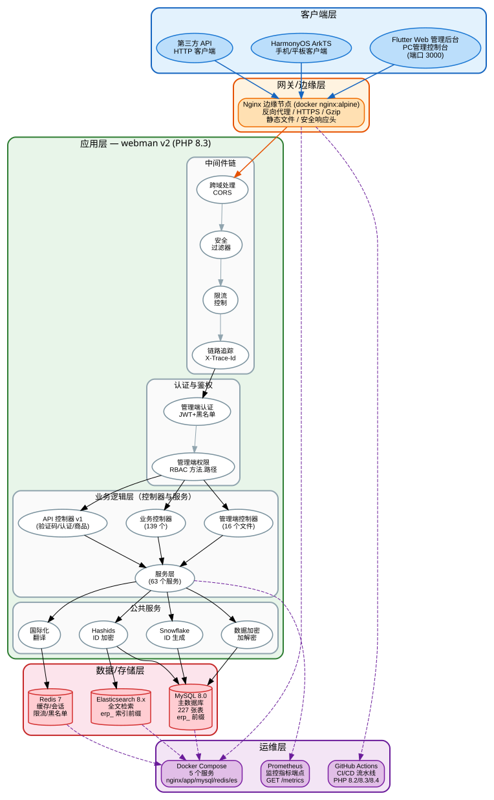
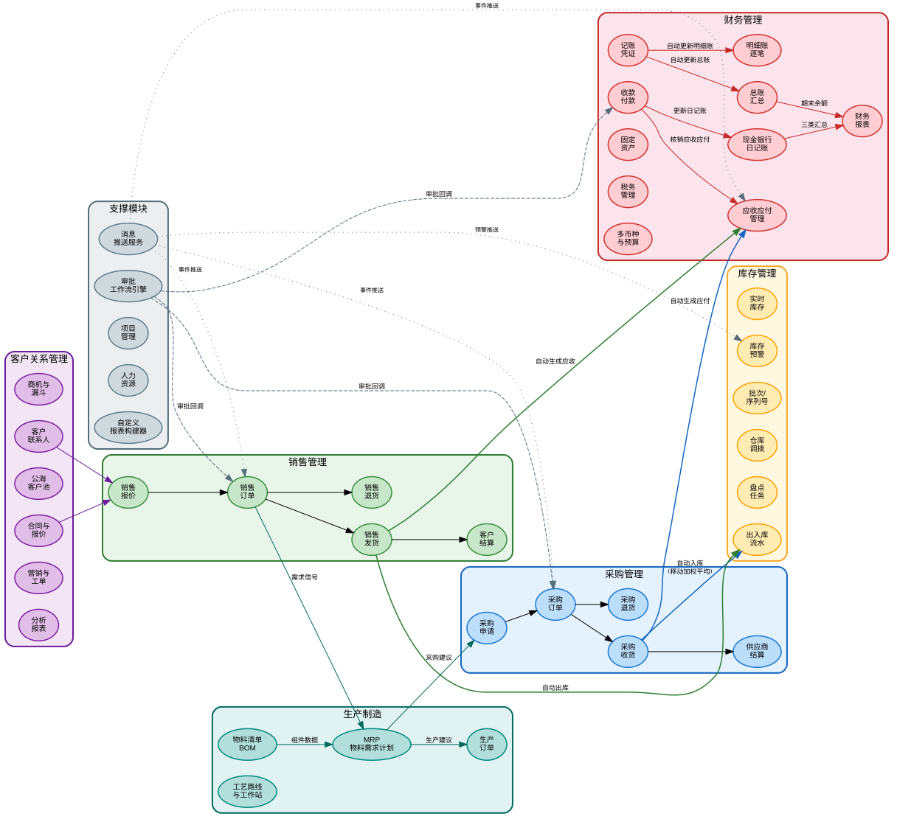

# 开放ERP系统 (open-erp)

基于 webman v2 + Flutter 的全栈ERP系统。

<div align="center"></div>

> [English version](README_EN.md) |[版本对比](docs/EDITIONS.md) | [架构设计图](docs/ARCHITECTURE.md) | [系统架构图](#系统架构图) | [设计文档](docs/DESIGN.md) | [安全架构](docs/SECURITY.md) | [API 参考](docs/API.md) | [功能手册](docs/FUNCTIONS.md)

## 功能清单

| 业务域 | 功能 | 说明 |
|--------|------|------|
| 🔐 认证 | 登录/注册/刷新令牌/登出 | 点击验证码 + JWT + 黑名单 |
| | 账号锁定 | 5 次失败锁定 15 分钟 |
| | 并发会话限制 | 同一用户最多 3 个有效 Token |
| 📊 仪表盘 | 经营总览/销售看板/库存看板/财务看板 | Redis 缓存 5 分钟 |
| 👥 用户管理 | CRUD + 批量删除/启禁用 | 软删除 + 密码二次确认 |
| | Excel 批量导入 | 逐行校验 + 错误报告 |
| 🔒 角色权限 | 角色 CRUD + 权限树 | RBAC method.path 粒度鉴权 |
| ⚙ 系统配置 | 键值对 CRUD | 分组管理 |
| 📋 操作审计 | 日志查询 + 来源端检测 | 8 平台自动识别 |
| 📁 文件管理 | 上传/Excel 导出/PDF 导出 | 敏感数据自动脱敏 |
| 🛡 安全防护 | 18 层纵深防御 | XSS/SQL注入/路径遍历/命令注入/CSRF/限流/CSP... |
| 🏥 运维 | 健康检查/metrics/API 文档/security.txt | Prometheus + OpenAPI 3.0 |
| 📦 商品管理 | 商品档案/SKU/多规格/多单位/分类/品牌/价格策略 | 多级分类树 + 多单位换算 |
| | 仓库库位 | 多仓库多库位管理 |
| | 供应商/客户档案 | 联系人/银行账户/信用额度 |
| 📥 采购管理 | 申请→订单→收货→退货→结算 | 完整采购流程 + 审批 |
| 📤 销售管理 | 报价→订单→发货→退货→结算 | 报价转订单 + 销售毛利 |
| 🏗 库存管理 | 实时库存/批次/序列号/调拨/盘点/预警 | 移动加权平均成本核算 |
| 💰 财务管理 | 应收应付/收付款/日记账/报销/利润表/固定资产/税务/多币种/预算/成本利润中心 | 自动生成应收应付 + 核销 + 全面财务管理 |
| 🤝 CRM | 客户/联系人/跟进记录/营销活动/服务工单/分析报表/销售漏斗/公海池/报价/合同 | 客户全生命周期管理 |
| ✅ 审批工作流 | 工作流定义/提交审批/批准/拒绝/撤回/我的审批 | 多节点审批流程引擎 |
| 🔔 消息通知 | 通知列表/已读标记/未读计数/全部已读 | 实时消息推送与状态追踪 |
| 📐 项目管理 | 项目/任务/工时记录 | 项目进度跟踪与资源管理 |
| 👤 人力资源 | 部门/员工/职位/考勤/请假/薪资 | 全面人事管理 |
| 🏭 生产制造 | BOM/生产订单/工艺路线/工作站/MRP | 物料需求计划与生产执行 |
| 📈 自定义报表 | 报表模板/数据集/字段/筛选器/执行/定时调度 | 可视化报表构建器 |
| 📋 订单管理(OMS) | 多渠道订单/履约编排/库存预占/分配/取消/RMA退换货 | 订单全生命周期管理 |
| 🏗 仓储管理(WMS) | 库区库位/ASN/收货/上架/波次/拣货/打包/发货 | 完整仓储作业流程 |
| 🚚 运输管理(TMS) | 承运商/服务/费率/运单/物流轨迹/运费发票 | 多承运商运费比价 + 轨迹追踪 |

## ERP 模块

各业务模块间的数据流转：

- 采购收货 → 自动入库（移动加权平均成本核算） → 自动生成应付
- 销售发货 → 自动出库 → 自动生成应收
- 收付款 → 核销应收应付 → 更新日记账
- 凭证审核 → 自动更新总账(科目汇总) + 明细账(逐笔记录)
- 资产负债表 → 自动汇总总账期末余额生成
- 现金流量表 → 自动汇总现金银行日记账生成（经营/投资/筹资三分类）
- 审批工作流 → 业务单据提交审批 → 多节点流转 → 审批结果回调业务模块
- 消息通知 → 审批/预警/系统事件触发 → 实时推送 → 用户标记已读
- MRP → 基于销售订单+BOM → 计算物料需求 → 生成采购建议/生产建议
- OMS → 多渠道订单导入 → 库存预占(ATP) → 创建履约 → 下发WMS拣货/打包
- WMS → 波次聚合 → 拣货任务 → 拣货确认 → 打包完成 → 触发生成TMS运单
- TMS → 运费比价 → 创建运单 → 确认发货(stockOut+AR) → 物流轨迹追踪 → 签收
- WMS入库 → ASN预到货 → 收货 → 质检 → 上架确认(stockIn+AP) → 库存更新
- RMA → 退货申请 → 审批 → 退回入库 → 退款

## 技术栈

| 层 | 技术 | 说明 |
|---|------|------|
| 后端框架 | webman v2 (workerman) | 超高性能 PHP 常驻进程框架 |
| PHP 版本 | 8.3+ | |
| 数据库 | MySQL 8.0+ | 表前缀 `erik_`，BIGINT 非自增主键 |
| 搜索引擎 | Elasticsearch | 通过 `webman-scout` 同步与查询 |
| 管理端前端 | Flutter 3.x | Web 端为 PC 管理后台风格（`apps/flutter/`） |
| 移动端 | HarmonyOS ArkTS | 鸿蒙原生客户端（`apps/harmonyos/`），支持手机/平板/2in1 |

## 核心依赖

| 包 | 用途 |
|---|------|
| `erikwang2013/snowflake-php` | Snowflake 算法生成全局唯一 BIGINT 主键 |
| `erikwang2013/hashids` | API 层 ID 加解密，隐藏真实数据库 ID |
| `erikwang2013/jwt-webman` | JWT 认证令牌签发与校验 |
| `erikwang2013/encryption` | 接口传输层敏感数据加解密 |
| `erikwang2013/encryptable` | 数据库存储层敏感字段自动加解密 |
| `erikwang2013/webman-scout` | Elasticsearch 数据同步与全文检索 |
| `erikwang2013/season` | 国家旗帜数据 |
| `erikwang2013/poster-php` | 点击验证码生成与校验 + 海报生成 |
| `erikwang2013/security-php` | 安全工具检查 |
| `phpoffice/phpspreadsheet` | Excel 导出 |
| `barryvdh/laravel-dompdf` | PDF 导出（基于 Dompdf） |
| `hg/apidoc` | API 文档自动生成 | 注解式接口文档，管理端/客户端分组 |

## 国际化

国际化 | Accept-Language 头自动检测 | 中文/English 双语支持

## 项目结构

```
open-erp/
├── app/
│   ├── admin/controller/       # 系统管理控制器 (14 个)
│   ├── api/v1/controller/      # 客户端 API（版本由 API-Version 请求头控制）
│   ├── controller/             # 业务模块控制器 (88 个)
│   │   ├── product/            # 商品/分类/品牌/仓库/库位/供应商/客户 (7 个)
│   │   ├── purchase/           # 采购申请/订单/收货/退货/结算 (5 个)
│   │   ├── sales/              # 销售报价/订单/发货/退货/结算 (5 个)
│   │   ├── inventory/          # 库存/流水/调拨/盘点/预警 (5 个)
│   │   ├── finance/            # 应收应付/凭证/收付款/日记账/总账/明细账/报表/资产/税务/多币种/预算/成本利润中心 (20 个)
│   │   ├── crm/                # 商机/跟进/漏斗/联系人/公海池/合同/报价/营销/工单/分析 (10 个)
│   │   ├── workflow/           # 工作流定义/审批提交/批准/拒绝/撤回 (2 个)
│   │   ├── notification/       # 通知列表/已读/未读计数 (1 个)
│   │   ├── project/            # 项目/任务/工时记录 (3 个)
│   │   ├── hr/                 # 部门/员工/职位/考勤/请假/薪资 (5 个)
│   │   ├── manufacturing/      # BOM/生产订单/工艺路线/工作站/MRP (5 个)
│   │   ├── report/             # 报表模板/数据集/执行/定时调度 (2 个)
│   │   ├── oms/                # OMS订单/履约/RMA/渠道 (4 个)
│   │   ├── wms/                # 库区/库位/ASN/收货/上架/波次/拣货/打包 (8 个)
│   │   └── tms/                # 承运商/服务/费率/运单/轨迹/运费发票 (6 个)
│   ├── service/                # 业务逻辑层
│   │   ├── inventory/          # 出入库 + 移动加权平均成本核算 + 库存预占/ATP
│   │   ├── finance/            # 应收应付自动生成 + 核销
│   │   ├── notification/       # 通知发送服务
│   │   ├── oms/                # 订单编排/库存分配/RMA生命周期
│   │   ├── wms/                # 入库流程(ASN→收货→上架) / 出库流程(波次→拣货→打包)
│   │   └── tms/                # 运单管理/运费比价/物流轨迹
│   ├── model/                  # 161 个 Eloquent 模型（多模块共用）
│   ├── middleware/             # 12 个中间件
│   ├── common/                 # Hashids/Snowflake/Encryption 服务
│   └── queue/                  # 队列任务
├── apps/
│   ├── flutter/                # Flutter 跨平台（Web PC + iOS/Android/macOS/Windows/Linux）
│   └── harmonyos/              # HarmonyOS 原生客户端
├── config/                     # 配置文件（含中文注释）
│   ├── plugin/hg/apidoc/        # API 文档配置
├── database/
│   ├── install.sql              # 完整安装SQL（163张表 + 种子数据）
│   ├── e2e-seed.sql             # E2E/CI 最小种子
│   └── backup/                 # 备份/恢复脚本
├── docs/                       # 架构、设计、安全、API 文档
├── tests/                      # PHPUnit 测试（20 个测试文件，137 个测试方法，805 条断言）
├── resource/
│   └── translations/           # 翻译文件 (zh_CN, en)
│       ├── zh_CN/              # 中文翻译 (127 键)
│       └── en/                 # English translations (127 keys)
├── public/                     # 公共入口
├── runtime/                    # 运行时文件
└── vendor/                     # Composer 依赖
```

## 系统架构图

> 点击图片查看原始 SVG。图表使用英文命名，完整清晰展示系统各层面的架构设计。

### 系统拓扑架构



**五层架构**: 客户端层 → 网关边缘层(Nginx 反向代理) → 应用层(webman v2 + 中间件链 + 认证鉴权 + 业务逻辑 + 公共服务) → 数据存储层(MySQL + Redis + Elasticsearch) → 运维层(CI/CD + Docker + Prometheus)

### 业务数据流程图



**七大业务域联动**: 采购 → 库存 → 销售 → 财务形成核心供应链闭环；客户关系管理驱动销售；生产制造MRP基于销售订单+物料清单驱动采购计划和生产计划；审批工作流、消息通知、项目管理、人力资源作为支撑模块贯穿全流程。

### 功能模块总览


**19 大业务域、163 张数据表、121 个控制器**: 涵盖认证安全、仪表盘、系统管理、安全防护、运维监控、商品管理、采购、销售、库存、财务(14子模块)、CRM(10子模块)、审批工作流、消息通知、项目管理、人力资源、生产制造(MRP)、自定义报表、订单管理(OMS)、仓储管理(WMS)、运输管理(TMS)、质量管理(QMS)、设备管理(EAM)、文档管理(DMS)、BI看板。

### 请求生命周期


**从客户端到数据库的完整请求路径**: 客户端(Flutter/鸿蒙) → Nginx SSL终止 → 语言检测 → 跨域处理 → 安全过滤器 → 限流 → API版本校验 → [管理端: JWT认证 → RBAC权限 → 操作日志] → 控制器 → 服务层 → 模型层 → 缓存/数据库/搜索引擎 → JSON响应。图中包含缓存命中和缓存未命中两条路径。

### 安全纵深防御架构


**18 层纵深防御**: L0 物理网络 → L1 传输安全 → L2 HTTP 安全头 → L3 请求校验 → L4 输入净化 → L5 CSRF 防护 → L6 限流 → L7 认证(JWT+Captcha+黑名单+会话控制) → L8 RBAC 授权 → L9 数据保护(传输加密+存储加密+ID混淆+数据脱敏) → L10 审计监控 → L11 合规披露。

---

## 环境要求

- PHP >= 8.3
- Composer 2.x
- MySQL >= 8.0
- Flutter >= 3.41（仅前端开发需要）
- Elasticsearch >= 7.x（可选，搜索功能需要）

## 快速开始

### 1. 安装依赖

```bash
composer install
```

### 2. 配置环境变量

复制并修改环境变量（可选，不配置则使用 `config/*.php` 中的默认值）:

```bash
cp .env.example .env
```

关键配置项：

| 环境变量 | 说明 | 默认值 |
|---------|------|--------|
| `JWT_SECRET` | JWT 签名密钥 | `open-admin-jwt-secret-change-in-production` |
| `HASHIDS_SALT` | Hashids 盐值 | `open-admin-hashids-salt-2026` |
| `ENCRYPTION_KEY` | API 加密密钥 | 32 字节默认值 |
| `SNOWFLAKE_DATACENTER_ID` | 数据中心 ID (0-31) | `1` |
| `SNOWFLAKE_WORKER_ID` | 工作节点 ID (0-31) | `1` |
| `SCOUT_HOSTS` | ES 地址 | `http://localhost:9200` |

**生产环境务必修改所有密钥为随机字符串。**

### 3. 初始化数据库

**方式一：Web 安装向导（推荐）**

启动服务后访问 `http://localhost:8788/install`，按引导完成 4 步安装：环境检查 → 数据库配置 → 管理员账号 → 一键安装。

**方式二：命令行导入**

```bash
mysql -u root -p 数据库名 < database/install.sql
```

`install.sql` 由 29 个迁移文件合并而成，包含全部 163 张表结构和种子数据。

**方式三：Docker 环境**

```bash
docker-compose exec app mysql -h mysql -u root -p < database/install.sql
```

### 4. 启动服务

```bash
php start.php start
```

默认监听 `http://0.0.0.0:8788`。

### 5. 启动前端（可选）

**Flutter 管理后台（Web 端）:**

```bash
cd apps/flutter
flutter pub get
flutter run -d chrome    # Web 端（PC 管理后台风格）
```

**HarmonyOS 客户端（手机端）:**

使用 DevEco Studio 打开 `apps/harmonyos/` 目录，连接真机或模拟器运行。

### 6. Docker Compose 一键部署（推荐生产环境）

项目提供完整的 Docker 编排方案，包含 5 个服务：Nginx、PHP (webman app)、MySQL、Redis、Elasticsearch。

```bash
# 1. 配置 Docker 环境变量
cp .env.docker .env

# 2. 启动所有服务
docker-compose up -d

# 3. 初始化数据库（进入 app 容器执行）
docker-compose exec app mysql -h mysql -u root -p < database/install.sql

# 4. 访问
# http://localhost:8788  (webman)
# http://localhost:8080  (Nginx 反向代理)
```

- `Dockerfile`: PHP 8.3 + OPcache + Composer，基于 `php:8.3-cli`
- `docker-compose.yml`: 5 个服务编排，网络隔离，数据卷持久化
- `.env.docker`: Docker 环境专用环境变量
## 数据库规范

- **表前缀**: `erik_`
- **主键**: 所有表主键均为 `id BIGINT UNSIGNED NOT NULL`，**禁用 AUTO_INCREMENT**
- **ID 生成**: 主键 ID 由应用层 `SnowflakeService::generate()` 生成，分布式唯一
- **必备字段**: 每张表必须包含 `id`, `created_at`, `updated_at`
- **软删除**: 需要软删除的表添加 `deleted_at DATETIME DEFAULT NULL`
- **敏感字段**: 手机号、邮箱、身份证号等使用 `encryptable` 插件自动加解密，数据库字段使用 `VARCHAR(500)` 存储密文

## API 规范

### API 文档

项目使用 hg/apidoc 自动生成接口文档，访问 `/apidoc` 查看。

- 管理端接口 (Admin)：25 个模块分组，含完整请求参数和响应结构
- 客户端接口 (Service API)：认证/验证码/商品 3 个分组
- 所有接口标注了 JWT 认证、API 版本、国际化等全局请求头

### 统一响应格式

```json
{
    "code": 0,
    "message": "success",
    "data": {}
}
```

### 业务错误码

| 错误码 | 含义 | 说明 |
|-------|------|------|
| `0` | 成功 | |
| `400` | 请求参数错误 | |
| `401` | 未登录（Token 无效或过期） | |
| `403` | 无权限 / 安全拦截 | RBAC 鉴权失败 / SecurityFilter 攻击检测 |
| `404` | 资源不存在 | |
| `422` | 参数验证失败 | |
| `413` | 请求体过大 | SecurityFilter 触发，超过 10MB |
| `405` | 请求方法不允许 | SecurityFilter 触发，仅允许 GET/POST/PUT/DELETE/OPTIONS/HEAD |
| `415` | 不支持的媒体类型 | SecurityFilter 触发，Content-Type 非 JSON |
| `429` | 请求过于频繁 | RateLimit 触发 / 账号锁定（5次登录失败锁定15分钟） |
| `500` | 服务器内部错误 | |

### 国际化

请求头 `Accept-Language` 自动切换语言（zh-CN → 中文, en → English），默认中文。

### ID 处理

- **请求/响应中的 ID**: 使用 hashids 加密为字符串，不暴露真实数据库 ID
- **接口路径**: `GET /admin/user/{hashid}` — 路径中的 `{id}` 为 hashid 字符串
- **数据库存储**: BIGINT 原值，由 snowflake 生成

### API 版本

API 版本通过请求头控制，**不在 URL 中体现**：

```http
API-Version: v1
```

- 未携带版本号时默认使用 `v1`
- 不支持的版本返回 `400 Bad Request`
- 新增版本时只需创建 `app/api/{version}/controller/` 目录，中间件注册新版本即可

### 限流

基于 Redis 滑动窗口算法，默认 60 次/分钟/IP/路由。敏感接口更严格：
- 登录：10 次/分钟
- 注册：5 次/分钟（默认关闭，需 `REGISTRATION_ENABLED=1` 开启）

响应头包含 `X-RateLimit-Limit`、`X-RateLimit-Remaining`、`X-RateLimit-Reset`。超限返回 429 并附带 `Retry-After`。

### 中间件架构

全局中间件对所有请求生效，按序执行：

```
Locale（Accept-Language 自动检测，设置语言环境）
  → Cors（跨域预处理 + 响应头）
  → SecurityFilter（HTTP方法限制/请求体大小/Content-Type校验/XSS/SQL注入/路径遍历/命令注入/CSRF 攻击拦截）
  → RateLimit（Redis 滑动窗口限流 + 账号锁定：5次登录失败锁定15分钟）
  → ApiVersion（API 版本校验，/api 路由组）
  → AdminAuth（JWT 认证 + 黑名单，/admin 路由组）
  → AdminPermission（RBAC 鉴权，/admin 路由组）
  → OperationLog（POST/PUT/DELETE 自动记录，含来源端检测，/admin 路由组）
```

`/health` 和 `/api/docs` 和 `/install` 为公开端点，仅经过 `Locale → Cors → SecurityFilter → RateLimit`。

安全增强：
- **账号锁定**：连续 5 次登录失败，账号自动锁定 15 分钟，期间登录返回 429
- **并发会话限制**：同一用户最多 3 个有效 Token，超出时最旧 Token 自动加入黑名单
- **security.txt**：`GET /.well-known/security.txt` 提供 RFC 9116 标准安全联系信息
- **Nginx 安全配置**：参考 `docs/nginx-security.conf` 提供完整的反向代理安全加固示例

### 认证

登录与注册需要先通过**点击验证码**校验：

1. 客户端请求 `POST /api/captcha/generate` 获取验证码图片（base64 PNG）和文字目标列表
2. 用户按顺序点击图中对应文字位置，收集点击坐标 `[{x, y}, ...]`
3. 登录时一并提交 `captcha_key` 和 `clicks`，服务端先校验验证码再校验凭证

```http
POST /api/auth/login
Content-Type: application/json

{
  "username": "admin",
  "password": "******",
  "captcha_key": "abc123...",
  "clicks": [{"x": 120, "y": 85}, {"x": 210, "y": 140}, {"x": 95, "y": 170}]
}
```

管理端后续接口需要 JWT 认证：

```http
Authorization: Bearer <token>
```

登录成功后返回 access_token，有效期 2 小时；另返回 refresh_token，有效期 14 天。

登出时 Token 加入 Redis 黑名单，有效期内不可复用。POST /admin/profile/logout

### 敏感操作二次确认

删除用户、角色、权限等敏感操作需要在请求体中传入当前登录用户的 `password` 进行身份二次确认：

```http
DELETE /admin/user/{id}
Content-Type: application/json
Authorization: Bearer <token>

{ "password": "******" }
```

## API 列表

> 所有 `/api/*` 接口需要在请求头中携带 `API-Version: v1`（不传则默认 v1）。

### 公开接口

| 方法 | 路径 | 说明 |
|-----|------|------|
| `GET` | `/health` | 健康检查（DB/Redis/ES 状态） |
| `GET` | `/api/docs` | OpenAPI 3.0 规范文档 |
| `POST` | `/api/captcha/generate` | 生成点击验证码 |
| `POST` | `/api/captcha/verify` | 校验点击验证码 |
| `POST` | `/api/auth/login` | 登录（需 captcha） |
| `POST` | `/api/auth/register` | 注册（需 captcha，默认关闭需 `REGISTRATION_ENABLED=1`） |
| `POST` | `/api/auth/refresh` | 刷新令牌 |
| `GET` | `/metrics` | Prometheus 监控指标 |

### 管理端接口（需 JWT + RBAC）

| 方法 | 路径 | 说明 |
|-----|------|------|
| `GET` | `/admin/dashboard` | 仪表盘数据（Redis 缓存 5 分钟） |
| `GET` | `/admin/user` | 用户列表（分页 + 搜索） |
| `POST` | `/admin/user` | 创建用户 |
| `GET` | `/admin/user/{id}` | 用户详情 |
| `PUT` | `/admin/user/{id}` | 更新用户 |
| `DELETE` | `/admin/user/{id}` | 删除用户（软删除，需密码确认） |
| `POST` | `/admin/user/batch/destroy` | 批量删除用户（需密码确认） |
| `POST` | `/admin/user/batch/status` | 批量启用/禁用用户 |
| `GET` | `/admin/role` | 角色列表 |
| `POST` | `/admin/role` | 创建角色 |
| `PUT` | `/admin/role/{id}` | 更新角色 |
| `DELETE` | `/admin/role/{id}` | 删除角色（需密码确认） |
| `GET` | `/admin/permission` | 权限树 |
| `POST` | `/admin/permission` | 创建权限 |
| `PUT` | `/admin/permission/{id}` | 更新权限 |
| `DELETE` | `/admin/permission/{id}` | 删除权限（级联子权限，需密码确认） |
| `GET` | `/admin/config` | 系统配置列表 |
| `POST` | `/admin/config` | 创建配置项 |
| `PUT` | `/admin/config/{id}` | 更新配置项 |
| `DELETE` | `/admin/config/{id}` | 删除配置项（需密码确认） |
| `GET` | `/admin/log` | 操作日志（分页 + 筛选） |
| `PUT` | `/admin/profile` | 更新个人信息 |
| `PUT` | `/admin/profile/password` | 修改密码 |
| `POST` | `/admin/profile/logout` | 登出（JWT 黑名单） |
| `POST` | `/admin/export/excel` | 导出 Excel |
| `POST` | `/admin/export/pdf` | 导出 PDF |
| `POST` | `/admin/import/users` | Excel 导入用户 |
| `POST` | `/admin/upload` | 文件上传（图片/文档，最大 10MB） |

### 业务接口（需 JWT + RBAC）

| 方法 | 路径 | 说明 |
|-----|------|------|
| `GET/POST/PUT/DELETE` | `/admin/product` | 商品 CRUD（含 SKU、价格） |
| `GET/POST/PUT/DELETE` | `/admin/category` | 商品分类 CRUD（树形） |
| `GET/POST/PUT/DELETE` | `/admin/brand` | 品牌 CRUD |
| `GET/POST/PUT/DELETE` | `/admin/warehouse` | 仓库 CRUD |
| `GET` | `/admin/warehouse/{id}/locations` | 仓库下库位列表 |
| `GET/POST/PUT/DELETE` | `/admin/location` | 库位 CRUD |
| `GET/POST/PUT/DELETE` | `/admin/supplier` | 供应商 CRUD |
| `GET/POST/PUT/DELETE` | `/admin/customer` | 客户 CRUD |
| `ANY` | `/admin/customer-level` | 客户等级管理 |
| `GET/POST/PUT/DELETE` | `/admin/purchase/apply` | 采购申请 |
| `GET/POST/PUT/DELETE` | `/admin/purchase/order` | 采购订单 |
| `GET/POST/PUT/DELETE` | `/admin/purchase/receive` | 采购收货（自动入库+生成应付） |
| `GET/POST/PUT/DELETE` | `/admin/purchase/return` | 采购退货 |
| `ANY` | `/admin/purchase/settlement` | 供应商结算 |
| `GET/POST/PUT/DELETE` | `/admin/sales/quotation` | 销售报价 |
| `GET/POST/PUT/DELETE` | `/admin/sales/order` | 销售订单 |
| `GET/POST/PUT/DELETE` | `/admin/sales/delivery` | 销售发货（自动出库+生成应收） |
| `GET/POST/PUT/DELETE` | `/admin/sales/return` | 销售退货 |
| `ANY` | `/admin/sales/settlement` | 客户结算 |
| `ANY` | `/admin/inventory` | 实时库存查询 |
| `ANY` | `/admin/inventory/flow` | 出入库流水 |
| `GET/POST/PUT/DELETE` | `/admin/inventory/transfer` | 库存调拨 |
| `GET/POST/PUT/DELETE` | `/admin/inventory/check` | 盘点任务 |
| `GET/POST/PUT/DELETE` | `/admin/inventory/alert` | 库存预警规则 |
| `GET/POST/PUT/DELETE` | `/admin/finance/ar-ap` | 应收应付 |
| `GET/POST/PUT/DELETE` | `/admin/finance/voucher` | 记账凭证 |
| `GET/POST/PUT/DELETE` | `/admin/finance/receipt` | 收款单 |
| `GET/POST/PUT/DELETE` | `/admin/finance/payment` | 付款单 |
| `ANY` | `/admin/finance/cash-journal` | 现金银行日记账 |
| `GET/POST/PUT/DELETE` | `/admin/finance/expense` | 费用报销 |
| `ANY` | `/admin/finance/report/profit` | 利润表 |
| `GET/POST/PUT/DELETE` | `/admin/finance/bank-account` | 银行账户 |
| `ANY` | `/admin/finance/general-ledger` | 总账（按科目+期间汇总） |
| `ANY` | `/admin/finance/subsidiary-ledger` | 明细账（科目逐笔明细） |
| `ANY` | `/admin/finance/report/balance-sheet` | 资产负债表 |
| `ANY` | `/admin/finance/report/cash-flow` | 现金流量表（经营/投资/筹资） |
| `GET/POST/PUT/DELETE` | `/admin/finance/asset` | 固定资产 CRUD + 计提折旧 |
| `GET/POST/DELETE` | `/admin/finance/tax-rate` | 税率配置 |
| `ANY` | `/admin/finance/tax-record` | 税务记录 |
| `GET/POST/PUT/DELETE` | `/admin/finance/currency` | 币种管理 |
| `GET/POST/PUT/DELETE` | `/admin/finance/exchange-rate` | 汇率管理 |
| `GET/POST/PUT/DELETE` | `/admin/finance/budget` | 预算管理（含预算vs实际对比） |
| `GET/POST/PUT/DELETE` | `/admin/finance/cost-center` | 成本中心（树形结构） |
| `GET/POST/PUT/DELETE` | `/admin/finance/profit-center` | 利润中心（树形结构） |
| `GET/POST/PUT/DELETE` | `/admin/crm/opportunity` | 商机管理 |
| `GET/POST/PUT/DELETE` | `/admin/crm/follow` | 跟进记录 |
| `GET/POST/PUT/DELETE` | `/admin/crm/funnel` | 销售漏斗阶段配置 |
| `GET/POST/PUT/DELETE` | `/admin/crm/contact` | 联系人 |
| `ANY` | `/admin/crm/pool` | 公海池（客户列表） |
| `POST` | `/admin/crm/pool/claim/{id}` | 领取公海客户 |
| `POST` | `/admin/crm/pool/release/{id}` | 释放客户到公海 |
| `GET/POST/PUT/DELETE` | `/admin/crm/pool/rules` | 公海池规则 |
| `GET/POST/PUT/DELETE` | `/admin/crm/contract` | 合同 CRUD |
| `POST` | `/admin/crm/contract/{id}/transition` | 合同状态流转 |
| `GET/POST/PUT/DELETE` | `/admin/crm/quotation` | CRM报价 |
| `POST` | `/admin/crm/quotation/{id}/to-contract` | 报价转合同 |
| `GET/POST/PUT/DELETE` | `/admin/crm/campaign` | 营销活动 |
| `GET/POST/PUT/DELETE` | `/admin/crm/ticket` | 服务工单 |
| `POST` | `/admin/crm/ticket/{id}/assign` | 分配工单 |
| `POST` | `/admin/crm/ticket/{id}/resolve` | 解决工单 |
| `POST` | `/admin/crm/ticket/{id}/reply` | 回复工单 |
| `ANY` | `/admin/crm/analytics/report` | 客户分析报表 |
| `POST` | `/admin/crm/analytics/generate` | 生成分析报表 |
| `ANY/POST` | `/admin/crm/analytics/metric` | 分析指标 |
| `ANY` | `/admin/dashboard/sales` | 销售面板 |
| `ANY` | `/admin/dashboard/inventory` | 库存面板 |
| `ANY` | `/admin/dashboard/finance` | 财务面板 |
| `GET/POST/PUT/DELETE` | `/admin/workflow` | 工作流定义 CRUD |
| `POST` | `/admin/workflow/{id}/submit` | 提交审批 |
| `POST` | `/admin/approval/{id}/approve` | 批准 |
| `POST` | `/admin/approval/{id}/reject` | 拒绝 |
| `POST` | `/admin/approval/{id}/withdraw` | 撤回 |
| `ANY` | `/admin/approval/my` | 我的审批列表 |
| `ANY` | `/admin/notification/my` | 我的通知 |
| `POST` | `/admin/notification/{id}/read` | 标记已读 |
| `POST` | `/admin/notification/read-all` | 全部已读 |
| `ANY` | `/admin/notification/unread-count` | 未读计数 |
| `GET/POST/PUT/DELETE` | `/admin/project` | 项目 CRUD |
| `GET/POST/PUT/DELETE` | `/admin/project/task` | 项目任务 CRUD |
| `GET/POST/PUT/DELETE` | `/admin/project/timesheet` | 工时记录 CRUD |
| `GET/POST/PUT/DELETE` | `/admin/hr/department` | 部门 CRUD |
| `GET/POST/PUT/DELETE` | `/admin/hr/employee` | 员工 CRUD |
| `GET/POST/PUT/DELETE` | `/admin/hr/position` | 职位 CRUD |
| `ANY/POST` | `/admin/hr/attendance` | 考勤/打卡 |
| `GET/POST/PUT/DELETE` | `/admin/hr/leave` | 请假 CRUD + 审批 |
| `GET/POST/PUT/DELETE` | `/admin/hr/salary` | 薪资 CRUD + 发放 |
| `ANY/POST` | `/admin/hr/salary-item` | 薪资项目 |
| `GET/POST/PUT/DELETE` | `/admin/mfg/bom` | BOM CRUD |
| `GET/POST/PUT/DELETE` | `/admin/mfg/production` | 生产订单 + 开工/完工 |
| `GET/POST/PUT/DELETE` | `/admin/mfg/routing` | 工艺路线 CRUD |
| `GET/POST/PUT/DELETE` | `/admin/mfg/workstation` | 工作站 CRUD |
| `GET/POST/PUT/DELETE` | `/admin/mfg/mrp` | MRP 计划 + 生成 |
| `GET/POST/PUT/DELETE` | `/admin/report` | 报表模板 CRUD |
| `POST` | `/admin/report/{id}/execute` | 执行报表 |
| `ANY` | `/admin/report/{id}/result` | 报表结果 |
| `GET/POST/PUT/DELETE` | `/admin/report/schedule` | 报表定时调度 |

### 客端接口（需 API-Version 头）

| 方法 | 路径 | 说明 |
|-----|------|------|
| `GET` | `/api/product` | 商品列表（不含进价） |
| `GET` | `/api/product/{hashid}` | 商品详情（含零售/批发价） |

## 前端说明

### Flutter 管理后台（PC 风格）

- **布局**: 侧边栏（可折叠 64px/240px）+ 顶栏 + 内容区，响应式三断点（手机/平板/桌面）
- **页面**: 登录、仪表盘、用户管理、角色权限、系统配置、操作日志、个人中心
- **状态管理**: GetX（`ApiService` 单例 + `AuthService` Token 持久化）
- **仪表盘**: 统计卡片、趋势折线图（fl_chart）、饼图、最近操作日志
- **导出**: Excel/PDF 导出，PDF 含不可移除版权信息
- **批量操作**: 多选批量删除、批量启用/禁用
- **主题**: Material 3 浅色/深色双主题

### HarmonyOS 移动端

- **页面**: 登录、仪表盘、用户列表/详情、个人中心
- **认证**: JWT Bearer + 401 自动无感刷新 Token，刷新失败自动重定向登录页
- **存储**: Token 通过 AppStorage 管理

## 开发规范

- 全局函数/类引用不加前置 `\`，统一使用 `use` 导入
- 所有 PHP 文件头部必须包含版权声明
- 所有配置文件必须包含中文注释说明
- 数据库主键必须由应用层 snowflake 生成，禁止自增
- API 层所有参数和响应中的 ID 必须通过 hashids 加解密
- AdminPermission 中间件使用 Redis 缓存用户权限（TTL=60s），消除 N+1 查询瓶颈

## 部署

### Docker Compose（推荐）

项目根目录提供 `docker-compose.yml`，编排 5 个服务：

| 服务 | 镜像 | 端口 |
|------|------|------|
| `nginx` | nginx:alpine | 80, 443 |
| `app` | 本地 `Dockerfile` 构建 | 8788 |
| `mysql` | mysql:8.0 | 3306 |
| `redis` | redis:7-alpine | 6379 |
| `elasticsearch` | elasticsearch:8.x | 9200 |

PHP 镜像通过 `Dockerfile` 构建，基础镜像 `php:8.3-cli`，启用 OPcache。

```bash
cp .env.docker .env
docker-compose up -d
```

### CI/CD

GitHub Actions 持续集成流水线：`.github/workflows/ci.yml`

- PHP 语法检查 (`php -l`)
- PHPUnit 单元测试
- Flutter 静态分析 (`flutter analyze`，CI 已含，启用中 — 见 `.github/workflows/ci.yml` 的 flutter job)

### 数据库备份

`database/backup/` 目录：

- `backup.sh` — mysqldump + gzip 备份，自动清理 30 天前旧备份
- `restore.sh` — 交互式恢复，列出可用备份供选择

### Nginx 安全配置

生产部署请参考 `docs/nginx-security.conf` 配置反向代理安全加固。

## 开源不易，欢迎支持

| 微信 | 支付宝 |
|:---:|:---:|
|  |  |

---

## License

MIT

Copyright (c) 2026 erik <erik@erik.xyz> — https://erik.xyz
