# 架构设计图与业务逻辑图

> Copyright (c) 2026 erik <erik@erik.xyz> — https://erik.xyz

> 以下 Mermaid 图表在 GitHub / GitLab / VS Code 中可自动渲染。其他环境请使用 [Mermaid Live Editor](https://mermaid.live/) 查看。

---

## 1. 系统拓扑架构

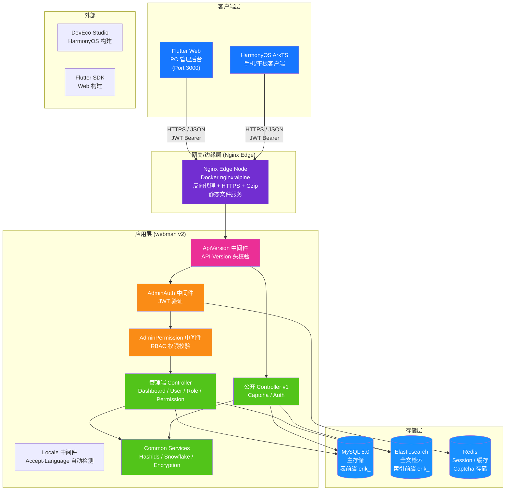

---

## 2. 后端分层架构

```mermaid
flowchart TD
    subgraph "路由层 Route Layer"
        R1["config/route.php<br/>URL → Controller 映射"]
    end

    subgraph "中间件层 Middleware Layer"
        M_LOC["Locale<br/>Accept-Language 自动检测<br/>zh_CN/en"]
        M_RL["RateLimit<br/>Redis 滑动窗口限流<br/>X-RateLimit 响应头"]
        M_SF["SecurityFilter<br/>攻击检测拦截<br/>XSS/SQL注入/路径遍历/CSRF"]
        M0["ApiVersion<br/>API 版本校验<br/>注入 apiVersion"]
        M1["AdminAuth<br/>JWT Token 校验<br/>注入 adminId"]
        M2["AdminPermission<br/>RBAC 鉴权<br/>method.path 匹配<br/>Redis 60s 缓存权限"]
    end

    subgraph "控制器层 Controller Layer"
        CT1["BaseController<br/>success/fail<br/>encodeId/decodeId<br/>generateId<br/>confirmPassword"]
        CT2["UserController<br/>CRUD + 搜索 + 分页"]
        CT3["RoleController<br/>CRUD + 权限同步"]
        CT4["PermissionController<br/>CRUD + 树构建"]
        CT5["DashboardController<br/>统计/趋势/分布"]
        CT6["ExportController<br/>Excel/PDF 导出"]
        CT7["CaptchaController<br/>验证码生成/校验"]
        CT8["AuthController<br/>登录/注册/刷新"]
    end

    subgraph "服务层 Service Layer"
        S1["HashidsService<br/>ID 编解码"]
        S2["SnowflakeService<br/>全局唯一 ID 生成"]
        S3["EncryptionService<br/>加解密 + 脱敏"]
    end

    subgraph "模型层 Model Layer"
        MD1["AdminUser<br/>encryptable casts"]
        MD2["AdminRole"]
        MD3["AdminPermission"]
        MD4["OperationLog"]
        MD5["SystemConfig"]
    end

    subgraph "驱动层 Driver Layer"
        D1["MySQL PDO"]
        D2["Elasticsearch HTTP"]
        D3["Redis"]
    end

    R1 --> M_LOC --> M_SF --> M_RL --> M0
    M0 --> M1
    M1 --> M2
    M2 --> CT2 & CT3 & CT4 & CT5 & CT6
    M0 --> CT7 & CT8
    CT1 -.->|extends| CT2 & CT3 & CT4 & CT5 & CT6
    CT2 & CT3 & CT4 & CT5 & CT6 & CT7 & CT8 --> S1 & S2 & S3
    CT2 & CT3 & CT4 & CT5 & CT6 & CT7 & CT8 --> MD1 & MD2 & MD3 & MD4 & MD5
    MD1 & MD2 & MD3 & MD4 & MD5 --> D1
    MD1 --> D2
    CT7 --> D3

    style R1 fill:#722ED1,color:#fff
    style M_LOC fill:#13C2C2,color:#fff
    style M_SF fill:#FF4D4F,color:#fff
    style M_RL fill:#EB2F96,color:#fff
    style M0 fill:#EB2F96,color:#fff
    style M1 fill:#FA8C16,color:#fff
    style M2 fill:#FA8C16,color:#fff
    style CT1 fill:#1677FF,color:#fff
```

### ERP 业务层扩展

随着系统从纯管理后台演进为完整 ERP 系统，控制器层和服务层新增以下业务模块：

| 层级 | 目录 | 说明 |
|------|------|------|
| 业务控制器 | `app/controller/{product,purchase,sales,inventory,finance,crm,workflow,notification,project,hr,manufacturing,report}/` | 70 个，按模块划分，处理业务请求 |
| 业务服务 | `app/service/{inventory,finance,notification}/` | 库存出入库+成本核算、财务应收应付+核销、通知发送 |

---

## 3. 请求生命周期

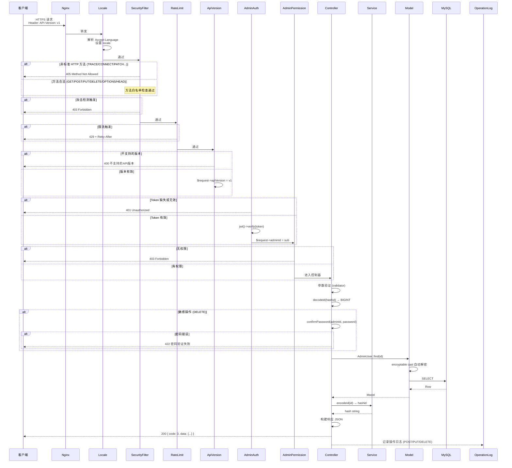

---

## 4. 认证与验证码流程

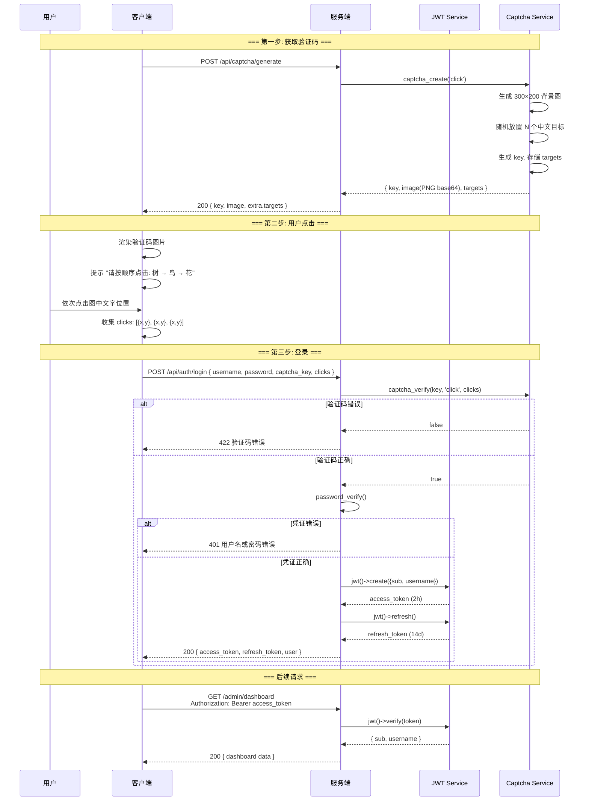

---

## 5. RBAC 权限模型

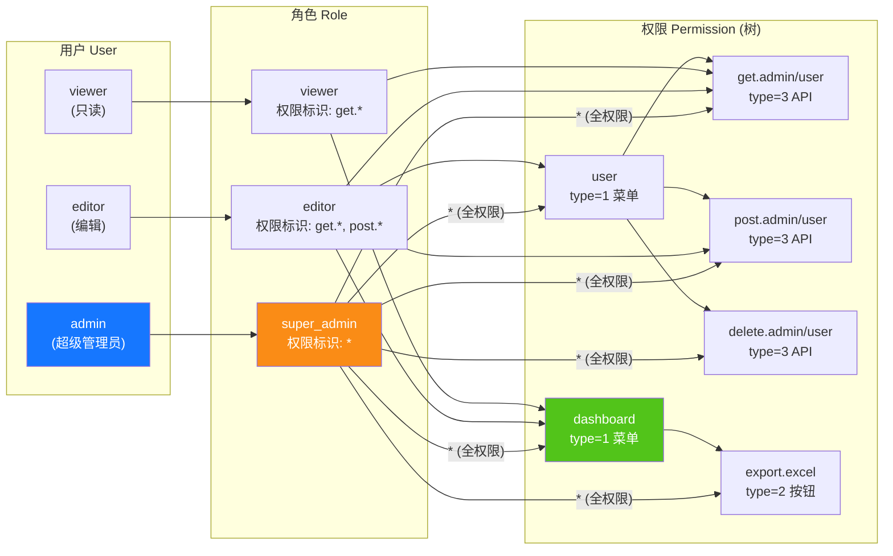

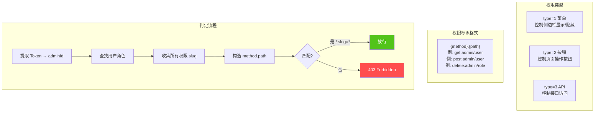

---

## 6. ID 全生命周期

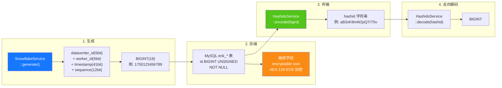

---

## 7. 数据加密分层

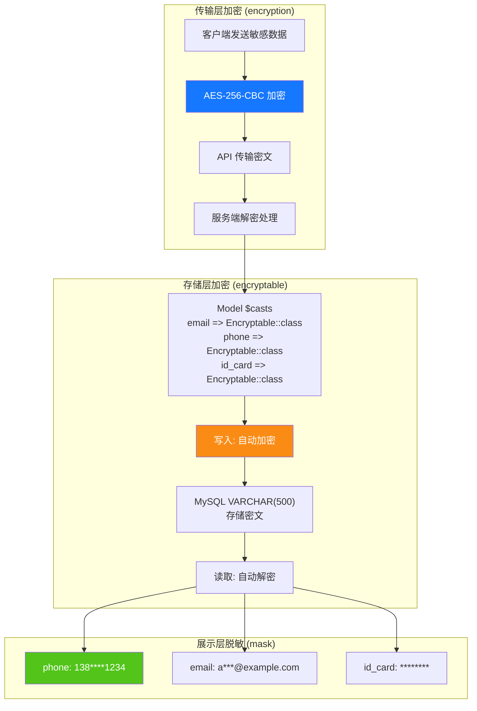

---

## 8. 数据库 ER 关系

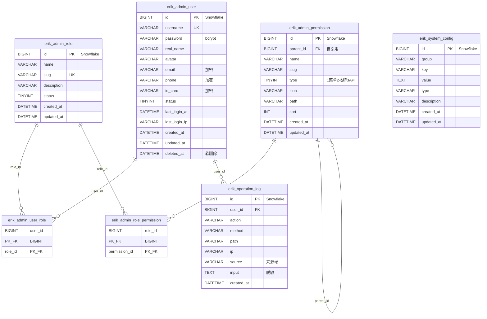

---

## 9. 导出业务流程

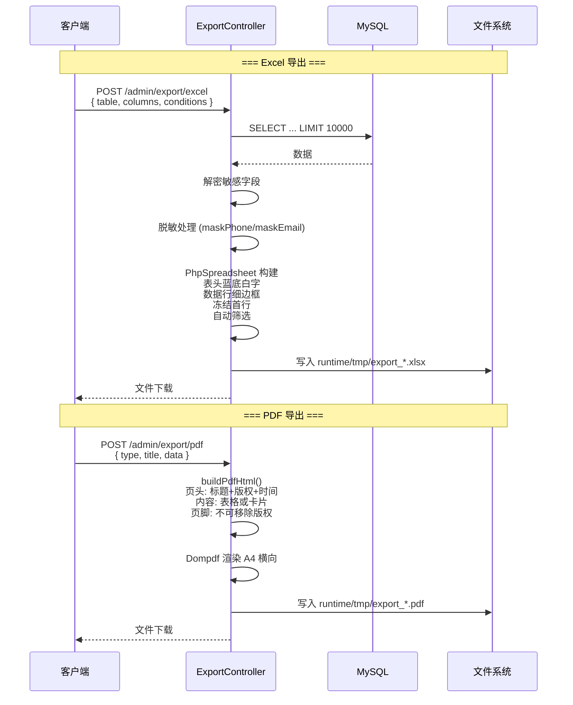

---

## 10. Flutter Web 组件树

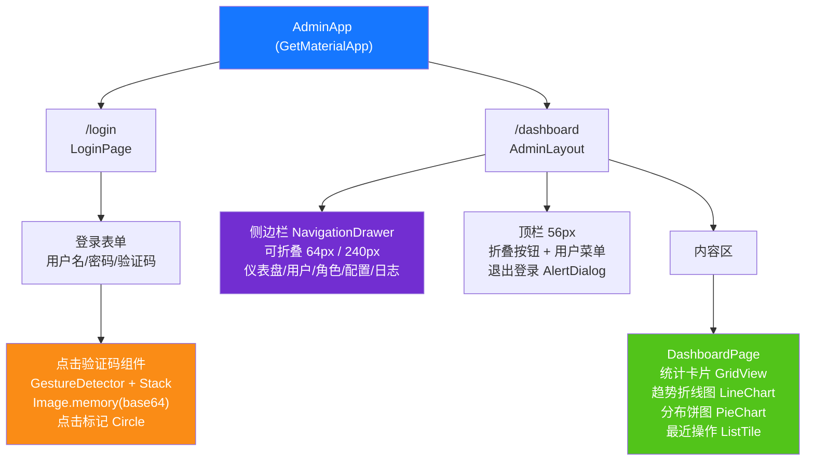

---

## 11. HarmonyOS 页面路由

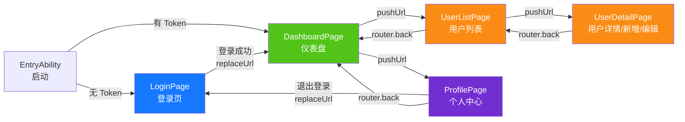

---

## 12. 安全纵深防御全景

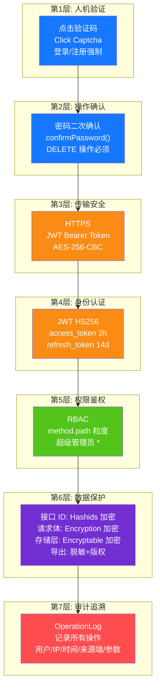

---

## 13. 部署拓扑

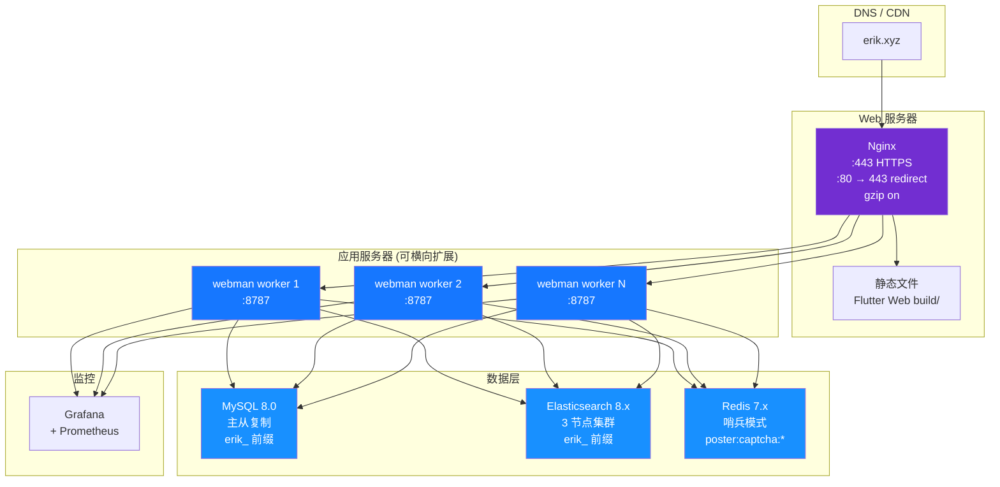

---

## 14. ERP 系统整体架构

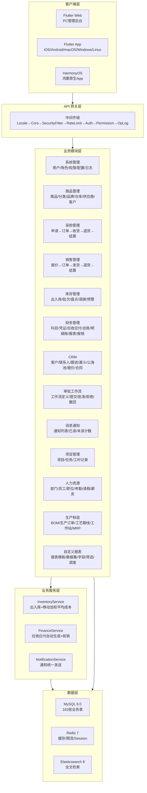

---

## 15. 跨模块数据流

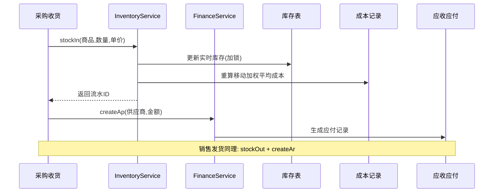

---

## 16. 库存成本核算数据流

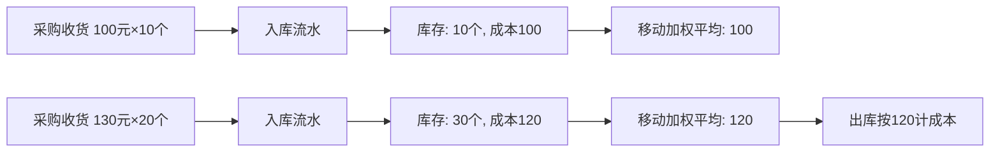

---

## 17. 审批工作流数据流

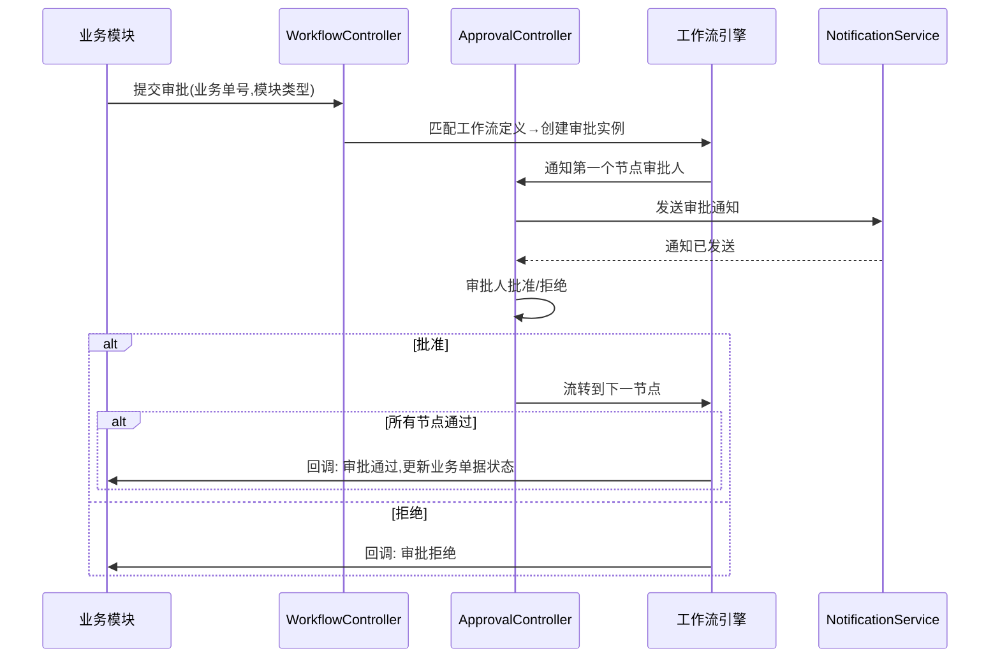

---

## 18. 消息通知数据流

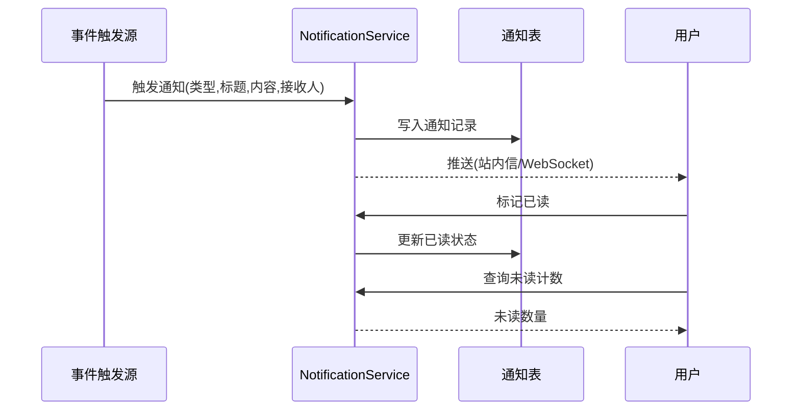

---

## 19. MRP 物料需求计划数据流

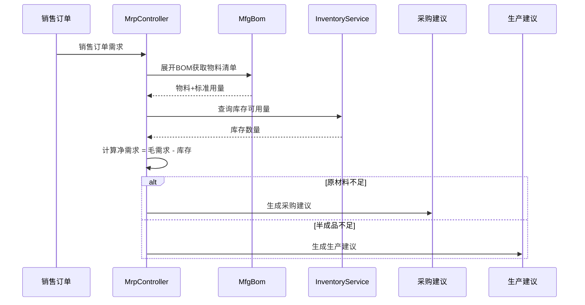

---

## 20. ERP 模块控制器-服务-模型映射表

> 服务层说明：`核心Service` 列标注该模块已下沉的业务服务；标注 **⚠ 控制器直查模型，已知技术债** 的模块，
> 控制器仍直接调用模型查询/写入方法（`XxxModel::find/where/save` 等），尚未抽取服务层，属已知技术债，
> 后续按 P2-F2 服务层轻量提取模式（`app/service/AbstractCrudService` 通用 CRUD 基类 + 模块 Service）逐步收敛。

| 模块 | Controllers (目录) | 核心Service | 主要Model | 表数 |
|------|-------------------|-------------|-----------|------|
| 系统管理 | admin/controller/ (14个) | - ⚠控制器直查模型，已知技术债 | AdminUser, AdminRole, AdminPermission | 7 |
| 商品管理 | controller/product/ (7个) | ProductService | Product, Category, Brand, Warehouse, Supplier, Customer | 11 |
| 采购管理 | controller/purchase/ (5个) | InventoryService, FinanceService ⚠CRUD仍直查，已知技术债 | PurchaseOrder, PurchaseReceive | 9 |
| 销售管理 | controller/sales/ (5个) | InventoryService, FinanceService ⚠CRUD仍直查，已知技术债 | SalesOrder, SalesDelivery | 9 |
| 库存管理 | controller/inventory/ (5个) | InventoryService ⚠CRUD仍直查，已知技术债 | Inventory, InventoryFlow, CostRecord | 11 |
| 财务管理 | controller/finance/ (20个) | FinanceService ⚠CRUD仍直查，已知技术债 | FinanceArAp, FinanceVoucher, FinanceReceipt, FinancePayment, FinanceGeneralLedger, FinanceBalanceSheet, FinanceAsset, FinanceBudget, FinanceCostCenter | 26 |
| CRM | controller/crm/ (10个) | CrmService | CrmOpportunity, CrmFollowRecord, CrmContract, CrmPoolRule, CrmQuotation, CrmCampaign, CrmTicket, CrmAnalyticsReport | 16 |
| 审批工作流 | controller/workflow/ (2个) | - ⚠控制器直查模型，已知技术债 | ApprovalWorkflow, ApprovalInstance, ApprovalNode, ApprovalRecord | 4 |
| 消息通知 | controller/notification/ (1个) | NotificationService ⚠CRUD仍直查，已知技术债 | Notification, NotificationSetting, NotificationTemplate | 3 |
| 项目管理 | controller/project/ (3个) | - ⚠控制器直查模型，已知技术债 | Project, ProjectTask, ProjectTimesheet, ProjectMember, ProjectGantt | 5 |
| 人力资源 | controller/hr/ (5个) | HrService | HrDepartment, HrEmployee, HrPosition, HrAttendance, HrLeave, HrSalary | 8 |
| 生产制造 | controller/manufacturing/ (5个) | ManufacturingService | MfgBom, MfgProductionOrder, MfgRouting, MfgWorkstation, MfgMrpPlan | 8 |
| 自定义报表 | controller/report/ (2个) | - ⚠控制器直查模型，已知技术债 | ReportTemplate, ReportDataset, ReportField, ReportFilter, ReportSchedule | 5 |
| EAM 设备管理 | controller/eam/ (4个) | - ⚠控制器直查模型，已知技术债 | EamEquipment, EamMaintenancePlan, EamRepairOrder, EamSparePart | 4 |
| DMS 文档管理 | controller/dms/ (2个) | - ⚠控制器直查模型，已知技术债 | DmsCategory, DmsDocument, DmsDocumentVersion | 3 |
| BI 看板 | controller/bi/ (3个) | - ⚠控制器直查模型，已知技术债 | BiDashboard, BiWidget | 2 |

### 20.1 P2-F2 服务层轻量提取记录（crm/hr/manufacturing/product 已完成抽取）

| 模块 | 抽取前控制器直查调用数 | 抽取后 | 新增 Service | 抽取内容 |
|------|----------------------|--------|--------------|----------|
| CRM | 57 | 0 | `app/service/crm/CrmService.php` | 通用 CRUD + 合同状态流转、报价转合同、公海池领取/释放、工单指派/解决/回复、明细级联清理、分析报表数据构建 |
| 人力资源 | 38 | 0 | `app/service/hr/HrService.php` | 通用 CRUD + 打卡迟到/早退判定、请假审批（自动生成请假考勤）、薪资唯一性/实发计算/发放/批量生成 |
| 生产制造 | 33 | 0 | `app/service/manufacturing/ManufacturingService.php` | 通用 CRUD + 工单开始/完成流转、BOM 版本复制/生效互斥、MRP 明细生成 |
| 商品管理 | 29 | 0 | `app/service/product/ProductService.php` | 通用 CRUD + 商品事务创建（SKU/价格）、按字段保留原值更新、详情关联加载 |

抽取模式：`app/service/AbstractCrudService.php` 提供 `list/all/find/create/update/delete/deleteWhere` 通用 CRUD
与 `normalizePageParams/canTransition` 纯逻辑助手；模块 Service 继承之并沉淀模块特有业务。
控制器经 `Container::get(XxxService::class)`（class_exists 回退）注入服务，保持路由/参数/返回结构完全不变；
hashid 编解码、密码二次确认、响应包装等 HTTP 关注点仍留在控制器。
新 Service 已在 `config/dependence.php` 登记（该文件为 dead config，未被 addDefinitions 加载，运行期依赖容器
class_exists 回退实例化，故所有 Service 保持无参构造）。

未抽取模块（项目管理 18 次、自定义报表 18 次、采购 24 次、销售 24 次、系统管理 42 次等）已在表中标注
"控制器直查模型，已知技术债"，后续迭代按同一模式抽取。

---

## OMS/WMS/TMS 扩展模块 (2026-08)

### OMS (Order Management System) — 8 tables
- **订单扩展** (`erik_oms_order`)：多渠道聚合/履约状态/支付状态/优先级
- **订单地址** (`erik_oms_order_address`)：收货/账单地址(多国格式)
- **履约记录** (`erik_oms_fulfillment`+`_item`)：分配/已拣/已打包/已发数量追踪
- **RMA** (`erik_oms_rma`+`_item`)：退换货全生命周期
- **库存预占** (`erik_oms_inventory_reservation`)：ATP = physical - reserved
- **渠道** (`erik_channel`)：direct/marketplace/edi/pos

### WMS (Warehouse Management System) — 12 tables
- **库区库位** (`erik_wms_zone`, `erik_wms_location`)：zone→aisle→rack→level→bin
- **入库** (`erik_wms_asn`+`_item`, `erik_wms_receiving`, `erik_wms_putaway_task`+`_item`)
- **出库** (`erik_wms_wave`+`wave_order`, `erik_wms_pick_task`+`_item`, `erik_wms_pack_task`)

### TMS (Transport Management System) — 7 tables
- **承运商** (`erik_tms_carrier`+`carrier_service`, `erik_tms_freight_rate`)
- **运单** (`erik_tms_shipment`+`_package`, `erik_tms_tracking_event`)
- **发票** (`erik_tms_freight_invoice`)

### Data Flow
```
OMS: Channel Order → Inventory Reservation (ATP) → Create Fulfillment → WMS
WMS: Wave → Pick → Pack → TMS Shipment
TMS: Rate Shop → Ship → Confirm (stockOut + AR) → Tracking → Delivery
WMS Inbound: ASN → Receive → Putaway (stockIn + AP)
RMA: Request → Approve → Return → Receive (stockIn) → Refund
```

---

## 21. 生态系统路线图 (2026-08)

> 详细设计规范: `docs/superpowers/specs/2026-08-04-erp-ecosystem-roadmap-design.md`

### 21.1 基线评估（路线图启动时）

> P0~P3 已全部交付，当前综合评分 89/100（见 docs/CLAUDE.md）；下表为路线图启动前的基线快照。

| 维度 | 评分 | 关键差距 |
|------|------|----------|
| 后端 API | 85/100 | 多模块为 CRUD 骨架，缺少业务计算引擎 |
| 安全防护 | 95/100 | 18 层纵深防御，已生产就绪 |
| 前端 UI | 20/100 | **最大短板**: Flutter 12 页覆盖 ~20% 模块，Web 管理面板缺失 |
| 运维生态 | 70/100 | 缺迁移回滚、自动备份、可观测性 |
| 业务深度 | 55/100 | 财务/HR/制造核心算法未实现 |
| **综合** | **65/100** | |

### 21.2 四阶段串行路线图

```
P0(3-4周) → P1(4-6周) → P2(1-2周) → P3(2-3周) = 总计约13周
```

| 阶段 | 名称 | 核心交付 |
|------|------|----------|
| **P0** | 前端生态 | Flutter Web 全模块管理面板（14 模块 40+ 页）、通用组件库、HarmonyOS 对齐 |
| **P1** | 业务深度 | 财务复式记账引擎、薪资计算引擎、MRP 引擎、质量管理模块、实时通知(WebSocket) |
| **P2** | 运维可靠性 | 数据库迁移回滚、自动备份增强、OpenTelemetry 追踪、RabbitMQ 队列驱动 |
| **P3** | 体验增强 | BI 可拖拽看板、设备管理(EAM)、多租户隔离、文档管理(DMS) |

### 21.3 中间件链演进

```
现状:   Locale → Cors → SecurityFilter → RateLimit → TracingId → {路由组}
P1 后:  Locale → Cors → SecurityFilter → RateLimit → WebSocketUpgrade → {路由组}
P2 后:  Locale → Cors → SecurityFilter → RateLimit → TracingId → WebSocketUpgrade → {路由组}
P3 后:  Locale → Cors → SecurityFilter → RateLimit → TracingId → TenantScope → WebSocketUpgrade → {路由组}
```

### 21.4 P0 目标架构 — Flutter Web 管理面板

| 层级 | 新增内容 |
|------|----------|
| 布局层 | `AdminLayout` PC 三栏布局（可折叠侧边栏 + 顶栏 + 内容区） |
| 组件层 | `DataTableWrapper`, `FormDialog`, `ConfirmDialog`, `StatCard`, `BreadcrumbNav`, `FileUploader` |
| 页面层 | 从现有 12 页扩展到 14 模块 40+ 页面全覆盖 |
| 服务层 | 复用现有 `ApiService`, `AuthService`, `CaptchaService`, `ExportService` |

### 21.5 P1 目标架构 — 业务计算引擎

| 引擎 | 服务类 | 关键规则 |
|------|--------|----------|
| 复式记账 | `DoubleEntryService`, `PeriodCloseService`, `AccountBalanceService` | 借贷平衡强制校验、期末损益结转、多币种汇率折算 |
| 薪资计算 | `SalaryEngineService`, `SocialInsuranceService`, `HousingFundService`, `TaxCalculatorService` | 社保基数上下限、公积金比例、个税累进税率、银行代发 |
| MRP | `MrpEngineService`, `BomExplosionService`, `NetRequirementService` | BOM逐层展开+损耗、低层码(LLC)、安全库存、批量规则 |
| 质量 | `QmsInspectionService` | IQC来料/IPQC过程/OQC出货 三单流转 |
| 通知 | `WebSocketService`, `ChannelRouter` | 站内/邮件/企微/钉钉 多渠道 |

### 21.6 数据模型变更汇总

| 阶段 | 新增表数 | 涉及模块 |
|------|----------|----------|
| P0 | 0 | 纯前端，无表变更 |
| P1 | 14 | 财务(2) + HR(3) + 制造(2) + 质量(5) + 通知(2) |
| P3 | 7 | BI(2) + EAM(3) + DMS(2) |

---

## 22. 多租户（预留能力，未启用）

> 版权声明同文件头：Copyright (c) 2026 erik <erik@erik.xyz> — https://erik.xyz

### 22.1 定位与决策

多租户在本项目中定位为**预留能力**，本期**不接线、不启用**（文档化降级）。与规划一致：
SaaS 计费、租户自助开通等"多租户完整商业化方案"不在本项目建设范围内；本期仅保留最小
代码骨架（中间件 + 模型 Trait）并给出启用步骤，供后续按需启用。
注：§21.2 路线图 P3 中的"多租户隔离"据此调整为"预留能力（文档化降级）"，保留骨架、不接线。

决策依据（2026-08 评审）：
- 现有部署几乎全部为单租户，接线会引入不必要的隔离复杂度与回归风险；
- 当前骨架存在技术缺陷（见 22.4），"接线即隔离"不成立，需先完成设计修正；
- 隔离需为 163 张表中的业务表逐表加列、逐模型启用，成本远超"最小接线"。

### 22.2 现状事实（代码与配置核对）

| 项 | 现状 |
|----|------|
| `app/middleware/TenantScope.php` | 存在，未注册；从 `X-Tenant-Id` 头读取租户，头缺失时直接放行 |
| `app/model/concerns/TenantScope.php` | 存在，无模型使用；`bootTenantScope()` 全局作用域仅在设置租户后过滤 |
| `config/middleware.php` | 全局链：Locale → Cors → SecurityFilter → RateLimit → TracingId，无 TenantScope |
| `config/route.php` /admin 组 | AdminAuth → AdminPermission → OperationLog，无 TenantScope |
| JWT 载荷 | 仅 `sub` / `username` / `token_type`，**无 tenant_id 声明**（`app/api/v1/controller/AuthController.php`） |
| 数据库 | **全库无 tenant_id 列**（install.sql 与 30 个迁移文件均无） |
| 模型 | **无任何模型 use TenantScope trait** |

### 22.3 启用步骤（预留参考，本期不执行）

1. 注册中间件：在 `config/route.php` 的 /admin 分组 `middleware()` 中追加
   `app\middleware\TenantScope::class`（置于 AdminAuth 之后，确保已认证）。
2. 请求方在请求头携带 `X-Tenant-Id`（int 租户ID）。
3. 为需要隔离的业务表增加 `tenant_id` 列（BIGINT + 索引）并回填存量数据；
   字典/系统表（如 `erik_admin_user`、`erik_role`、`erik_permission`）不隔离。
4. 在需要隔离的模型类中 `use app\model\concerns\TenantScope;`，自动按当前租户过滤。
5. （可选）如需从 JWT 而非请求头取租户：扩展登录签发载荷增加 `tenant_id` 声明，
   并在中间件中从 `$payload['tenant_id']` 读取。

### 22.4 已知技术限制（启用前必须解决）

- **静态传递链路断裂（PHP 8.3 实测）**：中间件经 trait 名调用 `setCurrentTenantId()`
  写入的是 trait 自身的静态拷贝，使用该 trait 的模型类读取不到，查询不会被过滤。
  启用时需改为基于请求上下文注入（如 `request()->tenantId`）。
- **静态全局状态串扰**：Workerman 为常驻进程，静态属性跨请求共享；若启用协程模式
  （Swoole/Swow）会发生跨租户数据串扰，需改为请求级绑定（`context()` / 请求对象）。
- **数据面缺口**：全库无 tenant_id 列，需逐表迁移；跨租户共享的字典表需设计豁免机制。

### 22.5 验收口径

本期验收 = 文档与代码一致：`config/middleware.php` 与 `config/route.php` 不含
TenantScope 注册；中间件与 Trait 注释明确标注"预留能力，未启用"并给出启用步骤；
本节描述与代码现状逐条对应。
