# مخططات البنية ومنطق الأعمال

> Copyright (c) 2026 erik <erik@erik.xyz> — https://erik.xyz

> تُعرض رسوم Mermaid التالية تلقائيًا في GitHub / GitLab / VS Code. في البيئات الأخرى استخدم [Mermaid Live Editor](https://mermaid.live/) للعرض.

---

## 1. طوبولوجيا بنية النظام

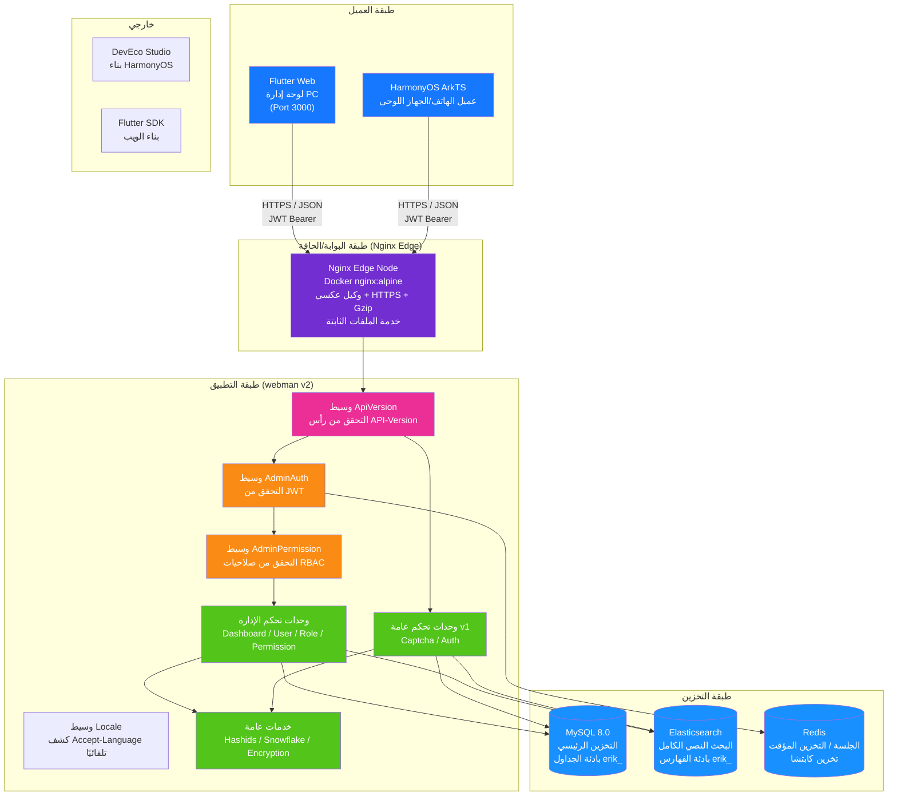

---

## 2. البنية الطبقية للخلفية

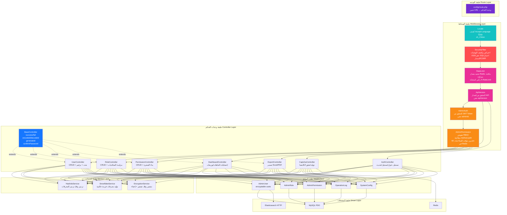

### توسعة طبقة أعمال ERP

مع تطور النظام من لوحة إدارة خالصة إلى نظام ERP كامل، أضيفت الوحدات التجارية التالية إلى طبقة وحدات التحكم وطبقة الخدمات:

| الطبقة | الدليل | الوصف |
|------|------|------|
| وحدات تحكم الأعمال | `app/controller/{product,purchase,sales,inventory,finance,crm,workflow,notification,project,hr,manufacturing,report}/` | 70 وحدة، مقسمة حسب الوحدات، تعالج طلبات الأعمال |
| خدمات الأعمال | `app/service/{inventory,finance,notification}/` | إدخال/إخراج المخزون + احتساب التكلفة، المستحقات/الذمم المالية + المقاصة، إرسال الإشعارات |

---

## 3. دورة حياة الطلب

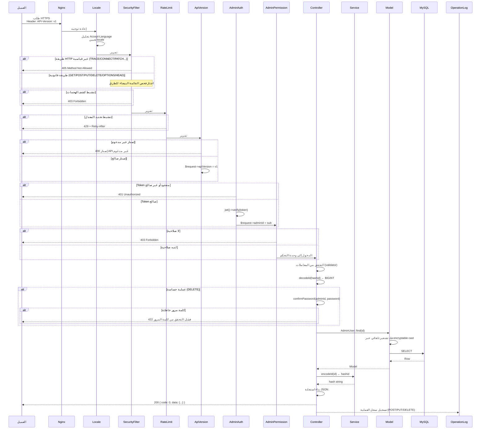

---

## 4. تدفق المصادقة والكابتشا

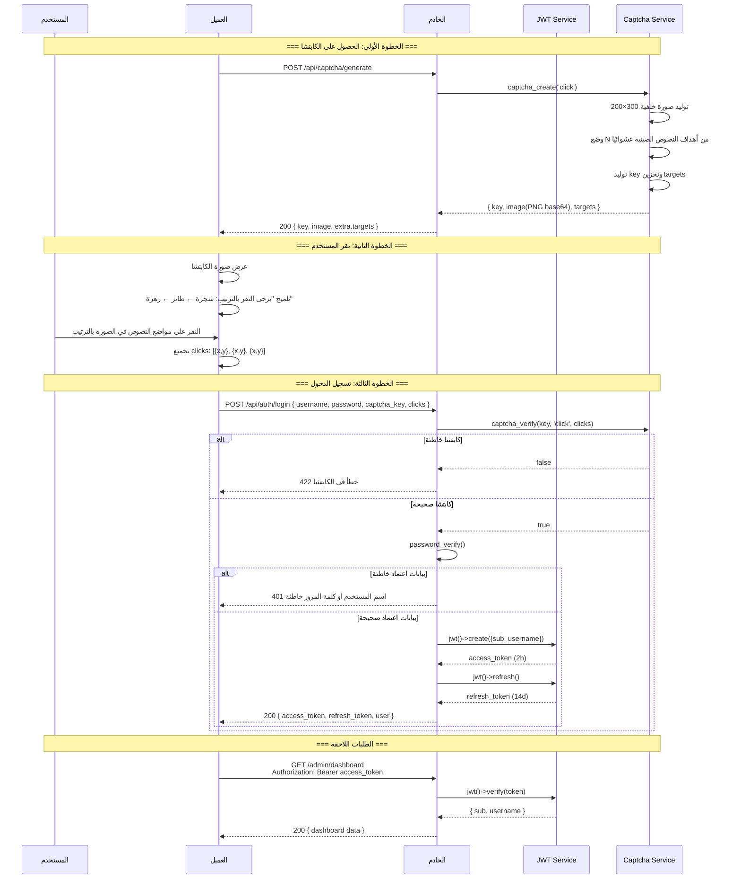

---

## 5. نموذج صلاحيات RBAC

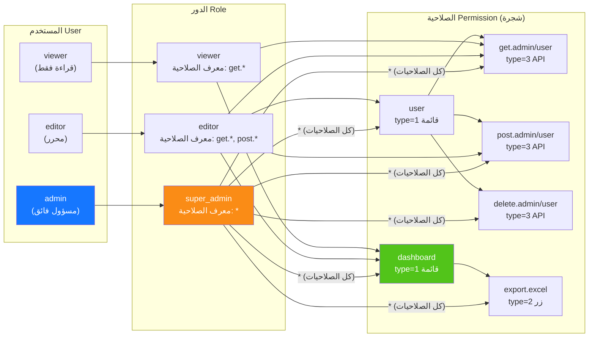

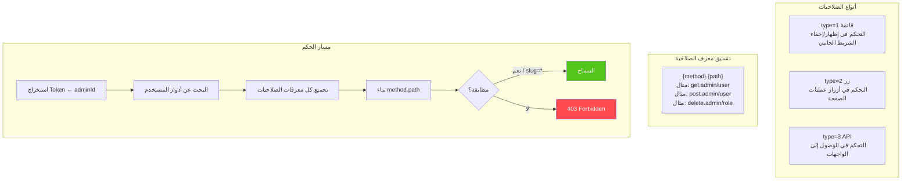

---

## 6. دورة حياة المعرّف الكاملة

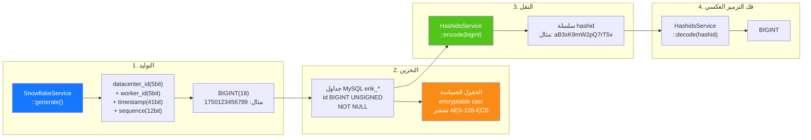

---

## 7. طبقات تشفير البيانات

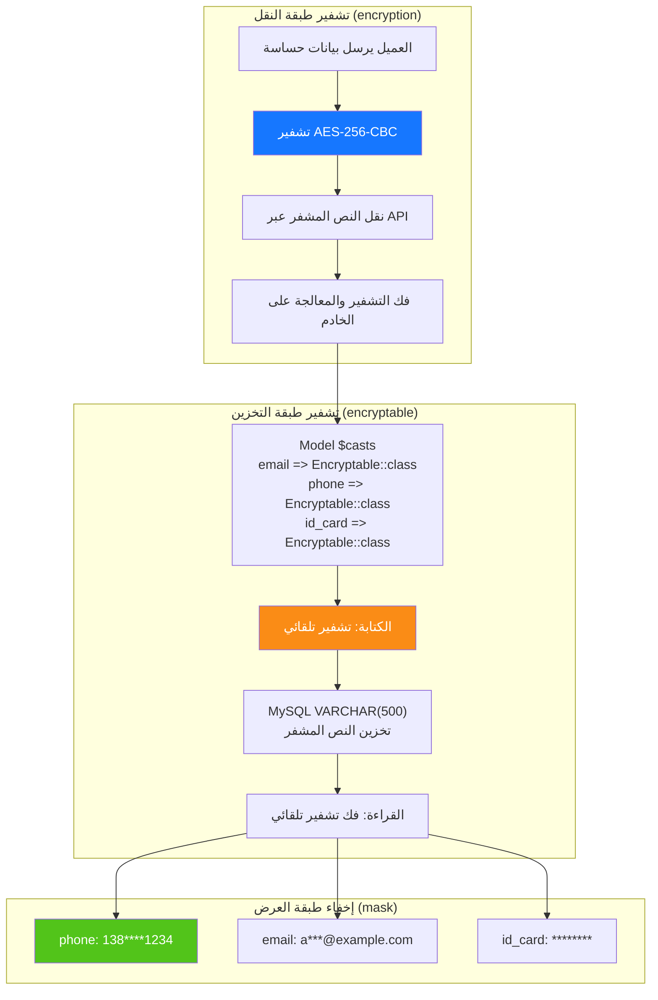

---

## 8. علاقات ER لقاعدة البيانات

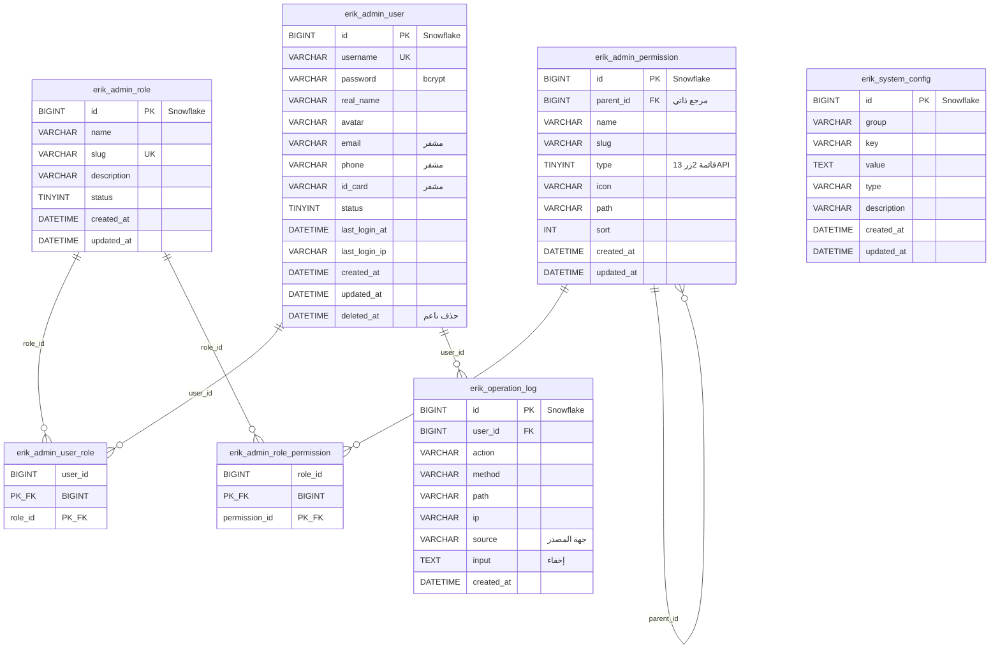

---

## 9. عملية تصدير الأعمال

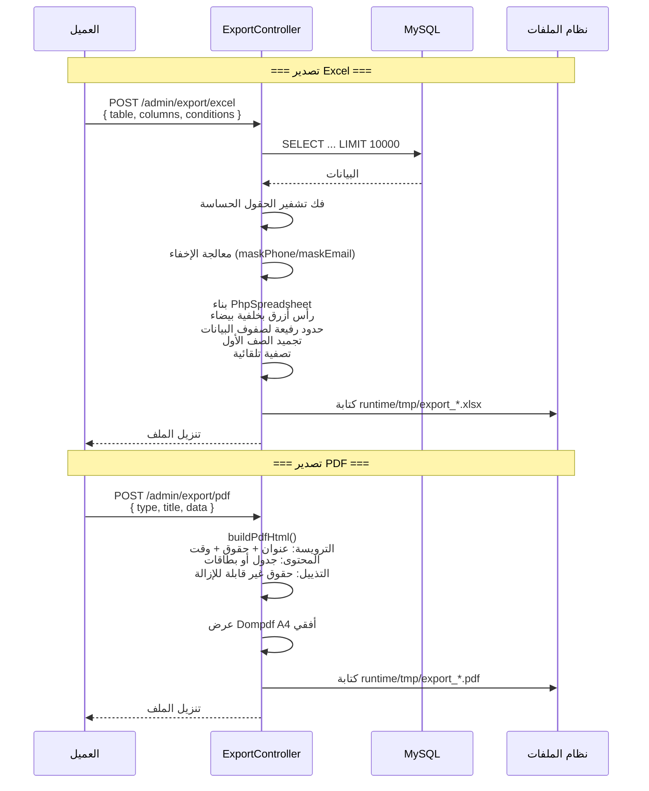

---

## 10. شجرة مكونات Flutter Web

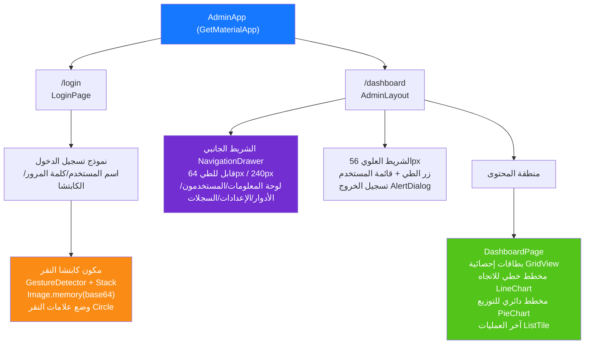

---

## 11. توجيه صفحات HarmonyOS

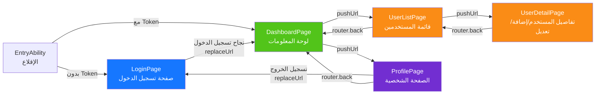

---

## 12. بانوراما الدفاع الأمني المتعمق

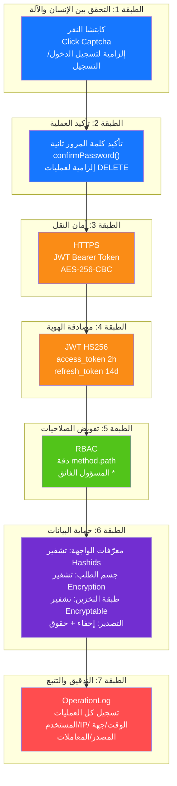

---

## 13. طوبولوجيا النشر

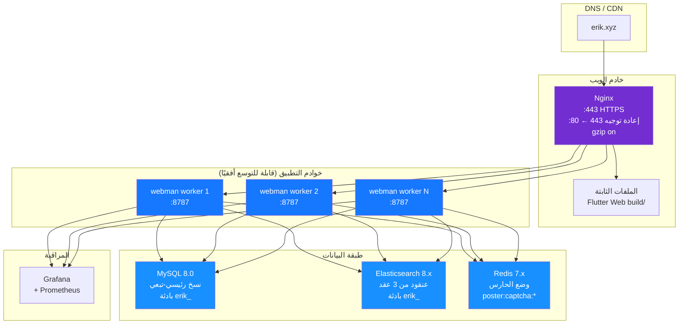

---

## 14. البنية الشاملة لنظام ERP

```mermaid
graph TB
    subgraph Client["طبقة العميل"]
        FW["Flutter Web<br/>لوحة إدارة PC"]
        FA["Flutter App<br/>iOS/Android/macOS/Windows/Linux"]
        HW["HarmonyOS<br/>تطبيق هارموني أصلي"]
    end

    subgraph Gateway["طبقة بوابة API"]
        MW["سلسلة الوسائط<br/>Locale→Cors→SecurityFilter→RateLimit→Auth→Permission→OpLog"]
    end

    subgraph Business["طبقة الوحدات التجارية"]
        direction LR
        Admin["إدارة النظام<br/>المستخدمون/الأدوار/الصلاحيات/الإعدادات/السجلات"]
        Product["إدارة المنتجات<br/>منتج/تصنيف/علامة تجارية/مستودع/مورد/عميل"]
        Purchase["إدارة المشتريات<br/>طلب←أمر←استلام←إرجاع←تسوية"]
        Sales["إدارة المبيعات<br/>عرض سعر←أمر←شحن←إرجاع←تسوية"]
        Inventory["إدارة المخزون<br/>إدخال/إخراج/دفعات/جرد/تحويل/تنبيهات"]
        Finance["الإدارة المالية<br/>حسابات/سندات/مستحقات/دفتر عام/دفتر فرعي/تقارير/مصاريف"]
        CRM["CRM<br/>عميل/جهة اتصال/متابعة/قمع/بركة عامة/عرض سعر/عقد"]
        Workflow["سير عمل الموافقات<br/>تعريف سير العمل/تقديم/موافقة/رفض/سحب"]
        Notification["إشعارات الرسائل<br/>قائمة الإشعارات/مقروء/عدد غير المقروء"]
        Project["إدارة المشاريع<br/>مشروع/مهمة/تسجيل ساعات العمل"]
        HR["الموارد البشرية<br/>قسم/موظف/منصب/حضور/إجازة/راتب"]
        Manufacturing["التصنيع<br/>BOM/أمر إنتاج/مسار تشغيلي/محطة عمل/MRP"]
        Report["تقارير مخصصة<br/>قالب تقرير/مجموعة بيانات/حقل/فلتر/جدولة"]
    end

    subgraph Service["طبقة خدمات الأعمال"]
        IS["InventoryService<br/>إدخال/إخراج + تكلفة المتوسط المتحرك المرجح"]
        FS["FinanceService<br/>توليد تلقائي للمستحقات + مقاصة"]
        NS["NotificationService<br/>إرسال موحد للإشعارات"]
    end

    subgraph Data["طبقة البيانات"]
        MySQL["MySQL 8.0<br/>163 جدول أعمال"]
        Redis["Redis 7<br/>تخزين مؤقت/تحديد معدل/جلسة"]
        ES["Elasticsearch 8<br/>بحث نصي كامل"]
    end

    Client --> Gateway
    Gateway --> Business
    Business --> Service
    Service --> Data
    Business --> Data
```

---

## 15. تدفق البيانات عبر الوحدات

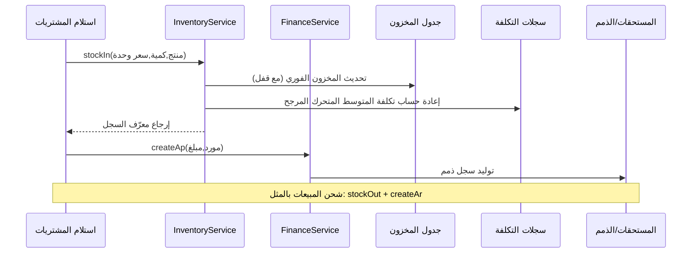

---

## 16. تدفق بيانات احتساب تكلفة المخزون

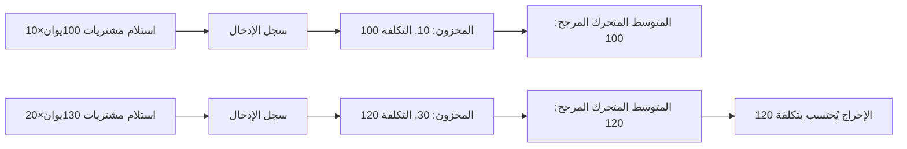

---

## 17. تدفق بيانات سير عمل الموافقات

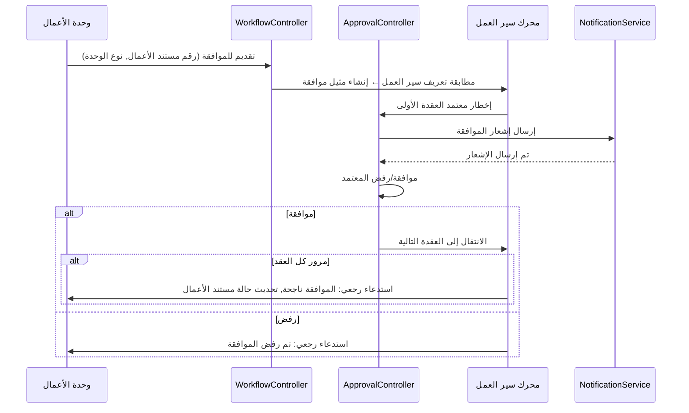

---

## 18. تدفق بيانات إشعارات الرسائل

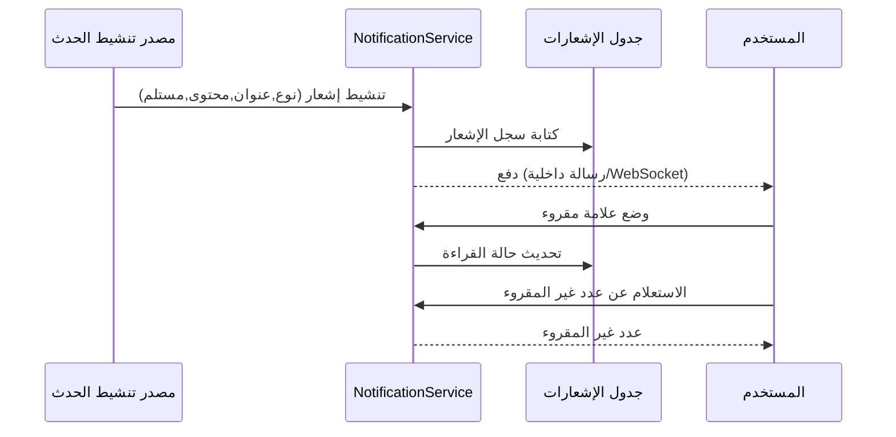

---

## 19. تدفق بيانات تخطيط متطلبات المواد MRP

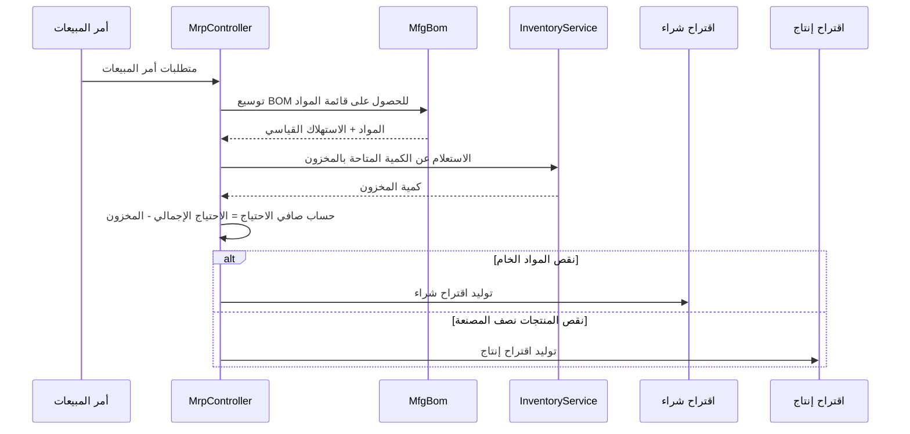

---

## 20. جدول تعيين وحدات التحكم-الخدمات-النماذج في ERP

> ملاحظة طبقة الخدمات: عمود `الخدمة الأساسية` يوضح الخدمات التجارية التي تم إنزالها لهذه الوحدة؛ الوحدات المعلمة بـ **⚠ وحدة التحكم تستعلم النماذج مباشرة، دين تقني معروف**،
> لا تزال وحدات التحكم تستدعي طرق الاستعلام/الكتابة في النماذج مباشرة (`XxxModel::find/where/save` وغيرها)، ولم يتم استخراج طبقة الخدمات بعد، وهي دين تقني معروف،
> وسيتم تقليصها تدريجيًا لاحقًا وفق نمط الاستخراج الخفيف لطبقة الخدمات P2-F2 (`app/service/AbstractCrudService` فئة أساسية عامة للـ CRUD + خدمة الوحدة).

| الوحدة | وحدات التحكم (الدليل) | الخدمة الأساسية | النماذج الرئيسية | عدد الجداول |
|------|-------------------|-------------|-----------|------|
| إدارة النظام | admin/controller/ (14) | - ⚠استعلام مباشر للنماذج، دين تقني معروف | AdminUser, AdminRole, AdminPermission | 7 |
| إدارة المنتجات | controller/product/ (7) | ProductService | Product, Category, Brand, Warehouse, Supplier, Customer | 11 |
| إدارة المشتريات | controller/purchase/ (5) | InventoryService, FinanceService ⚠CRUD ما زال استعلامًا مباشرًا، دين تقني معروف | PurchaseOrder, PurchaseReceive | 9 |
| إدارة المبيعات | controller/sales/ (5) | InventoryService, FinanceService ⚠CRUD ما زال استعلامًا مباشرًا، دين تقني معروف | SalesOrder, SalesDelivery | 9 |
| إدارة المخزون | controller/inventory/ (5) | InventoryService ⚠CRUD ما زال استعلامًا مباشرًا، دين تقني معروف | Inventory, InventoryFlow, CostRecord | 11 |
| الإدارة المالية | controller/finance/ (20) | FinanceService ⚠CRUD ما زال استعلامًا مباشرًا، دين تقني معروف | FinanceArAp, FinanceVoucher, FinanceReceipt, FinancePayment, FinanceGeneralLedger, FinanceBalanceSheet, FinanceAsset, FinanceBudget, FinanceCostCenter | 26 |
| CRM | controller/crm/ (10) | CrmService | CrmOpportunity, CrmFollowRecord, CrmContract, CrmPoolRule, CrmQuotation, CrmCampaign, CrmTicket, CrmAnalyticsReport | 16 |
| سير عمل الموافقات | controller/workflow/ (2) | - ⚠استعلام مباشر للنماذج، دين تقني معروف | ApprovalWorkflow, ApprovalInstance, ApprovalNode, ApprovalRecord | 4 |
| إشعارات الرسائل | controller/notification/ (1) | NotificationService ⚠CRUD ما زال استعلامًا مباشرًا، دين تقني معروف | Notification, NotificationSetting, NotificationTemplate | 3 |
| إدارة المشاريع | controller/project/ (3) | - ⚠استعلام مباشر للنماذج، دين تقني معروف | Project, ProjectTask, ProjectTimesheet, ProjectMember, ProjectGantt | 5 |
| الموارد البشرية | controller/hr/ (5) | HrService | HrDepartment, HrEmployee, HrPosition, HrAttendance, HrLeave, HrSalary | 8 |
| التصنيع | controller/manufacturing/ (5) | ManufacturingService | MfgBom, MfgProductionOrder, MfgRouting, MfgWorkstation, MfgMrpPlan | 8 |
| التقارير المخصصة | controller/report/ (2) | - ⚠استعلام مباشر للنماذج، دين تقني معروف | ReportTemplate, ReportDataset, ReportField, ReportFilter, ReportSchedule | 5 |
| إدارة المعدات EAM | controller/eam/ (4) | - ⚠استعلام مباشر للنماذج، دين تقني معروف | EamEquipment, EamMaintenancePlan, EamRepairOrder, EamSparePart | 4 |
| إدارة المستندات DMS | controller/dms/ (2) | - ⚠استعلام مباشر للنماذج، دين تقني معروف | DmsCategory, DmsDocument, DmsDocumentVersion | 3 |
| لوحات BI | controller/bi/ (3) | - ⚠استعلام مباشر للنماذج، دين تقني معروف | BiDashboard, BiWidget | 2 |

### 20.1 سجل الاستخراج الخفيف لطبقة الخدمات P2-F2 (اكتمل الاستخراج لـ crm/hr/manufacturing/product)

| الوحدة | عدد استدعاءات الاستعلام المباشر قبل الاستخراج | بعد الاستخراج | الخدمة الجديدة | محتوى الاستخراج |
|------|----------------------|--------|--------------|----------|
| CRM | 57 | 0 | `app/service/crm/CrmService.php` | CRUD عام + انتقال حالة العقد، عرض السعر ← عقد، استلام/تحرير البركة العامة، إسناد/حل/رد التذاكر، تنظيف متتالي للتفاصيل، بناء بيانات التقارير التحليلية |
| الموارد البشرية | 38 | 0 | `app/service/hr/HrService.php` | CRUD عام + تحديد تأخر الحضور/الخروج المبكر، موافقات الإجازات (توليد حضور/إجازات تلقائيًا)، تفرد الرواتب/احتساب صافي الراتب/الصرف/التوليد الجماعي |
| التصنيع | 33 | 0 | `app/service/manufacturing/ManufacturingService.php` | CRUD عام + انتقال بدء/إكمال أوامر العمل، نسخ إصدار BOM/استبعاد التفعيل، توليد تفاصيل MRP |
| إدارة المنتجات | 29 | 0 | `app/service/product/ProductService.php` | CRUD عام + إنشاء معاملات المنتج (SKU/السعر)، تحديث محتفظ بقيمة الحقل الأصلية، تحميل الارتباطات التفصيلية |

نمط الاستخراج: يوفر `app/service/AbstractCrudService.php` عمليات CRUD العامة `list/all/find/create/update/delete/deleteWhere`
ومساعدي المنطق الخالص `normalizePageParams/canTransition`؛ خدمات الوحدات ترث منه وترسّب منطق الأعمال الخاص بالوحدة.
تقوم وحدات التحكم بحقن الخدمات عبر `Container::get(XxxService::class)` (مع تراجع class_exists)، مع الحفاظ التام على بنية المسارات/المعاملات/الاستجابات؛
تبقى اهتمامات HTTP مثل ترميز وفك ترميز hashid وتأكيد كلمة المرور الثانية وتغليف الاستجابة في وحدات التحكم.
الخدمات الجديدة مسجلة في `config/dependence.php` (ملف تكوين ميت، لا يُحمَّل عبر addDefinitions، ويعتمد حاوية التشغيل على
تراجع class_exists للإنشاء، لذا تبقى جميع الخدمات بمنشئ بلا معاملات).

الوحدات غير المستخرجة (إدارة المشاريع 18 مرة، التقارير المخصصة 18 مرة، المشتريات 24 مرة، المبيعات 24 مرة، إدارة النظام 42 مرة وغيرها) معلمة في الجدول
"استعلام مباشر للنماذج، دين تقني معروف"، وسيتم استخراجها في التكرارات اللاحقة وفق النمط نفسه.

---

## وحدات التوسعة OMS/WMS/TMS (2026-08)

### OMS (نظام إدارة الطلبات) — 8 جداول
- **توسعة الطلبات** (`erik_oms_order`): تجميع متعدد القنوات/حالة التنفيذ/حالة الدفع/الأولوية
- **عناوين الطلبات** (`erik_oms_order_address`): عناوين الاستلام/الفوترة (تنسيقات متعددة الدول)
- **سجلات التنفيذ** (`erik_oms_fulfillment`+`_item`): تتبع كميات التخصيص/الانتقاء/التغليف/الشحن
- **RMA** (`erik_oms_rma`+`_item`): دورة حياة كاملة للإرجاع والاستبدال
- **حجز المخزون** (`erik_oms_inventory_reservation`): ATP = physical - reserved
- **القنوات** (`erik_channel`): direct/marketplace/edi/pos

### WMS (نظام إدارة المستودعات) — 12 جدولًا
- **المناطق والمواقع** (`erik_wms_zone`, `erik_wms_location`): zone→aisle→rack→level→bin
- **الإدخال** (`erik_wms_asn`+`_item`, `erik_wms_receiving`, `erik_wms_putaway_task`+`_item`)
- **الإخراج** (`erik_wms_wave`+`wave_order`, `erik_wms_pick_task`+`_item`, `erik_wms_pack_task`)

### TMS (نظام إدارة النقل) — 7 جداول
- **الناقلون** (`erik_tms_carrier`+`carrier_service`, `erik_tms_freight_rate`)
- **بوليصة الشحن** (`erik_tms_shipment`+`_package`, `erik_tms_tracking_event`)
- **الفواتير** (`erik_tms_freight_invoice`)

### تدفق البيانات
```
OMS: Channel Order → Inventory Reservation (ATP) → Create Fulfillment → WMS
WMS: Wave → Pick → Pack → TMS Shipment
TMS: Rate Shop → Ship → Confirm (stockOut + AR) → Tracking → Delivery
WMS Inbound: ASN → Receive → Putaway (stockIn + AP)
RMA: Request → Approve → Return → Receive (stockIn) → Refund
```

---

## 21. خارطة طريق النظام البيئي (2026-08)

> مواصفات التصميم التفصيلية: `superpowers/specs/2026-08-04-erp-ecosystem-roadmap-design.md`

### 21.1 التقييم الأساسي (عند إطلاق خارطة الطريق)

> تم تسليم P0~P3 بالكامل، والنتيجة الشاملة الحالية 89/100 (انظر CLAUDE.md)؛ الجدول التالي هو لقطة الأساس قبل إطلاق خارطة الطريق.

| البعد | النتيجة | الفجوة الرئيسية |
|------|------|----------|
| API الخلفية | 85/100 | وحدات متعددة هي هياكل CRUD، تفتقر إلى محركات احتساب الأعمال |
| الحماية الأمنية | 95/100 | دفاع متعمق من 18 طبقة، جاهز للإنتاج |
| واجهة المستخدم | 20/100 | **أكبر قصور**: 12 صفحة Flutter تغطي ~20% من الوحدات، لوحة إدارة الويب مفقودة |
| بيئة التشغيل | 70/100 | ينقصها تراجع الهجرات والنسخ الاحتياطي التلقائي وقابلية المراقبة |
| عمق الأعمال | 55/100 | الخوارزميات الأساسية للمالية/HR/التصنيع غير منفذة |
| **الإجمالي** | **65/100** | |

### 21.2 خارطة طريق متسلسلة بأربع مراحل

```
P0(3-4 أسابيع) → P1(4-6 أسابيع) → P2(1-2 أسبوعين) → P3(2-3 أسابيع) = إجمالي حوالي 13 أسبوعًا
```

| المرحلة | الاسم | التسليمات الأساسية |
|------|------|----------|
| **P0** | بيئة الواجهة | لوحة إدارة Flutter Web لجميع الوحدات (14 وحدة 40+ صفحة)، مكتبة مكونات عامة، محاذاة HarmonyOS |
| **P1** | عمق الأعمال | محرك القيد المزدوج، محرك احتساب الرواتب، محرك MRP، وحدة إدارة الجودة، إشعارات فورية (WebSocket) |
| **P2** | موثوقية التشغيل | تراجع هجرات قاعدة البيانات، تعزيز النسخ الاحتياطي التلقائي، تتبع OpenTelemetry، قيادة قوائم انتظار RabbitMQ |
| **P3** | تحسين التجربة | لوحات BI بالسحب والإفلات، إدارة المعدات (EAM)، عزل متعدد المستأجرين، إدارة المستندات (DMS) |

### 21.3 تطور سلسلة الوسائط

```
الوضع الحالي: Locale → Cors → SecurityFilter → RateLimit → TracingId → {مجموعة التوجيه}
بعد P1:  Locale → Cors → SecurityFilter → RateLimit → WebSocketUpgrade → {مجموعة التوجيه}
بعد P2:  Locale → Cors → SecurityFilter → RateLimit → TracingId → WebSocketUpgrade → {مجموعة التوجيه}
بعد P3:  Locale → Cors → SecurityFilter → RateLimit → TracingId → TenantScope → WebSocketUpgrade → {مجموعة التوجيه}
```

### 21.4 البنية المستهدفة لـ P0 — لوحة إدارة Flutter Web

| الطبقة | المحتوى الجديد |
|------|----------|
| طبقة التخطيط | `AdminLayout` تخطيط PC ثلاثي الأعمدة (شريط جانبي قابل للطي + شريط علوي + منطقة محتوى) |
| طبقة المكونات | `DataTableWrapper`, `FormDialog`, `ConfirmDialog`, `StatCard`, `BreadcrumbNav`, `FileUploader` |
| طبقة الصفحات | التوسع من 12 صفحة حاليًا إلى تغطية كاملة لـ 14 وحدة 40+ صفحة |
| طبقة الخدمات | إعادة استخدام `ApiService`, `AuthService`, `CaptchaService`, `ExportService` الحالية |

### 21.5 البنية المستهدفة لـ P1 — محركات احتساب الأعمال

| المحرك | فئة الخدمة | القواعد الرئيسية |
|------|--------|----------|
| القيد المزدوج | `DoubleEntryService`, `PeriodCloseService`, `AccountBalanceService` | تحقق إلزامي من توازن المدين/الدائن، ترحيل أرباح وخسائر نهاية الفترة، تحويل أسعار الصرف متعدد العملات |
| احتساب الرواتب | `SalaryEngineService`, `SocialInsuranceService`, `HousingFundService`, `TaxCalculatorService` | حدود أساس التأمين الاجتماعي، نسب صندوق الإسكان، الضريبة التصاعدية على الدخل، الصرف عبر البنك |
| MRP | `MrpEngineService`, `BomExplosionService`, `NetRequirementService` | توسيع BOM طبقة بطبقة + الهالك، رمز الطبقة الدنيا (LLC)، مخزون الأمان، قواعد الدفعات |
| الجودة | `QmsInspectionService` | انتقال ثلاثي لـ IQC للمواد/IPQC للعمليات/OQC للشحن |
| الإشعارات | `WebSocketService`, `ChannelRouter` | قنوات متعددة: داخلية/بريد/وي تشات الأعمال/دينغ توك |

### 21.6 ملخص تغييرات نموذج البيانات

| المرحلة | عدد الجداول الجديدة | الوحدات المعنية |
|------|----------|------|
| P0 | 0 | واجهة فقط، بدون تغييرات على الجداول |
| P1 | 14 | مالية(2) + HR(3) + تصنيع(2) + جودة(5) + إشعارات(2) |
| P3 | 7 | BI(2) + EAM(3) + DMS(2) |

---

## 22. تعدد المستأجرين (قدرة محجوزة، غير مفعلة)

> إعلان حقوق النشر كما في ترويسة الملف: Copyright (c) 2026 erik <erik@erik.xyz> — https://erik.xyz

### 22.1 التموضع والقرار

تعدد المستأجرين في هذا المشروع هو **قدرة محجوزة**، **غير موصَّل وغير مفعَّل** في هذه المرحلة (تخفيض موثق). بما يتسق مع التخطيط:
الحلول التجارية الكاملة لتعدد المستأجرين مثل فوترة SaaS والتفعيل الذاتي للمستأجرين ليست ضمن نطاق هذا المشروع؛ في هذه المرحلة لا يُحتفظ إلا
بهيكل كود أدنى (وسيط + trait نموذج) مع خطوات التفعيل، للتفعيل حسب الحاجة لاحقًا.
ملاحظة: «عزل تعدد المستأجرين» في P3 من §21.2 يُعدَّل بناءً على ذلك إلى «قدرة محجوزة (تخفيض موثق)»، مع الاحتفاظ بالهيكل دون توصيل.

أساس القرار (مراجعة 2026-08):
- جميع عمليات النشر الحالية تقريبًا أحادية المستأجر، والتوصيل سيُدخل تعقيد عزل غير ضروري ومخاطر انحدار؛
- الهيكل الحالي يعاني عيوبًا تقنية (انظر 22.4)، و«التوصيل يعني العزل» غير صحيح، يجب إصلاح التصميم أولًا؛
- يتطلب العزل إضافة أعمدة لكل جدول أعمال من الجداول الـ 163 وتفعيلها لكل نموذج، والتكلفة تتجاوز بكثير «الحد الأدنى من التوصيل».

### 22.2 الوقائع الحالية (التحقق من الكود والإعدادات)

| البند | الوضع الحالي |
|----|------|
| `app/middleware/TenantScope.php` | موجود، غير مسجل؛ يقرأ المستأجر من رأس `X-Tenant-Id`، ويمرر مباشرة عند غياب الرأس |
| `app/model/concerns/TenantScope.php` | موجود، لا تستخدمه أي نماذج؛ `bootTenantScope()` نطاق عالمي لا يفلتر إلا بعد تعيين المستأجر |
| `config/middleware.php` | السلسلة العامة: Locale → Cors → SecurityFilter → RateLimit → TracingId، بدون TenantScope |
| `config/route.php` مجموعة /admin | AdminAuth → AdminPermission → OperationLog، بدون TenantScope |
| حمولة JWT | `sub` / `username` / `token_type` فقط، **بدون ادعاء tenant_id** (`app/api/v1/controller/AuthController.php`) |
| قاعدة البيانات | **لا توجد أي أعمدة tenant_id في القاعدة** (ولا في install.sql) |
| النماذج | **لا يستخدم أي نموذج trait TenantScope** |

### 22.3 خطوات التفعيل (مرجع محجوز، لا تنفَّذ في هذه المرحلة)

1. تسجيل الوسيط: إضافة `app\middleware\TenantScope::class` في `middleware()` لمجموعة /admin في `config/route.php`
   (وضعه بعد AdminAuth، لضمان المصادقة).
2. يحمل الطالب رأس `X-Tenant-Id` (int معرف المستأجر) في ترويسة الطلب.
3. إضافة عمود `tenant_id` (BIGINT + فهرس) لجداول الأعمال التي تحتاج العزل وإعادة ملء البيانات القائمة؛
   جداول القواميس/النظام (مثل `erik_admin_user` و`erik_role` و`erik_permission`) لا تُعزل.
4. في فئات النماذج التي تحتاج العزل: `use app\model\concerns\TenantScope;`، فيتم الفلترة تلقائيًا حسب المستأجر الحالي.
5. (اختياري) إذا أردت أخذ المستأجر من JWT بدل الترويسة: توسيع حمولة إصدار تسجيل الدخول بإضافة ادعاء `tenant_id`،
   والقراءة من `$payload['tenant_id']` في الوسيط.

### 22.4 القيود التقنية المعروفة (يجب حلها قبل التفعيل)

- **انقطاع سلسلة النقل الثابتة (مُختبَر فعليًا على PHP 8.3)**: الوسيط يستدعي `setCurrentTenantId()` عبر اسم trait
   ويكتب نسخة ثابتة خاصة بالـ trait نفسه، ولا تستطيع فئات النماذج التي تستخدم الـ trait قراءتها، ولن تُفلتر الاستعلامات.
   عند التفعيل يجب التحول إلى الحقن المستند إلى سياق الطلب (مثل `request()->tenantId`).
- **تداخل الحالة العامة الثابتة**: Workerman عملية مقيمة، الخصائص الثابتة مشتركة عبر الطلبات؛ إذا فُعِّل وضع coroutine
   (Swoole/Swow) سيحدث تداخل بيانات عبر المستأجرين، يجب التحول إلى الربط على مستوى الطلب (`context()` / كائن الطلب).
- **فجوة مستوى البيانات**: لا توجد أعمدة tenant_id في القاعدة، يتطلب ترحيلًا جدولًا بجدول؛ جدول القواميس المشتركة عبر المستأجرين يحتاج آلية استثناء مصممة.

### 22.5 معايير القبول

قبول هذه المرحلة = توافق المستندات مع الكود: `config/middleware.php` و`config/route.php` لا يحتويان على
تسجيل TenantScope؛ التعليقات في الوسيط والـ trait تشير بوضوح إلى «قدرة محجوزة، غير مفعلة» مع خطوات التفعيل؛
هذا القسم يتطابق بندًا ببند مع الوضع الحالي للكود.
