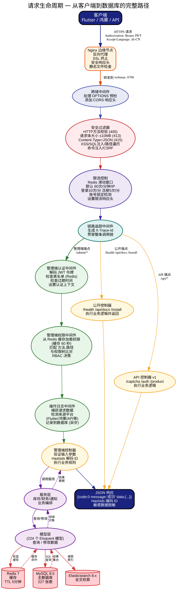
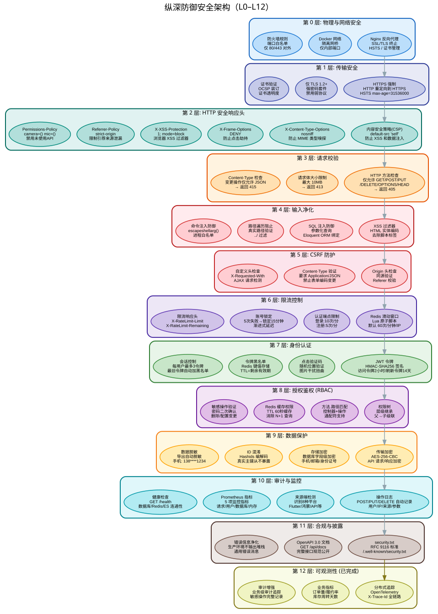

# نظام إدارة موارد المؤسسات المفتوح (open-erp)

نظام ERP متكامل الحزمة (Full-stack) مبني على webman v2 + Flutter.

<div align="center"></div>

<div align="center">🌐 [中文](../../../README.md) | [English](../en/README.md) | [한국어](../ko/README.md) | [Русский](../ru/README.md) | [Deutsch](../de/README.md) | [Français](../fr/README.md) | [Español](../es/README.md) | [Português](../pt/README.md) | [हिन्दी](../hi/README.md) | العربية | [বাংলা](../bn/README.md) | [Bahasa Indonesia](../id/README.md) | [日本語](../ja/README.md)</div>

> [English version](../en/README.md) | [مقارنة الإصدارات](EDITIONS.md) | [مخطط التصميم المعماري](ARCHITECTURE.md) | [نظام البنية المعمارية](#نظام-البنية-المعمارية) | [وثيقة التصميم](DESIGN.md) | [بنية الأمان](SECURITY.md) | [مرجع API](API.md) | [دليل الوظائف](FUNCTIONS.md)

## قائمة الوظائف

| مجال الأعمال | الوظيفة | الوصف |
|--------|------|------|
| 🔐 المصادقة | تسجيل الدخول / التسجيل / تحديث الرمز / تسجيل الخروج | كابتشا بالنقر + JWT + قائمة سوداء |
| | قفل الحساب | 5 محاولات فاشلة تقفل الحساب لمدة 15 دقيقة |
| | حد الجلسات المتزامنة | حتى 3 رموز صالحة لنفس المستخدم |
| 📊 لوحة المعلومات | نظرة عامة على الأعمال / لوحة المبيعات / لوحة المخزون / لوحة المالية | تخزين مؤقت Redis لمدة 5 دقائق |
| 👥 إدارة المستخدمين | CRUD + حذف جماعي / تفعيل-تعطيل | حذف ناعم + تأكيد كلمة المرور |
| | استيراد جماعي Excel | تحقق سطر بسطر + تقرير أخطاء |
| 🔒 صلاحيات الأدوار | CRUD للأدوار + شجرة الصلاحيات | تفويض بدرجة دقة method.path عبر RBAC |
| ⚙ إعدادات النظام | CRUD لزوج المفتاح-القيمة | إدارة المجموعات |
| 📋 تدقيق العمليات | الاستعلام عن السجلات + كشف جهاز المصدر | التعرف التلقائي على 8 منصات |
| 📁 إدارة الملفات | رفع / تصدير Excel / تصدير PDF | إخفاء تلقائي للبيانات الحساسة |
| 🛡 الحماية الأمنية | دفاع عميق من 18 طبقة | XSS/حقن SQL/اجتياز المسار/حقن الأوامر/CSRF/تحديد المعدل/CSP... |
| 🏥 التشغيل والصيانة | فحص الصحة / metrics / وثائق API / security.txt | Prometheus + OpenAPI 3.0 |
| 📦 إدارة المنتجات | سجل المنتج / SKU / مواصفات متعددة / وحدات متعددة / تصنيف / علامة تجارية / استراتيجية الأسعار | شجرة تصنيف متعددة المستويات + تحويل بين وحدات متعددة |
| | مستودعات ومواقع تخزين | إدارة مستودعات ومواقع تخزين متعددة |
| | سجل الموردين / العملاء | جهات اتصال / حسابات بنكية / حدود ائتمانية |
| 📥 إدارة المشتريات | طلب ← أمر ← استلام ← إرجاع ← تسوية | عملية شراء كاملة + موافقات |
| 📤 إدارة المبيعات | عرض سعر ← أمر ← شحن ← إرجاع ← تسوية | تحويل عرض السعر إلى أمر + هامش الربح |
| 🏗 إدارة المخزون | مخزون فوري / دفعات / أرقام تسلسلية / تحويل / جرد / تنبيهات | تكلفة المتوسط المتحرك المرجح |
| 💰 الإدارة المالية | ذمم مدينة/دائنة / مقبوضات-مدفوعات / دفتر يومية / مصاريف / بيان الأرباح / أصول ثابتة / ضرائب / عملات متعددة / ميزانيات / مراكز تكلفة وأرباح | توليد تلقائي للذمم + تسوية + إدارة مالية شاملة |
| 🤝 إدارة علاقات العملاء | عملاء / جهات اتصال / سجلات متابعة / حملات تسويقية / تذاكر خدمة / تقارير تحليلية / قمع مبيعات / تجمع عام / عروض أسعار / عقود | إدارة دورة حياة العميل كاملة |
| ✅ سير عمل الموافقات | تعريف سير العمل / تقديم للموافقة / موافقة / رفض / سحب / موافقاتي | محرك عمليات موافقة متعددة العقد |
| 🔔 إشعارات الرسائل | قائمة الإشعارات / تحديد كمقروء / عدد غير المقروء / قراءة الكل | دفع الرسائل في الوقت الفعلي وتتبع الحالة |
| 📐 إدارة المشاريع | مشاريع / مهام / سجلات ساعات العمل | تتبع تقدم المشروع وإدارة الموارد |
| 👤 الموارد البشرية | أقسام / موظفون / مناصب / حضور / إجازات / رواتب | إدارة شؤون موظفين شاملة |
| 🏭 التصنيع والإنتاج | BOM / أوامر إنتاج / مسارات تشغيل / محطات عمل / MRP | تخطيط متطلبات المواد وتنفيذ الإنتاج |
| 📈 تقارير مخصصة | قوالب تقارير / مجموعات بيانات / حقول / فلاتر / تنفيذ / جدولة | منشئ تقارير مرئي |
| 📋 إدارة الطلبات (OMS) | طلبات متعددة القنوات / تنسيق التنفيذ / حجز المخزون / توزيع / إلغاء / RMA للإرجاع والاستبدال | إدارة دورة حياة الطلب كاملة |
| 🏗 إدارة المستودعات (WMS) | مناطق ومواقع / ASN / استلام / رفع للأرفف / موجات / انتقاء / تغليف / شحن | سير عمل مستودع كامل |
| 🚚 إدارة النقل (TMS) | ناقلون / خدمات / أسعار / شحنات / تتبع لوجستي / فواتير شحن | مقارنة أسعار الناقلين المتعددين + تتبع المسارات |

## وحدات ERP

تدفق البيانات بين وحدات الأعمال:

- استلام الشراء ← إدخال تلقائي للمخزون (تكلفة المتوسط المتحرك المرجح) ← توليد ذمم دائنة تلقائيًا
- شحن المبيعات ← إخراج تلقائي من المخزون ← توليد ذمم مدينة تلقائيًا
- المقبوضات/المدفوعات ← تسوية الذمم المدينة/الدائنة ← تحديث دفتر اليومية
- مراجعة القيود ← تحديث تلقائي لدفتر الأستاذ العام (ملخص الحسابات) + دفتر الأستاذ التفصيلي (تسجيل كل معاملة)
- الميزانية العمومية ← توليد تلقائي من ملخص الأرصدة الختامية لدفتر الأستاذ
- قائمة التدفق النقدي ← توليد تلقائي من دفتر اليومية النقدية والبنكية (ثلاثة تصنيفات: تشغيلي/استثماري/تمويلي)
- سير عمل الموافقات ← إرسال مستندات الأعمال للموافقة ← تدفق متعدد العقد ← استدعاء النتيجة في وحدات الأعمال
- إشعارات الرسائل ← أحداث الموافقات/التنبيهات/النظام ← دفع فوري ← المستخدم يحدد كمقروء
- MRP ← بناءً على أوامر المبيعات + BOM ← حساب احتياجات المواد ← توليد اقتراحات شراء/إنتاج
- OMS ← استيراد طلبات متعددة القنوات ← حجز المخزون (ATP) ← إنشاء التنفيذ ← إرسال لمهام انتقاء/تغليف WMS
- WMS ← تجميع الموجات ← مهام انتقاء ← تأكيد الانتقاء ← اكتمال التغليف ← إطلاق شحنة TMS
- TMS ← مقارنة أسعار الشحن ← إنشاء الشحنة ← تأكيد الشحن (stockOut+AR) ← تتبع المسار اللوجستي ← التوقيع على الاستلام
- إدخال WMS ← إشعار ASN ← استلام ← فحص الجودة ← تأكيد الرفع للأرفف (stockIn+AP) ← تحديث المخزون
- RMA ← طلب إرجاع ← موافقة ← إدخال الإرجاع للمخزون ← استرداد المبلغ

## حزمة التقنيات

| الطبقة | التقنية | الوصف |
|---|------|------|
| إطار العمل الخلفي | webman v2 (workerman) | إطار PHP عالي الأداء للعمليات المقيمة |
| إصدار PHP | 8.3+ | |
| قاعدة البيانات | MySQL 8.0+ | بادئة الجداول `erp_`، مفتاح أساسي BIGINT غير تلقائي التزايد |
| محرك البحث | Elasticsearch | المزامنة والاستعلام عبر `webman-scout` |
| واجهة الإدارة | Flutter 3.x | الويب بأسلوب لوحة إدارة الكمبيوتر (`apps/flutter/`) |
| الجوال | HarmonyOS ArkTS | عميل أصلي لهارموني (`apps/harmonyos/`)، يدعم الهاتف/اللوحي/2in1 |

## التبعيات الأساسية

| الحزمة | الاستخدام |
|---|------|
| `erikwang2013/snowflake-php` | توليد مفاتيح أساسية BIGINT فريدة عالميًا بخوارزمية Snowflake |
| `erikwang2013/hashids` | تشفير/فك تشفير معرفات طبقة API لإخفاء معرفات قاعدة البيانات الحقيقية |
| `erikwang2013/jwt-webman` | إصدار والتحقق من رموز مصادقة JWT |
| `erikwang2013/encryption` | تشفير/فك تشفير البيانات الحساسة في طبقة نقل الواجهات |
| `erikwang2013/encryptable` | تشفير/فك تشفير تلقائي للحقول الحساسة في طبقة تخزين قاعدة البيانات |
| `erikwang2013/webman-scout` | مزامنة بيانات Elasticsearch والبحث النصي الكامل |
| `erikwang2013/season` | بيانات أعلام الدول |
| `erikwang2013/poster-php` | توليد والتحقق من كابتشا النقر + توليد الملصقات |
| `erikwang2013/security-php` | أدوات الفحص الأمني |
| `phpoffice/phpspreadsheet` | تصدير Excel |
| `barryvdh/laravel-dompdf` | تصدير PDF (مبني على Dompdf) |
| `hg/apidoc` | توليد تلقائي لوثائق API | وثائق واجهات بنمط التعليقات التوضيحية، مقسمة للإدارة/العميل |

## التدويل

التدويل | اكتشاف تلقائي عبر رأس `Accept-Language` | دعم ثنائي اللغة: الصينية/الإنجليزية

## هيكل المشروع

```
open-erp/
├── app/
│   ├── admin/controller/       # 系统管理控制器 (14 个)
│   ├── api/v1/controller/      # 客户端 API（版本由 API-Version 请求头控制）
│   ├── controller/             # 业务模块控制器 (88 个)
│   │   ├── product/            # 商品/分类/品牌/仓库/库位/供应商/客户 (7 个)
│   │   ├── purchase/           # 采购申请/订单/收货/退货/结算 (5 个)
│   │   ├── sales/              # 销售报价/订单/发货/退货/结算 (5 个)
│   │   ├── inventory/          # 库存/流水/调拨/盘点/预警 (5 个)
│   │   ├── finance/            # 应收应付/凭证/收付款/日记账/总账/明细账/报表/资产/税务/多币种/预算/成本利润中心 (20 个)
│   │   ├── crm/                # 商机/跟进/漏斗/联系人/公海池/合同/报价/营销/工单/分析 (10 个)
│   │   ├── workflow/           # 工作流定义/审批提交/批准/拒绝/撤回 (2 个)
│   │   ├── notification/       # 通知列表/已读/未读计数 (1 个)
│   │   ├── project/            # 项目/任务/工时记录 (3 个)
│   │   ├── hr/                 # 部门/员工/职位/考勤/请假/薪资 (5 个)
│   │   ├── manufacturing/      # BOM/生产订单/工艺路线/工作站/MRP (5 个)
│   │   ├── report/             # 报表模板/数据集/执行/定时调度 (2 个)
│   │   ├── oms/                # OMS订单/履约/RMA/渠道 (4 个)
│   │   ├── wms/                # 库区/库位/ASN/收货/上架/波次/拣货/打包 (8 个)
│   │   └── tms/                # 承运商/服务/费率/运单/轨迹/运费发票 (6 个)
│   ├── service/                # 业务逻辑层
│   │   ├── inventory/          # 出入库 + 移动加权平均成本核算 + 库存预占/ATP
│   │   ├── finance/            # 应收应付自动生成 + 核销
│   │   ├── notification/       # 通知发送服务
│   │   ├── oms/                # 订单编排/库存分配/RMA生命周期
│   │   ├── wms/                # 入库流程(ASN→收货→上架) / 出库流程(波次→拣货→打包)
│   │   └── tms/                # 运单管理/运费比价/物流轨迹
│   ├── model/                  # 161 个 Eloquent 模型（多模块共用）
│   ├── middleware/             # 12 个中间件
│   ├── common/                 # Hashids/Snowflake/Encryption 服务
│   └── queue/                  # 队列任务
├── apps/
│   ├── flutter/                # Flutter 跨平台（Web PC + iOS/Android/macOS/Windows/Linux）
│   └── harmonyos/              # HarmonyOS 原生客户端
├── config/                     # 配置文件（含中文注释）
│   ├── plugin/hg/apidoc/        # API 文档配置
├── database/
│   ├── install.sql              # 完整安装SQL（163张表 + 种子数据）
│   ├── e2e-seed.sql             # E2E/CI 最小种子
│   └── backup/                 # 备份/恢复脚本
├── docs/                       # 架构、设计、安全、API 文档
├── tests/                      # PHPUnit 测试（20 个测试文件，137 个测试方法，805 条断言）
├── resource/
│   └── translations/           # 翻译文件 (zh_CN, en)
│       ├── zh_CN/              # 中文翻译 (127 键)
│       └── en/                 # English translations (127 keys)
├── public/                     # 公共入口
├── runtime/                    # 运行时文件
└── vendor/                     # Composer 依赖
```

## نظام البنية المعمارية

> انقر على الصورة لعرض ملف SVG الأصلي. المخططات بتسميات إنجليزية، وتعرض بوضوح كامل التصميم المعماري لكل طبقات النظام.

### طوبولوجيا النظام


**معمارية من خمس طبقات**: طبقة العميل ← طبقة حافة البوابة (Nginx عكسي) ← طبقة التطبيق (webman v2 + سلسلة الوسائط + المصادقة والتفويض + منطق الأعمال + الخدمات العامة) ← طبقة تخزين البيانات (MySQL + Redis + Elasticsearch) ← طبقة التشغيل (CI/CD + Docker + Prometheus)

### مخطط تدفق بيانات الأعمال


**ترابط سبعة مجالات أعمال**: تشكل المشتريات ← المخزون ← المبيعات ← المالية حلقة سلسلة التوريد الأساسية؛ تقود إدارة علاقات العملاء المبيعات؛ يعتمد MRP للتصنيع على أوامر المبيعات وقائمة المواد لدفع خطة الشراء وخطة الإنتاج؛ سير عمل الموافقات وإشعارات الرسائل وإدارة المشاريع والموارد البشرية تدعم العملية بأكملها كوحدات مساندة.

### نظرة عامة على الوحدات الوظيفية


**19 مجال أعمال و163 جدول بيانات و121 وحدة تحكم**: تشمل المصادقة والأمان ولوحة المعلومات وإدارة النظام والحماية الأمنية ومراقبة التشغيل وإدارة المنتجات والمشتريات والمبيعات والمخزون والمالية (14 وحدة فرعية) وإدارة علاقات العملاء (10 وحدات فرعية) وسير عمل الموافقات وإشعارات الرسائل وإدارة المشاريع والموارد البشرية والتصنيع (MRP) والتقارير المخصصة وإدارة الطلبات (OMS) وإدارة المستودعات (WMS) وإدارة النقل (TMS) وإدارة الجودة (QMS) وإدارة المعدات (EAM) وإدارة المستندات (DMS) ولوحات BI.

### دورة حياة الطلب



**مسار الطلب الكامل من العميل إلى قاعدة البيانات**: العميل (Flutter/هارموني) ← إنهاء SSL في Nginx ← كشف اللغة ← معالجة عبر المواقع ← فلتر الأمان ← تحديد المعدل ← التحقق من إصدار API ← [لوحة الإدارة: مصادقة JWT ← صلاحيات RBAC ← سجل العمليات] ← وحدة التحكم ← طبقة الخدمة ← طبقة النموذج ← التخزين المؤقت/قاعدة البيانات/محرك البحث ← استجابة JSON. يتضمن المخطط مساري إصابة ذاكرة التخزين المؤقت وعدم إصابتها.

### معمارية الدفاع الأمني العميق



**18 طبقة دفاع عميق**: L0 الشبكة الفيزيائية ← L1 أمان النقل ← L2 رؤوس أمان HTTP ← L3 التحقق من الطلب ← L4 تنقية المدخلات ← L5 حماية CSRF ← L6 تحديد المعدل ← L7 المصادقة (JWT+Captcha+قائمة سوداء+التحكم بالجلسات) ← L8 تفويض RBAC ← L9 حماية البيانات (تشفير النقل + تشفير التخزين + إخفاء المعرفات + إخفاء البيانات) ← L10 مراقبة التدقيق ← L11 الإفصاح الامتثالي.

---

## متطلبات البيئة

- PHP >= 8.3
- Composer 2.x
- MySQL >= 8.0
- Flutter >= 3.41 (مطلوب فقط لتطوير الواجهة الأمامية)
- Elasticsearch >= 7.x (اختياري، مطلوب لوظيفة البحث)

## البدء السريع

### 1. تثبيت التبعيات

```bash
composer install
```

### 2. ضبط متغيرات البيئة

انسخ وعدّل متغيرات البيئة (اختياري، إن لم تضبطها ستُستخدم القيم الافتراضية في `config/*.php`):

```bash
cp .env.example .env
```

بنود الإعداد الرئيسية:

| متغير البيئة | الوصف | القيمة الافتراضية |
|---------|------|--------|
| `JWT_SECRET` | مفتاح توقيع JWT | `open-admin-jwt-secret-change-in-production` |
| `HASHIDS_SALT` | ملح Hashids | `open-admin-hashids-salt-2026` |
| `ENCRYPTION_KEY` | مفتاح تشفير API | قيمة افتراضية 32 بايت |
| `SNOWFLAKE_DATACENTER_ID` | معرف مركز البيانات (0-31) | `1` |
| `SNOWFLAKE_WORKER_ID` | معرف عقدة العمل (0-31) | `1` |
| `SCOUT_HOSTS` | عنوان ES | `http://localhost:9200` |

**في بيئة الإنتاج، يجب تغيير جميع المفاتيح إلى سلاسل عشوائية.**

### 3. تهيئة قاعدة البيانات

**الطريقة الأولى: معالج تثبيت الويب (موصى به)**

بعد بدء الخدمة، افتح `http://localhost:8788/install` واتبع الإرشادات لإكمال التثبيت في 4 خطوات: فحص البيئة ← إعداد قاعدة البيانات ← حساب المدير ← تثبيت بنقرة واحدة.

**الطريقة الثانية: استيراد سطر الأوامر**

```bash
mysql -u root -p اسم_قاعدة_البيانات < database/install.sql
```

`install.sql` مدمج من 29 ملف ترحيل، ويحتوي على بنية جميع الجداول الـ 163 وبيانات البذرة.

**الطريقة الثالثة: بيئة Docker**

```bash
docker-compose exec app mysql -h mysql -u root -p < database/install.sql
```

### 4. بدء الخدمة

```bash
php start.php start
```

يستمع افتراضيًا على `http://0.0.0.0:8788`.

### 5. تشغيل الواجهة الأمامية (اختياري)

**لوحة إدارة Flutter (الويب):**

```bash
cd apps/flutter
flutter pub get
flutter run -d chrome    # Web 端（PC 管理后台风格）
```

**عميل HarmonyOS (الجوال):**

افتح مجلد `apps/harmonyos/` باستخدام DevEco Studio، واربط جهازًا حقيقيًا أو محاكيًا للتشغيل.

### 6. النشر بنقرة واحدة عبر Docker Compose (موصى به للإنتاج)

يوفر المشروع حل ترتيب Docker كامل يتضمن 5 خدمات: Nginx وPHP (تطبيق webman) وMySQL وRedis وElasticsearch.

```bash
# 1. ضبط متغيرات بيئة Docker
cp .env.docker .env

# 2. تشغيل جميع الخدمات
docker-compose up -d

# 3. تهيئة قاعدة البيانات (نفذ داخل حاوية app)
docker-compose exec app mysql -h mysql -u root -p < database/install.sql

# 4. الوصول
# http://localhost:8788  (webman)
# http://localhost:8080  (Nginx 反向代理)
```

- `Dockerfile`: PHP 8.3 + OPcache + Composer، مبني على `php:8.3-cli`
- `docker-compose.yml`: ترتيب 5 خدمات، عزل شبكة، استمرارية بيانات عبر أحجام التخزين
- `.env.docker`: متغيرات بيئة مخصصة لبيئة Docker

## مواصفات قاعدة البيانات

- **بادئة الجداول**: `erp_`
- **المفتاح الأساسي**: مفتاح أساسي `id BIGINT UNSIGNED NOT NULL` في جميع الجداول، **ممنوع AUTO_INCREMENT**
- **توليد المعرفات**: تولد معرفات المفاتيح الأساسية في طبقة التطبيق عبر `SnowflakeService::generate()`، فريدة موزعة
- **الحقول الإلزامية**: يجب أن يحتوي كل جدول على `id`, `created_at`, `updated_at`
- **الحذف الناعم**: الجداول التي تحتاج حذفًا ناعمًا تضيف `deleted_at DATETIME DEFAULT NULL`
- **الحقول الحساسة**: أرقام الهواتف والبريد الإلكتروني وأرقام الهوية وغيرها تُشفَّر وتُفكَّ تلقائيًا عبر إضافة `encryptable`، وتُخزن حقول قاعدة البيانات كـ `VARCHAR(500)` بنص مشفر

## مواصفات API

### وثائق API

يستخدم المشروع hg/apidoc لتوليد وثائق الواجهات تلقائيًا، افتح `/apidoc` لعرضها.

- واجهات الإدارة (Admin): 25 مجموعة وحدات، مع معاملات الطلب وهياكل الاستجابة الكاملة
- واجهات العميل (Service API): 3 مجموعات — المصادقة/التحقق/المنتجات
- جميع الواجهات موضحة برؤوس عامة: مصادقة JWT وإصدار API والتدويل وغيرها

### تنسيق الاستجابة الموحد

```json
{
    "code": 0,
    "message": "success",
    "data": {}
}
```

### أكواد أخطاء الأعمال

| كود الخطأ | المعنى | الوصف |
|-------|------|------|
| `0` | نجاح | |
| `400` | خطأ في معاملات الطلب | |
| `401` | غير مسجل دخول (رمز غير صالح أو منتهي) | |
| `403` | لا صلاحية / اعتراض أمني | فشل تفويض RBAC / كشف هجوم SecurityFilter |
| `404` | المورد غير موجود | |
| `422` | فشل التحقق من المعاملات | |
| `413` | حجم جسم الطلب كبير جدًا | تفعيل SecurityFilter، يتجاوز 10MB |
| `405` | طريقة الطلب غير مسموحة | تفعيل SecurityFilter، يسمح فقط GET/POST/PUT/DELETE/OPTIONS/HEAD |
| `415` | نوع الوسائط غير مدعوم | تفعيل SecurityFilter، Content-Type ليس JSON |
| `429` | الطلبات كثيرة جدًا | تفعيل RateLimit / قفل الحساب (5 محاولات فاشلة تقفل 15 دقيقة) |
| `500` | خطأ داخلي في الخادم | |

### التدويل

يتبدل الرأس `Accept-Language` اللغة تلقائيًا (zh-CN → الصينية، en → الإنجليزية)، والصينية هي الافتراضية.

### معالجة المعرفات

- **المعرفات في الطلب/الاستجابة**: تُشفَّر كسلاسل عبر hashids، دون كشف معرفات قاعدة البيانات الحقيقية
- **مسار الواجهة**: `GET /admin/user/{hashid}` — `{id}` في المسار عبارة عن سلسلة hashid
- **تخزين قاعدة البيانات**: القيمة الأصلية BIGINT، مولدة عبر snowflake

### إصدارات API

يُتحكم في إصدار API عبر رأس الطلب، **ولا يظهر في عنوان URL**:

```http
API-Version: v1
```

- عند عدم حمل رقم إصدار، يُستخدم `v1` افتراضيًا
- الإصدار غير المدعوم يُرجع `400 Bad Request`
- عند إضافة إصدار جديد يكفي إنشاء مجلد `app/api/{version}/controller/` وتسجيل الإصدار في الوسيط

### تحديد المعدل

خوارزمية نافذة منزلقة قائمة على Redis، افتراضيًا 60 مرة/دقيقة/IP/مسار. الواجهات الحساسة أكثر صرامة:
- تسجيل الدخول: 10 مرات/دقيقة
- التسجيل: 5 مرات/دقيقة (مغلق افتراضيًا، يتطلب تفعيل `REGISTRATION_ENABLED=1`)

تحتوي رؤوس الاستجابة على `X-RateLimit-Limit` و`X-RateLimit-Remaining` و`X-RateLimit-Reset`. عند تجاوز الحد تُرجع 429 مع `Retry-After`.

### معمارية الوسائط

الوسائط العامة تسري على جميع الطلبات وتُنفذ بالترتيب:

```
Locale（Accept-Language 自动检测，设置语言环境）
  → Cors（跨域预处理 + 响应头）
  → SecurityFilter（HTTP方法限制/请求体大小/Content-Type校验/XSS/SQL注入/路径遍历/命令注入/CSRF 攻击拦截）
  → RateLimit（Redis 滑动窗口限流 + 账号锁定：5次登录失败锁定15分钟）
  → ApiVersion（API 版本校验，/api 路由组）
  → AdminAuth（JWT 认证 + 黑名单，/admin 路由组）
  → AdminPermission（RBAC 鉴权，/admin 路由组）
  → OperationLog（POST/PUT/DELETE 自动记录，含来源端检测，/admin 路由组）
```

`/health` و`/api/docs` و`/install` نقاط عامة، وتمر فقط عبر `Locale → Cors → SecurityFilter → RateLimit`.

تعزيزات أمنية:
- **قفل الحساب**: 5 محاولات تسجيل دخول فاشلة متتالية تقفل الحساب 15 دقيقة، وتُرجع 429 خلال فترة القفل
- **حد الجلسات المتزامنة**: حتى 3 رموز صالحة لنفس المستخدم، عند التجاوز يُضاف أقدم رمز تلقائيًا للقائمة السوداء
- **security.txt**: `GET /.well-known/security.txt` يوفر معلومات الاتصال الأمني القياسية RFC 9116
- **إعداد Nginx الأمني**: راجع `nginx-security.conf` للحصول على مثال كامل لتعزيز أمان الوكيل العكسي

### المصادقة

يتطلب تسجيل الدخول والتسجيل التحقق عبر **كابتشا النقر** أولاً:

1. يطلب العميل `POST /api/captcha/generate` للحصول على صورة كابتشا (PNG بصيغة base64) وقائمة النصوص الهدف
2. ينقر المستخدم مواقع النصوص المقابلة في الصورة بالترتيب، ويجمع إحداثيات النقر `[{x, y}, ...]`
3. عند تسجيل الدخول يرسل معه `captcha_key` و`clicks`، ويتحقق الخادم أولاً من الكابتشا ثم من بيانات الاعتماد

```http
POST /api/auth/login
Content-Type: application/json

{
  "username": "admin",
  "password": "******",
  "captcha_key": "abc123...",
  "clicks": [{"x": 120, "y": 85}, {"x": 210, "y": 140}, {"x": 95, "y": 170}]
}
```

واجهات لوحة الإدارة اللاحقة تتطلب مصادقة JWT:

```http
Authorization: Bearer <token>
```

بعد نجاح تسجيل الدخول يُرجع access_token بصلاحية ساعتين، وrefresh_token بصلاحية 14 يومًا.

عند تسجيل الخروج يُضاف الرمز إلى قائمة Redis السوداء ولا يمكن إعادة استخدامه خلال صلاحيته. POST /admin/profile/logout

### التأكيد الثانوي للعمليات الحساسة

تتطلب العمليات الحساسة مثل حذف المستخدمين والأدوار والصلاحيات إدخال `password` للمستخدم المسجل حاليًا في جسم الطلب لتأكيد الهوية ثانويًا:

```http
DELETE /admin/user/{id}
Content-Type: application/json
Authorization: Bearer <token>

{ "password": "******" }
```

## قائمة API

القائمة الكاملة للواجهات (الواجهات العامة / واجهات الإدارة / واجهات الأعمال / واجهات العميل) نُقلت إلى وثيقة مستقلة:

→ [وثيقة مرجع API](API.md)

## ملاحظات الواجهة الأمامية

### لوحة إدارة Flutter (بأسلوب الكمبيوتر)

- **التخطيط**: شريط جانبي (قابل للطي 64px/240px) + شريط علوي + منطقة المحتوى، ثلاث نقاط توقف متجاوبة (هاتف/لوحي/سطح مكتب)
- **الصفحات**: تسجيل الدخول ولوحة المعلومات وإدارة المستخدمين وصلاحيات الأدوار وإعدادات النظام وسجل العمليات والملف الشخصي
- **إدارة الحالة**: GetX (`ApiService` كائن مفرد + `AuthService` لحفظ الرمز)
- **لوحة المعلومات**: بطاقات إحصائية ورسم خطي للاتجاه (fl_chart) ورسم دائري وأحدث سجلات العمليات
- **التصدير**: تصدير Excel/PDF، وPDF يتضمن معلومات حقوق نشر غير قابلة للإزالة
- **العمليات الجماعية**: حذف جماعي متعدد التحديد، تفعيل/تعطيل جماعي
- **السمة**: Material 3 بسمتين فاتحة/داكنة

### جوال HarmonyOS

- **الصفحات**: تسجيل الدخول ولوحة المعلومات وقائمة المستخدمين/التفاصيل والملف الشخصي
- **المصادقة**: JWT Bearer + تحديث تلقائي غير محسوس للرمز عند 401، وإعادة توجيه تلقائية لصفحة تسجيل الدخول عند فشل التحديث
- **التخزين**: الرمز يُدار عبر AppStorage

## معايير التطوير

- الاستشهاد بالوظائف/الفئات العامة بدون بادئة `\`، باستخدام `use` للاستيراد
- يجب أن تحتوي رؤوس جميع ملفات PHP على بيان حقوق النشر
- يجب أن تحتوي جميع ملفات الإعداد على تعليقات توضيحية بالصينية
- يجب توليد المفاتيح الأساسية لقاعدة البيانات عبر snowflake في طبقة التطبيق، ويُمنع التزايد التلقائي
- يجب تشفير/فك تشفير جميع المعرفات في معاملات واستجابات طبقة API عبر hashids
- يستخدم وسيط AdminPermission ذاكرة Redis لتخزين صلاحيات المستخدم (TTL=60s)، مما يزيل اختناق استعلامات N+1

## النشر

### Docker Compose (موصى به)

في جذر المشروع `docker-compose.yml`، ينسق 5 خدمات:

| الخدمة | الصورة | المنفذ |
|------|------|------|
| `nginx` | nginx:alpine | 80, 443 |
| `app` | مبنية من `Dockerfile` محلي | 8788 |
| `mysql` | mysql:8.0 | 3306 |
| `redis` | redis:7-alpine | 6379 |
| `elasticsearch` | elasticsearch:8.x | 9200 |

تُبنى صورة PHP عبر `Dockerfile`، الصورة الأساسية `php:8.3-cli`، مع تفعيل OPcache.

```bash
cp .env.docker .env
docker-compose up -d
```

### CI/CD

خط أنابيب التكامل المستمر في GitHub Actions: `.github/workflows/ci.yml`

- فحص بناء جملة PHP (`php -l`)
- اختبارات الوحدة PHPUnit
- التحليل الثابت لـ Flutter (`flutter analyze`، مضمّن في CI ومفعّل — انظر مهمة flutter في `.github/workflows/ci.yml`)

### النسخ الاحتياطي لقاعدة البيانات

مجلد `database/backup/`:

- `backup.sh` — نسخ mysqldump + gzip، تنظيف تلقائي للنسخ الأقدم من 30 يومًا
- `restore.sh` — استعادة تفاعلية، تعرض النسخ الاحتياطية المتاحة للاختيار

### إعداد Nginx الأمني

يرجى الرجوع إلى `nginx-security.conf` لتكوين تعزيز أمان الوكيل العكسي في نشر الإنتاج.

## المصدر المفتوح صعب، شكرًا لدعمكم

| WeChat | Alipay |
|:---:|:---:|
|  |  |

### التحويل الدولي (تحويل بنكي / Global Bank Transfer)

**معلومات المستلم**

- اسم المستلم: WANG KEXUN
- رقم حساب المستلم: 881015918251

**البنك المستلم**

- ZA Bank SWIFT Code：AABLHKHHXXX
- اسم البنك: ZA Bank Limited
- رمز البنك: 387
- عنوان البنك: Core F, Cyberport 3, 100 Cyberport Road, Hong Kong

**البنك الوسيط للتحويلات الدولية (عند الحاجة)**

> هذا البنك هو بنك وسيط (بنك عبور)، وليس البنك المستلم. استفسر من البنك المُحوِّل عما إذا كان مطلوبًا تقديمه.

- لتحويلات الدولار الهونغ كونغي واليوان والأمريكي: Citibank N.A. Hong Kong — SWIFT `CITIHKHXXXX`، رمز البنك 006، الفرع Hong Kong Branch، رمز الفرع 391، Citibank Tower, Citibank Plaza, 3 Garden Road, Central, Hong Kong
- للعملات الأخرى: THE BANK OF NEW YORK MELLON — SWIFT `IRVTUS3NXXX`، 240 GREENWICH STREET, NEW YORK, United States

### التبرع بالعملات الرقمية (Crypto Donation)

إذا كان هذا المشروع مفيدًا لك، فمرحبًا بمسح رمز الاستجابة السريعة للتبرع، شكرًا لك!

| <br>**BNB Smart Chain (BEP20)**<br>`0x355d429f97511897ccb4e271ec888205f9ab6629` | <br>**Tron (TRC20)**<br>`TEdDHWLajt1XvqtPDWmQctdrJaC3pzZZzz` |
| <br>**Ethereum (ERC20)**<br>`0x355d429f97511897ccb4e271ec888205f9ab6629` | <br>**Aptos**<br>`0x836e3780edfc3f7b2372b39e2a1a3a5d7adfaccd96c726f21cfde1b50dd68030` |
| <br>**Plasma**<br>`0x355d429f97511897ccb4e271ec888205f9ab6629` | <br>**Polygon POS**<br>`0x355d429f97511897ccb4e271ec888205f9ab6629` |
| <br>**Solana**<br>`2hfhboHdmdrYsY25XfQSsEWxq5ip4EQsR7f4AzSRMUyr` | <br>**The Open Network (TON)**<br>`UQB9kFQohzmXUir9QSSZq01iwl9aQZIDdBpNmDklljRtCoGK` |
| <br>**Arbitrum One**<br>`0x355d429f97511897ccb4e271ec888205f9ab6629` | <br>**AVAX C-Chain**<br>`0x355d429f97511897ccb4e271ec888205f9ab6629` |

---

## License

MIT

Copyright (c) 2026 erik <erik@erik.xyz> — https://erik.xyz
