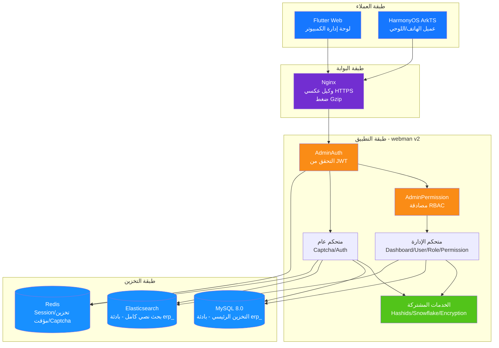

# بنية طوبولوجيا النظام

```mermaid
flowchart TB
    subgraph clients["طبقة العملاء"]
        flutter["Flutter Web<br/>لوحة إدارة الكمبيوتر"]
        harmony["HarmonyOS ArkTS<br/>عميل الهاتف/اللوحي"]
    end

    subgraph gateway["طبقة البوابة"]
        nginx["Nginx<br/>وكيل عكسي HTTPS<br/>ضغط Gzip"]
    end

    subgraph app["طبقة التطبيق - webman v2"]
        auth["AdminAuth<br/>التحقق من JWT"]
        perm["AdminPermission<br/>مصادقة RBAC"]
        admin["متحكم الإدارة<br/>Dashboard/User/Role/Permission"]
        public["متحكم عام<br/>Captcha/Auth"]
        common["الخدمات المشتركة<br/>Hashids/Snowflake/Encryption"]
    end

    subgraph storage["طبقة التخزين"]
        mysql[("MySQL 8.0<br/>التخزين الرئيسي - بادئة erp_")]
        es[("Elasticsearch<br/>بحث نصي كامل - بادئة erp_")]
        redis[("Redis<br/>Session/تخزين مؤقت/Captcha")]
    end

    flutter --> nginx
    harmony --> nginx
    nginx --> auth
    auth --> perm
    perm --> admin
    auth --> public
    admin --> common
    public --> common
    admin --> mysql
    public --> mysql
    admin --> es
    public --> es
    auth --> redis
    public --> redis

    style flutter fill:#1677FF,color:#fff
    style harmony fill:#1677FF,color:#fff
    style nginx fill:#722ED1,color:#fff
    style auth fill:#FA8C16,color:#fff
    style perm fill:#FA8C16,color:#fff
    style common fill:#52C41A,color:#fff
    style mysql fill:#1890FF,color:#fff
    style es fill:#1890FF,color:#fff
    style redis fill:#1890FF,color:#fff
```
