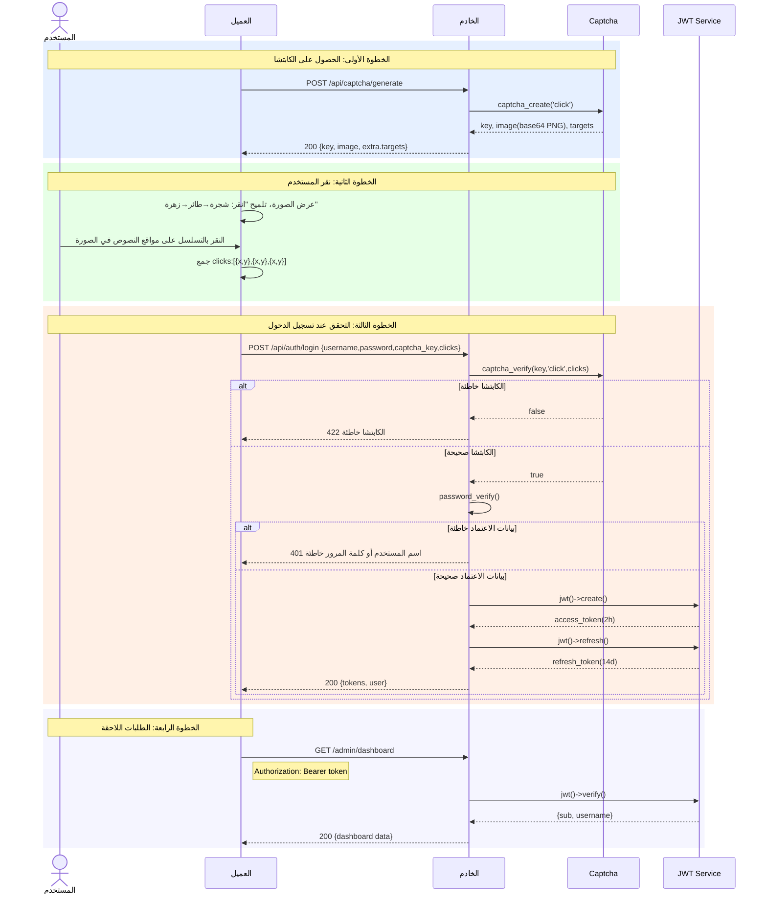

# تدفق المصادقة والكابتشا

```mermaid
sequenceDiagram
    actor U as المستخدم
    participant CL as العميل
    participant SV as الخادم
    participant CAP as Captcha
    participant JWT as JWT Service

    rect rgb(230, 240, 255)
    Note over U,CAP: الخطوة الأولى: الحصول على الكابتشا
    CL->>SV: POST /api/captcha/generate
    SV->>CAP: captcha_create('click')
    CAP-->>SV: key, image(base64 PNG), targets
    SV-->>CL: 200 {key, image, extra.targets}
    end

    rect rgb(230, 255, 230)
    Note over U,CAP: الخطوة الثانية: نقر المستخدم
    CL->>CL: عرض الصورة، تلميح "انقر: شجرة→طائر→زهرة"
    U->>CL: النقر بالتسلسل على مواقع النصوص في الصورة
    CL->>CL: جمع clicks:[{x,y},{x,y},{x,y}]
    end

    rect rgb(255, 240, 230)
    Note over U,CAP: الخطوة الثالثة: التحقق عند تسجيل الدخول
    CL->>SV: POST /api/auth/login {username,password,captcha_key,clicks}
    SV->>CAP: captcha_verify(key,'click',clicks)

    alt الكابتشا خاطئة
        CAP-->>SV: false
        SV-->>CL: 422 الكابتشا خاطئة
    else الكابتشا صحيحة
        CAP-->>SV: true
        SV->>SV: password_verify()
        alt بيانات الاعتماد خاطئة
            SV-->>CL: 401 اسم المستخدم أو كلمة المرور خاطئة
        else بيانات الاعتماد صحيحة
            SV->>JWT: jwt()->create()
            JWT-->>SV: access_token(2h)
            SV->>JWT: jwt()->refresh()
            JWT-->>SV: refresh_token(14d)
            SV-->>CL: 200 {tokens, user}
        end
    end
    end

    rect rgb(245, 245, 255)
    Note over U,CL: الخطوة الرابعة: الطلبات اللاحقة
    CL->>SV: GET /admin/dashboard
    Note right of CL: Authorization: Bearer token
    SV->>JWT: jwt()->verify()
    JWT-->>SV: {sub, username}
    SV-->>CL: 200 {dashboard data}
    end
```
