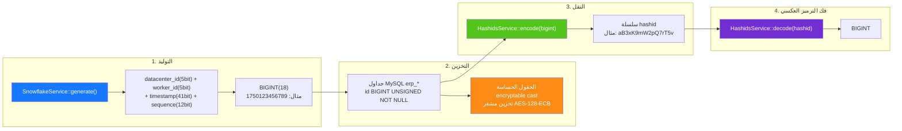

# دورة حياة المعرف الكاملة

```mermaid
flowchart LR
    subgraph gen["1. التوليد"]
        g1["SnowflakeService::generate()"]
        g2["datacenter_id(5bit) + worker_id(5bit)<br/>+ timestamp(41bit) + sequence(12bit)"]
        g3["BIGINT(18)<br/>مثال: 1750123456789"]
        g1 --> g2 --> g3
    end

    subgraph store["2. التخزين"]
        s1["جداول MySQL erp_*<br/>id BIGINT UNSIGNED NOT NULL"]
        s2["الحقول الحساسة encryptable cast<br/>تخزين مشفر AES-128-ECB"]
        g3 --> s1 --> s2
    end

    subgraph transfer["3. النقل"]
        t1["HashidsService::encode(bigint)"]
        t2["سلسلة hashid<br/>مثال: aB3xK9mW2pQ7rT5v"]
        s1 --> t1 --> t2
    end

    subgraph reverse["4. فك الترميز العكسي"]
        r1["HashidsService::decode(hashid)"]
        r2["BIGINT"]
        t2 --> r1 --> r2
    end

    style g1 fill:#1677FF,color:#fff
    style s2 fill:#FA8C16,color:#fff
    style t1 fill:#52C41A,color:#fff
    style r1 fill:#722ED1,color:#fff
```
