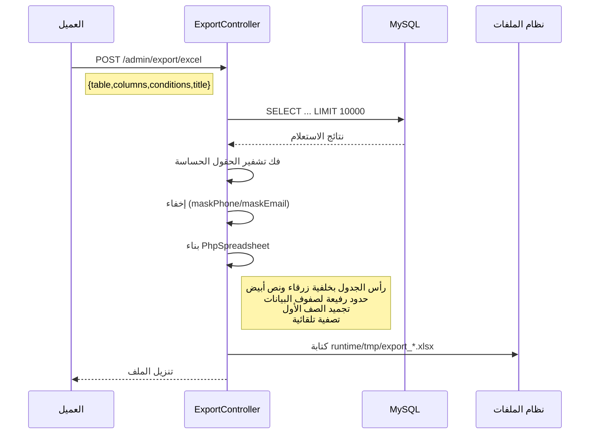
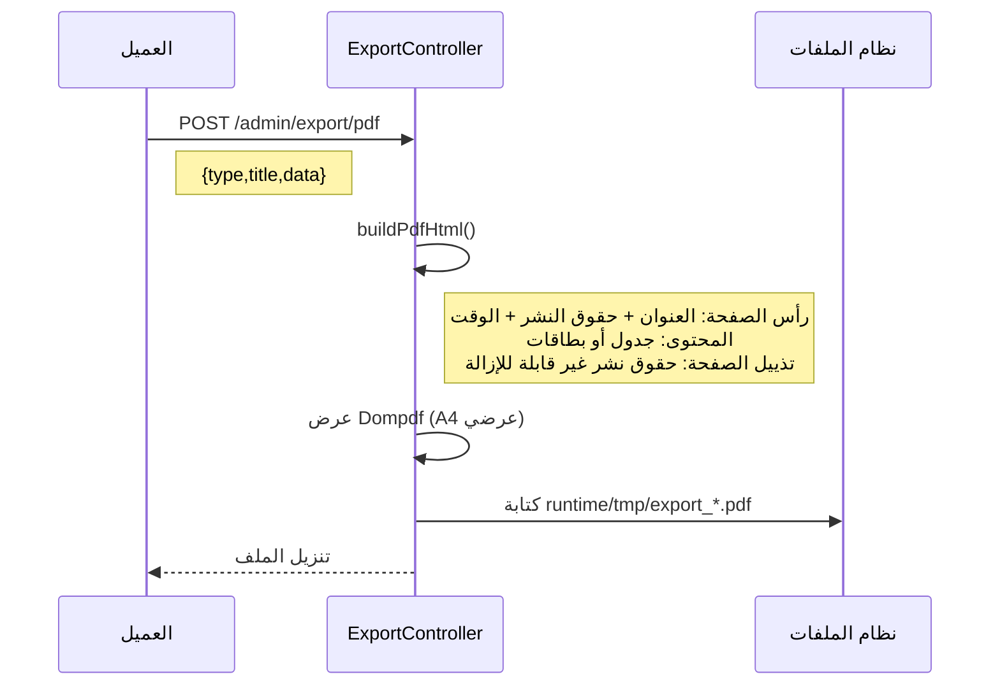

# عمليات التصدير

## تصدير Excel

```mermaid
sequenceDiagram
    participant C as العميل
    participant CTL as ExportController
    participant DB as MySQL
    participant FS as نظام الملفات

    C->>CTL: POST /admin/export/excel
    Note right of C: {table,columns,conditions,title}
    CTL->>DB: SELECT ... LIMIT 10000
    DB-->>CTL: نتائج الاستعلام
    CTL->>CTL: فك تشفير الحقول الحساسة
    CTL->>CTL: إخفاء (maskPhone/maskEmail)
    CTL->>CTL: بناء PhpSpreadsheet
    Note right of CTL: رأس الجدول بخلفية زرقاء ونص أبيض<br/>حدود رفيعة لصفوف البيانات<br/>تجميد الصف الأول<br/>تصفية تلقائية
    CTL->>FS: كتابة runtime/tmp/export_*.xlsx
    CTL-->>C: تنزيل الملف
```

## تصدير PDF

```mermaid
sequenceDiagram
    participant C as العميل
    participant CTL as ExportController
    participant FS as نظام الملفات

    C->>CTL: POST /admin/export/pdf
    Note right of C: {type,title,data}
    CTL->>CTL: buildPdfHtml()
    Note right of CTL: رأس الصفحة: العنوان + حقوق النشر + الوقت<br/>المحتوى: جدول أو بطاقات<br/>تذييل الصفحة: حقوق نشر غير قابلة للإزالة
    CTL->>CTL: عرض Dompdf (A4 عرضي)
    CTL->>FS: كتابة runtime/tmp/export_*.pdf
    CTL-->>C: تنزيل الملف
```
