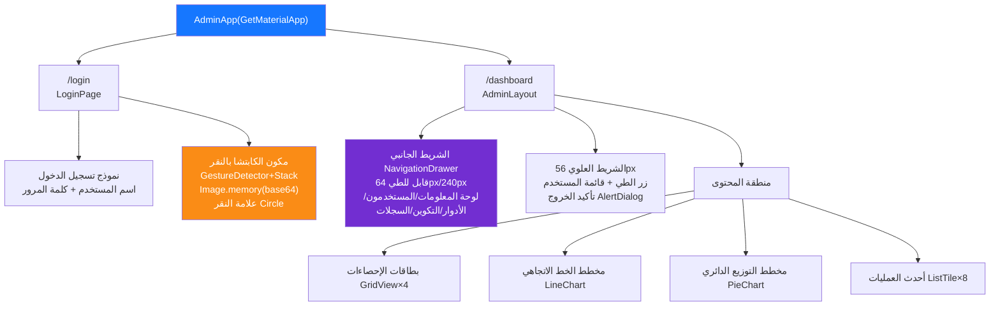
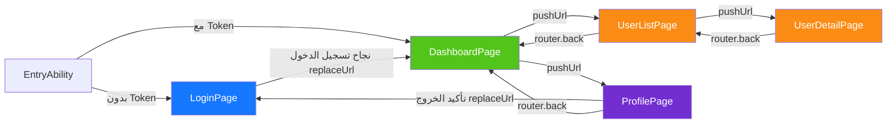

# بنية مكونات الواجهة الأمامية

## شجرة مكونات Flutter Web

```mermaid
flowchart TD
    app["AdminApp(GetMaterialApp)"]

    app --> login["/login<br/>LoginPage"]
    app --> dashboard["/dashboard<br/>AdminLayout"]

    login --> form["نموذج تسجيل الدخول<br/>اسم المستخدم + كلمة المرور"]
    login --> captcha["مكون الكابتشا بالنقر<br/>GestureDetector+Stack<br/>Image.memory(base64)<br/>علامة النقر Circle"]

    dashboard --> sidebar["الشريط الجانبي NavigationDrawer<br/>قابل للطي 64px/240px<br/>لوحة المعلومات/المستخدمون/الأدوار/التكوين/السجلات"]
    dashboard --> header["الشريط العلوي 56px<br/>زر الطي + قائمة المستخدم<br/>تأكيد الخروج AlertDialog"]
    dashboard --> content["منطقة المحتوى"]

    content --> stats["بطاقات الإحصاءات GridView×4"]
    content --> chart["مخطط الخط الاتجاهي LineChart"]
    content --> pie["مخطط التوزيع الدائري PieChart"]
    content --> logs["أحدث العمليات ListTile×8"]

    style app fill:#1677FF,color:#fff
    style captcha fill:#FA8C16,color:#fff
    style sidebar fill:#722ED1,color:#fff
```

## توجيه صفحات HarmonyOS

```mermaid
flowchart LR
    entry["EntryAbility"]
    entry -->|"بدون Token"| loginH["LoginPage"]
    entry -->|"مع Token"| dashH["DashboardPage"]

    loginH -->|"نجاح تسجيل الدخول replaceUrl"| dashH

    dashH -->|"pushUrl"| userList["UserListPage"]
    dashH -->|"pushUrl"| profile["ProfilePage"]

    userList -->|"pushUrl"| userDetail["UserDetailPage"]
    userList -->|"router.back"| dashH
    userDetail -->|"router.back"| userList

    profile -->|"تأكيد الخروج replaceUrl"| loginH
    profile -->|"router.back"| dashH

    style loginH fill:#1677FF,color:#fff
    style dashH fill:#52C41A,color:#fff
    style userList fill:#FA8C16,color:#fff
    style userDetail fill:#FA8C16,color:#fff
    style profile fill:#722ED1,color:#fff
```
