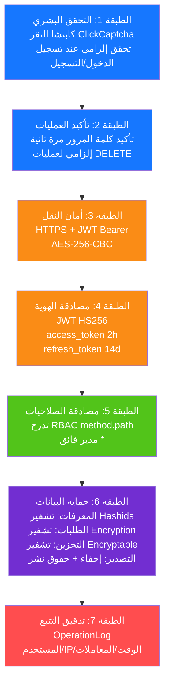

# الدفاع الأمني المتعمق

```mermaid
flowchart TB
    l1["الطبقة 1: التحقق البشري<br/>كابتشا النقر ClickCaptcha<br/>تحقق إلزامي عند تسجيل الدخول/التسجيل"]
    l2["الطبقة 2: تأكيد العمليات<br/>تأكيد كلمة المرور مرة ثانية<br/>إلزامي لعمليات DELETE"]
    l3["الطبقة 3: أمان النقل<br/>HTTPS + JWT Bearer<br/>AES-256-CBC"]
    l4["الطبقة 4: مصادقة الهوية<br/>JWT HS256<br/>access_token 2h<br/>refresh_token 14d"]
    l5["الطبقة 5: مصادقة الصلاحيات<br/>تدرج RBAC method.path<br/>مدير فائق *"]
    l6["الطبقة 6: حماية البيانات<br/>المعرفات: تشفير Hashids<br/>الطلبات: تشفير Encryption<br/>التخزين: تشفير Encryptable<br/>التصدير: إخفاء + حقوق نشر"]
    l7["الطبقة 7: تدقيق التتبع<br/>OperationLog<br/>المستخدم/IP/الوقت/المعاملات"]

    l1 --> l2 --> l3 --> l4 --> l5 --> l6 --> l7

    style l1 fill:#1677FF,color:#fff
    style l2 fill:#1677FF,color:#fff
    style l3 fill:#FA8C16,color:#fff
    style l4 fill:#FA8C16,color:#fff
    style l5 fill:#52C41A,color:#fff
    style l6 fill:#722ED1,color:#fff
    style l7 fill:#FF4D4F,color:#fff
```
