# আর্কিটেকচার ডিজাইন ডায়াগ্রাম ও বিজনেস লজিক ডায়াগ্রাম

> Copyright (c) 2026 erik <erik@erik.xyz> — https://erik.xyz

> নিম্নলিখিত Mermaid চার্ট GitHub / GitLab / VS Code-এ স্বয়ংক্রিয়ভাবে রেন্ডার হয়। অন্যান্য পরিবেশে দেখতে [Mermaid Live Editor](https://mermaid.live/) ব্যবহার করুন।

---

## 1. সিস্টেম টপোলজি আর্কিটেকচার

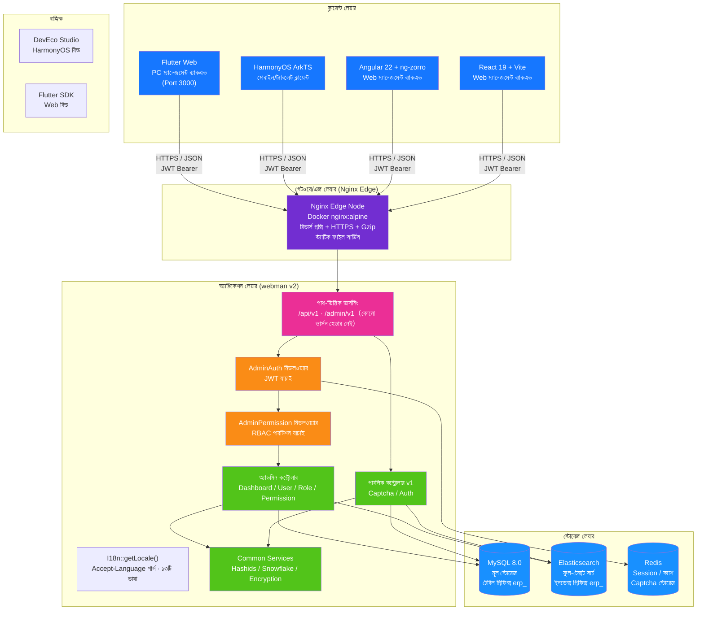

---

## 2. ব্যাকএন্ড লেয়ারড আর্কিটেকচার

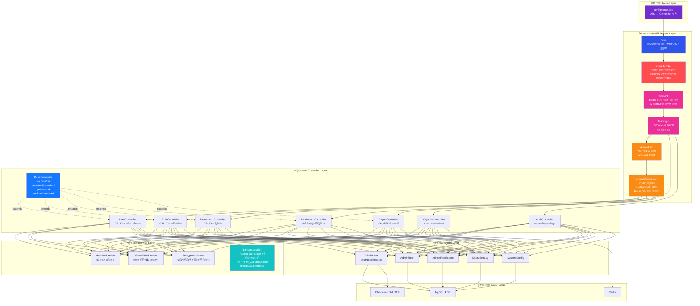

### ERP বিজনেস লেয়ার এক্সটেনশন

সিস্টেম বিশুদ্ধ ম্যানেজমেন্ট ব্যাকএন্ড থেকে সম্পূর্ণ ERP সিস্টেমে বিবর্তিত হওয়ায়, কন্ট্রোলার লেয়ার ও সার্ভিস লেয়ারে নিম্নলিখিত বিজনেস মডিউল যুক্ত হয়েছে:

| লেয়ার | ডিরেক্টরি | ব্যাখ্যা |
|------|------|------|
| বিজনেস কন্ট্রোলার | `app/controller/{product,purchase,sales,inventory,finance,crm,workflow,notification,project,hr,manufacturing,report,oms,wms,tms,quality,eam,dms,open,platform,print,retail,bi}/` | ১৩৯টি (২৩টি ব্যবসায়িক ডোমেইন, এছাড়া টপ-লেভেল Install / Index), মডিউল অনুযায়ী বিভক্ত, বিজনেস রিকোয়েস্ট প্রসেস করে |
| বিজনেস সার্ভিস | `app/service/{finance,inventory,notification,crm,hr,manufacturing,oms,wms,tms,quality,…}/` | ৬৩টি সার্ভিস ক্লাস / ৬৪টি ফাইল / ২০টি মডিউল সাব-ডিরেক্টরি; ইনভেন্টরি ইন-আউট+খরচ হিসাব、ফাইন্যান্স AR/AP+নিষ্পত্তি、নোটিফিকেশন পাঠানো সহ |

### আন্তর্জাতিকীকরণ (১৩টি ভাষা)

ভাষা নির্ধারণ হয় `app/common/I18n.php`-এর `getLocale()`-এ (`I18n::trans()` থেকে কল হয়, **এটি মিডলওয়্যার নয়**): রিকোয়েস্ট হেডার `Accept-Language`-এর প্রথম ট্যাগ নেওয়া হয়, তারপর প্রধান ভাষার সাব-ট্যাগ ম্যাপ করা হয় (`zh*` → `zh_CN`)। ফ্রন্টএন্ড ও ব্যাকএন্ডের অভিধানের ভূমিকা:

| প্রান্ত | অভিধানের অবস্থান | পরিসর | জেনারেটর |
|----|----------|------|--------|
| ব্যাকএন্ড | `resource/translations/<locale>/{common,modules,validation}.php` | ১৩টি ভাষা ডিরেক্টরি; `zh_CN` ৫৬৫টি, বাকি ১১টি ভাষায় প্রতিটি ৫৪৪টি, `en` ৩০টি (লিফ এন্ট্রির গণনা, `validation.php`-এর `attributes` ফিল্ড লেবেল গণনায় ধরা হয়, তার গ্রুপ কী ধরা হয় না) | `scripts/gen-be-locales.mjs` |
| Angular | সোর্স `apps/angular/src/app/core/zh-en/part1..4.ts` → প্রোডাক্ট `core/zh-<code>.ts` | সোর্স অভিধানে ১৪৫৬টি এন্ট্রি | `scripts/gen-fe-locales.mjs --app angular` |
| React | সোর্স `apps/react/src/lib/i18n/zhEn.ts` → প্রোডাক্ট `lib/i18n/zh<Code>.ts` | সোর্স অভিধানে ১৪৫১টি এন্ট্রি | `scripts/gen-fe-locales.mjs --app react` |

- ভাষা: `zh_CN` `en` `ja` `ko` `de` `fr` `es` `pt` `ru` `ar` `hi` `bn` `id`।
- ব্যাকএন্ডে "ইংরেজিই key": `en`-এর common/modules ফাঁকা; `validation.php`-এর কী হলো ফ্রেমওয়ার্কের রুলের নাম, কেবল ভ্যালু অনূদিত হয়।
- ফ্রন্টএন্ডে ১১টি নতুন ভাষার অভিধান প্রতিটি `import()`-এ ডাইনামিকভাবে আলাদা chunk হিসেবে লোড হয়, এন্ট্রি না থাকলে চীনা মূল টেক্সটে ফিরে যায়।
- ভাষা বদলালেই `Accept-Language` বদলায়, ব্যাকএন্ড ভাষা অনুযায়ী টেক্সট ফেরত দেয় (`app/common/I18n.php` + `config/translation.php`)।

---

## 3. রিকোয়েস্ট লাইফসাইকেল

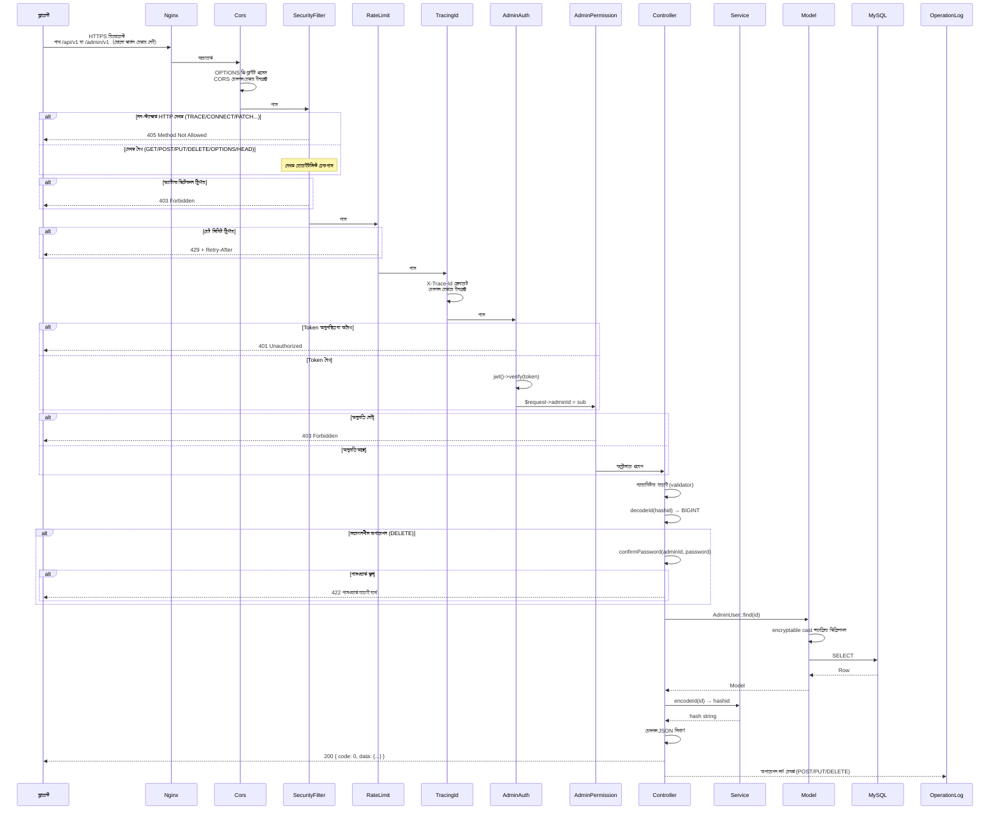

---

## 4. অথ ও ক্যাপচা ফ্লো

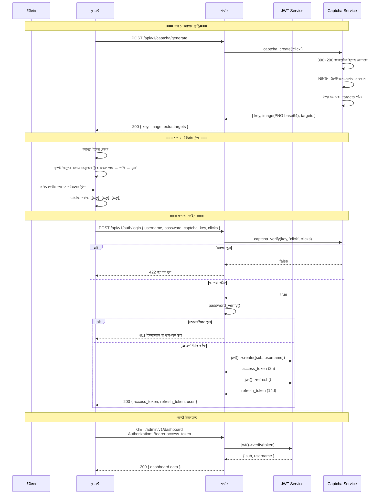

---

## 5. RBAC পারমিশন মডেল

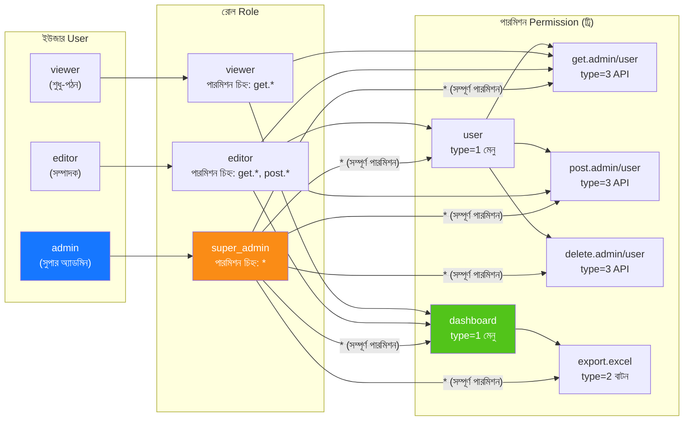

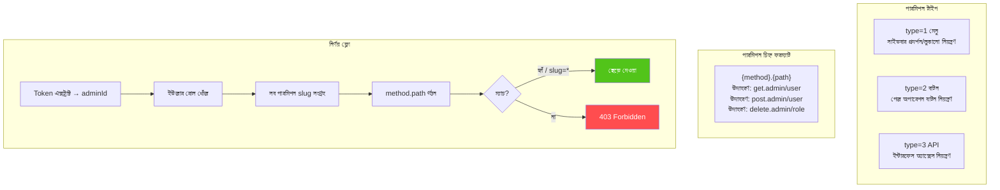

---

## 6. ID সম্পূর্ণ লাইফসাইকেল

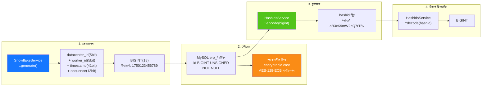

---

## 7. ডেটা এনক্রিপশন লেয়ারিং

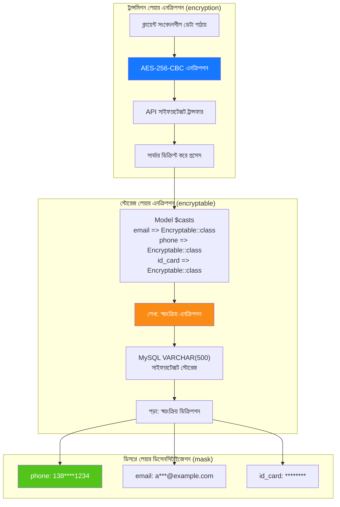

---

## 8. ডেটাবেস ER সম্পর্ক

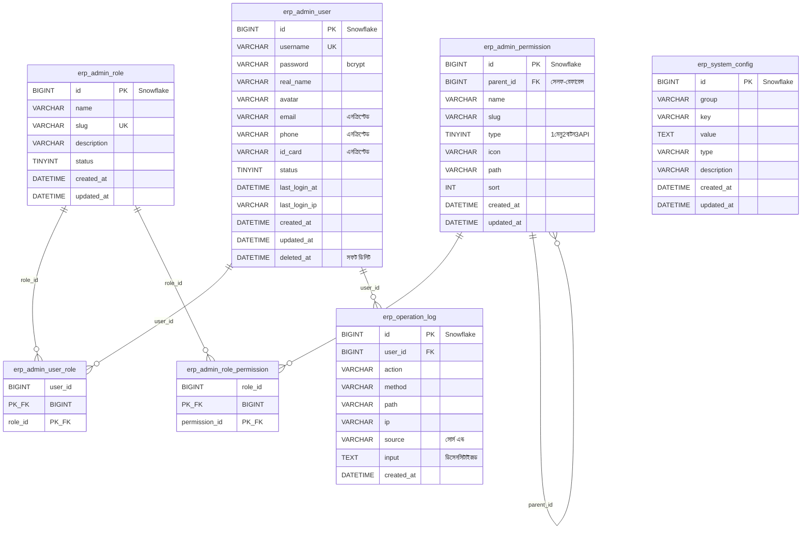

---

## 9. এক্সপোর্ট বিজনেস ফ্লো

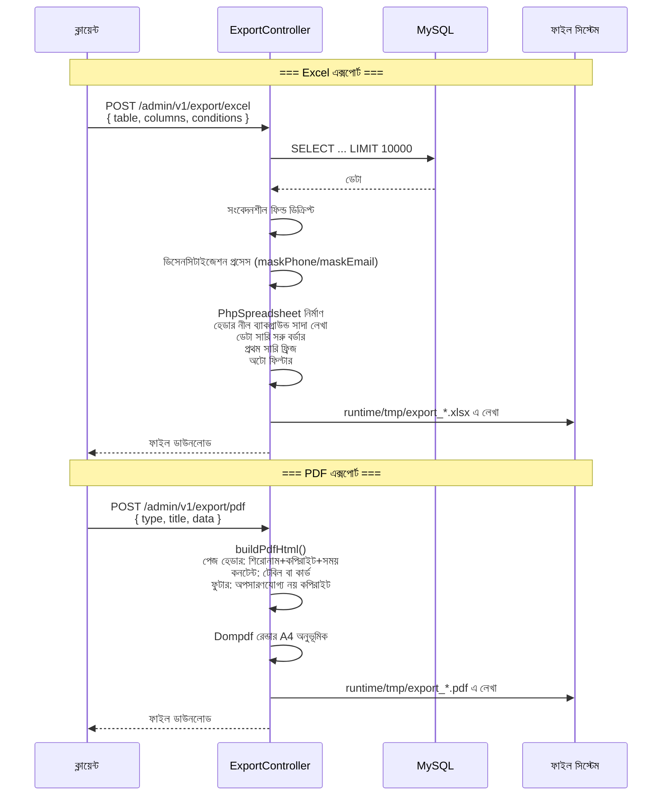

---

## 10. Flutter Web কম্পোনেন্ট ট্রি

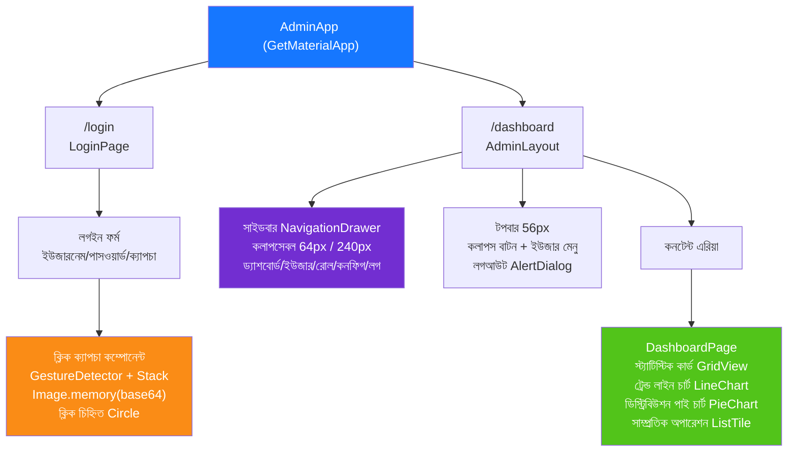

---

## 11. HarmonyOS পেজ রাউটিং

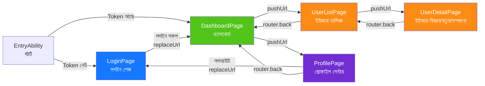

---

## 12. সিকিউরিটি ডিপ ডিফেন্স ওভারভিউ

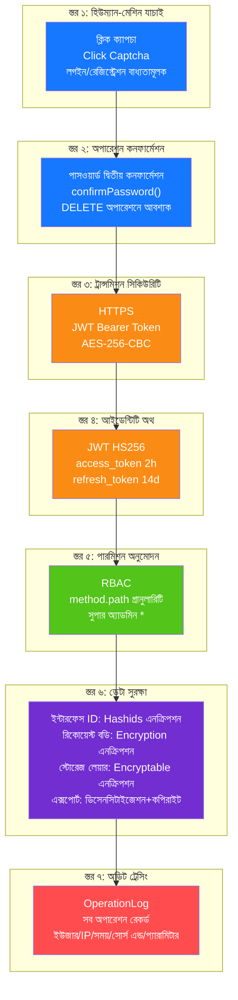

---

## 13. ডিপ্লয়মেন্ট টপোলজি

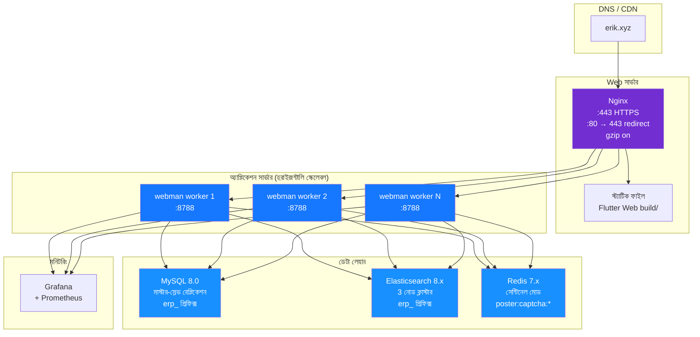

---

## 14. ERP সিস্টেম সামগ্রিক আর্কিটেকচার

```mermaid
graph TB
    subgraph Client["ক্লায়েন্ট লেয়ার"]
        FW["Flutter Web<br/>PC ম্যানেজমেন্ট ব্যাকএন্ড"]
        FA["Flutter App<br/>iOS/Android/macOS/Windows/Linux"]
        HW["HarmonyOS<br/>হারমনি নেটিভ App"]
        NG["Angular 22 + ng-zorro<br/>Web ম্যানেজমেন্ট ব্যাকএন্ড"]
        RC["React 19 + Vite<br/>Web ম্যানেজমেন্ট ব্যাকএন্ড"]
    end

    subgraph Gateway["API গেটওয়ে লেয়ার"]
        MW["মিডলওয়্যার চেইন<br/>Cors→SecurityFilter→RateLimit→TracingId<br/>রাউট গ্রুপ：AdminAuth→AdminPermission→OperationLog"]
    end

    subgraph Business["বিজনেস মডিউল লেয়ার"]
        direction LR
        Admin["সিস্টেম ম্যানেজমেন্ট<br/>ইউজার/রোল/পারমিশন/কনফিগ/লগ"]
        Product["পণ্য ম্যানেজমেন্ট<br/>পণ্য/ক্যাটাগরি/ব্র্যান্ড/ওয়ারহাউস/সাপ্লায়ার/কাস্টমার"]
        Purchase["ক্রয় ম্যানেজমেন্ট<br/>অ্যাপ্লিকেশন→অর্ডার→রিসিভ→রিটার্ন→সেটেলমেন্ট"]
        Sales["সেলস ম্যানেজমেন্ট<br/>কোটেশন→অর্ডার→ডেলিভারি→রিটার্ন→সেটেলমেন্ট"]
        Inventory["ইনভেন্টরি ম্যানেজমেন্ট<br/>ইন-আউট/ব্যাচ/স্টকটেক/ট্রান্সফার/অ্যালার্ট"]
        Finance["ফাইন্যান্স ম্যানেজমেন্ট<br/>অ্যাকাউন্ট/ভাউচার/রিসিভেবল-পেবল/জেনারেল লেজার/সাবসিডিয়ারি লেজার/রিপোর্ট/রিম্বার্সমেন্ট"]
        CRM["CRM<br/>কাস্টমার/কন্টাক্ট/ফলো-আপ/ফানেল/পাবলিক পুল/কোটেশন/কন্ট্রাক্ট"]
        Workflow["অ্যাপ্রুভাল ওয়ার্কফ্লো<br/>ওয়ার্কফ্লো ডেফিনিশন/সাবমিট/অ্যাপ্রুভ/রিজেক্ট/উইথড্র"]
        Notification["মেসেজ নোটিফিকেশন<br/>নোটিফিকেশন লিস্ট/পঠিত/অপঠিত কাউন্ট"]
        Project["প্রজেক্ট ম্যানেজমেন্ট<br/>প্রজেক্ট/টাস্ক/টাইমশিট"]
        HR["হিউম্যান রিসোর্স<br/>ডিপার্টমেন্ট/এমপ্লয়ি/পজিশন/অ্যাটেনডেন্স/লিভ/স্যালারি"]
        Manufacturing["প্রোডাকশন ম্যানুফ্যাকচারিং<br/>BOM/প্রোডাকশন অর্ডার/রাউটিং/ওয়ার্কস্টেশন/MRP"]
        Report["কাস্টম রিপোর্ট<br/>রিপোর্ট টেমপ্লেট/ডেটাসেট/ফিল্ড/ফিল্টার/শিডিউল"]
    end

    subgraph Service["বিজনেস সার্ভিস লেয়ার"]
        IS["InventoryService<br/>ইন-আউট + চলমান ওজনযুক্ত গড় খরচ"]
        FS["FinanceService<br/>রিসিভেবল-পেবল স্বয়ংক্রিয় জেনারেশন + নিষ্পত্তি"]
        NS["NotificationService<br/>নোটিফিকেশন একীভূত পাঠানো"]
    end

    subgraph Data["ডেটা লেয়ার"]
        MySQL["MySQL 8.0<br/>২২৭টি বিজনেস টেবিল"]
        Redis["Redis 7<br/>ক্যাশ/রেট লিমিট/Session"]
        ES["Elasticsearch 8<br/>ফুল-টেক্সট সার্চ"]
    end

    Client --> Gateway
    Gateway --> Business
    Business --> Service
    Service --> Data
    Business --> Data
```

---

## 15. ক্রস-মডিউল ডেটা ফ্লো

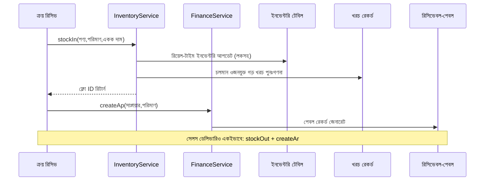

---

## 16. ইনভেন্টরি খরচ হিসাব ডেটা ফ্লো

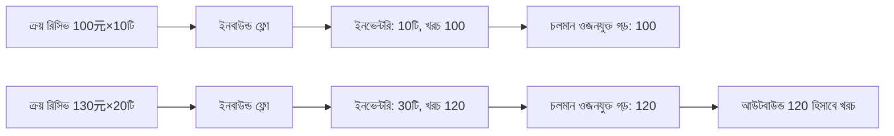

---

## 17. অ্যাপ্রুভাল ওয়ার্কফ্লো ডেটা ফ্লো

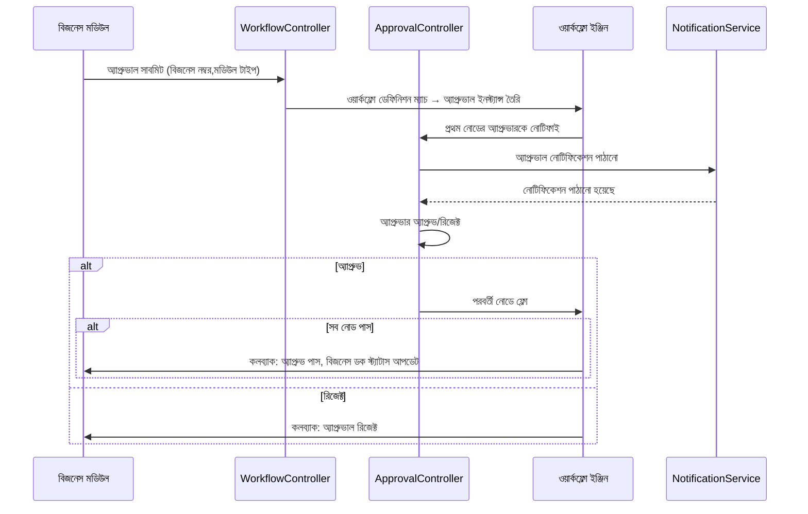

---

## 18. মেসেজ নোটিফিকেশন ডেটা ফ্লো

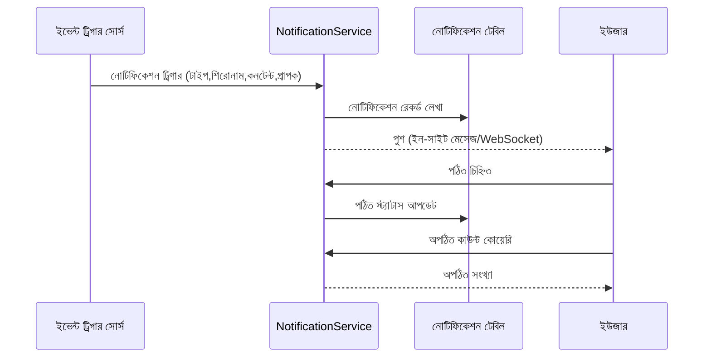

---

## 19. MRP ম্যাটেরিয়াল রিকোয়ারমেন্ট প্ল্যানিং ডেটা ফ্লো

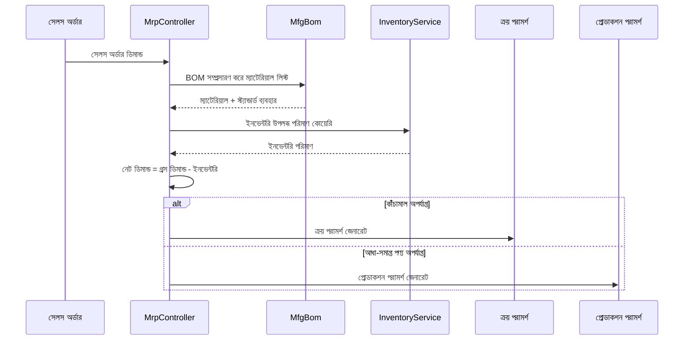

---

## 20. ERP মডিউল কন্ট্রোলার-সার্ভিস-মডেল ম্যাপিং টেবিল

> সার্ভিস লেয়ার ব্যাখ্যা: `কোর Service` কলাম সেই মডিউলের ডুবিয়ে দেওয়া বিজনেস সার্ভিস চিহ্নিত করে; **⚠ কন্ট্রোলার সরাসরি মডেল কোয়েরি করে, পরিচিত টেকনিক্যাল ডেব্ট** চিহ্নিত মডিউলগুলিতে,
> কন্ট্রোলার এখনও সরাসরি মডেল কোয়েরি/রাইট মেথড কল করে (`XxxModel::find/where/save` ইত্যাদি), সার্ভিস লেয়ার এখনও এক্সট্রাক্ট করা হয়নি, পরিচিত টেকনিক্যাল ডেব্ট,
> পরবর্তীতে P2-F2 সার্ভিস লেয়ার লাইটওয়েট এক্সট্রাকশন প্যাটার্ন (`app/service/AbstractCrudService` জেনেরিক CRUD বেস ক্লাস + মডিউল Service) অনুযায়ী ধাপে ধাপে কনভার্জ হবে।

| মডিউল | Controllers (ডিরেক্টরি) | কোর Service | প্রধান Model | টেবিল সংখ্যা |
|------|-------------------|-------------|-----------|------|
| সিস্টেম ম্যানেজমেন্ট | admin/controller/ (16টি) | - ⚠ কন্ট্রোলার সরাসরি মডেল কোয়েরি, পরিচিত টেকনিক্যাল ডেব্ট | AdminUser, AdminRole, AdminPermission | 7 |
| পণ্য ম্যানেজমেন্ট | controller/product/ (8টি) | ProductService | Product, Category, Brand, Warehouse, Supplier, Customer | 12 |
| ক্রয় ম্যানেজমেন্ট | controller/purchase/ (8টি) | InventoryService, FinanceService ⚠ CRUD এখনও সরাসরি কোয়েরি, পরিচিত টেকনিক্যাল ডেব্ট | PurchaseOrder, PurchaseReceive | 14 |
| সেলস ম্যানেজমেন্ট | controller/sales/ (5টি) | InventoryService, FinanceService ⚠ CRUD এখনও সরাসরি কোয়েরি, পরিচিত টেকনিক্যাল ডেব্ট | SalesOrder, SalesDelivery | 9 |
| ইনভেন্টরি ম্যানেজমেন্ট | controller/inventory/ (6টি) | InventoryService ⚠ CRUD এখনও সরাসরি কোয়েরি, পরিচিত টেকনিক্যাল ডেব্ট | Inventory, InventoryFlow, CostRecord | 11 |
| ফাইন্যান্স ম্যানেজমেন্ট | controller/finance/ (28টি) | FinanceService ⚠ CRUD এখনও সরাসরি কোয়েরি, পরিচিত টেকনিক্যাল ডেব্ট | FinanceArAp, FinanceVoucher, FinanceReceipt, FinancePayment, FinanceGeneralLedger, FinanceBalanceSheet, FinanceAsset, FinanceBudget, FinanceCostCenter | 38 |
| CRM | controller/crm/ (10টি) | CrmService | CrmOpportunity, CrmFollowRecord, CrmContract, CrmPoolRule, CrmQuotation, CrmCampaign, CrmTicket, CrmAnalyticsReport | 16 |
| অ্যাপ্রুভাল ওয়ার্কফ্লো | controller/workflow/ (3টি) | - ⚠ কন্ট্রোলার সরাসরি মডেল কোয়েরি, পরিচিত টেকনিক্যাল ডেব্ট | ApprovalWorkflow, ApprovalInstance, ApprovalNode, ApprovalRecord | 4 |
| মেসেজ নোটিফিকেশন | controller/notification/ (2টি) | NotificationService ⚠ CRUD এখনও সরাসরি কোয়েরি, পরিচিত টেকনিক্যাল ডেব্ট | Notification, NotificationSetting, NotificationTemplate | 4 |
| প্রজেক্ট ম্যানেজমেন্ট | controller/project/ (4টি) | - ⚠ কন্ট্রোলার সরাসরি মডেল কোয়েরি, পরিচিত টেকনিক্যাল ডেব্ট | Project, ProjectTask, ProjectTimesheet, ProjectMember, ProjectGantt | 6 |
| হিউম্যান রিসোর্স | controller/hr/ (9টি) | HrService | HrDepartment, HrEmployee, HrPosition, HrAttendance, HrLeave, HrSalary | 21 |
| প্রোডাকশন ম্যানুফ্যাকচারিং | controller/manufacturing/ (13টি) | ManufacturingService | MfgBom, MfgProductionOrder, MfgRouting, MfgWorkstation, MfgMrpPlan | 21 |
| কাস্টম রিপোর্ট | controller/report/ (2টি) | - ⚠ কন্ট্রোলার সরাসরি মডেল কোয়েরি, পরিচিত টেকনিক্যাল ডেব্ট | ReportTemplate, ReportDataset, ReportField, ReportFilter, ReportSchedule | 5 |
| EAM ইকুইপমেন্ট ম্যানেজমেন্ট | controller/eam/ (5টি) | - ⚠ কন্ট্রোলার সরাসরি মডেল কোয়েরি, পরিচিত টেকনিক্যাল ডেব্ট | EamEquipment, EamMaintenancePlan, EamRepairOrder, EamSparePart, EamInspectionTask, EamInspectionResult | 6 |
| DMS ডকুমেন্ট ম্যানেজমেন্ট | controller/dms/ (2টি) | - ⚠ কন্ট্রোলার সরাসরি মডেল কোয়েরি, পরিচিত টেকনিক্যাল ডেব্ট | DmsCategory, DmsDocument, DmsDocumentVersion | 3 |
| BI ড্যাশবোর্ড | controller/bi/ (3টি) | - ⚠ কন্ট্রোলার সরাসরি মডেল কোয়েরি, পরিচিত টেকনিক্যাল ডেব্ট | BiDashboard, BiWidget | 2 |

> এই টেবিলটি প্রাথমিক মডিউল ম্যাপিং (সিস্টেম ম্যানেজমেন্ট + ১৫টি ব্যবসায়িক ডোমেইন); পরবর্তীতে যোগ হওয়া oms / wms / tms / quality / open / platform / print / retail ৮টি ডোমেইন এতে অন্তর্ভুক্ত নয়,
> সম্পূর্ণ তালিকা দেখুন `docs/CLAUDE.md` প্রজেক্ট স্ট্রাকচার ট্রিতে (`app/controller/` মোট ২৩টি মডিউল ডিরেক্টরি / ১৩৯টি কন্ট্রোলার, টপ-লেভেল Install ও Index সহ)।
>
> `টেবিল সংখ্যা`-র গণনার পদ্ধতি (2026-09-15 পরিমাপ): `database/install.sql`-এর ২২৭টি টেবিল নিয়ে টেবিল-নাম প্রিফিক্স অনুযায়ী একক মডিউলে বরাদ্দ —— সিস্টেম ম্যানেজমেন্ট `admin_*`+`system_config`+`operation_log`;
> পণ্য ম্যানেজমেন্ট `product*`/`category`/`brand`/`warehouse`/`location`/`supplier`/`customer*`; ক্রয় ম্যানেজমেন্ট `purchase_*`+`supplier_assessment`; ইনভেন্টরি ম্যানেজমেন্ট `inventory*`/`transfer*`/`check_*`/`cost_record`;
> বাকি মডিউল একই-নাম প্রিফিক্সের টেবিল (`sales_*`→সেলস, `finance_*`→ফাইন্যান্স, `crm_*`→CRM, `approval_*`→অ্যাপ্রুভাল, `notification*`→নোটিফিকেশন, `project*`→প্রজেক্ট, `hr_*`→হিউম্যান রিসোর্স, `mfg_*`→প্রোডাকশন, `report_*`→রিপোর্ট, `eam_*`→EAM, `dms_*`→DMS, `bi_*`→BI)।
> একটি টেবিল শুধু এক কলামে যায়; পরবর্তীতে যোগ হওয়া ডোমেইন ও শেয়ার্ড টেবিল মোট ৪৮টি (`oms_`/`wms_`/`tms_`/`quality_`/`openapi_`/`webhook_`/`member_`/`print_template`/`company`/`tenant`/`channel`/`custom_field_definition`/`tax_*`) এই টেবিলের কোনো সারিতে গণনা করা হয় না।
> পুনর্গণনা: ``grep -o 'CREATE TABLE IF NOT EXISTS `erp_[a-z_]*`' database/install.sql | sed 's/.*`erp_\([a-z_]*\)`/\1/' | cut -d_ -f1 | sort | uniq -c | sort -rn``

### 20.1 P2-F2 সার্ভিস লেয়ার লাইটওয়েট এক্সট্রাকশন রেকর্ড (crm/hr/manufacturing/product এক্সট্রাকশন সম্পন্ন)

| মডিউল | এক্সট্রাকশনের আগে কন্ট্রোলার সরাসরি কোয়েরি কল সংখ্যা | এক্সট্রাকশনের পরে | নতুন Service | এক্সট্রাকশন কনটেন্ট |
|------|----------------------|--------|--------------|----------|
| CRM | 57 | 0 | `app/service/crm/CrmService.php` | জেনেরিক CRUD + কন্ট্রাক্ট স্ট্যাটাস ফ্লো、কোটেশন-টু-কন্ট্রাক্ট、পাবলিক পুল ক্লেইম/রিলিজ、টিকিট অ্যাসাইন/সলভ/রিপ্লাই、ডিটেইল ক্যাসকেড ক্লিনআপ、অ্যানালিটিক্স রিপোর্ট ডেটা নির্মাণ |
| হিউম্যান রিসোর্স | 38 | 0 | `app/service/hr/HrService.php` | জেনেরিক CRUD + ক্লক-ইন লেট/আর্লি লিভ ডিটারমিনেশন、লিভ অ্যাপ্রুভাল (স্বয়ংক্রিয় লিভ অ্যাটেনডেন্স জেনারেশন)、স্যালারি ইউনিকনেস/নেট পে হিসাব/পেমেন্ট/ব্যাচ জেনারেশন |
| প্রোডাকশন ম্যানুফ্যাকচারিং | 33 | 0 | `app/service/manufacturing/ManufacturingService.php` | জেনেরিক CRUD + ওয়ার্ক অর্ডার স্টার্ট/কমপ্লিট ফ্লো、BOM ভার্সন কপি/এফেক্টিভ মিউচুয়াল এক্সক্লুশন、MRP ডিটেইল জেনারেশন |
| পণ্য ম্যানেজমেন্ট | 29 | 0 | `app/service/product/ProductService.php` | জেনেরিক CRUD + পণ্য ট্রানজেকশন তৈরি (SKU/দাম)、ফিল্ড অনুযায়ী মূল মান রেখে আপডেট、বিবরণ রিলেটেড লোডিং |

এক্সট্রাকশন প্যাটার্ন: `app/service/AbstractCrudService.php` `list/all/find/create/update/delete/deleteWhere` জেনেরিক CRUD
এবং `normalizePageParams/canTransition` পিওর লজিক হেল্পার প্রদান করে; মডিউল Service এটি থেকে ইনহেরিট করে মডিউল-নির্দিষ্ট বিজনেস জমা করে।
কন্ট্রোলার `Container::get(XxxService::class)` (class_exists ফলব্যাক) দিয়ে সার্ভিস ইনজেক্ট করে, রাউট/প্যারামিটার/রিটার্ন স্ট্রাকচার সম্পূর্ণ অপরিবর্তিত রাখে;
hashid এনকোড/ডিকোড、পাসওয়ার্ড দ্বিতীয় কনফার্মেশন、রেসপন্স র্যাপিং ইত্যাদি HTTP ফোকাস পয়েন্ট কন্ট্রোলারেই থাকে।
নতুন Service `config/dependence.php`-এ নিবন্ধিত হয়েছে (ফাইলটি dead config, addDefinitions দিয়ে লোড হয় না, রানটাইম ডিপেন্ডেন্সি কন্টেইনার
class_exists ফলব্যাক ইনস্ট্যান্টিয়েশন, তাই সব Service নো-আর্গুমেন্ট কনস্ট্রাক্টর রাখে)।

এক্সট্রাক্ট না হওয়া মডিউল (প্রজেক্ট ম্যানেজমেন্ট 18 বার、কাস্টম রিপোর্ট 18 বার、ক্রয় 24 বার、সেলস 24 বার、সিস্টেম ম্যানেজমেন্ট 42 বার ইত্যাদি) টেবিলে
"কন্ট্রোলার সরাসরি মডেল কোয়েরি, পরিচিত টেকনিক্যাল ডেব্ট" চিহ্নিত করা হয়েছে, পরবর্তী ইটারেশনে একই প্যাটার্নে এক্সট্রাক্ট হবে।

> ⚠ পুনঃপরীক্ষা (2026-09-15): এই অংশের সংখ্যাগুলো **এক্সট্রাকশনের সময়বিন্দুর** (1051d83 / 2026-08-16) পরিমাপ —— একই পদ্ধতিতে ওই কমিট যাচাই করলে চার মডিউল ঠিক
> CRM 57→0、হিউম্যান রিসোর্স 36→0 (এই অংশে লেখা 38)、প্রোডাকশন 33→0、পণ্য 29→0; তখন এক্সট্রাক্ট না হওয়া মডিউল ছিল প্রজেক্ট 18 / রিপোর্ট 18 / ক্রয় 25 / সেলস 25 / সিস্টেম ম্যানেজমেন্ট 44 (লেখা 18/18/24/24/42, 1~2-এর পার্থক্য গণনার পদ্ধতিগত পার্থক্য)।
> এক্সট্রাকশনের পর যোগ হওয়া পেজগুলো Service-এ যুক্ত হয়নি, সরাসরি কোয়েরি ফিরে এসেছে: CRM ৬ জায়গায় (সম্পর্কিত নাম ব্যাকফিল `pluck`)、প্রোডাকশন ৩৯ জায়গায় (CostEntry/MaterialIssue/WorkReport/Subcontract ইন-আউট ইত্যাদি ৬টি পরবর্তী কন্ট্রোলার)、
> পণ্য ২ জায়গায় (LocationController লকেশন), হিউম্যান রিসোর্স এখনও ০; এক্সট্রাক্ট না হওয়া মডিউল এখন প্রজেক্ট 24 / রিপোর্ট 20 / ক্রয় 58 / সেলস 35 / সিস্টেম ম্যানেজমেন্ট 67।
> পুনঃপরীক্ষার পদ্ধতি ও কমান্ড (`Model::class` গণনায় ধরা হয় না): ``grep -rhoE '\b[A-Z][A-Za-z]*::(find|where|whereIn|query|first|all|count|paginate|insert|update|delete|save|create|pluck|exists)\(' app/controller/<মডিউল>/ | grep -vE '\b(Service|Container|Validator|Cache|Log)::' | wc -l``

---

## OMS/WMS/TMS এক্সটেনশন মডিউল (2026-08)

### OMS (Order Management System) — 8 টেবিল
- **অর্ডার এক্সটেনশন** (`erp_oms_order`)：মাল্টি-চ্যানেল অ্যাগ্রিগেশন/ফুলফিলমেন্ট স্ট্যাটাস/পেমেন্ট স্ট্যাটাস/প্রায়োরিটি
- **অর্ডার ঠিকানা** (`erp_oms_order_address`)：রিসিভ/বিল ঠিকানা (মাল্টি-কান্ট্রি ফরম্যাট)
- **ফুলফিলমেন্ট রেকর্ড** (`erp_oms_fulfillment`+`_item`)：অ্যালোকেটেড/পিকড/প্যাকড/শিপড পরিমাণ ট্র্যাকিং
- **RMA** (`erp_oms_rma`+`_item`)：রিটার্ন/এক্সচেঞ্জ সম্পূর্ণ লাইফসাইকেল
- **ইনভেন্টরি রিজার্ভেশন** (`erp_oms_inventory_reservation`)：ATP = physical - reserved
- **চ্যানেল** (`erp_channel`)：direct/marketplace/edi/pos

### WMS (Warehouse Management System) — 12 টেবিল
- **জোন ও লোকেশন** (`erp_wms_zone`, `erp_wms_location`)：zone→aisle→rack→level→bin
- **ইনবাউন্ড** (`erp_wms_asn`+`_item`, `erp_wms_receiving`, `erp_wms_putaway_task`+`_item`)
- **আউটবাউন্ড** (`erp_wms_wave`+`wave_order`, `erp_wms_pick_task`+`_item`, `erp_wms_pack_task`)

### TMS (Transport Management System) — 7 টেবিল
- **ক্যারিয়ার** (`erp_tms_carrier`+`carrier_service`, `erp_tms_freight_rate`)
- **শিপমেন্ট** (`erp_tms_shipment`+`_package`, `erp_tms_tracking_event`)
- **ইনভয়েস** (`erp_tms_freight_invoice`)

### Data Flow
```
OMS: Channel Order → Inventory Reservation (ATP) → Create Fulfillment → WMS
WMS: Wave → Pick → Pack → TMS Shipment
TMS: Rate Shop → Ship → Confirm (stockOut + AR) → Tracking → Delivery
WMS Inbound: ASN → Receive → Putaway (stockIn + AP)
RMA: Request → Approve → Return → Receive (stockIn) → Refund
```

---

## 21. ইকোসিস্টেম রোডম্যাপ (2026-08)

> বিস্তারিত ডিজাইন স্পেক: `docs/superpowers/specs/2026-08-04-erp-ecosystem-roadmap-design.md`

### 21.1 বেসলাইন অ্যাসেসমেন্ট (রোডম্যাপ শুরুর সময়)

> P0~P3 সব ডেলিভার হয়েছে, বর্তমান সমন্বিত স্কোর 89/100 (CLAUDE.md দেখুন); নিম্নলিখিত টেবিল রোডম্যাপ শুরুর আগের বেসলাইন স্ন্যাপশট।

| মাত্রা | স্কোর | মূল ফাঁক |
|------|------|----------|
| ব্যাকএন্ড API | 85/100 | একাধিক মডিউল CRUD কঙ্কাল, বিজনেস হিসাব ইঞ্জিন নেই |
| সিকিউরিটি সুরক্ষা | 95/100 | ৭ স্তরের ডিপ ডিফেন্স (L0–L12 প্যানোরামা), প্রোডাকশন-রেডি |
| ফ্রন্টএন্ড UI | 20/100 | **সবচেয়ে বড় দুর্বলতা**: Flutter 12 পেজ ~20% মডিউল কভার করে, Web ম্যানেজমেন্ট প্যানেল নেই |
| অপস ইকোসিস্টেম | 70/100 | মাইগ্রেশন রোলব্যাক、অটো ব্যাকআপ、অবজারভেবিলিটি নেই |
| বিজনেস গভীরতা | 55/100 | ফাইন্যান্স/HR/ম্যানুফ্যাকচারিং কোর অ্যালগরিদম ইমপ্লিমেন্ট হয়নি |
| **সমন্বিত** | **65/100** | |

### 21.2 চার-ফেজ সিরিয়াল রোডম্যাপ

```
P0(3-4周) → P1(4-6周) → P2(1-2周) → P3(2-3周) = মোট প্রায় 13 সপ্তাহ
```

| ফেজ | নাম | কোর ডেলিভারি |
|------|------|----------|
| **P0** | ফ্রন্টএন্ড ইকোসিস্টেম | Flutter Web ফুল-মডিউল ম্যানেজমেন্ট প্যানেল (14 মডিউল 40+ পেজ)、জেনেরিক কম্পোনেন্ট লাইব্রেরি、HarmonyOS অ্যালাইনমেন্ট |
| **P1** | বিজনেস গভীরতা | ফাইন্যান্স ডাবল-এন্ট্রি ইঞ্জিন、স্যালারি হিসাব ইঞ্জিন、MRP ইঞ্জিন、কোয়ালিটি ম্যানেজমেন্ট মডিউল、রিয়েল-টাইম নোটিফিকেশন (WebSocket) |
| **P2** | অপস রিলায়েবিলিটি | ডেটাবেস মাইগ্রেশন রোলব্যাক、অটো ব্যাকআপ এনহ্যান্সমেন্ট、OpenTelemetry ট্রেসিং、RabbitMQ কিউ ড্রাইভার |
| **P3** | এক্সপেরিয়েন্স এনহ্যান্সমেন্ট | BI ড্র্যাগ-অ্যান্ড-ড্রপ ড্যাশবোর্ড、ইকুইপমেন্ট ম্যানেজমেন্ট (EAM)、মাল্টি-টেন্যান্ট আইসোলেশন、ডকুমেন্ট ম্যানেজমেন্ট (DMS) |

### 21.3 মিডলওয়্যার চেইন ইভোল্যুশন

```
বর্তমান:  Cors → SecurityFilter → RateLimit → TracingId → {রাউট গ্রুপ}
P1 পরে:   Cors → SecurityFilter → RateLimit → WebSocketUpgrade → {রাউট গ্রুপ}
P2 পরে:   Cors → SecurityFilter → RateLimit → TracingId → WebSocketUpgrade → {রাউট গ্রুপ}
P3 পরে:   Cors → SecurityFilter → RateLimit → TracingId → TenantScope → WebSocketUpgrade → {রাউট গ্রুপ}
```

### 21.4 P0 টার্গেট আর্কিটেকচার — Flutter Web ম্যানেজমেন্ট প্যানেল

| লেয়ার | নতুন কনটেন্ট |
|------|----------|
| লেআউট লেয়ার | `AdminLayout` PC থ্রি-কলাম লেআউট (কলাপসেবল সাইডবার + টপবার + কনটেন্ট এরিয়া) |
| কম্পোনেন্ট লেয়ার | `DataTableWrapper`, `FormDialog`, `ConfirmDialog`, `StatCard`, `BreadcrumbNav`, `FileUploader` |
| পেজ লেয়ার | বর্তমান 12 পেজ থেকে 14 মডিউল 40+ পেজ ফুল কভারেজে সম্প্রসারিত |
| সার্ভিস লেয়ার | বিদ্যমান `ApiService`, `AuthService`, `CaptchaService`, `ExportService` রিইউজ |

### 21.5 P1 টার্গেট আর্কিটেকচার — বিজনেস হিসাব ইঞ্জিন

| ইঞ্জিন | সার্ভিস ক্লাস | মূল নিয়ম |
|------|--------|----------|
| ডাবল-এন্ট্রি | `DoubleEntryService`, `PeriodCloseService`, `AccountBalanceService` | ডেবিট-ক্রেডিট ব্যালেন্স বাধ্যতামূলক যাচাই、পিরিয়ড-এন্ড লাভ-লস ক্যারি-ফরওয়ার্ড、মাল্টি-কারেন্সি এক্সচেঞ্জ রেট কনভার্সন |
| স্যালারি হিসাব | `SalaryEngineService`, `SocialInsuranceService`, `HousingFundService`, `TaxCalculatorService` | সোশ্যাল ইন্স্যুরেন্স বেস আপার-লোয়ার সীমা、প্রভিডেন্ট ফান্ড রেশিও、ব্যক্তিগত আয়কর প্রগ্রেসিভ রেট、ব্যাংক পে-রোল |
| MRP | `MrpEngineService`, `BomExplosionService`, `NetRequirementService` | BOM লেয়ার-বাই-লেয়ার সম্প্রসারণ + লস、লো-লেভেল কোড (LLC)、সেফটি স্টক、ব্যাচ নিয়ম |
| কোয়ালিটি | `QmsInspectionService` | IQC ইনকামিং/IPQC প্রসেস/OQC শিপিং তিন ডক ফ্লো |
| নোটিফিকেশন | `WebSocketService`, `ChannelRouter` | ইন-সাইট/ইমেইল/এন্টারপ্রাইজ WeChat/DingTalk মাল্টি-চ্যানেল |

### 21.6 ডেটা মডেল পরিবর্তন সামারি

| ফেজ | নতুন টেবিল সংখ্যা | সংশ্লিষ্ট মডিউল |
|------|----------|----------|
| P0 | 0 | পিওর ফ্রন্টএন্ড, কোনো টেবিল পরিবর্তন নেই |
| P1 | 14 | ফাইন্যান্স(2) + HR(3) + ম্যানুফ্যাকচারিং(2) + কোয়ালিটি(5) + নোটিফিকেশন(2) |
| P3 | 7 | BI(2) + EAM(3) + DMS(2) |

---

## 22. মাল্টি-টেন্যান্সি (রিজার্ভড ক্যাপাবিলিটি, সক্রিয় নয়)

> কপিরাইট ডিক্লারেশন ফাইল হেডারের মতো: Copyright (c) 2026 erik <erik@erik.xyz> — https://erik.xyz

### 22.1 পজিশনিং ও সিদ্ধান্ত

মাল্টি-টেন্যান্সি এই প্রজেক্টে **রিজার্ভড ক্যাপাবিলিটি** হিসেবে পজিশন করা, এই পর্বে **কানেক্ট করা হয় না、সক্রিয় করা হয় না** (ডকুমেন্টেড ডিগ্রেডেশন)। পরিকল্পনার সাথে সামঞ্জস্যপূর্ণ:
SaaS বিলিং、টেন্যান্ট সেলফ-অনবোর্ডিং ইত্যাদি "মাল্টি-টেন্যান্সি সম্পূর্ণ বাণিজ্যিকীকরণ সমাধান" এই প্রজেক্টের নির্মাণ সুযোগের মধ্যে নেই; এই পর্বে শুধু ন্যূনতম
কোড কঙ্কাল (মিডলওয়্যার + মডেল Trait) রাখা হয় এবং সক্রিয়করণ ধাপ দেওয়া হয়, পরবর্তীতে প্রয়োজন অনুযায়ী সক্রিয় করার জন্য।
দ্রষ্টব্য: §21.2 রোডম্যাপ P3-এর "মাল্টি-টেন্যান্ট আইসোলেশন" এর ভিত্তিতে "রিজার্ভড ক্যাপাবিলিটি (ডকুমেন্টেড ডিগ্রেডেশন)" হিসেবে সমন্বয় করা হয়েছে, কঙ্কাল রাখা হয়েছে, কানেক্ট করা হয়নি।

সিদ্ধান্তের ভিত্তি (2026-08 রিভিউ):
- বর্তমান ডিপ্লয়মেন্ট প্রায় সব সিঙ্গেল-টেন্যান্ট, কানেক্ট করলে অপ্রয়োজনীয় আইসোলেশন জটিলতা ও রিগ্রেশন ঝুঁকি আসবে;
- বর্তমান কঙ্কালে টেকনিক্যাল ত্রুটি আছে (22.4 দেখুন), "কানেক্ট মানেই আইসোলেশন" সত্য নয়, প্রথমে ডিজাইন সংশোধন সম্পন্ন করতে হবে;
- আইসোলেশনের জন্য ২২৭টি ব্যবসায়িক টেবিলে একে একে কলাম যোগ করতে হবে、একে একে মডেল সক্রিয় করতে হবে, খরচ "ন্যূনতম কানেক্ট"-এর চেয়ে অনেক বেশি।

### 22.2 বর্তমান অবস্থা (কোড ও কনফিগ মিলিয়ে যাচাই)

| আইটেম | বর্তমান অবস্থা |
|----|------|
| `app/middleware/TenantScope.php` | আছে, রেজিস্টার করা হয়নি; `X-Tenant-Code` হেডার থেকে টেন্যান্ট কোড পড়ে `erp_tenant` টেবিল কোয়েরি করে কনটেক্সট ইনজেক্ট করে, হেডার অনুপস্থিত থাকলে সরাসরি ছেড়ে দেয় |
| `app/model/concerns/TenantScope.php` | আছে; ৪টি ফাইন্যান্স মডেল (`FinanceLedger` / `FinanceBalanceSheet` / `FinanceCashFlow` / `FinanceProfit`, কোম্পানি-পরিবার `tenantScopeByCompany()` true রিটার্ন করে) ব্যবহার করে, `company_id` অনুযায়ী ফিল্টার করে; মিডলওয়্যার রেজিস্টার না থাকায় রিকোয়েস্ট কনটেক্সট ইনজেক্ট হয় না, গ্লোবাল স্কোপ বর্তমানে কার্যকর নয় |
| `config/middleware.php` | গ্লোবাল চেইন: Cors → SecurityFilter → RateLimit → TracingId, TenantScope নেই |
| `config/route.php` /admin/v1 গ্রুপ | AdminAuth → AdminPermission → OperationLog, TenantScope নেই |
| JWT পেলোড | শুধু `sub` / `username` / `token_type`, **tenant_id ডিক্লারেশন নেই** (`app/api/v1/controller/AuthController.php`) |
| ডেটাবেস | **পুরো ডেটাবেসে tenant_id কলাম নেই** (install.sql-এও নেই) |
| মডেল | ৪টি ফাইন্যান্স মডেল `TenantScope` trait ব্যবহার করে (কোম্পানি-পরিবার, `company_id` ফিল্টার) —— পাইলট আইসোলেশন; টেন্যান্ট কনটেক্সট ইনজেক্ট না হলে কোনো ফিল্টার যোগ হয় না |

### 22.3 সক্রিয়করণ ধাপ (রিজার্ভড রেফারেন্স, এই পর্বে এক্সিকিউট নয়)

1. মিডলওয়্যার রেজিস্টার: `config/route.php`-এর /admin/v1 গ্রুপের `middleware()`-এ
   `app\middleware\TenantScope::class` যুক্ত করুন (AdminAuth-এর পরে বসান, অথ সম্পন্ন হয়েছে তা নিশ্চিত করতে)।
2. রিকোয়েস্টকারী রিকোয়েস্ট হেডারে `X-Tenant-Code` (টেন্যান্ট কোড স্ট্রিং) বহন করবে।
3. আইসোলেশন প্রয়োজন বিজনেস টেবিলে `tenant_id` কলাম যোগ (BIGINT + ইনডেক্স) করে বিদ্যমান ডেটা ব্যাকফিল করুন;
   ডিকশনারি/সিস্টেম টেবিল (যেমন `erp_admin_user`、`erp_role`、`erp_permission`) আইসোলেট হয় না।
4. আইসোলেশন প্রয়োজন মডেল ক্লাসে `use app\model\concerns\TenantScope;` যোগ করুন, স্বয়ংক্রিয়ভাবে বর্তমান টেন্যান্ট অনুযায়ী ফিল্টার হবে।
5. (ঐচ্ছিক) JWT থেকে হেডারের বদলে টেন্যান্ট নিতে চাইলে: লগইন ইস্যু পেলোডে `tenant_id` ডিক্লারেশন যোগ করুন,
   এবং মিডলওয়্যারে `$payload['tenant_id']` থেকে পড়ুন।

### 22.4 পরিচিত টেকনিক্যাল সীমাবদ্ধতা (সক্রিয় করার আগে অবশ্যই সমাধান করতে হবে)

- **ট্রাস্ট বাউন্ডারি (রেজিস্টার করার আগে অবশ্যই সমাধান করতে হবে)**：টেন্যান্ট কনটেক্সটের উৎস `X-Tenant-Code` রিকোয়েস্ট হেডার, যা জাল করা যায়
  এমন ইনপুট; `erp_admin_user`-এর সঙ্গে কোম্পানি/টেন্যান্টের বাইন্ডিং (অ্যাডমিনের সদস্যতা নির্ধারণ) প্রতিষ্ঠার আগে মিডলওয়্যার সক্রিয় করলে
  অনধিকার ডেটা-প্লেন ফাঁক তৈরি হবে (যেকোনো অথেনটিকেটেড অ্যাডমিন যেকোনো টেন্যান্ট দাবি করে তার ডেটা পড়তে পারবে)।
- **স্ট্যাটিক ট্রান্সমিশন চেইন ভেঙে যাওয়া (PHP 8.3 পরীক্ষিত) P2-4 B5 ফিক্স সংস্করণে প্রতিস্থাপিত হয়েছে**：`TenantScope` trait
  এখন রিকোয়েস্ট কনটেক্সট ইনজেকশনে চলে (`request()->tenantId` / `companyId`), এই পাথে কোনো স্ট্যাটিক স্টেট নেই,
  রেসিডেন্ট প্রসেসে রিকোয়েস্ট-জুড়ে ক্রস-টকও তাই দূর হয়েছে; trait নামের স্ট্যাটিক ফ্যাসাড `@deprecated` হিসেবে চিহ্নিত, শুধু
  টেস্ট/CLI ফলব্যাকের জন্য।
- **ডেটা প্লেন ফাঁক**：পুরো ডেটাবেসে tenant_id কলাম নেই, টেবিল প্রতি মাইগ্রেশন প্রয়োজন; ক্রস-টেন্যান্ট শেয়ার্ড ডিকশনারি টেবিলে এক্সেম্পশন মেকানিজম ডিজাইন করতে হবে।

### 22.5 অ্যাকসেপটেন্স ক্রাইটেরিয়া

এই পর্বের অ্যাকসেপটেন্স = ডকুমেন্ট ও কোড সামঞ্জস্যপূর্ণ: `config/middleware.php` ও `config/route.php`-এ
TenantScope রেজিস্ট্রেশন নেই; মিডলওয়্যার কমেন্টে "বাস্তবায়িত, ডিফল্টে রেজিস্টার করা হয়নি" চিহ্নিত এবং রেজিস্ট্রেশন পয়েন্ট ও ট্রাস্ট বাউন্ডারি দেওয়া আছে,
Trait কমেন্টে রিকোয়েস্ট কনটেক্সট ইনজেকশন চেইন ও রিগ্রেশন লাইন (টেন্যান্ট কনটেক্সট না থাকলে ফিল্টারে অংশ নেয় না) চিহ্নিত;
এই সেকশনের বর্ণনা কোডের বর্তমান অবস্থার সাথে প্রতিটি পয়েন্ট মিলে।
