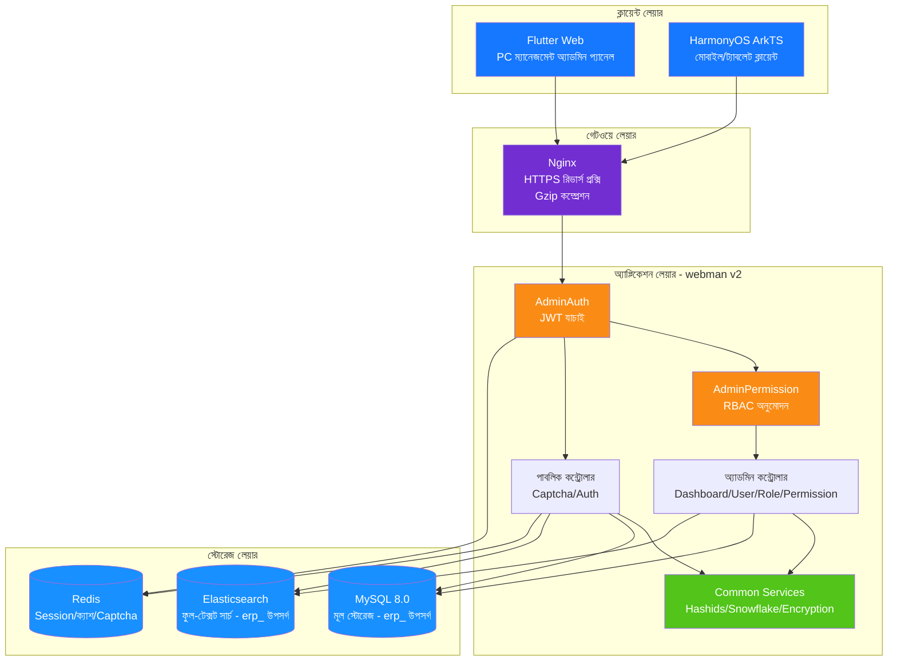

# সিস্টেম টপোলজি আর্কিটেকচার

```mermaid
flowchart TB
    subgraph clients["ক্লায়েন্ট লেয়ার"]
        flutter["Flutter Web<br/>PC ম্যানেজমেন্ট অ্যাডমিন প্যানেল"]
        harmony["HarmonyOS ArkTS<br/>মোবাইল/ট্যাবলেট ক্লায়েন্ট"]
    end

    subgraph gateway["গেটওয়ে লেয়ার"]
        nginx["Nginx<br/>HTTPS রিভার্স প্রক্সি<br/>Gzip কম্প্রেশন"]
    end

    subgraph app["অ্যাপ্লিকেশন লেয়ার - webman v2"]
        auth["AdminAuth<br/>JWT যাচাই"]
        perm["AdminPermission<br/>RBAC অনুমোদন"]
        admin["অ্যাডমিন কন্ট্রোলার<br/>Dashboard/User/Role/Permission"]
        public["পাবলিক কন্ট্রোলার<br/>Captcha/Auth"]
        common["Common Services<br/>Hashids/Snowflake/Encryption"]
    end

    subgraph storage["স্টোরেজ লেয়ার"]
        mysql[("MySQL 8.0<br/>মূল স্টোরেজ - erp_ উপসর্গ")]
        es[("Elasticsearch<br/>ফুল-টেক্সট সার্চ - erp_ উপসর্গ")]
        redis[("Redis<br/>Session/ক্যাশ/Captcha")]
    end

    flutter --> nginx
    harmony --> nginx
    nginx --> auth
    auth --> perm
    perm --> admin
    auth --> public
    admin --> common
    public --> common
    admin --> mysql
    public --> mysql
    admin --> es
    public --> es
    auth --> redis
    public --> redis

    style flutter fill:#1677FF,color:#fff
    style harmony fill:#1677FF,color:#fff
    style nginx fill:#722ED1,color:#fff
    style auth fill:#FA8C16,color:#fff
    style perm fill:#FA8C16,color:#fff
    style common fill:#52C41A,color:#fff
    style mysql fill:#1890FF,color:#fff
    style es fill:#1890FF,color:#fff
    style redis fill:#1890FF,color:#fff
```
