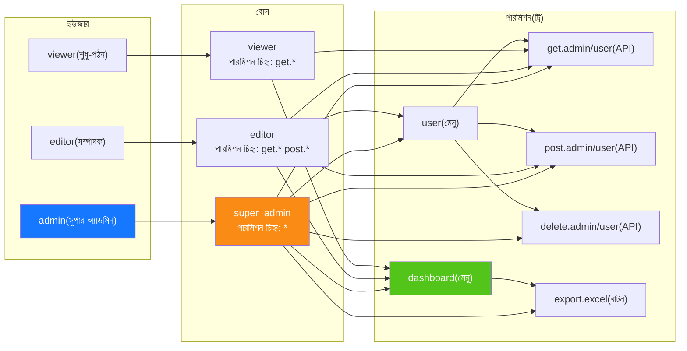
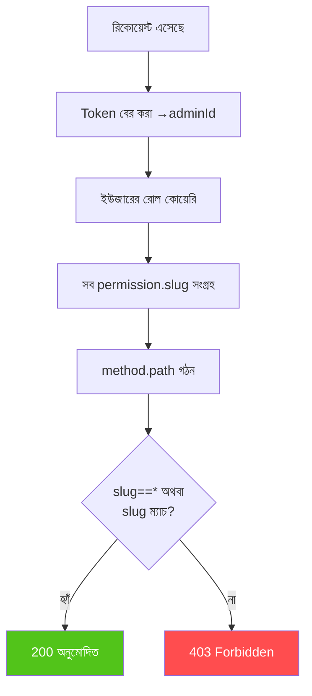
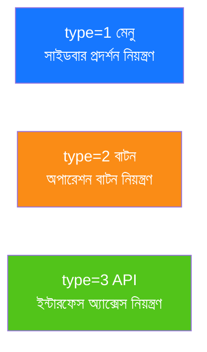

# RBAC অনুমতি মডেল

## ইউজার-রোল-পারমিশন সম্পর্ক

```mermaid
flowchart LR
    subgraph users["ইউজার"]
        u1["admin(সুপার অ্যাডমিন)"]
        u2["editor(সম্পাদক)"]
        u3["viewer(শুধু-পঠন)"]
    end

    subgraph roles["রোল"]
        r1["super_admin<br/>পারমিশন চিহ্ন: *"]
        r2["editor<br/>পারমিশন চিহ্ন: get.* post.*"]
        r3["viewer<br/>পারমিশন চিহ্ন: get.*"]
    end

    subgraph permissions["পারমিশন(ট্রি)"]
        p1["dashboard(মেনু)"]
        p2["user(মেনু)"]
        p3["get.admin/user(API)"]
        p4["post.admin/user(API)"]
        p5["delete.admin/user(API)"]
        p6["export.excel(বাটন)"]
    end

    u1 --> r1
    u2 --> r2
    u3 --> r3
    r1 --> p1 & p2 & p3 & p4 & p5 & p6
    r2 --> p1 & p2 & p3 & p4
    r3 --> p1 & p3
    p2 --> p3 & p4 & p5
    p1 --> p6

    style u1 fill:#1677FF,color:#fff
    style r1 fill:#FA8C16,color:#fff
    style p1 fill:#52C41A,color:#fff
```

## পারমিশন যাচাই ফ্লো

```mermaid
flowchart TD
    start["রিকোয়েস্ট এসেছে"] --> extract["Token বের করা →adminId"]
    extract --> findRoles["ইউজারের রোল কোয়েরি"]
    findRoles --> collectSlug["সব permission.slug সংগ্রহ"]
    collectSlug --> buildKey["method.path গঠন"]
    buildKey --> check{"slug==* অথবা<br/>slug ম্যাচ?"}
    check -->|"হ্যাঁ"| allow["200 অনুমোদিত"]
    check -->|"না"| deny["403 Forbidden"]

    style allow fill:#52C41A,color:#fff
    style deny fill:#FF4D4F,color:#fff
```

## পারমিশন টাইপ

```mermaid
flowchart LR
    t1["type=1 মেনু<br/>সাইডবার প্রদর্শন নিয়ন্ত্রণ"]
    t2["type=2 বাটন<br/>অপারেশন বাটন নিয়ন্ত্রণ"]
    t3["type=3 API<br/>ইন্টারফেস অ্যাক্সেস নিয়ন্ত্রণ"]

    style t1 fill:#1677FF,color:#fff
    style t2 fill:#FA8C16,color:#fff
    style t3 fill:#52C41A,color:#fff
```
