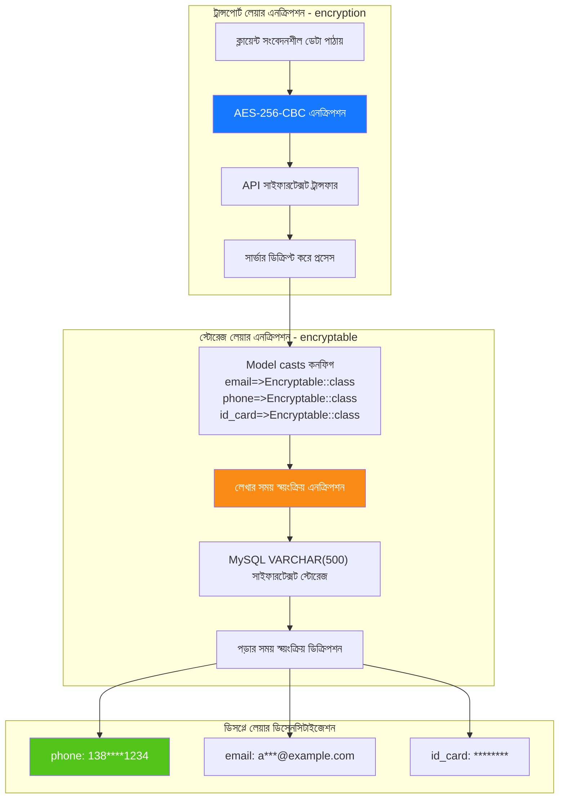

# ডেটা এনক্রিপশন লেয়ারিং

```mermaid
flowchart TB
    subgraph transport["ট্রান্সপোর্ট লেয়ার এনক্রিপশন - encryption"]
        e1["ক্লায়েন্ট সংবেদনশীল ডেটা পাঠায়"]
        e2["AES-256-CBC এনক্রিপশন"]
        e3["API সাইফারটেক্সট ট্রান্সফার"]
        e4["সার্ভার ডিক্রিপ্ট করে প্রসেস"]
        e1 --> e2 --> e3 --> e4
    end

    subgraph storage["স্টোরেজ লেয়ার এনক্রিপশন - encryptable"]
        d1["Model casts কনফিগ<br/>email=>Encryptable::class<br/>phone=>Encryptable::class<br/>id_card=>Encryptable::class"]
        d2["লেখার সময় স্বয়ংক্রিয় এনক্রিপশন"]
        d3["MySQL VARCHAR(500) সাইফারটেক্সট স্টোরেজ"]
        d4["পড়ার সময় স্বয়ংক্রিয় ডিক্রিপশন"]
        d1 --> d2 --> d3 --> d4
    end

    subgraph mask["ডিসপ্লে লেয়ার ডিসেনসিটাইজেশন"]
        m1["phone: 138****1234"]
        m2["email: a***@example.com"]
        m3["id_card: ********"]
        d4 --> m1 & m2 & m3
    end

    e4 --> d1

    style e2 fill:#1677FF,color:#fff
    style d2 fill:#FA8C16,color:#fff
    style m1 fill:#52C41A,color:#fff
```
