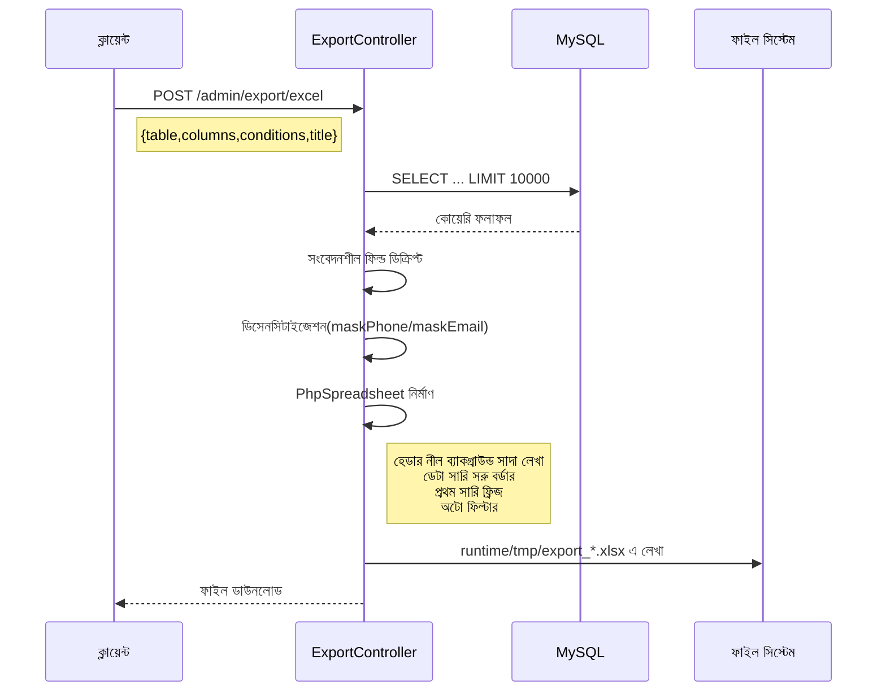
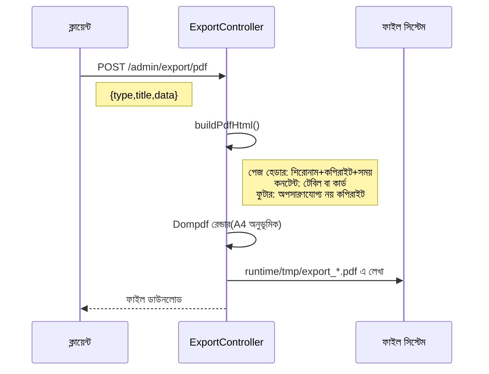

# এক্সপোর্ট বিজনেস ফ্লো

## Excel এক্সপোর্ট

```mermaid
sequenceDiagram
    participant C as ক্লায়েন্ট
    participant CTL as ExportController
    participant DB as MySQL
    participant FS as ফাইল সিস্টেম

    C->>CTL: POST /admin/export/excel
    Note right of C: {table,columns,conditions,title}
    CTL->>DB: SELECT ... LIMIT 10000
    DB-->>CTL: কোয়েরি ফলাফল
    CTL->>CTL: সংবেদনশীল ফিল্ড ডিক্রিপ্ট
    CTL->>CTL: ডিসেনসিটাইজেশন(maskPhone/maskEmail)
    CTL->>CTL: PhpSpreadsheet নির্মাণ
    Note right of CTL: হেডার নীল ব্যাকগ্রাউন্ড সাদা লেখা<br/>ডেটা সারি সরু বর্ডার<br/>প্রথম সারি ফ্রিজ<br/>অটো ফিল্টার
    CTL->>FS: runtime/tmp/export_*.xlsx এ লেখা
    CTL-->>C: ফাইল ডাউনলোড
```

## PDF এক্সপোর্ট

```mermaid
sequenceDiagram
    participant C as ক্লায়েন্ট
    participant CTL as ExportController
    participant FS as ফাইল সিস্টেম

    C->>CTL: POST /admin/export/pdf
    Note right of C: {type,title,data}
    CTL->>CTL: buildPdfHtml()
    Note right of CTL: পেজ হেডার: শিরোনাম+কপিরাইট+সময়<br/>কনটেন্ট: টেবিল বা কার্ড<br/>ফুটার: অপসারণযোগ্য নয় কপিরাইট
    CTL->>CTL: Dompdf রেন্ডার(A4 অনুভূমিক)
    CTL->>FS: runtime/tmp/export_*.pdf এ লেখা
    CTL-->>C: ফাইল ডাউনলোড
```
