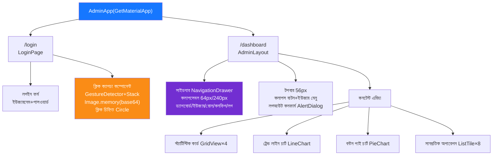
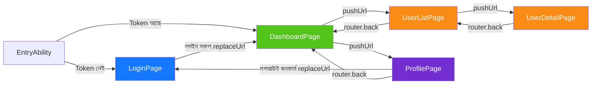

# ফ্রন্টএন্ড কম্পোনেন্ট আর্কিটেকচার

## Flutter Web কম্পোনেন্ট ট্রি

```mermaid
flowchart TD
    app["AdminApp(GetMaterialApp)"]

    app --> login["/login<br/>LoginPage"]
    app --> dashboard["/dashboard<br/>AdminLayout"]

    login --> form["লগইন ফর্ম<br/>ইউজারনেম+পাসওয়ার্ড"]
    login --> captcha["ক্লিক ক্যাপচা কম্পোনেন্ট<br/>GestureDetector+Stack<br/>Image.memory(base64)<br/>ক্লিক চিহ্নিত Circle"]

    dashboard --> sidebar["সাইডবার NavigationDrawer<br/>কলাপসেবল 64px/240px<br/>ড্যাশবোর্ড/ইউজার/রোল/কনফিগ/লগ"]
    dashboard --> header["টপবার 56px<br/>কলাপস বাটন+ইউজার মেনু<br/>লগআউট কনফার্ম AlertDialog"]
    dashboard --> content["কনটেন্ট এরিয়া"]

    content --> stats["স্ট্যাটিস্টিক কার্ড GridView×4"]
    content --> chart["ট্রেন্ড লাইন চার্ট LineChart"]
    content --> pie["বন্টন পাই চার্ট PieChart"]
    content --> logs["সাম্প্রতিক অপারেশন ListTile×8"]

    style app fill:#1677FF,color:#fff
    style captcha fill:#FA8C16,color:#fff
    style sidebar fill:#722ED1,color:#fff
```

## HarmonyOS পেজ রাউটিং

```mermaid
flowchart LR
    entry["EntryAbility"]
    entry -->|"Token নেই"| loginH["LoginPage"]
    entry -->|"Token আছে"| dashH["DashboardPage"]

    loginH -->|"লগইন সফল replaceUrl"| dashH

    dashH -->|"pushUrl"| userList["UserListPage"]
    dashH -->|"pushUrl"| profile["ProfilePage"]

    userList -->|"pushUrl"| userDetail["UserDetailPage"]
    userList -->|"router.back"| dashH
    userDetail -->|"router.back"| userList

    profile -->|"লগআউট কনফার্ম replaceUrl"| loginH
    profile -->|"router.back"| dashH

    style loginH fill:#1677FF,color:#fff
    style dashH fill:#52C41A,color:#fff
    style userList fill:#FA8C16,color:#fff
    style userDetail fill:#FA8C16,color:#fff
    style profile fill:#722ED1,color:#fff
```
