# Architekturdiagramme und Geschäftslogikdiagramme

> Copyright (c) 2026 erik <erik@erik.xyz> — https://erik.xyz

> Die folgenden Mermaid-Diagramme werden in GitHub / GitLab / VS Code automatisch gerendert. In anderen Umgebungen bitte mit dem [Mermaid Live Editor](https://mermaid.live/) anzeigen.

---

## 1. Systemtopologie-Architektur

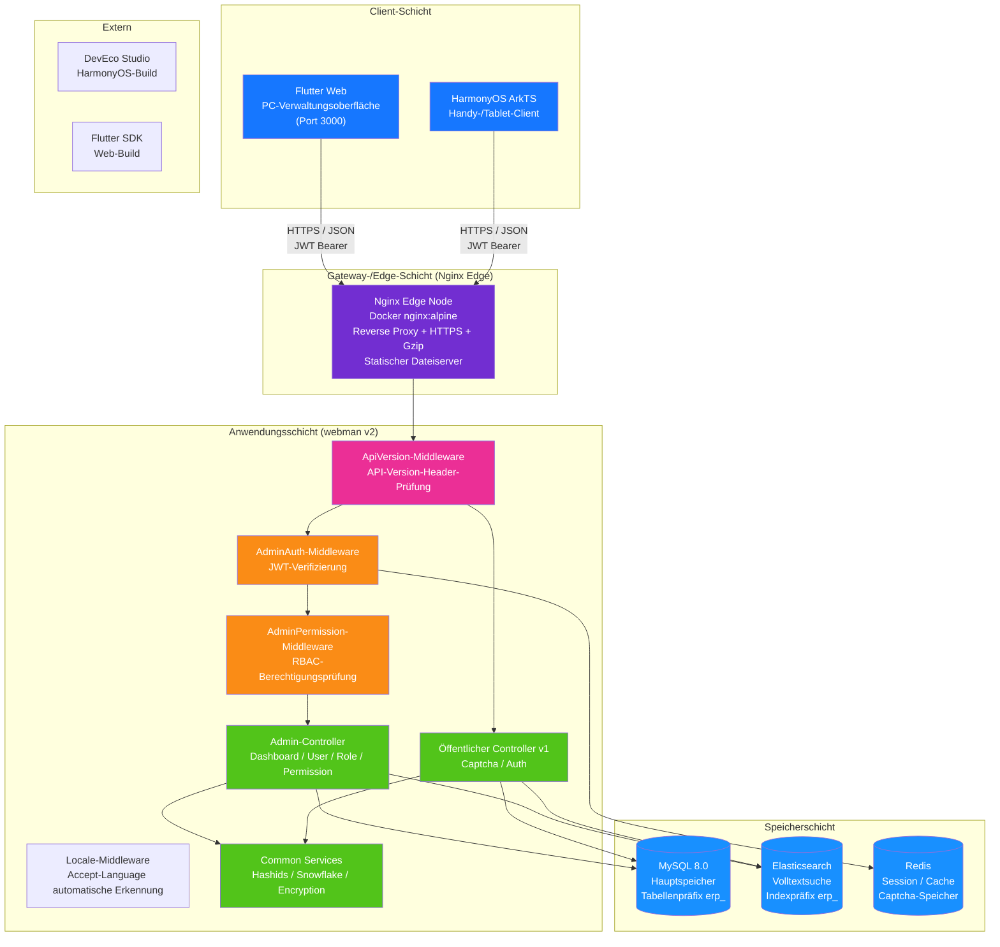

---

## 2. Backend-Mehrschichtarchitektur

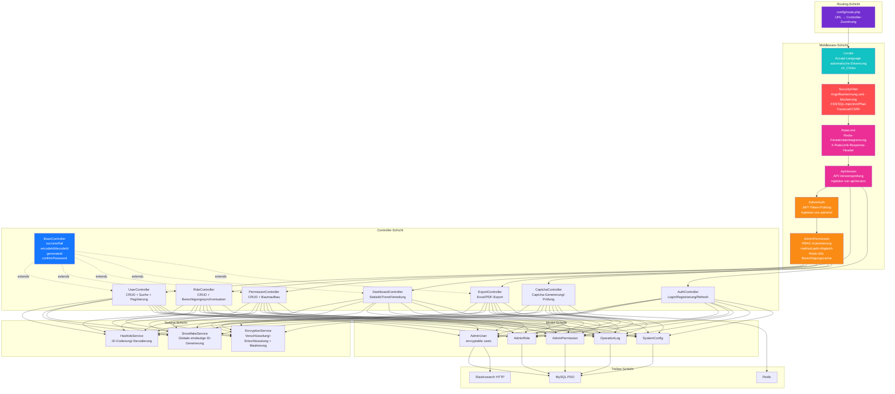

### Erweiterung der ERP-Geschäftsschicht

Mit der Weiterentwicklung des Systems von einer reinen Verwaltungsoberfläche zu einem vollständigen ERP-System kommen zur Controller- und Service-Schicht folgende Geschäftsmodule hinzu:

| Ebene | Verzeichnis | Beschreibung |
|------|------|------|
| Geschäftscontroller | `app/controller/{product,purchase,sales,inventory,finance,crm,workflow,notification,project,hr,manufacturing,report}/` | 70 Stück, nach Modulen gegliedert, verarbeiten Geschäftsanfragen |
| Geschäftsservices | `app/service/{inventory,finance,notification}/` | Lager-Ein-/Ausgang + Kostenrechnung, finanzielle Forderungen/Verbindlichkeiten + Verrechnung, Benachrichtigungsversand |

---

## 3. Request-Lebenszyklus

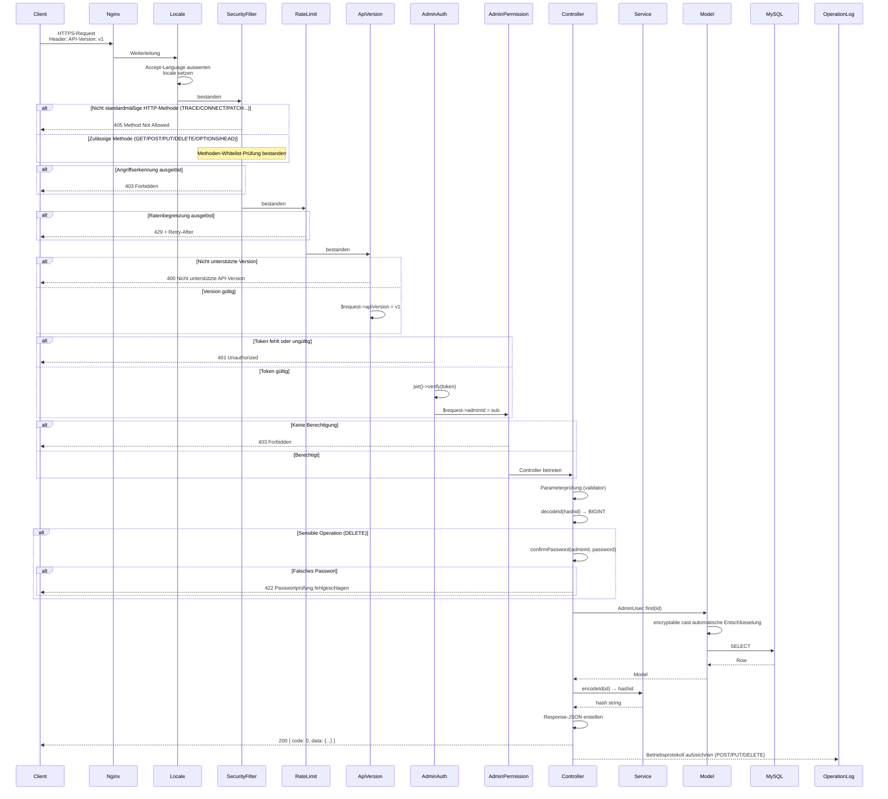

---

## 4. Authentifizierungs- und Captcha-Ablauf

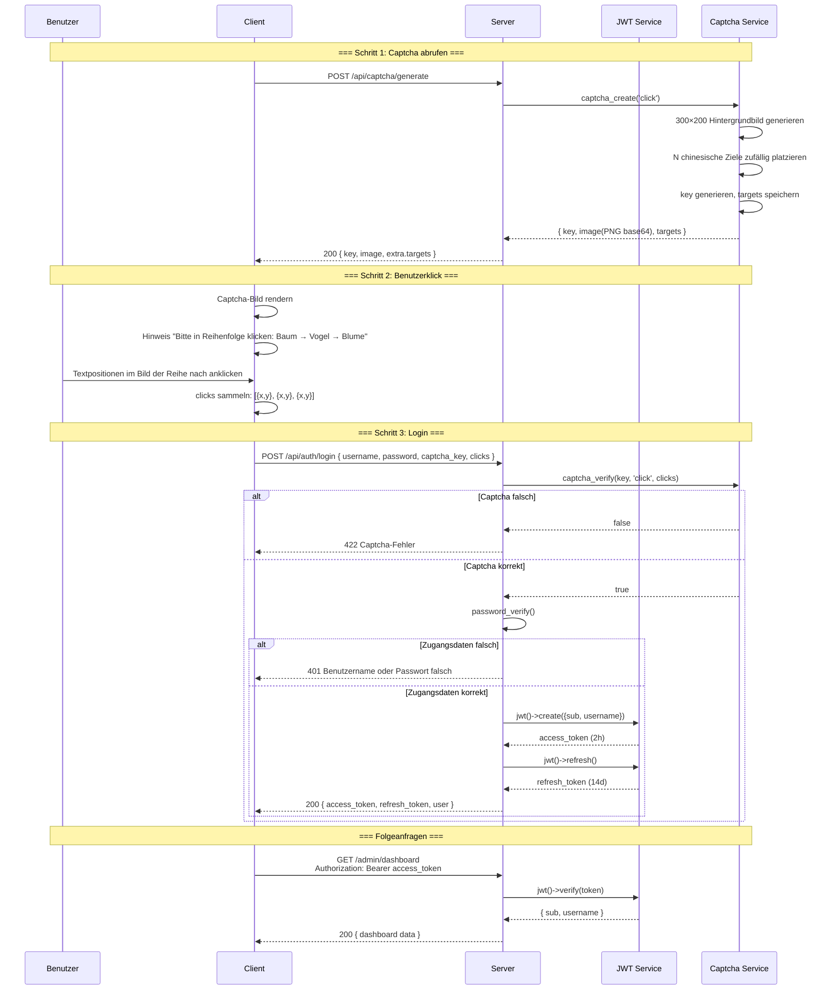

---

## 5. RBAC-Berechtigungsmodell

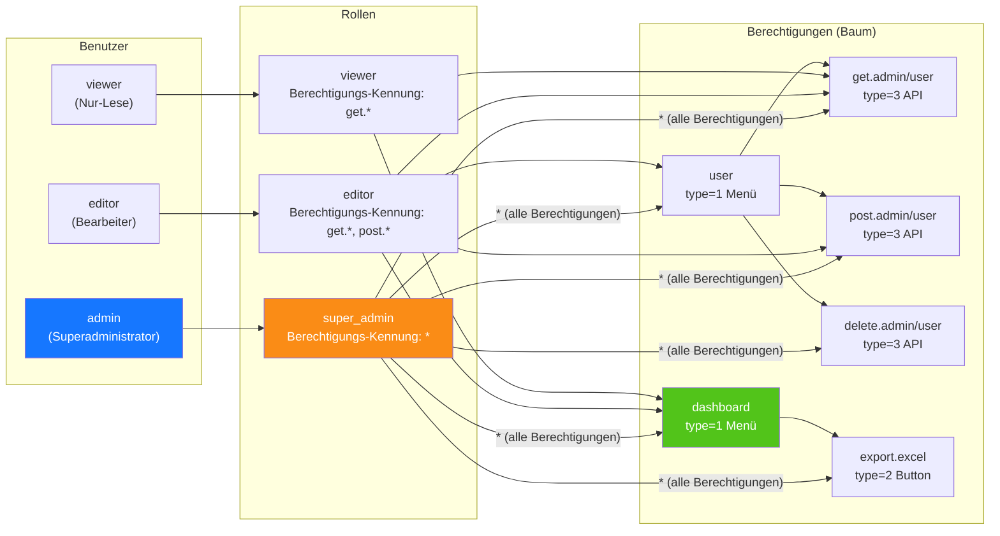

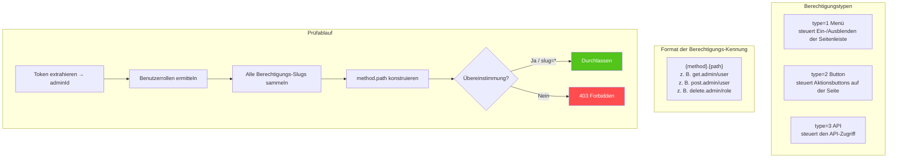

---

## 6. Vollständiger ID-Lebenszyklus

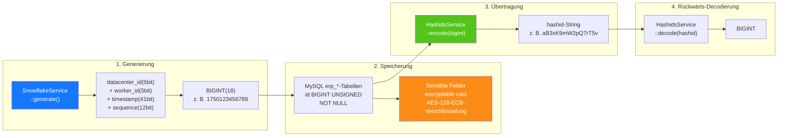

---

## 7. Ebenen der Datenverschlüsselung

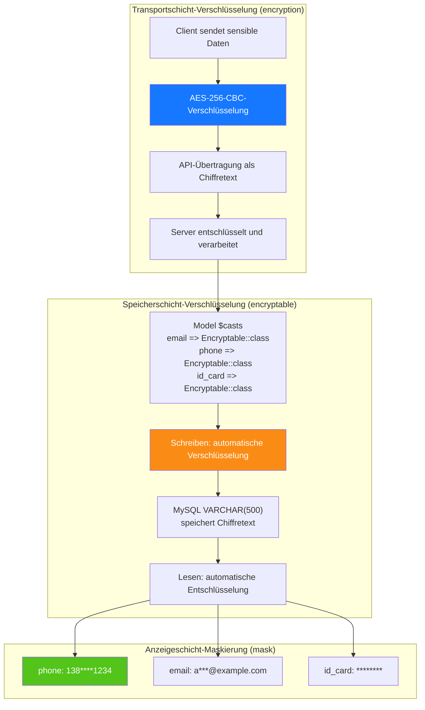

---

## 8. ER-Beziehungen der Datenbank

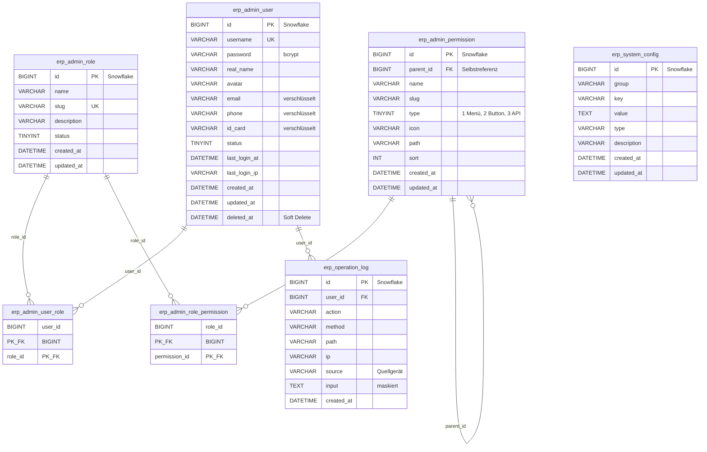

---

## 9. Export-Geschäftsablauf

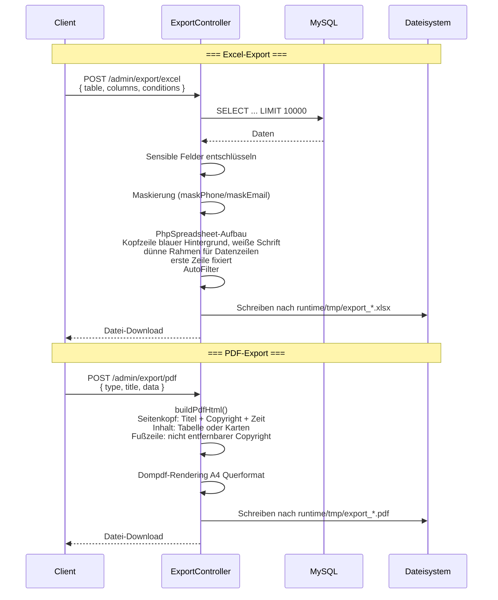

---

## 10. Flutter-Web-Komponentenbaum

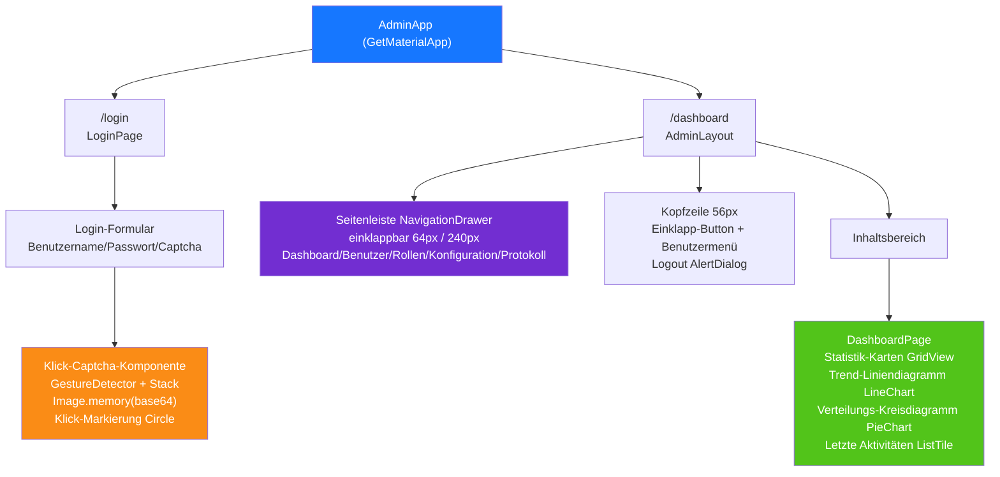

---

## 11. HarmonyOS-Seitenrouting

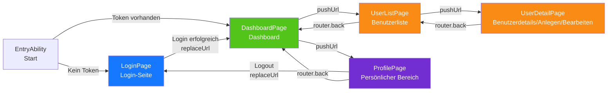

---

## 12. Panorama der abgestuften Sicherheitsverteidigung

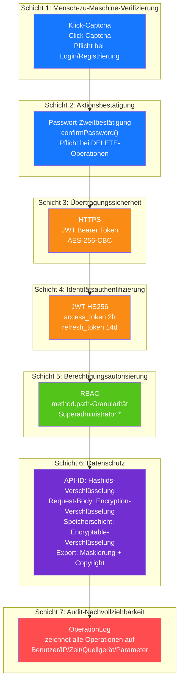

---

## 13. Bereitstellungstopologie

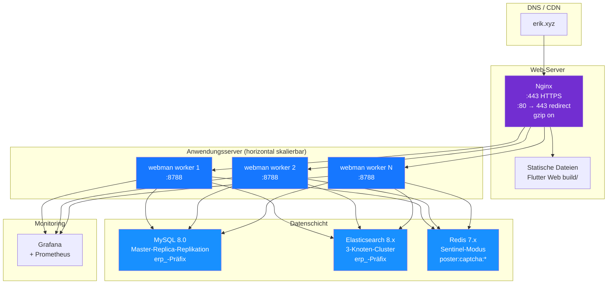

---

## 14. Gesamtarchitektur des ERP-Systems

```mermaid
graph TB
    subgraph Client["Client-Schicht"]
        FW["Flutter Web<br/>PC-Verwaltungsoberfläche"]
        FA["Flutter App<br/>iOS/Android/macOS/Windows/Linux"]
        HW["HarmonyOS<br/>HarmonyOS-native App"]
    end

    subgraph Gateway["API-Gateway-Schicht"]
        MW["Middleware-Kette<br/>Locale→Cors→SecurityFilter→RateLimit→Auth→Permission→OpLog"]
    end

    subgraph Business["Geschäftsmodul-Schicht"]
        direction LR
        Admin["Systemverwaltung<br/>Benutzer/Rollen/Berechtigungen/Konfiguration/Protokoll"]
        Product["Artikelverwaltung<br/>Artikel/Kategorien/Marken/Lager/Supplier/Kunden"]
        Purchase["Einkaufsverwaltung<br/>Antrag→Bestellung→Wareneingang→Retoure→Abrechnung"]
        Sales["Vertriebsverwaltung<br/>Angebot→Bestellung→Versand→Retoure→Abrechnung"]
        Inventory["Lagerverwaltung<br/>Ein-/Ausgang/Chargen/Inventur/Umlagerung/Warnung"]
        Finance["Finanzverwaltung<br/>Konten/Belege/Forderungen-Verbindlichkeiten/Hauptbuch/Detailbuch/Berichte/Erstattungen"]
        CRM["CRM<br/>Kunden/Kontakte/Nachfass/Aufbereitung/Public Pool/Angebote/Verträge"]
        Workflow["Genehmigungs-Workflow<br/>Workflow-Definition/Einreichen/Genehmigen/Ablehnen/Zurückziehen"]
        Notification["Benachrichtigungen<br/>Benachrichtigungsliste/Gelesen/Anzahl ungelesen"]
        Project["Projektverwaltung<br/>Projekte/Aufgaben/Zeiterfassung"]
        HR["Personalwesen<br/>Abteilungen/Mitarbeiter/Positionen/Anwesenheit/Urlaub/Gehalt"]
        Manufacturing["Produktion<br/>BOM/Produktionsaufträge/Arbeitspläne/Arbeitsstationen/MRP"]
        Report["Benutzerdefinierte Berichte<br/>Berichtsvorlagen/Datensätze/Felder/Filter/Zeitpläne"]
    end

    subgraph Service["Geschäfts-Service-Schicht"]
        IS["InventoryService<br/>Ein-/Ausgang + gleitende gewichtete Durchschnittskosten"]
        FS["FinanceService<br/>automatische Erzeugung von Forderungen/Verbindlichkeiten + Verrechnung"]
        NS["NotificationService<br/>einheitlicher Benachrichtigungsversand"]
    end

    subgraph Data["Datenschicht"]
        MySQL["MySQL 8.0<br/>163 Geschäftstabellen"]
        Redis["Redis 7<br/>Cache/Ratenbegrenzung/Session"]
        ES["Elasticsearch 8<br/>Volltextsuche"]
    end

    Client --> Gateway
    Gateway --> Business
    Business --> Service
    Service --> Data
    Business --> Data
```

---

## 15. Modulübergreifende Datenflüsse

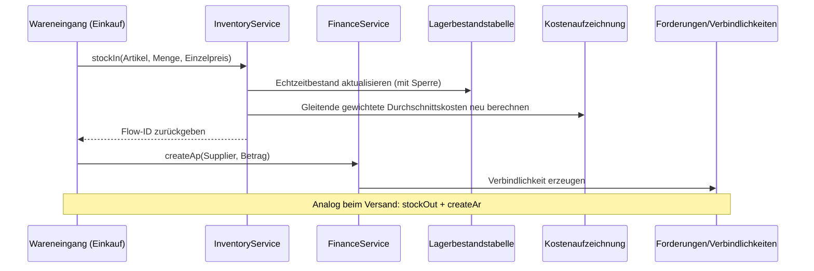

---

## 16. Datenfluss der Lagerkostenrechnung

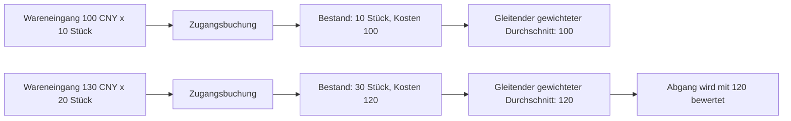

---

## 17. Datenfluss des Genehmigungsworkflows

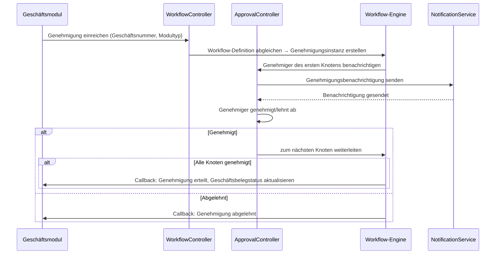

---

## 18. Datenfluss der Benachrichtigungen

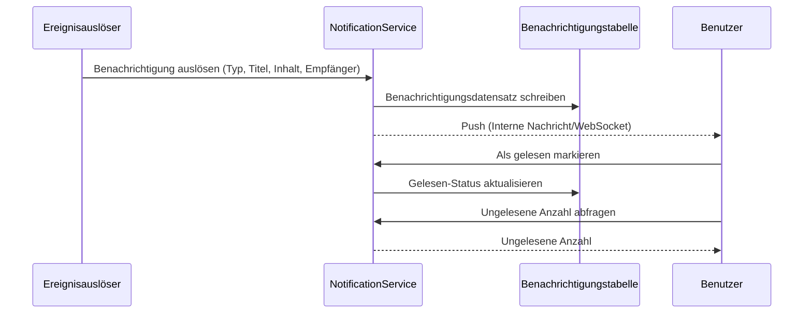

---

## 19. Datenfluss der MRP-Materialbedarfsplanung

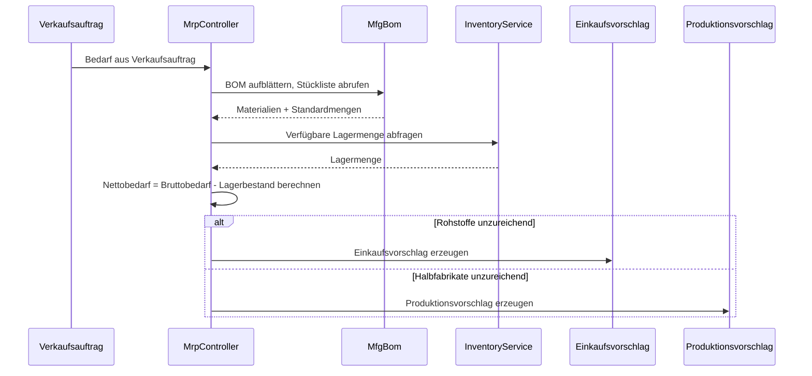

---

## 20. Zuordnungstabelle der ERP-Module: Controller-Service-Model

> Hinweis zur Service-Schicht: In der Spalte `Kern-Service` sind die bereits ausgelagerten Geschäftsservices des Moduls vermerkt; Module mit der Kennzeichnung **⚠ Controller greift direkt auf Model zu (bekannter Tech-Schuldposten)**
> rufen weiterhin direkt Modell-Abfrage-/Schreibmethoden im Controller auf (`XxxModel::find/where/save` usw.), eine Service-Schicht wurde noch nicht extrahiert. Dies ist ein bekannter Tech-Schuldposten,
> der in der Folge schrittweise nach dem Muster der leichten Service-Schicht-Extraktion P2-F2 (`app/service/AbstractCrudService` generische CRUD-Basisklasse + Modul-Service) abgebaut wird.

| Modul | Controllers (Verzeichnis) | Kern-Service | Wichtigste Models | Tabellen |
|------|-------------------|-------------|-----------|------|
| Systemverwaltung | admin/controller/ (14) | - ⚠ Controller greift direkt auf Model zu, bekannter Tech-Schuldposten | AdminUser, AdminRole, AdminPermission | 7 |
| Artikelverwaltung | controller/product/ (7) | ProductService | Product, Category, Brand, Warehouse, Supplier, Customer | 11 |
| Einkaufsverwaltung | controller/purchase/ (5) | InventoryService, FinanceService ⚠ CRUD greift weiterhin direkt zu, bekannter Tech-Schuldposten | PurchaseOrder, PurchaseReceive | 9 |
| Vertriebsverwaltung | controller/sales/ (5) | InventoryService, FinanceService ⚠ CRUD greift weiterhin direkt zu, bekannter Tech-Schuldposten | SalesOrder, SalesDelivery | 9 |
| Lagerverwaltung | controller/inventory/ (5) | InventoryService ⚠ CRUD greift weiterhin direkt zu, bekannter Tech-Schuldposten | Inventory, InventoryFlow, CostRecord | 11 |
| Finanzverwaltung | controller/finance/ (20) | FinanceService ⚠ CRUD greift weiterhin direkt zu, bekannter Tech-Schuldposten | FinanceArAp, FinanceVoucher, FinanceReceipt, FinancePayment, FinanceGeneralLedger, FinanceBalanceSheet, FinanceAsset, FinanceBudget, FinanceCostCenter | 26 |
| CRM | controller/crm/ (10) | CrmService | CrmOpportunity, CrmFollowRecord, CrmContract, CrmPoolRule, CrmQuotation, CrmCampaign, CrmTicket, CrmAnalyticsReport | 16 |
| Genehmigungs-Workflow | controller/workflow/ (2) | - ⚠ Controller greift direkt auf Model zu, bekannter Tech-Schuldposten | ApprovalWorkflow, ApprovalInstance, ApprovalNode, ApprovalRecord | 4 |
| Benachrichtigungen | controller/notification/ (1) | NotificationService ⚠ CRUD greift weiterhin direkt zu, bekannter Tech-Schuldposten | Notification, NotificationSetting, NotificationTemplate | 3 |
| Projektverwaltung | controller/project/ (3) | - ⚠ Controller greift direkt auf Model zu, bekannter Tech-Schuldposten | Project, ProjectTask, ProjectTimesheet, ProjectMember, ProjectGantt | 5 |
| Personalwesen | controller/hr/ (5) | HrService | HrDepartment, HrEmployee, HrPosition, HrAttendance, HrLeave, HrSalary | 8 |
| Produktion | controller/manufacturing/ (5) | ManufacturingService | MfgBom, MfgProductionOrder, MfgRouting, MfgWorkstation, MfgMrpPlan | 8 |
| Benutzerdefinierte Berichte | controller/report/ (2) | - ⚠ Controller greift direkt auf Model zu, bekannter Tech-Schuldposten | ReportTemplate, ReportDataset, ReportField, ReportFilter, ReportSchedule | 5 |
| EAM Anlagenverwaltung | controller/eam/ (4) | - ⚠ Controller greift direkt auf Model zu, bekannter Tech-Schuldposten | EamEquipment, EamMaintenancePlan, EamRepairOrder, EamSparePart | 4 |
| DMS Dokumentenverwaltung | controller/dms/ (2) | - ⚠ Controller greift direkt auf Model zu, bekannter Tech-Schuldposten | DmsCategory, DmsDocument, DmsDocumentVersion | 3 |
| BI-Dashboard | controller/bi/ (3) | - ⚠ Controller greift direkt auf Model zu, bekannter Tech-Schuldposten | BiDashboard, BiWidget | 2 |

### 20.1 Aufzeichnung der leichten Service-Schicht-Extraktion P2-F2 (crm/hr/manufacturing/product bereits extrahiert)

| Modul | Direktzugriffe im Controller vor der Extraktion | Nach der Extraktion | Neuer Service | Extrahierter Inhalt |
|------|----------------------|--------|--------------|----------|
| CRM | 57 | 0 | `app/service/crm/CrmService.php` | Generisches CRUD + Vertragsstatus-Übergänge, Angebot-zu-Vertrag, Public-Pool-Zuweisung/Freigabe, Ticket-Zuweisung/Lösung/Antwort, kaskadierende Bereinigung von Detaildatensätzen, Aufbau von Analyseberichtsdaten |
| Personalwesen | 38 | 0 | `app/service/hr/HrService.php` | Generisches CRUD + Stempeln-Zu-spät/Zu-früh-Erkennung, Urlaubsgenehmigung (automatische Urlaubs-Anwesenheitserfassung), Gehalts-Eindeutigkeit/Auszahlungsbetrag-Berechnung/Auszahlung/Massenerzeugung |
| Produktion | 33 | 0 | `app/service/manufacturing/ManufacturingService.php` | Generisches CRUD + Auftragsstart/-abschluss-Übergänge, BOM-Versionskopie/Wirksamkeits-Mutual-Exclusion, MRP-Detailerzeugung |
| Artikelverwaltung | 29 | 0 | `app/service/product/ProductService.php` | Generisches CRUD + transaktionale Artikelerstellung (SKU/Preise), feldweises Aktualisieren unter Beibehaltung der Originalwerte, assoziatives Laden von Detaildaten |

Extraktionsmuster: `app/service/AbstractCrudService.php` stellt `list/all/find/create/update/delete/deleteWhere` als generisches CRUD
sowie `normalizePageParams/canTransition` als rein logische Helfer bereit; die Modul-Services erben davon und bündeln die modulspezifische Geschäftslogik.
Controller injizieren die Services über `Container::get(XxxService::class)` (mit class_exists-Fallback), sodass Routen, Parameter und Rückgabestrukturen vollständig unverändert bleiben;
HTTP-Belange wie Hashid-Codierung/-Decodierung, Passwort-Zweitbestätigung und Response-Wrapping verbleiben im Controller.
Die neuen Services sind in `config/dependence.php` registriert (diese Datei ist eine dead config und wird von addDefinitions nicht geladen; der Laufzeit-Container
instanziiert über den class_exists-Fallback, daher bleiben alle Services ohne Konstruktorargumente).

Nicht extrahierte Module (Projektverwaltung 18, Benutzerdefinierte Berichte 18, Einkauf 24, Vertrieb 24, Systemverwaltung 42 usw.) sind in der Tabelle
mit "Controller greift direkt auf Model zu, bekannter Tech-Schuldposten" gekennzeichnet und werden in Folgeiterationen nach demselben Muster extrahiert.

---

## OMS/WMS/TMS-Erweiterungsmodule (2026-08)

### OMS (Order Management System) — 8 Tabellen
- **Auftragserweiterung** (`erp_oms_order`): Multi-Kanal-Aggregation/Erfüllungsstatus/Zahlungsstatus/Priorität
- **Auftragsadresse** (`erp_oms_order_address`): Liefer-/Rechnungsadresse (Länderformate)
- **Erfüllungsaufzeichnungen** (`erp_oms_fulfillment`+`_item`): Zuordnung/kommissioniert/verpackt/versendet Mengenverfolgung
- **RMA** (`erp_oms_rma`+`_item`): vollständiger Lebenszyklus von Rückgabe/Umtausch
- **Bestandsreservierung** (`erp_oms_inventory_reservation`): ATP = physical - reserved
- **Kanäle** (`erp_channel`): direct/marketplace/edi/pos

### WMS (Warehouse Management System) — 12 Tabellen
- **Zonen/Lagerplätze** (`erp_wms_zone`, `erp_wms_location`): zone→aisle→rack→level→bin
- **Wareneingang** (`erp_wms_asn`+`_item`, `erp_wms_receiving`, `erp_wms_putaway_task`+`_item`)
- **Warenausgang** (`erp_wms_wave`+`wave_order`, `erp_wms_pick_task`+`_item`, `erp_wms_pack_task`)

### TMS (Transport Management System) — 7 Tabellen
- **Spediteure** (`erp_tms_carrier`+`carrier_service`, `erp_tms_freight_rate`)
- **Sendungen** (`erp_tms_shipment`+`_package`, `erp_tms_tracking_event`)
- **Rechnungen** (`erp_tms_freight_invoice`)

### Datenflüsse
```
OMS: Channel Order → Inventory Reservation (ATP) → Create Fulfillment → WMS
WMS: Wave → Pick → Pack → TMS Shipment
TMS: Rate Shop → Ship → Confirm (stockOut + AR) → Tracking → Delivery
WMS Inbound: ASN → Receive → Putaway (stockIn + AP)
RMA: Request → Approve → Return → Receive (stockIn) → Refund
```

---

## 21. Ökosystem-Roadmap (2026-08)

> Detaillierte Designspezifikation: `superpowers/specs/2026-08-04-erp-ecosystem-roadmap-design.md`

### 21.1 Basisbewertung (zu Beginn der Roadmap)

> P0~P3 wurden vollständig ausgeliefert, die aktuelle Gesamtbewertung beträgt 89/100 (siehe CLAUDE.md); die folgende Tabelle ist eine Basisschnappschuss-Analyse vor Beginn der Roadmap.

| Dimension | Bewertung | Wichtigste Lücken |
|------|------|----------|
| Backend-API | 85/100 | Mehrere Module sind CRUD-Gerüste, es fehlen Geschäftsberechnungs-Engines |
| Sicherheit | 95/100 | 18 Schichten abgestufter Verteidigung, produktionsbereit |
| Frontend-UI | 20/100 | **Größte Schwäche**: Flutter 12 Seiten decken ~20 % der Module ab, Web-Admin-Panel fehlt |
| Betriebs-Ökosystem | 70/100 | Es fehlen Migrations-Rollback, automatische Backups, Observability |
| Geschäftstiefe | 55/100 | Kernalgorithmen für Finanzen/HR/Produktion nicht implementiert |
| **Gesamt** | **65/100** | |

### 21.2 Vierphasige serielle Roadmap

```
P0(3-4 Wochen) → P1(4-6 Wochen) → P2(1-2 Wochen) → P3(2-3 Wochen) = insgesamt ca. 13 Wochen
```

| Phase | Name | Kern-Lieferumfang |
|------|------|----------|
| **P0** | Frontend-Ökosystem | Flutter-Web-Admin-Panel für alle Module (14 Module, 40+ Seiten), generische Komponentenbibliothek, HarmonyOS-Angleichung |
| **P1** | Geschäftstiefe | Doppelte-Buchführungs-Engine, Gehaltsberechnungs-Engine, MRP-Engine, Qualitätsmanagementmodul, Echtzeit-Benachrichtigungen (WebSocket) |
| **P2** | Betriebliche Zuverlässigkeit | Datenbank-Migrations-Rollback, erweiterte automatische Backups, OpenTelemetry-Tracing, RabbitMQ-Queue-Treiber |
| **P3** | Erlebnisverbesserung | BI-Drag-and-Drop-Dashboards, Anlagenverwaltung (EAM), Multi-Tenant-Isolation, Dokumentenverwaltung (DMS) |

### 21.3 Entwicklung der Middleware-Kette

```
Heute:    Locale → Cors → SecurityFilter → RateLimit → TracingId → {Routengruppen}
Nach P1:  Locale → Cors → SecurityFilter → RateLimit → WebSocketUpgrade → {Routengruppen}
Nach P2:  Locale → Cors → SecurityFilter → RateLimit → TracingId → WebSocketUpgrade → {Routengruppen}
Nach P3:  Locale → Cors → SecurityFilter → RateLimit → TracingId → TenantScope → WebSocketUpgrade → {Routengruppen}
```

### 21.4 P0-Zielarchitektur — Flutter-Web-Admin-Panel

| Ebene | Neuer Inhalt |
|------|----------|
| Layout-Ebene | `AdminLayout` PC-Dreispalten-Layout (einklappbare Seitenleiste + Kopfzeile + Inhaltsbereich) |
| Komponenten-Ebene | `DataTableWrapper`, `FormDialog`, `ConfirmDialog`, `StatCard`, `BreadcrumbNav`, `FileUploader` |
| Seiten-Ebene | Erweiterung von den vorhandenen 12 Seiten auf vollständige Abdeckung von 14 Modulen mit 40+ Seiten |
| Service-Ebene | Wiederverwendung der vorhandenen `ApiService`, `AuthService`, `CaptchaService`, `ExportService` |

### 21.5 P1-Zielarchitektur — Geschäftsberechnungs-Engines

| Engine | Service-Klassen | Kernregeln |
|------|--------|----------|
| Doppelte Buchführung | `DoubleEntryService`, `PeriodCloseService`, `AccountBalanceService` | Erzwungene Soll/Haben-Gleichgewichtsprüfung, Periodenabschluss mit Ergebnisüberträgen, Multi-Währungs-Umrechnung |
| Gehaltsberechnung | `SalaryEngineService`, `SocialInsuranceService`, `HousingFundService`, `TaxCalculatorService` | Sozialversicherungsbasis-Unter-/Obergrenzen, Wohnungsbaufonds-Sätze, progressive Einkommensteuer, Bank-Datenträger |
| MRP | `MrpEngineService`, `BomExplosionService`, `NetRequirementService` | BOM-Ebenen-Aufblätterung + Schwund, Low-Level-Code (LLC), Sicherheitsbestand, Losgrößenregeln |
| Qualität | `QmsInspectionService` | IQC-Eingang/IPQC-Prozess/OQC-Ausgang, Drei-Formular-Durchlauf |
| Benachrichtigungen | `WebSocketService`, `ChannelRouter` | Interne Nachricht/E-Mail/WeCom/DingTalk, Multi-Kanal |

### 21.6 Zusammenfassung der Datenmodelländerungen

| Phase | Neue Tabellen | Betroffene Module |
|------|----------|----------|
| P0 | 0 | Reines Frontend, keine Tabellenänderungen |
| P1 | 14 | Finanzen (2) + HR (3) + Produktion (2) + Qualität (5) + Benachrichtigungen (2) |
| P3 | 7 | BI (2) + EAM (3) + DMS (2) |

---

## 22. Multi-Tenant (reservierte Fähigkeit, nicht aktiviert)

> Copyright-Hinweis wie im Dateikopf: Copyright (c) 2026 erik <erik@erik.xyz> — https://erik.xyz

### 22.1 Positionierung und Entscheidung

Multi-Tenant ist in diesem Projekt als **reservierte Fähigkeit** positioniert; in dieser Phase wird es **nicht angeschlossen und nicht aktiviert** (dokumentierte Reduzierung). Im Einklang mit der Planung:
"SaaS-Abrechnung, tenantseitige Selbstregistrierung" und andere "vollständige kommerzielle Multi-Tenant-Lösungen" liegen außerhalb des Projektumfangs; diese Phase behält nur das minimale
Code-Gerüst (Middleware + Model-Trait) und gibt Aktivierungsschritte für eine spätere bedarfsgerechte Aktivierung an.
Hinweis: Das "Multi-Tenant-Isolation" in §21.2 Roadmap P3 wird entsprechend zu "reservierte Fähigkeit (dokumentierte Reduzierung)" angepasst — Gerüst bleibt, keine Verkabelung.

Entscheidungsgrundlage (Review 2026-08):
- Die bestehenden Bereitstellungen sind fast ausnahmslos Single-Tenant; eine Verkabelung würde unnötige Isolationskomplexität und Regressionsrisiken einführen;
- Das aktuelle Gerüst hat technische Defizite (siehe 22.4), "Verkabelung = Isolation" trifft nicht zu; zuerst ist eine Designkorrektur erforderlich;
- Die Isolation erfordert das Hinzufügen von Spalten je Geschäftstabelle unter den 163 Tabellen und das Aktivieren je Model — der Aufwand übersteigt eine "minimale Verkabelung" deutlich.

### 22.2 Aktueller Stand (Code- und Konfigurationsabgleich)

| Position | Aktueller Stand |
|----|------|
| `app/middleware/TenantScope.php` | Vorhanden, nicht registriert; liest den Tenant aus dem `X-Tenant-Id`-Header, lässt bei fehlendem Header direkt durch |
| `app/model/concerns/TenantScope.php` | Vorhanden, von keinem Model verwendet; der globale Scope in `bootTenantScope()` filtert nur, wenn ein Tenant gesetzt ist |
| `config/middleware.php` | Globale Kette: Locale → Cors → SecurityFilter → RateLimit → TracingId, ohne TenantScope |
| `/admin`-Gruppe in `config/route.php` | AdminAuth → AdminPermission → OperationLog, ohne TenantScope |
| JWT-Payload | Nur `sub` / `username` / `token_type`, **kein tenant_id-Claim** (`app/api/v1/controller/AuthController.php`) |
| Datenbank | **Keine tenant_id-Spalte in der gesamten Datenbank** (auch nicht in install.sql) |
| Models | **Kein Model verwendet den TenantScope-Trait** |

### 22.3 Aktivierungsschritte (Referenz für später, in dieser Phase nicht ausgeführt)

1. Middleware registrieren: in der `middleware()` der /admin-Gruppe in `config/route.php`
   `app\middleware\TenantScope::class` anhängen (nach AdminAuth, um authentifizierte Anfragen sicherzustellen).
2. Der Anfragesteller trägt im Request-Header `X-Tenant-Id` (int Tenant-ID) ein.
3. Für zu isolierende Geschäftstabellen die Spalte `tenant_id` hinzufügen (BIGINT + Index) und Bestandsdaten nachtragen;
   Wörterbuch-/Systemtabellen (z. B. `erp_admin_user`, `erp_role`, `erp_permission`) werden nicht isoliert.
4. In den zu isolierenden Model-Klassen `use app\model\concerns\TenantScope;` einbinden — automatische Filterung nach aktuellem Tenant.
5. (Optional) Falls der Tenant aus dem JWT statt aus dem Header kommen soll: das Login-Signierungs-Payload um den Claim `tenant_id` erweitern
   und in der Middleware aus `$payload['tenant_id']` lesen.

### 22.4 Bekannte technische Einschränkungen (müssen vor Aktivierung gelöst werden)

- **Unterbrochene statische Übergabekette (mit PHP 8.3 getestet)**: Die Middleware ruft `setCurrentTenantId()` über den Trait-Namen auf
   und schreibt damit in die statische Kopie des Traits selbst; Model-Klassen, die diesen Trait verwenden, können sie nicht lesen, die Abfrage wird nicht gefiltert.
   Bei der Aktivierung auf eine requestkontextbasierte Injektion umstellen (z. B. `request()->tenantId`).
- **Statische Globalzustands-Interferenz**: Workerman ist ein persistent laufender Prozess; statische Eigenschaften werden über Requests hinweg geteilt; bei aktiviertem Coroutine-Modus
   (Swoole/Swow) kommt es zu tenantübergreifender Dateninterferenz — auf requestgebundene Bindung umstellen (`context()` / Request-Objekt).
- **Datenebenen-Lücke**: Es gibt keine tenant_id-Spalte in der gesamten Datenbank; Migration ist je Tabelle erforderlich; für tenantübergreifend geteilte Wörterbuchtabellen muss ein Befreiungsmechanismus entworfen werden.

### 22.5 Abnahmekriterien

Abnahme dieser Phase = Dokumentation und Code stimmen überein: `config/middleware.php` und `config/route.php` enthalten
keine TenantScope-Registrierung; Middleware und Trait-Kommentare kennzeichnen eindeutig "reservierte Fähigkeit, nicht aktiviert" und geben Aktivierungsschritte an;
dieser Abschnitt entspricht Punkt für Punkt dem Code-Stand.
