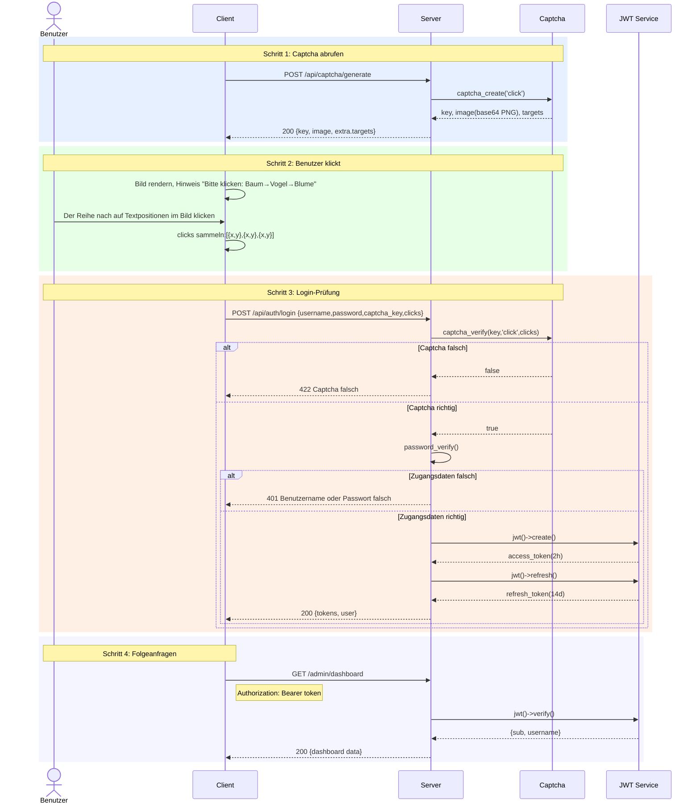

# Authentifizierungs- und Captcha-Ablauf

```mermaid
sequenceDiagram
    actor U as Benutzer
    participant CL as Client
    participant SV as Server
    participant CAP as Captcha
    participant JWT as JWT Service

    rect rgb(230, 240, 255)
    Note over U,CAP: Schritt 1: Captcha abrufen
    CL->>SV: POST /api/captcha/generate
    SV->>CAP: captcha_create('click')
    CAP-->>SV: key, image(base64 PNG), targets
    SV-->>CL: 200 {key, image, extra.targets}
    end

    rect rgb(230, 255, 230)
    Note over U,CAP: Schritt 2: Benutzer klickt
    CL->>CL: Bild rendern, Hinweis "Bitte klicken: Baum→Vogel→Blume"
    U->>CL: Der Reihe nach auf Textpositionen im Bild klicken
    CL->>CL: clicks sammeln:[{x,y},{x,y},{x,y}]
    end

    rect rgb(255, 240, 230)
    Note over U,CAP: Schritt 3: Login-Prüfung
    CL->>SV: POST /api/auth/login {username,password,captcha_key,clicks}
    SV->>CAP: captcha_verify(key,'click',clicks)

    alt Captcha falsch
        CAP-->>SV: false
        SV-->>CL: 422 Captcha falsch
    else Captcha richtig
        CAP-->>SV: true
        SV->>SV: password_verify()
        alt Zugangsdaten falsch
            SV-->>CL: 401 Benutzername oder Passwort falsch
        else Zugangsdaten richtig
            SV->>JWT: jwt()->create()
            JWT-->>SV: access_token(2h)
            SV->>JWT: jwt()->refresh()
            JWT-->>SV: refresh_token(14d)
            SV-->>CL: 200 {tokens, user}
        end
    end
    end

    rect rgb(245, 245, 255)
    Note over U,CL: Schritt 4: Folgeanfragen
    CL->>SV: GET /admin/dashboard
    Note right of CL: Authorization: Bearer token
    SV->>JWT: jwt()->verify()
    JWT-->>SV: {sub, username}
    SV-->>CL: 200 {dashboard data}
    end
```
