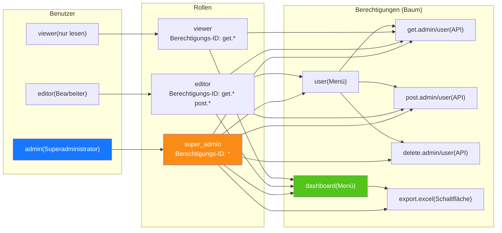
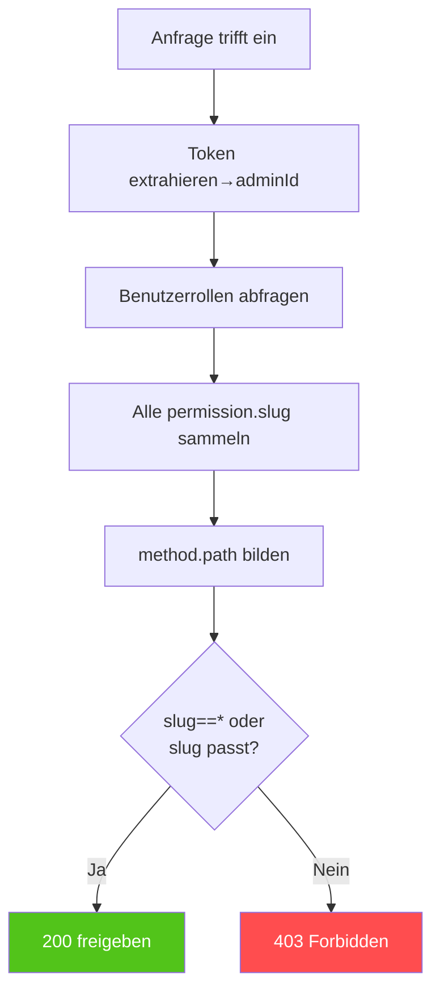
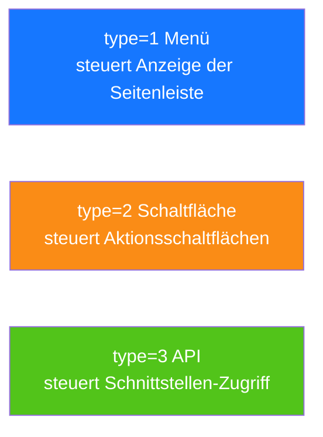

# RBAC-Berechtigungsmodell

## Benutzer-Rolle-Berechtigung-Beziehung

```mermaid
flowchart LR
    subgraph users["Benutzer"]
        u1["admin(Superadministrator)"]
        u2["editor(Bearbeiter)"]
        u3["viewer(nur lesen)"]
    end

    subgraph roles["Rollen"]
        r1["super_admin<br/>Berechtigungs-ID: *"]
        r2["editor<br/>Berechtigungs-ID: get.* post.*"]
        r3["viewer<br/>Berechtigungs-ID: get.*"]
    end

    subgraph permissions["Berechtigungen (Baum)"]
        p1["dashboard(Menü)"]
        p2["user(Menü)"]
        p3["get.admin/user(API)"]
        p4["post.admin/user(API)"]
        p5["delete.admin/user(API)"]
        p6["export.excel(Schaltfläche)"]
    end

    u1 --> r1
    u2 --> r2
    u3 --> r3
    r1 --> p1 & p2 & p3 & p4 & p5 & p6
    r2 --> p1 & p2 & p3 & p4
    r3 --> p1 & p3
    p2 --> p3 & p4 & p5
    p1 --> p6

    style u1 fill:#1677FF,color:#fff
    style r1 fill:#FA8C16,color:#fff
    style p1 fill:#52C41A,color:#fff
```

## Berechtigungsprüfungs-Ablauf

```mermaid
flowchart TD
    start["Anfrage trifft ein"] --> extract["Token extrahieren→adminId"]
    extract --> findRoles["Benutzerrollen abfragen"]
    findRoles --> collectSlug["Alle permission.slug sammeln"]
    collectSlug --> buildKey["method.path bilden"]
    buildKey --> check{"slug==* oder<br/>slug passt?"}
    check -->|"Ja"| allow["200 freigeben"]
    check -->|"Nein"| deny["403 Forbidden"]

    style allow fill:#52C41A,color:#fff
    style deny fill:#FF4D4F,color:#fff
```

## Berechtigungstypen

```mermaid
flowchart LR
    t1["type=1 Menü<br/>steuert Anzeige der Seitenleiste"]
    t2["type=2 Schaltfläche<br/>steuert Aktionsschaltflächen"]
    t3["type=3 API<br/>steuert Schnittstellen-Zugriff"]

    style t1 fill:#1677FF,color:#fff
    style t2 fill:#FA8C16,color:#fff
    style t3 fill:#52C41A,color:#fff
```
