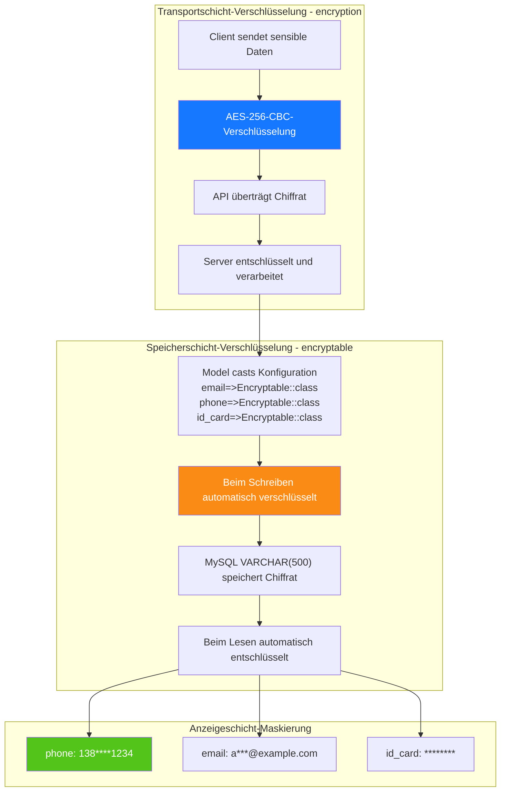

# Datenverschlüsselungs-Schichten

```mermaid
flowchart TB
    subgraph transport["Transportschicht-Verschlüsselung - encryption"]
        e1["Client sendet sensible Daten"]
        e2["AES-256-CBC-Verschlüsselung"]
        e3["API überträgt Chiffrat"]
        e4["Server entschlüsselt und verarbeitet"]
        e1 --> e2 --> e3 --> e4
    end

    subgraph storage["Speicherschicht-Verschlüsselung - encryptable"]
        d1["Model casts Konfiguration<br/>email=>Encryptable::class<br/>phone=>Encryptable::class<br/>id_card=>Encryptable::class"]
        d2["Beim Schreiben automatisch verschlüsselt"]
        d3["MySQL VARCHAR(500) speichert Chiffrat"]
        d4["Beim Lesen automatisch entschlüsselt"]
        d1 --> d2 --> d3 --> d4
    end

    subgraph mask["Anzeigeschicht-Maskierung"]
        m1["phone: 138****1234"]
        m2["email: a***@example.com"]
        m3["id_card: ********"]
        d4 --> m1 & m2 & m3
    end

    e4 --> d1

    style e2 fill:#1677FF,color:#fff
    style d2 fill:#FA8C16,color:#fff
    style m1 fill:#52C41A,color:#fff
```
