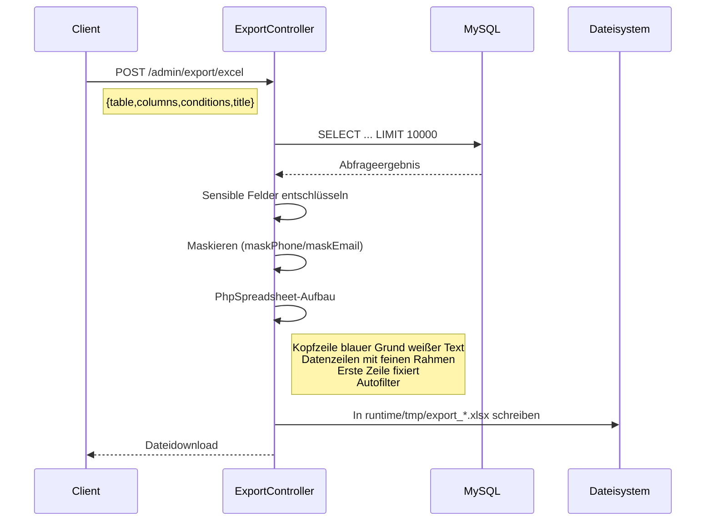
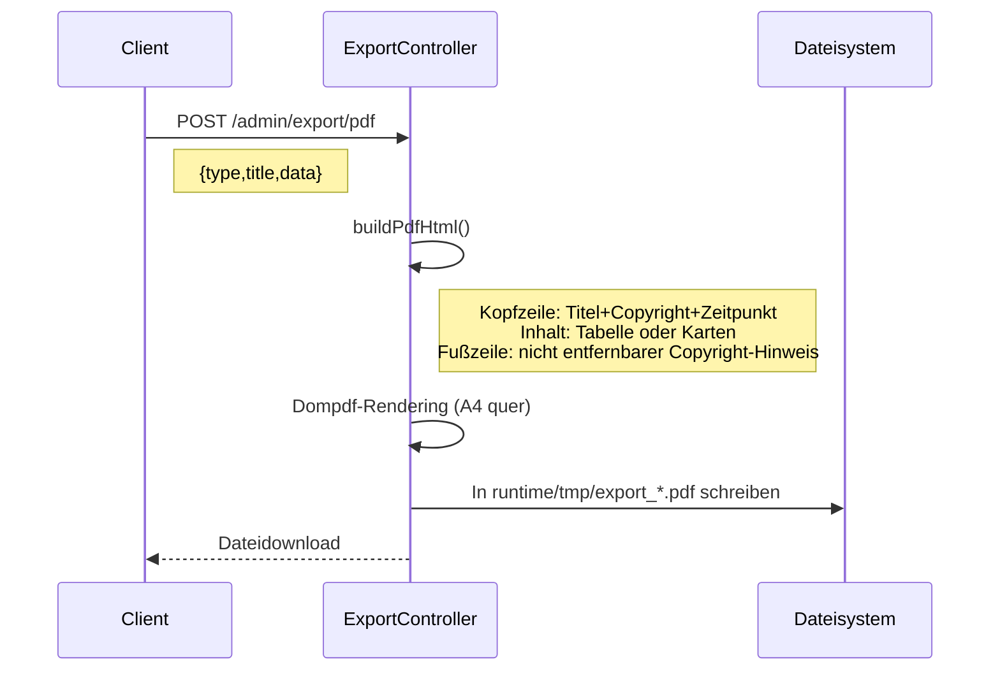

# Export-Geschäftsablauf

## Excel-Export

```mermaid
sequenceDiagram
    participant C as Client
    participant CTL as ExportController
    participant DB as MySQL
    participant FS as Dateisystem

    C->>CTL: POST /admin/export/excel
    Note right of C: {table,columns,conditions,title}
    CTL->>DB: SELECT ... LIMIT 10000
    DB-->>CTL: Abfrageergebnis
    CTL->>CTL: Sensible Felder entschlüsseln
    CTL->>CTL: Maskieren (maskPhone/maskEmail)
    CTL->>CTL: PhpSpreadsheet-Aufbau
    Note right of CTL: Kopfzeile blauer Grund weißer Text<br/>Datenzeilen mit feinen Rahmen<br/>Erste Zeile fixiert<br/>Autofilter
    CTL->>FS: In runtime/tmp/export_*.xlsx schreiben
    CTL-->>C: Dateidownload
```

## PDF-Export

```mermaid
sequenceDiagram
    participant C as Client
    participant CTL as ExportController
    participant FS as Dateisystem

    C->>CTL: POST /admin/export/pdf
    Note right of C: {type,title,data}
    CTL->>CTL: buildPdfHtml()
    Note right of CTL: Kopfzeile: Titel+Copyright+Zeitpunkt<br/>Inhalt: Tabelle oder Karten<br/>Fußzeile: nicht entfernbarer Copyright-Hinweis
    CTL->>CTL: Dompdf-Rendering (A4 quer)
    CTL->>FS: In runtime/tmp/export_*.pdf schreiben
    CTL-->>C: Dateidownload
```
