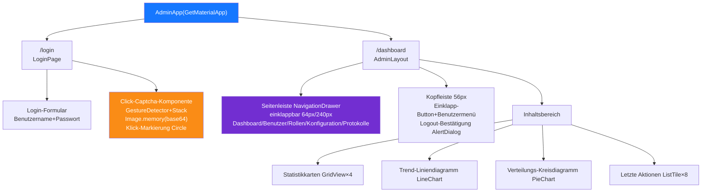
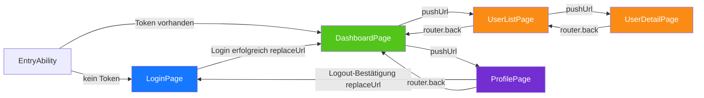

# Frontend-Komponentenarchitektur

## Flutter-Web-Komponentenbaum

```mermaid
flowchart TD
    app["AdminApp(GetMaterialApp)"]

    app --> login["/login<br/>LoginPage"]
    app --> dashboard["/dashboard<br/>AdminLayout"]

    login --> form["Login-Formular<br/>Benutzername+Passwort"]
    login --> captcha["Click-Captcha-Komponente<br/>GestureDetector+Stack<br/>Image.memory(base64)<br/>Klick-Markierung Circle"]

    dashboard --> sidebar["Seitenleiste NavigationDrawer<br/>einklappbar 64px/240px<br/>Dashboard/Benutzer/Rollen/Konfiguration/Protokolle"]
    dashboard --> header["Kopfleiste 56px<br/>Einklapp-Button+Benutzermenü<br/>Logout-Bestätigung AlertDialog"]
    dashboard --> content["Inhaltsbereich"]

    content --> stats["Statistikkarten GridView×4"]
    content --> chart["Trend-Liniendiagramm LineChart"]
    content --> pie["Verteilungs-Kreisdiagramm PieChart"]
    content --> logs["Letzte Aktionen ListTile×8"]

    style app fill:#1677FF,color:#fff
    style captcha fill:#FA8C16,color:#fff
    style sidebar fill:#722ED1,color:#fff
```

## HarmonyOS-Seitenrouten

```mermaid
flowchart LR
    entry["EntryAbility"]
    entry -->|"kein Token"| loginH["LoginPage"]
    entry -->|"Token vorhanden"| dashH["DashboardPage"]

    loginH -->|"Login erfolgreich replaceUrl"| dashH

    dashH -->|"pushUrl"| userList["UserListPage"]
    dashH -->|"pushUrl"| profile["ProfilePage"]

    userList -->|"pushUrl"| userDetail["UserDetailPage"]
    userList -->|"router.back"| dashH
    userDetail -->|"router.back"| userList

    profile -->|"Logout-Bestätigung replaceUrl"| loginH
    profile -->|"router.back"| dashH

    style loginH fill:#1677FF,color:#fff
    style dashH fill:#52C41A,color:#fff
    style userList fill:#FA8C16,color:#fff
    style userDetail fill:#FA8C16,color:#fff
    style profile fill:#722ED1,color:#fff
```
