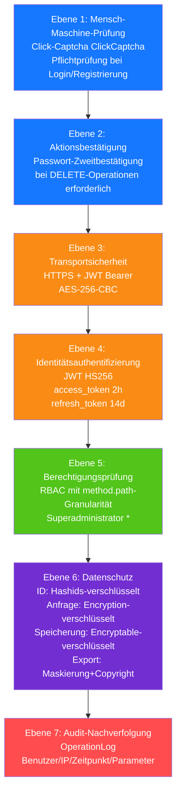

# Sicherheitstiefenverteidigung

```mermaid
flowchart TB
    l1["Ebene 1: Mensch-Maschine-Prüfung<br/>Click-Captcha ClickCaptcha<br/>Pflichtprüfung bei Login/Registrierung"]
    l2["Ebene 2: Aktionsbestätigung<br/>Passwort-Zweitbestätigung<br/>bei DELETE-Operationen erforderlich"]
    l3["Ebene 3: Transportsicherheit<br/>HTTPS + JWT Bearer<br/>AES-256-CBC"]
    l4["Ebene 4: Identitätsauthentifizierung<br/>JWT HS256<br/>access_token 2h<br/>refresh_token 14d"]
    l5["Ebene 5: Berechtigungsprüfung<br/>RBAC mit method.path-Granularität<br/>Superadministrator *"]
    l6["Ebene 6: Datenschutz<br/>ID: Hashids-verschlüsselt<br/>Anfrage: Encryption-verschlüsselt<br/>Speicherung: Encryptable-verschlüsselt<br/>Export: Maskierung+Copyright"]
    l7["Ebene 7: Audit-Nachverfolgung<br/>OperationLog<br/>Benutzer/IP/Zeitpunkt/Parameter"]

    l1 --> l2 --> l3 --> l4 --> l5 --> l6 --> l7

    style l1 fill:#1677FF,color:#fff
    style l2 fill:#1677FF,color:#fff
    style l3 fill:#FA8C16,color:#fff
    style l4 fill:#FA8C16,color:#fff
    style l5 fill:#52C41A,color:#fff
    style l6 fill:#722ED1,color:#fff
    style l7 fill:#FF4D4F,color:#fff
```
