# Architecture Diagrams and Business Logic Diagrams

> Copyright (c) 2026 erik <erik@erik.xyz> — https://erik.xyz

> The Mermaid diagrams below render automatically in GitHub / GitLab / VS Code. For other environments, use the [Mermaid Live Editor](https://mermaid.live/) to view them.

---

## 1. System Topology Architecture

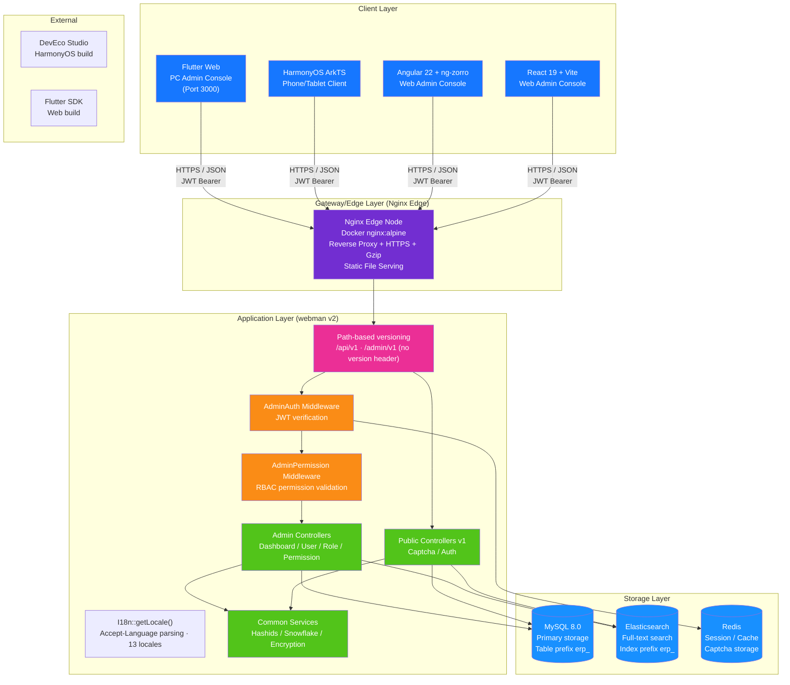

---

## 2. Backend Layered Architecture

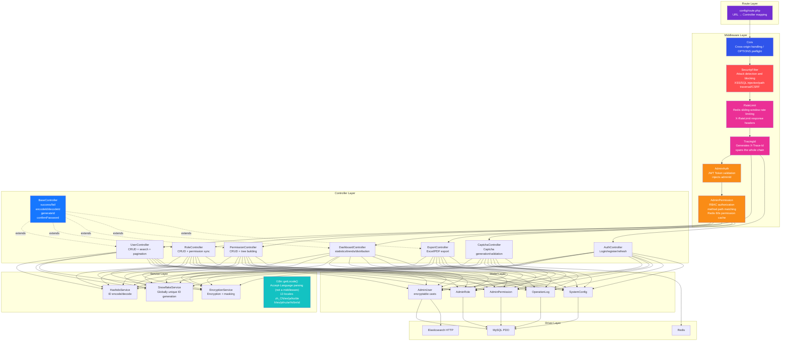

### ERP Business Layer Extension

As the system evolves from a pure admin console into a complete ERP system, the following business modules are added to the controller and service layers:

| Layer | Directory | Description |
|------|------|------|
| Business controllers | `app/controller/{product,purchase,sales,inventory,finance,crm,workflow,notification,project,hr,manufacturing,report,oms,wms,tms,quality,eam,dms,open,platform,print,retail,bi}/` | 139 (23 business domains, plus top-level Install / Index), organized per module, handling business requests |
| Business services | `app/service/{finance,inventory,notification,crm,hr,manufacturing,oms,wms,tms,quality,…}/` | 63 service classes / 64 files / 20 module subdirectories; covering inventory stock in/out + costing, finance AR/AP + write-off, notification sending |

### Internationalization (13 Languages)

Locale resolution lives in `getLocale()` in `app/common/I18n.php` (called by `I18n::trans()`, **not a middleware**): it takes the first tag of the `Accept-Language` request header and maps the primary language subtag (`zh*` → `zh_CN`). Division of labour between the frontend and backend dictionaries:

| End | Dictionary location | Scale | Generator |
|----|----------|------|--------|
| Backend | `resource/translations/<locale>/{common,modules,validation}.php` | 13 locale directories; `zh_CN` 565 entries, each of the other 11 locales 544 entries, `en` 30 entries (leaf-entry scope; the `attributes` field labels in `validation.php` count, their group keys do not) | `scripts/gen-be-locales.mjs` |
| Angular | source `apps/angular/src/app/core/zh-en/part1..4.ts` → artifacts `core/zh-<code>.ts` | 1456 source entries | `scripts/gen-fe-locales.mjs --app angular` |
| React | source `apps/react/src/lib/i18n/zhEn.ts` → artifacts `lib/i18n/zh<Code>.ts` | 1451 source entries | `scripts/gen-fe-locales.mjs --app react` |

- Languages: `zh_CN` `en` `ja` `ko` `de` `fr` `es` `pt` `ru` `ar` `hi` `bn` `id`.
- Backend "English is the key": `en`'s common/modules are left empty; the keys in `validation.php` are framework rule names, so only the values are translated.
- Each of the 11 new frontend locale dictionaries is dynamically `import()`ed into its own chunk; missing entries fall back to the original Chinese text.
- Switching language switches `Accept-Language`, and the backend returns text per locale (`app/common/I18n.php` + `config/translation.php`).

---

## 3. Request Lifecycle

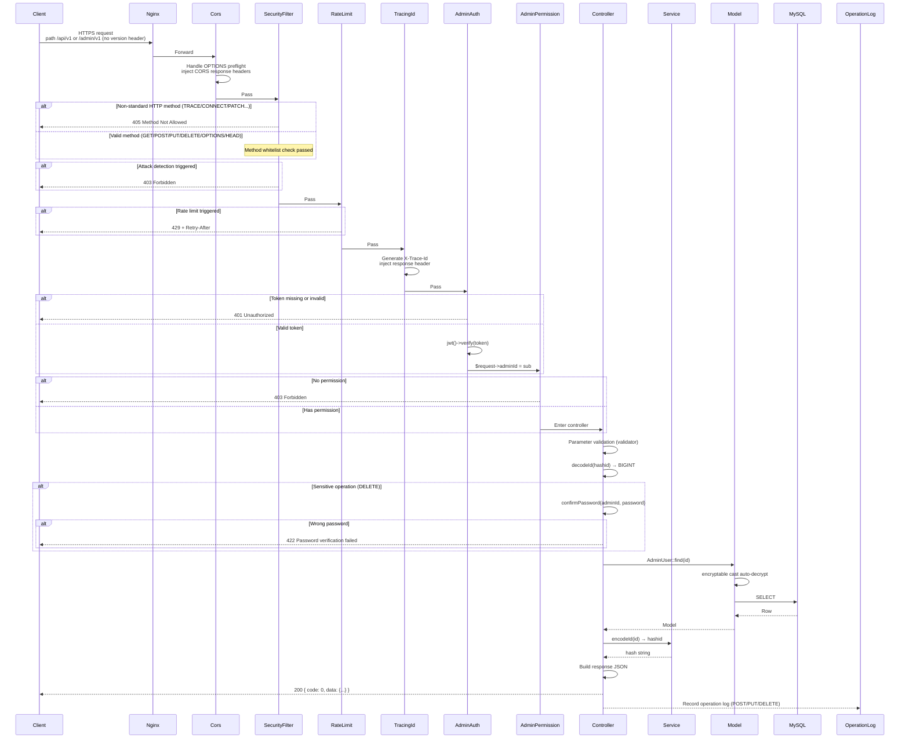

---

## 4. Authentication and Captcha Flow

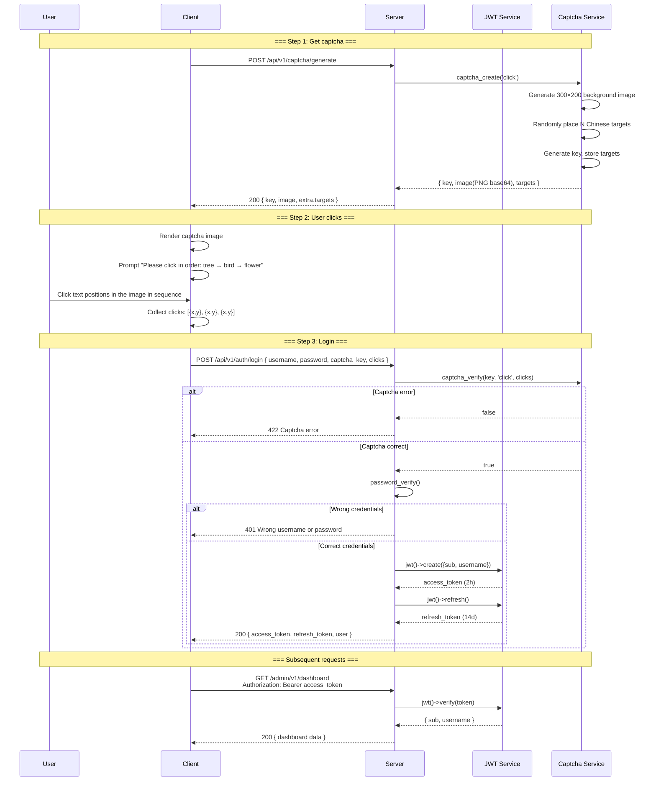

---

## 5. RBAC Permission Model

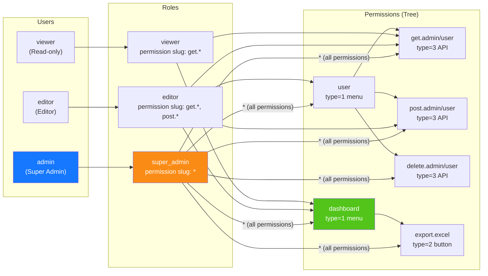

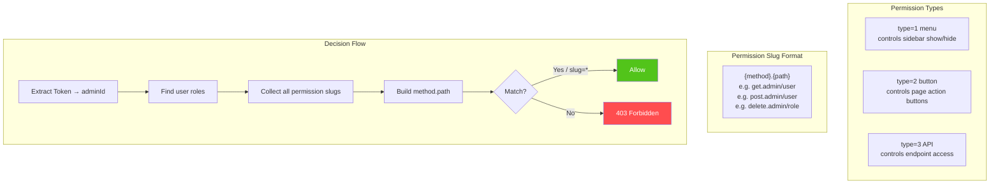

---

## 6. ID Full Lifecycle

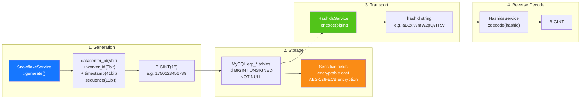

---

## 7. Data Encryption Layers

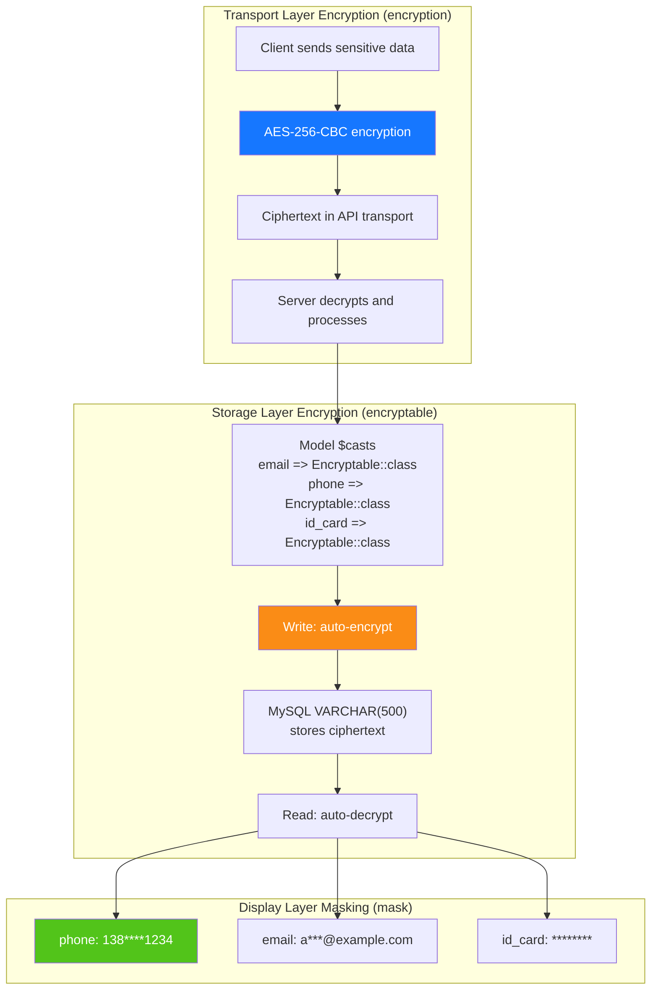

---

## 8. Database ER Relationships

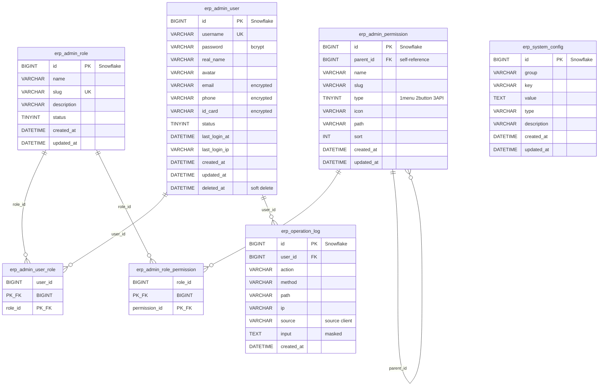

---

## 9. Export Business Flow

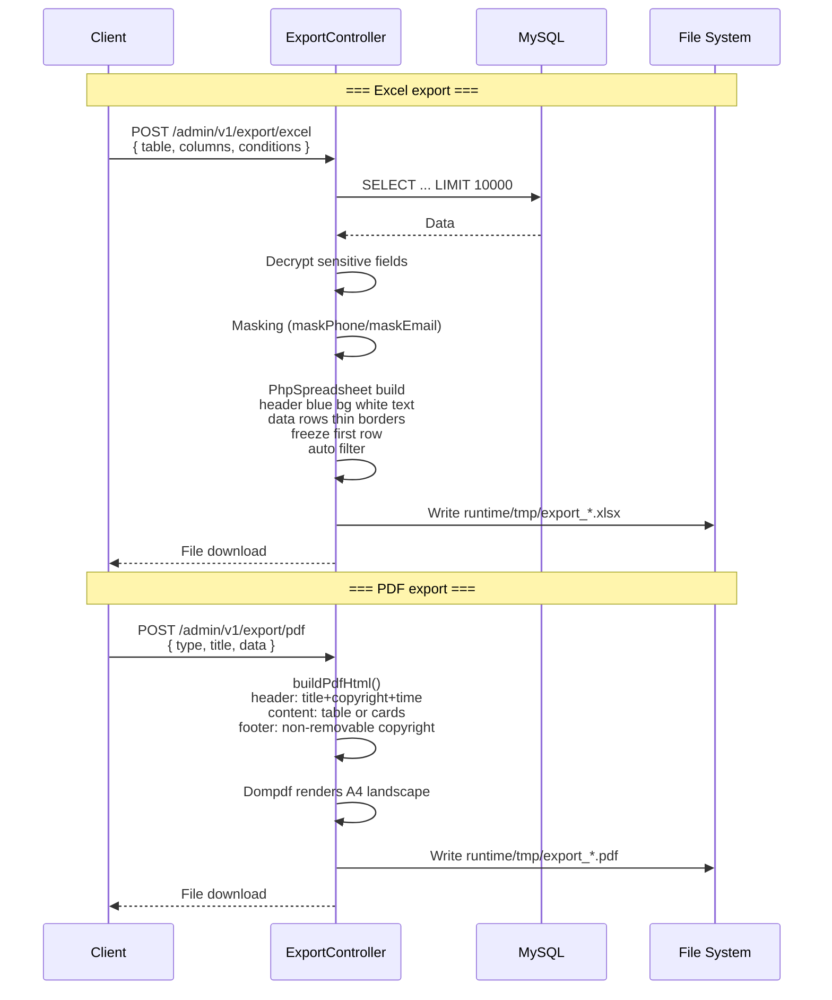

---

## 10. Flutter Web Component Tree

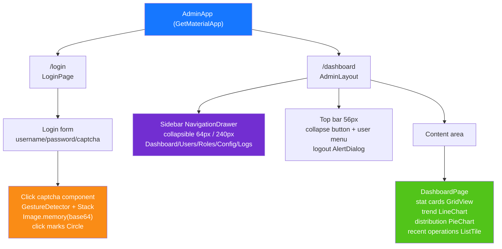

---

## 11. HarmonyOS Page Routing

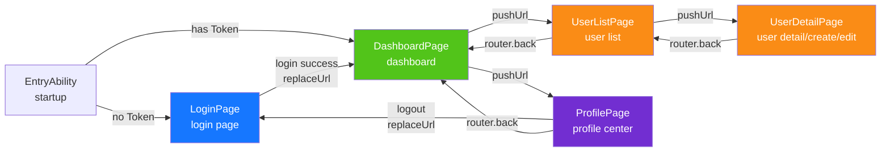

---

## 12. Defense in Depth Overview

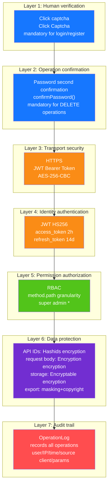

---

## 13. Deployment Topology

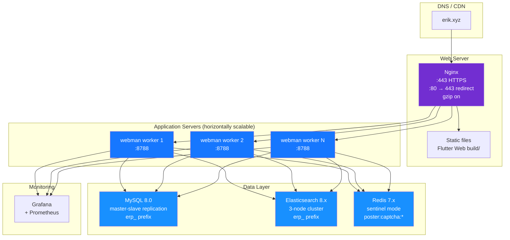
## 14. ERP System Overall Architecture

```mermaid
graph TB
    subgraph Client["Client Layer"]
        FW["Flutter Web<br/>PC Admin Panel"]
        FA["Flutter App<br/>iOS/Android/macOS/Windows/Linux"]
        HW["HarmonyOS<br/>HarmonyOS Native App"]
        NG["Angular 22 + ng-zorro<br/>Web Admin Console"]
        RC["React 19 + Vite<br/>Web Admin Console"]
    end

    subgraph Gateway["API Gateway Layer"]
        MW["Middleware Chain<br/>Cors→SecurityFilter→RateLimit→TracingId<br/>route groups: AdminAuth→AdminPermission→OperationLog"]
    end

    subgraph Business["Business Module Layer"]
        direction LR
        Admin["System Management<br/>Users/Roles/Permissions/Config/Logs"]
        Product["Product Management<br/>Products/Categories/Brands/Warehouses/Suppliers/Customers"]
        Purchase["Purchase Management<br/>Apply→Order→Receive→Return→Settlement"]
        Sales["Sales Management<br/>Quote→Order→Delivery→Return→Settlement"]
        Inventory["Inventory Management<br/>In/Out/Batches/Counts/Transfers/Alerts"]
        Finance["Finance Management<br/>Accounts/Vouchers/AR-AP/General Ledger/Detail Ledger/Reports/Reimbursement"]
        CRM["CRM<br/>Customers/Contacts/Follow-ups/Funnel/Public Pool/Quotations/Contracts"]
        Workflow["Approval Workflow<br/>Workflow Definition/Submit/Approve/Reject/Withdraw"]
        Notification["Message Notifications<br/>Notification List/Read/Unread Count"]
        Project["Project Management<br/>Projects/Tasks/Timesheets"]
        HR["Human Resources<br/>Departments/Employees/Positions/Attendance/Leave/Payroll"]
        Manufacturing["Manufacturing<br/>BOM/Production Orders/Routings/Workstations/MRP"]
        Report["Custom Reports<br/>Report Templates/Datasets/Fields/Filters/Scheduling"]
    end

    subgraph Service["Business Service Layer"]
        IS["InventoryService<br/>In/Out + Moving Weighted Average Cost"]
        FS["FinanceService<br/>AR-AP Auto-Generation + Reconciliation"]
        NS["NotificationService<br/>Unified Notification Sending"]
    end

    subgraph Data["Data Layer"]
        MySQL["MySQL 8.0<br/>227 Business Tables"]
        Redis["Redis 7<br/>Cache/Rate Limiting/Session"]
        ES["Elasticsearch 8<br/>Full-Text Search"]
    end

    Client --> Gateway
    Gateway --> Business
    Business --> Service
    Service --> Data
    Business --> Data
```

---

## 15. Cross-Module Data Flow

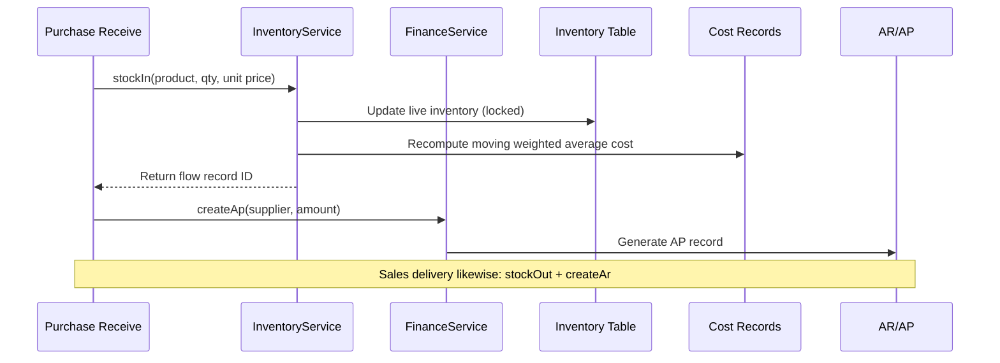

---

## 16. Inventory Costing Data Flow

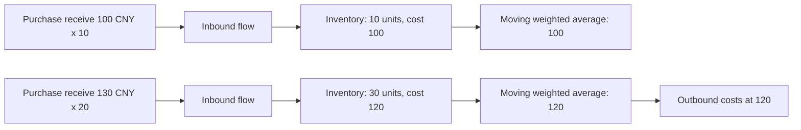

---

## 17. Approval Workflow Data Flow

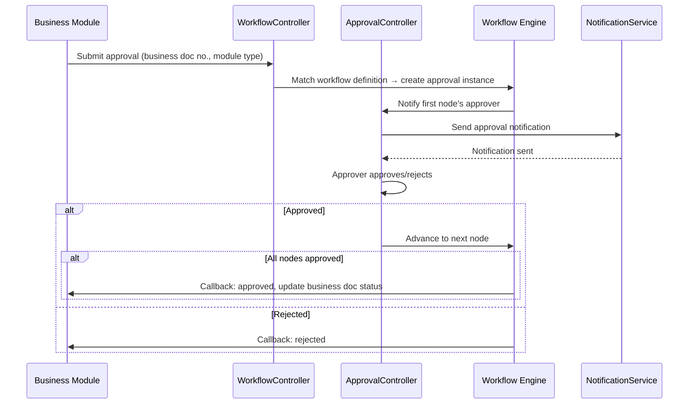

---

## 18. Message Notification Data Flow

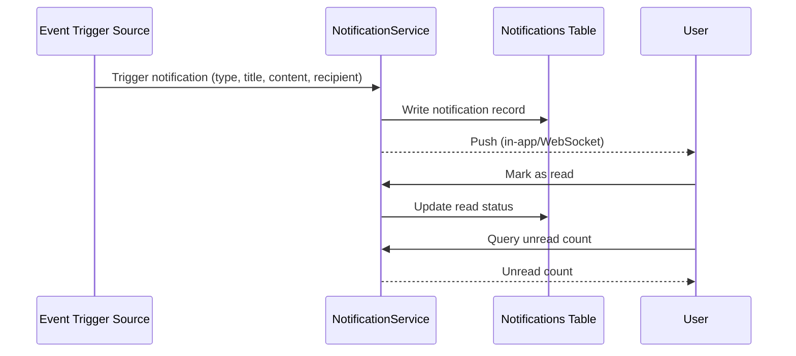

---

## 19. MRP Material Requirements Planning Data Flow

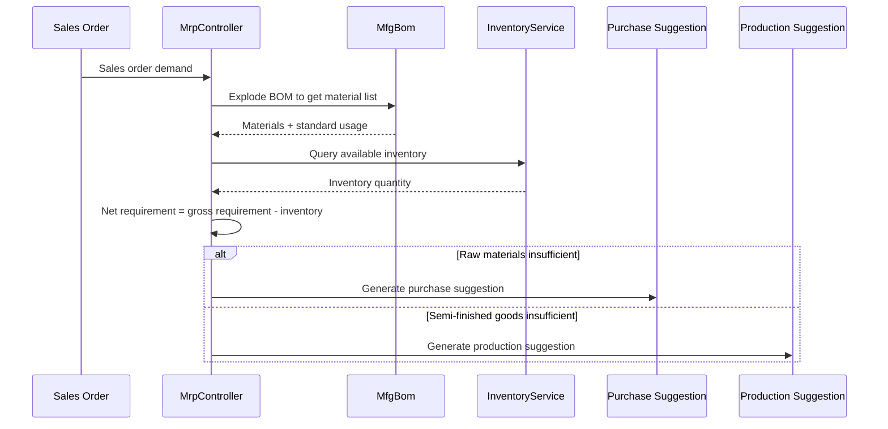

---

## 20. ERP Module Controller-Service-Model Mapping Table

> Service layer notes: the `Core Service` column marks business services already extracted for the module;
> modules marked **⚠ controller queries model directly, known tech debt** still have controllers calling
> model query/write methods directly (`XxxModel::find/where/save` etc.) without an extracted service layer;
> this is known tech debt, to be gradually converged under the P2-F2 lightweight service-layer extraction
> pattern (`app/service/AbstractCrudService` generic CRUD base class + module Service).

| Module | Controllers (Directory) | Core Service | Main Models | Tables |
|------|-------------------|-------------|-----------|------|
| System Management | admin/controller/ (16) | - ⚠ controller queries model directly, known tech debt | AdminUser, AdminRole, AdminPermission | 7 |
| Product Management | controller/product/ (8) | ProductService | Product, Category, Brand, Warehouse, Supplier, Customer | 12 |
| Purchase Management | controller/purchase/ (8) | InventoryService, FinanceService ⚠ CRUD still queries directly, known tech debt | PurchaseOrder, PurchaseReceive | 14 |
| Sales Management | controller/sales/ (5) | InventoryService, FinanceService ⚠ CRUD still queries directly, known tech debt | SalesOrder, SalesDelivery | 9 |
| Inventory Management | controller/inventory/ (6) | InventoryService ⚠ CRUD still queries directly, known tech debt | Inventory, InventoryFlow, CostRecord | 11 |
| Finance Management | controller/finance/ (28) | FinanceService ⚠ CRUD still queries directly, known tech debt | FinanceArAp, FinanceVoucher, FinanceReceipt, FinancePayment, FinanceGeneralLedger, FinanceBalanceSheet, FinanceAsset, FinanceBudget, FinanceCostCenter | 38 |
| CRM | controller/crm/ (10) | CrmService | CrmOpportunity, CrmFollowRecord, CrmContract, CrmPoolRule, CrmQuotation, CrmCampaign, CrmTicket, CrmAnalyticsReport | 16 |
| Approval Workflow | controller/workflow/ (3) | - ⚠ controller queries model directly, known tech debt | ApprovalWorkflow, ApprovalInstance, ApprovalNode, ApprovalRecord | 4 |
| Message Notifications | controller/notification/ (2) | NotificationService ⚠ CRUD still queries directly, known tech debt | Notification, NotificationSetting, NotificationTemplate | 4 |
| Project Management | controller/project/ (4) | - ⚠ controller queries model directly, known tech debt | Project, ProjectTask, ProjectTimesheet, ProjectMember, ProjectGantt | 6 |
| Human Resources | controller/hr/ (9) | HrService | HrDepartment, HrEmployee, HrPosition, HrAttendance, HrLeave, HrSalary | 21 |
| Manufacturing | controller/manufacturing/ (13) | ManufacturingService | MfgBom, MfgProductionOrder, MfgRouting, MfgWorkstation, MfgMrpPlan | 21 |
| Custom Reports | controller/report/ (2) | - ⚠ controller queries model directly, known tech debt | ReportTemplate, ReportDataset, ReportField, ReportFilter, ReportSchedule | 5 |
| EAM Equipment Management | controller/eam/ (5) | - ⚠ controller queries model directly, known tech debt | EamEquipment, EamMaintenancePlan, EamRepairOrder, EamSparePart, EamInspectionTask, EamInspectionResult | 6 |
| DMS Document Management | controller/dms/ (2) | - ⚠ controller queries model directly, known tech debt | DmsCategory, DmsDocument, DmsDocumentVersion | 3 |
| BI Dashboards | controller/bi/ (3) | - ⚠ controller queries model directly, known tech debt | BiDashboard, BiWidget | 2 |

> This table is an early module mapping (system management + 15 business domains); the 8 domains added later — oms / wms / tms / quality / open / platform / print / retail — are not listed;
> the full list is in the `docs/CLAUDE.md` project structure tree (`app/controller/` has 23 module directories / 139 controllers in total, including the top-level Install and Index).
>
> `Tables` caliber (measured 2026-09-15): take the 227 tables in `database/install.sql` and attribute each to exactly one module by table-name prefix — system management `admin_*`+`system_config`+`operation_log`;
> product management `product*`/`category`/`brand`/`warehouse`/`location`/`supplier`/`customer*`; purchase management `purchase_*`+`supplier_assessment`; inventory management `inventory*`/`transfer*`/`check_*`/`cost_record`;
> the remaining modules use their same-named table prefixes (`sales_*`→sales, `finance_*`→finance, `crm_*`→CRM, `approval_*`→approval, `notification*`→notification, `project*`→project, `hr_*`→HR, `mfg_*`→manufacturing, `report_*`→reports, `eam_*`→EAM, `dms_*`→DMS, `bi_*`→BI).
> One table is attributed to only one column; the domains added later plus shared tables total 48 tables (`oms_`/`wms_`/`tms_`/`quality_`/`openapi_`/`webhook_`/`member_`/`print_template`/`company`/`tenant`/`channel`/`custom_field_definition`/`tax_*`) and are not counted in any row of this table.
> Recompute: ``grep -o 'CREATE TABLE IF NOT EXISTS `erp_[a-z_]*`' database/install.sql | sed 's/.*`erp_\([a-z_]*\)`/\1/' | cut -d_ -f1 | sort | uniq -c | sort -rn``

### 20.1 P2-F2 Lightweight Service-Layer Extraction Record (crm/hr/manufacturing/product extraction completed)

| Module | Direct Controller Queries Before Extraction | After Extraction | New Service | Extracted Content |
|------|----------------------|--------|--------------|----------|
| CRM | 57 | 0 | `app/service/crm/CrmService.php` | Generic CRUD + contract status transitions, quotation-to-contract conversion, public pool claim/release, ticket assignment/resolve/reply, line-item cascade cleanup, analytics report data assembly |
| Human Resources | 38 | 0 | `app/service/hr/HrService.php` | Generic CRUD + clock-in late/early-leave determination, leave approval (auto-generating leave attendance records), salary uniqueness/net-pay calculation/disbursement/batch generation |
| Manufacturing | 33 | 0 | `app/service/manufacturing/ManufacturingService.php` | Generic CRUD + work order start/complete transitions, BOM version copy/activation mutual exclusion, MRP line-item generation |
| Product Management | 29 | 0 | `app/service/product/ProductService.php` | Generic CRUD + transactional product creation (SKU/prices), field-wise original-value-preserving updates, detail relational loading |

Extraction pattern: `app/service/AbstractCrudService.php` provides the generic CRUD methods
`list/all/find/create/update/delete/deleteWhere` and the pure-logic helpers `normalizePageParams/canTransition`;
module Services extend it and settle module-specific business logic.
Controllers inject services via `Container::get(XxxService::class)` (with class_exists fallback), keeping routes,
parameters, and response structures completely unchanged; HTTP concerns such as hashid encode/decode,
password second confirmation, and response wrapping remain in the controllers.
New Services are registered in `config/dependence.php` (a dead config not loaded by addDefinitions; the runtime
container instantiates via the class_exists fallback, so all Services keep no-arg constructors).

Modules not yet extracted (Project Management 18 calls, Custom Reports 18, Purchase 24, Sales 24,
System Management 42, etc.) are marked in the table as "controller queries model directly, known tech debt"
and will be extracted under the same pattern in later iterations.

> ⚠ Re-measurement (2026-09-15): the figures in this section are as measured at **extraction time** (1051d83 / 2026-08-16) — re-checking that commit with the same caliber gives exactly
> CRM 57→0, HR 36→0 (this section records 38), Manufacturing 33→0, Product 29→0; the not-yet-extracted modules at that time were Project 18 / Reports 18 / Purchase 25 / Sales 25 / System Management 44 (recorded as 18/18/24/24/42, the difference of 1–2 being a counting-caliber difference).
> Pages added after extraction were not wired into the Services, so direct queries have crept back: CRM 6 places (relation-name backfill via `pluck`), Manufacturing 39 places (CostEntry/MaterialIssue/WorkReport/Subcontract receiving-issuing and the like — 6 later controllers in total),
> Product Management 2 places (LocationController warehouse locations), HR still 0; the not-yet-extracted modules now stand at Project 24 / Reports 20 / Purchase 58 / Sales 35 / System Management 67.
> Re-measurement caliber and command (`Model::class` not counted): ``grep -rhoE '\b[A-Z][A-Za-z]*::(find|where|whereIn|query|first|all|count|paginate|insert|update|delete|save|create|pluck|exists)\(' app/controller/<module>/ | grep -vE '\b(Service|Container|Validator|Cache|Log)::' | wc -l``

---

## OMS/WMS/TMS Extension Modules (2026-08)

### OMS (Order Management System) — 8 tables
- **Order extension** (`erp_oms_order`): multi-channel aggregation/fulfillment status/payment status/priority
- **Order address** (`erp_oms_order_address`): shipping/billing addresses (multi-country formats)
- **Fulfillment records** (`erp_oms_fulfillment`+`_item`): allocated/picked/packed/shipped quantity tracking
- **RMA** (`erp_oms_rma`+`_item`): return/exchange full lifecycle
- **Inventory reservation** (`erp_oms_inventory_reservation`): ATP = physical - reserved
- **Channels** (`erp_channel`): direct/marketplace/edi/pos

### WMS (Warehouse Management System) — 12 tables
- **Zones & locations** (`erp_wms_zone`, `erp_wms_location`): zone→aisle→rack→level→bin
- **Inbound** (`erp_wms_asn`+`_item`, `erp_wms_receiving`, `erp_wms_putaway_task`+`_item`)
- **Outbound** (`erp_wms_wave`+`wave_order`, `erp_wms_pick_task`+`_item`, `erp_wms_pack_task`)

### TMS (Transport Management System) — 7 tables
- **Carriers** (`erp_tms_carrier`+`carrier_service`, `erp_tms_freight_rate`)
- **Shipments** (`erp_tms_shipment`+`_package`, `erp_tms_tracking_event`)
- **Invoices** (`erp_tms_freight_invoice`)

### Data Flow
```
OMS: Channel Order → Inventory Reservation (ATP) → Create Fulfillment → WMS
WMS: Wave → Pick → Pack → TMS Shipment
TMS: Rate Shop → Ship → Confirm (stockOut + AR) → Tracking → Delivery
WMS Inbound: ASN → Receive → Putaway (stockIn + AP)
RMA: Request → Approve → Return → Receive (stockIn) → Refund
```

---

## 21. Ecosystem Roadmap (2026-08)

> Detailed design spec: `docs/superpowers/specs/2026-08-04-erp-ecosystem-roadmap-design.md`

### 21.1 Baseline Assessment (at Roadmap Launch)

> P0~P3 have all been delivered; the current overall score is 89/100 (see docs/CLAUDE.md); the table below is the baseline snapshot before the roadmap launch.

| Dimension | Score | Key Gap |
|------|------|----------|
| Backend APIs | 85/100 | Most modules are CRUD skeletons, missing business calculation engines |
| Security | 95/100 | 7-layer defense in depth (L0–L12 panorama), production-ready |
| Frontend UI | 20/100 | **Biggest shortfall**: Flutter 12 pages cover ~20% of modules, Web admin panel missing |
| Ops ecosystem | 70/100 | Missing migration rollback, auto backup, observability |
| Business depth | 55/100 | Finance/HR/manufacturing core algorithms not implemented |
| **Overall** | **65/100** | |

### 21.2 Four-Phase Serial Roadmap

```
P0(3-4 weeks) → P1(4-6 weeks) → P2(1-2 weeks) → P3(2-3 weeks) = ~13 weeks total
```

| Phase | Name | Core Deliverables |
|------|------|----------|
| **P0** | Frontend ecosystem | Flutter Web full-module admin panel (14 modules 40+ pages), common component library, HarmonyOS alignment |
| **P1** | Business depth | Finance double-entry engine, payroll calculation engine, MRP engine, quality management module, real-time notifications (WebSocket) |
| **P2** | Ops reliability | Database migration rollback, auto backup enhancement, OpenTelemetry tracing, RabbitMQ queue driver |
| **P3** | Experience enhancement | BI drag-and-drop dashboards, equipment management (EAM), multi-tenant isolation, document management (DMS) |

### 21.3 Middleware Chain Evolution

```
Current:  Cors → SecurityFilter → RateLimit → TracingId → {route group}
After P1: Cors → SecurityFilter → RateLimit → WebSocketUpgrade → {route group}
After P2: Cors → SecurityFilter → RateLimit → TracingId → WebSocketUpgrade → {route group}
After P3: Cors → SecurityFilter → RateLimit → TracingId → TenantScope → WebSocketUpgrade → {route group}
```

### 21.4 P0 Target Architecture — Flutter Web Admin Panel

| Layer | Additions |
|------|----------|
| Layout layer | `AdminLayout` PC three-column layout (collapsible sidebar + top bar + content area) |
| Component layer | `DataTableWrapper`, `FormDialog`, `ConfirmDialog`, `StatCard`, `BreadcrumbNav`, `FileUploader` |
| Page layer | Expand from the existing 12 pages to full coverage of 14 modules 40+ pages |
| Service layer | Reuse existing `ApiService`, `AuthService`, `CaptchaService`, `ExportService` |

### 21.5 P1 Target Architecture — Business Calculation Engines

| Engine | Service Classes | Key Rules |
|------|--------|----------|
| Double-entry accounting | `DoubleEntryService`, `PeriodCloseService`, `AccountBalanceService` | Mandatory debit/credit balance validation, period-end P&L carry-over, multi-currency FX conversion |
| Payroll calculation | `SalaryEngineService`, `SocialInsuranceService`, `HousingFundService`, `TaxCalculatorService` | Social insurance base upper/lower limits, housing fund ratio, progressive individual income tax rates, bank payroll disbursement |
| MRP | `MrpEngineService`, `BomExplosionService`, `NetRequirementService` | Layer-by-layer BOM explosion with loss rates, low-level code (LLC), safety stock, lot-sizing rules |
| Quality | `QmsInspectionService` | IQC incoming/IPQC in-process/OQC outgoing three-document flow |
| Notifications | `WebSocketService`, `ChannelRouter` | Multi-channel in-app/email/WeCom/DingTalk |

### 21.6 Data Model Change Summary

| Phase | New Tables | Modules Involved |
|------|----------|----------|
| P0 | 0 | Pure frontend, no table changes |
| P1 | 14 | Finance(2) + HR(3) + Manufacturing(2) + Quality(5) + Notifications(2) |
| P3 | 7 | BI(2) + EAM(3) + DMS(2) |

---

## 22. Multi-Tenancy (Reserved Capability, Not Enabled)

> Copyright notice as in the file header: Copyright (c) 2026 erik <erik@erik.xyz> — https://erik.xyz

### 22.1 Positioning and Decision

Multi-tenancy is positioned in this project as a **reserved capability**, **not wired up or enabled** in this phase (documented downgrade). Consistent with the plan:
a "complete multi-tenant commercialization solution" such as SaaS billing and tenant self-service provisioning is out of scope for this project; this phase keeps only a minimal
code skeleton (middleware + model Trait) and provides enablement steps for later on-demand use.
Note: the "multi-tenant isolation" item in roadmap §21.2 P3 is accordingly adjusted to "reserved capability (documented downgrade)", keeping the skeleton without wiring it up.

Decision basis (2026-08 review):
- Existing deployments are almost entirely single-tenant; wiring it up would introduce unnecessary isolation complexity and regression risk;
- The current skeleton has technical flaws (see 22.4); "wired up equals isolated" does not hold, a design fix must come first;
- Isolation would require adding a column per business table across all 227 tables and enabling per model, a cost far exceeding "minimal wiring".

### 22.2 Current Facts (Code and Config Verification)

| Item | Current State |
|----|------|
| `app/middleware/TenantScope.php` | Exists, not registered; reads the tenant code from the `X-Tenant-Code` header and looks up `erp_tenant` to inject the context, passes through directly when the header is missing |
| `app/model/concerns/TenantScope.php` | Exists; used by 4 finance models (`FinanceLedger` / `FinanceBalanceSheet` / `FinanceCashFlow` / `FinanceProfit`, whose company family `tenantScopeByCompany()` returns true), filtering by `company_id`; because the middleware is not registered and the request context is never injected, the global scope does not take effect at present |
| `config/middleware.php` | Global chain: Cors → SecurityFilter → RateLimit → TracingId, no TenantScope |
| `config/route.php` /admin/v1 group | AdminAuth → AdminPermission → OperationLog, no TenantScope |
| JWT payload | Only `sub` / `username` / `token_type`, **no tenant_id claim** (`app/api/v1/controller/AuthController.php`) |
| Database | **No tenant_id column anywhere in the database** (nor in install.sql) |
| Models | 4 finance models use the `TenantScope` trait (company family, filtering `company_id`) — pilot isolation; when no tenant context is injected, no filtering is applied |

### 22.3 Enablement Steps (Reserved Reference, Not Executed This Phase)

1. Register the middleware: append `app\middleware\TenantScope::class` to the `middleware()` of the /admin/v1 group in `config/route.php` (place it after AdminAuth to ensure authentication).
2. Requesters carry `X-Tenant-Code` (tenant code string) in the request header.
3. Add a `tenant_id` column (BIGINT + index) to business tables requiring isolation and backfill existing data;
   dictionary/system tables (e.g. `erp_admin_user`, `erp_role`, `erp_permission`) are not isolated.
4. Add `use app\model\concerns\TenantScope;` in models requiring isolation for automatic filtering by the current tenant.
5. (Optional) To take the tenant from JWT instead of the header: extend the login issuance payload with a `tenant_id` claim and read from `$payload['tenant_id']` in the middleware.

### 22.4 Known Technical Limitations (Must Be Resolved Before Enablement)

- **Trust boundary (must be resolved before registration)**: the tenant context comes from the `X-Tenant-Code` request header, which is
  forgeable input; enabling the middleware before a binding between `erp_admin_user` and companies/tenants
  (administrator ownership determination) is established would open a privilege-escalation gap in the data plane
  (any authenticated administrator could claim any tenant and read its data).
- **The broken static pass-through chain (measured on PHP 8.3) has been superseded by the P2-4 B5 fix**: the `TenantScope` trait
  now goes through request-context injection (`request()->tenantId` / `companyId`), a path with no static state, so
  cross-request crosstalk within the long-running process is eliminated as a result; the trait's static facade is marked `@deprecated`
  and remains only as a test/CLI fallback.
- **Data-plane gap**: no tenant_id column anywhere in the database; a per-table migration is needed, and cross-tenant shared dictionary tables require an exemption mechanism.

### 22.5 Acceptance Criteria

This phase's acceptance = documentation consistent with code: neither `config/middleware.php` nor `config/route.php` contains a
TenantScope registration; the middleware comment marks it "implemented, not registered by default" and gives the registration point and the trust boundary,
the Trait comment marks the request-context injection chain and the regression line (it takes no part in filtering when there is no tenant context);
each item described in this section corresponds one-to-one with the current code state.
