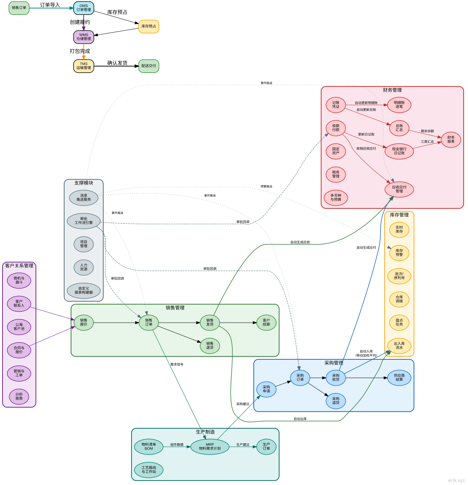

# Open ERP System (open-erp)

A full-stack ERP system built on webman v2 + Flutter.

<div align="center"></div>

<div align="center">🌐 [中文](../../../README.md) | English | [한국어](../ko/README.md) | [Русский](../ru/README.md) | [Deutsch](../de/README.md) | [Français](../fr/README.md) | [Español](../es/README.md) | [Português](../pt/README.md) | [हिन्दी](../hi/README.md) | [العربية](../ar/README.md) | [বাংলা](../bn/README.md) | [Bahasa Indonesia](../id/README.md) | [日本語](../ja/README.md)</div>

> [中文版](../../../README.md) | [版本对比](EDITIONS.md) | [架构设计图](ARCHITECTURE.md) | [系统架构图](#system-architecture-diagram) | [设计文档](DESIGN.md) | [安全架构](SECURITY.md) | [API Reference](API.md) | [功能手册](FUNCTIONS.md)

## Feature List

| Business Domain | Feature | Description |
|--------|------|------|
| 🔐 Authentication | Login/Register/Refresh token/Logout | Click captcha + JWT + blacklist |
| | Account lockout | Locked for 15 minutes after 5 failed attempts |
| | Concurrent session limit | Max 3 valid tokens per user |
| 📊 Dashboard | Business overview/Sales board/Inventory board/Finance board | 30-day sales trend/Top5 hot products/order status distribution/AR-AP aging + Redis cache 5 minutes |
| 👥 User Management | CRUD + batch delete/enable-disable | Soft delete + password re-confirmation |
| | Excel bulk import | Row-by-row validation + error report |
| 🔒 Roles & Permissions | Role CRUD + permission tree | RBAC method.path granular authorization |
| ⚙ System Config | Key-value CRUD | Group management |
| 📋 Operation Audit | Log query + source client detection | Auto-detects 8 platforms |
| 📁 File Management | Upload/Excel export/PDF export | Sensitive data auto-masked |
| 🛡 Security | 18 layers of defense in depth | XSS/SQL injection/path traversal/command injection/CSRF/rate limiting/CSP... |
| 🏥 Operations | Health check/metrics/API docs/security.txt | Prometheus + OpenAPI 3.0 |
| 📦 Product Management | Product master/SKU/multi-spec/multi-unit/category/brand/pricing strategy | Multi-level category tree + multi-unit conversion |
| | Warehouses & locations | Multi-warehouse, multi-location management |
| | Supplier/Customer master | Contacts/bank accounts/credit limits |
| 📥 Purchase Management | Requisition→Order→Receiving→Return→Settlement | Full purchase flow + approval |
| 📤 Sales Management | Quotation→Order→Delivery→Return→Settlement | Quotation to order + sales gross margin |
| 🏗 Inventory Management | Live inventory/batch/serial/transfer/count/alert | Moving weighted average costing |
| 💰 Finance Management | AR/AP/receipts & payments/journal/expense reimbursement/income statement/fixed assets/tax/multi-currency/budget/cost & profit centers | Auto-generated AR/AP + write-off + comprehensive financial management |
| 🤝 CRM | Customers/contacts/follow-up records/campaigns/service tickets/analytics reports/sales funnel/shared pool/quotation/contracts | Full customer lifecycle management |
| ✅ Approval Workflow | Workflow definition/submit approval/approve/reject/withdraw/my approvals | Multi-node approval process engine |
| 🔔 Notifications | Notification list/read marking/unread count/mark all read | Real-time message push and status tracking |
| 📐 Project Management | Projects/tasks/timesheets | Project progress tracking and resource management |
| 👤 Human Resources | Departments/employees/positions/attendance/leave/payroll | Comprehensive HR management |
| 🏭 Manufacturing | BOM/production orders/routings/workstations/MRP | Material requirements planning and production execution |
| 📈 Custom Reports | Report templates/datasets/fields/filters/execute/schedule | Visual report builder |
| 📋 Order Management (OMS) | Multi-channel orders/fulfillment orchestration/inventory reservation/allocation/cancellation/RMA returns | Full order lifecycle management |
| 🏗 Warehouse Management (WMS) | Zones/locations/ASN/receiving/putaway/waves/picking/packing/shipping | Complete warehouse operations flow |
| 🚚 Transportation Management (TMS) | Carriers/services/rates/shipments/tracking/freight invoices | Multi-carrier freight comparison + tracking |

## ERP Modules

Data flow between business modules:

- Purchase receiving → automatic stock-in (moving weighted average costing) → automatic AP generation
- Sales delivery → automatic stock-out → automatic AR generation
- Receipts/payments → write off AR/AP → update journals
- Voucher approval → auto-update general ledger (account summary) + subsidiary ledger (per-transaction records)
- Balance sheet → auto-summarized from general ledger closing balances
- Cash flow statement → auto-summarized from cash & bank journals (operating/investing/financing categories)
- Approval workflow → business documents submitted for approval → multi-node flow → approval result callback to business modules
- Notifications → triggered by approvals/alerts/system events → real-time push → user marks read
- MRP → based on sales orders + BOM → calculates material requirements → generates purchase/production suggestions
- OMS → multi-channel order import → inventory reservation (ATP) → create fulfillment → dispatch WMS picking/packing
- WMS → wave aggregation → picking tasks → picking confirmation → packing complete → triggers TMS shipment creation
- TMS → freight rate comparison → create shipment → confirm shipping (stockOut+AR) → tracking → proof of delivery
- WMS inbound → ASN advance notice → receiving → quality inspection → putaway confirmation (stockIn+AP) → inventory update
- RMA → return request → approval → return stock-in → refund

## Tech Stack

| Layer | Technology | Description |
|---|------|------|
| Backend framework | webman v2 (workerman) | Ultra-high-performance PHP resident-process framework |
| PHP version | 8.3+ | |
| Database | MySQL 8.0+ | Table prefix `erp_`, BIGINT non-auto-increment primary keys |
| Search engine | Elasticsearch | Synced and queried via `webman-scout` |
| Admin frontend | Flutter 3.x | Web is a PC admin console style (`apps/flutter/`) |
| Mobile | HarmonyOS ArkTS | HarmonyOS native client (`apps/harmonyos/`), supports phone/tablet/2in1 |

## Core Dependencies

| Package | Purpose |
|---|------|
| `erikwang2013/snowflake-php` | Snowflake algorithm for globally unique BIGINT primary keys |
| `erikwang2013/hashids` | API-layer ID encryption to hide real database IDs |
| `erikwang2013/jwt-webman` | JWT authentication token issuance and validation |
| `erikwang2013/encryption` | Sensitive data encryption/decryption at the transport layer |
| `erikwang2013/encryptable` | Automatic encryption/decryption of sensitive fields at the storage layer |
| `erikwang2013/webman-scout` | Elasticsearch data sync and full-text search |
| `erikwang2013/season` | Country flag data |
| `erikwang2013/poster-php` | Click captcha generation/validation + poster generation |
| `erikwang2013/security-php` | Security tool checks |
| `phpoffice/phpspreadsheet` | Excel export |
| `barryvdh/laravel-dompdf` | PDF export (based on Dompdf) |
| `hg/apidoc` | Automatic API documentation | Annotation-based interface docs, admin/client groups |

## Internationalization

Internationalization | Automatic detection via `Accept-Language` header | Chinese/English bilingual support

## Project Structure

```
open-erp/
├── app/
│   ├── admin/controller/       # 系统管理控制器 (14 个)
│   ├── api/v1/controller/      # 客户端 API（版本由 /api/v1 路径控制）
│   ├── controller/             # Business module controllers (136, 23 domains + admin 18)
│   │   ├── product/            # 商品/分类/品牌/仓库/库位/供应商/客户 (7 个)
│   │   ├── purchase/           # 采购申请/订单/收货/退货/结算 (5 个)
│   │   ├── sales/              # 销售报价/订单/发货/退货/结算 (5 个)
│   │   ├── inventory/          # 库存/流水/调拨/盘点/预警 (5 个)
│   │   ├── finance/            # 应收应付/凭证/收付款/日记账/总账/明细账/报表/资产/税务/多币种/预算/成本利润中心 (20 个)
│   │   ├── crm/                # 商机/跟进/漏斗/联系人/公海池/合同/报价/营销/工单/分析 (10 个)
│   │   ├── workflow/           # 工作流定义/审批提交/批准/拒绝/撤回 (2 个)
│   │   ├── notification/       # 通知列表/已读/未读计数 (1 个)
│   │   ├── project/            # 项目/任务/工时记录 (3 个)
│   │   ├── hr/                 # 部门/员工/职位/考勤/请假/薪资 (5 个)
│   │   ├── manufacturing/      # BOM/生产订单/工艺路线/工作站/MRP (5 个)
│   │   ├── report/             # 报表模板/数据集/执行/定时调度 (2 个)
│   │   ├── oms/                # OMS订单/履约/RMA/渠道 (4 个)
│   │   ├── wms/                # 库区/库位/ASN/收货/上架/波次/拣货/打包 (8 个)
│   │   └── tms/                # 承运商/服务/费率/运单/轨迹/运费发票 (6 个)
│   ├── service/                # 业务逻辑层
│   │   ├── inventory/          # 出入库 + 移动加权平均成本核算 + 库存预占/ATP
│   │   ├── finance/            # 应收应付自动生成 + 核销
│   │   ├── notification/       # 通知发送服务
│   │   ├── oms/                # 订单编排/库存分配/RMA生命周期
│   │   ├── wms/                # 入库流程(ASN→收货→上架) / 出库流程(波次→拣货→打包)
│   │   └── tms/                # 运单管理/运费比价/物流轨迹
│   ├── model/                  # 223 个 Eloquent 模型（多模块共用）
│   ├── middleware/             # 11 个中间件
│   ├── common/                 # Hashids/Snowflake/Encryption 服务
│   └── queue/                  # 队列任务
├── apps/
│   ├── flutter/                # Flutter 跨平台（Web PC + iOS/Android/macOS/Windows/Linux）
│   └── harmonyos/              # HarmonyOS 原生客户端
├── config/                     # 配置文件（含中文注释）
│   ├── plugin/hg/apidoc/        # API 文档配置
├── database/
│   ├── install.sql              # 完整安装SQL（226 + 种子数据）
│   ├── e2e-seed.sql             # E2E/CI 最小种子
│   └── backup/                 # 备份/恢复脚本
├── docs/                       # 架构、设计、安全、API 文档
├── tests/                      # PHPUnit 测试（20 个测试文件，137 个测试方法，805 条断言）
├── resource/
│   └── translations/           # 翻译文件 (zh_CN, en)
│       ├── zh_CN/              # 中文翻译 (127 键)
│       └── en/                 # English translations (127 keys)
├── public/                     # 公共入口
├── runtime/                    # 运行时文件
└── vendor/                     # Composer 依赖
```

## System Architecture Diagram

> Click the image to view the original SVG. The diagrams use English naming and fully illustrate the architecture design at each layer.

### System Topology Architecture


**Five-layer architecture**: Client layer → Gateway edge layer (Nginx reverse proxy) → Application layer (webman v2 + middleware chain + authentication & authorization + business logic + common services) → Data storage layer (MySQL + Redis + Elasticsearch) → Operations layer (CI/CD + Docker + Prometheus)

### Business Data Flow



**Seven business domains working together**: Purchase → Inventory → Sales → Finance form the core supply chain loop; customer relationship management drives sales; manufacturing MRP drives purchase and production plans based on sales orders + BOM; approval workflow, message notifications, project management, and human resources serve as supporting modules throughout the whole process.

### Functional Module Overview


**19 business domains, 226 data tables, 121 controllers**: Covering authentication & security, dashboard, system management, security protection, operations monitoring, product management, purchase, sales, inventory, finance (14 sub-modules), CRM (10 sub-modules), approval workflow, message notifications, project management, human resources, manufacturing (MRP), custom reports, order management (OMS), warehouse management (WMS), transportation management (TMS), quality management (QMS), equipment management (EAM), document management (DMS), BI dashboards.

### Request Lifecycle


**Full request path from client to database**: Client (Flutter/HarmonyOS) → Nginx SSL termination → language detection → CORS handling → security filter → rate limiting → API version validation → [Admin: JWT authentication → RBAC permission → operation log] → Controller → Service layer → Model layer → cache/database/search engine → JSON response. The diagram includes both cache hit and cache miss paths.

### Security Defense-in-Depth Architecture


**18 layers of defense in depth**: L0 physical network → L1 transport security → L2 HTTP security headers → L3 request validation → L4 input sanitization → L5 CSRF protection → L6 rate limiting → L7 authentication (JWT+Captcha+blacklist+session control) → L8 RBAC authorization → L9 data protection (transport encryption + storage encryption + ID obfuscation + data masking) → L10 audit monitoring → L11 compliance disclosure.

---

## Environment Requirements

- PHP >= 8.3
- Composer 2.x
- MySQL >= 8.0
- Flutter >= 3.41 (frontend development only)
- Elasticsearch >= 7.x (optional, required for search features)

## Quick Start

### 1. Install Dependencies

```bash
composer install
```

### 2. Configure Environment Variables

Copy and modify the environment variables (optional; if not configured, defaults from `config/*.php` are used):

```bash
cp .env.example .env
```

Key configuration items:

| Environment Variable | Description | Default |
|---------|------|--------|
| `JWT_SECRET` | JWT signing secret | `open-admin-jwt-secret-change-in-production` |
| `HASHIDS_SALT` | Hashids salt | `open-admin-hashids-salt-2026` |
| `ENCRYPTION_KEY` | API encryption key | 32-byte default |
| `SNOWFLAKE_DATACENTER_ID` | Datacenter ID (0-31) | `1` |
| `SNOWFLAKE_WORKER_ID` | Worker node ID (0-31) | `1` |
| `SCOUT_HOSTS` | ES address | `http://localhost:9200` |

**In production, be sure to replace all secrets with random strings.**

### 3. Initialize the Database

**Option 1: Web installation wizard (recommended)**

After starting the service, visit `http://localhost:8788/install` and follow the 4-step guided install: environment check → database config → admin account → one-click install.

**Option 2: Command-line import**

```bash
mysql -u root -p 数据库名 < database/install.sql
```

`install.sql` is merged from 29 migration files and contains all 226 table structures and seed data.

**Option 3: Docker environment**

```bash
```

### 4. Start the Service

```bash
php start.php start
```

Listens on `http://0.0.0.0:8788` by default.

### 5. Start the Frontend (Optional)

**Flutter admin console (Web):**

```bash
cd apps/flutter
flutter pub get
flutter run -d chrome    # Web (PC admin console style)
```

**HarmonyOS client (Mobile):**

Open the `apps/harmonyos/` directory with DevEco Studio, and run on a real device or emulator.

### 6. One-Click Deployment with Docker Compose (recommended for production)

The project provides a complete Docker orchestration with 5 services: Nginx, PHP (webman app), MySQL, Redis, Elasticsearch.

```bash
# 1. Configure Docker environment variables
cp .env.docker .env
# 2. Replace placeholder keys with random values (idempotent)
bash scripts/gen-env-keys.sh .env

# 3. Start all services
docker compose up -d

# 4. Initialize the database (run inside the app container)

# 5. Access
# http://localhost:8788  (webman)
# http://localhost:8080  (Nginx reverse proxy)
```

- `Dockerfile`: PHP 8.3 + OPcache + Composer, based on `php:8.3-cli`
- `docker-compose.yml`: 5-service orchestration, network isolation, data volume persistence
- `.env.docker`: environment variables for the Docker environment

## Usage

### 1. Login

On first use, visit the web installer `http://localhost:8788/install` to complete the installation and create an admin account. If already installed, open the console, enter your credentials and pass the click captcha to log in.

### 2. Feature navigation

After login, enter each business module from the sidebar: dashboard, products, purchasing, sales, inventory, finance, CRM, approval workflows, notifications, projects, HR, manufacturing, custom reports, OMS/WMS/TMS, BI dashboards and system management (users/roles/config/logs). The sidebar is fixed on desktop and collapses into a drawer on mobile.

### 3. Permissions and security

- Features and APIs are controlled by RBAC; menus and endpoints without permission are inaccessible (403)
- Sensitive operations such as deleting a user/role require re-entering the current password in the request body
- After logout the token is immediately blacklisted and cannot be reused

### 4. Multi-language

Switched automatically via the `Accept-Language` request header (zh-CN / en), defaulting to Chinese.

## Database Conventions

- **Table prefix**: `erp_`
- **Primary key**: all tables use `id BIGINT UNSIGNED NOT NULL`, **AUTO_INCREMENT is forbidden**
- **ID generation**: primary key IDs are generated at the application layer by `SnowflakeService::generate()`, globally unique across distributed nodes
- **Mandatory fields**: every table must include `id`, `created_at`, `updated_at`
- **Soft delete**: tables requiring soft delete add `deleted_at DATETIME DEFAULT NULL`
- **Sensitive fields**: phone numbers, emails, ID card numbers, etc. are automatically encrypted/decrypted via the `encryptable` plugin; database columns use `VARCHAR(500)` to store ciphertext

## API Conventions

### API Documentation

The project uses hg/apidoc to auto-generate interface documentation; visit `/apidoc` to view it.

- Admin endpoints: 25 module groups, with full request parameters and response structures
- Client endpoints (Service API): 3 groups — authentication/captcha/products
- All endpoints document the global request headers: JWT authentication, API version, internationalization

### Unified Response Format

```json
{
    "code": 0,
    "message": "success",
    "data": {}
}
```

### Business Error Codes

| Error Code | Meaning | Description |
|-------|------|------|
| `0` | Success | |
| `400` | Invalid request parameters | |
| `401` | Not logged in (invalid or expired token) | |
| `403` | No permission / security block | RBAC authorization failure / SecurityFilter attack detection |
| `404` | Resource not found | |
| `422` | Parameter validation failed | |
| `413` | Request body too large | SecurityFilter triggered, exceeds 10MB |
| `405` | Method not allowed | SecurityFilter triggered, only GET/POST/PUT/DELETE/OPTIONS/HEAD allowed |
| `415` | Unsupported media type | SecurityFilter triggered, Content-Type is not JSON |
| `429` | Too many requests | RateLimit triggered / account lockout (15 min after 5 failed logins) |
| `500` | Internal server error | |

### Internationalization

The `Accept-Language` request header switches language automatically (zh-CN → Chinese, en → English), Chinese is the default.

### ID Handling

- **IDs in requests/responses**: encrypted to strings with hashids, real database IDs are never exposed
- **Endpoint paths**: `GET /admin/user/{hashid}` — `{id}` in the path is a hashid string
- **Database storage**: BIGINT raw values, generated by snowflake

### API Versioning

API versions are placed in the URL path — `/api/v1/*`, `/admin/v1/*`, `/open/v1/*` — no version request headers are used.
- To add a version, just create the `app/api/{version}/controller/` directory and register the new version in the middleware

### Rate Limiting

Based on the Redis sliding window algorithm, default 60 requests/minute/IP/route. Sensitive endpoints are stricter:
- Login: 10 requests/minute
- Register: 5 requests/minute (disabled by default; enable with `REGISTRATION_ENABLED=1`)

Response headers include `X-RateLimit-Limit`, `X-RateLimit-Remaining`, `X-RateLimit-Reset`. Exceeding the limit returns 429 with `Retry-After`.

### Middleware Architecture

Global middleware applies to all requests and executes in order:

```
Locale（Accept-Language 自动检测，设置语言环境）
  → Cors（跨域预处理 + 响应头）
  → SecurityFilter（HTTP方法限制/请求体大小/Content-Type校验/XSS/SQL注入/路径遍历/命令注入/CSRF 攻击拦截）
  → RateLimit（Redis 滑动窗口限流 + 账号锁定：5次登录失败锁定15分钟）
  → ApiVersion（API 版本校验，/api 路由组）
  → AdminAuth（JWT 认证 + 黑名单，/admin 路由组）
  → AdminPermission（RBAC 鉴权，/admin 路由组）
  → OperationLog（POST/PUT/DELETE 自动记录，含来源端检测，/admin 路由组）
```

`/health`, `/api/docs`, and `/install` are public endpoints that only pass through `Locale → Cors → SecurityFilter → RateLimit`.

Security enhancements:
- **Account lockout**: after 5 consecutive failed logins, the account is locked for 15 minutes; login returns 429 during the lockout
- **Concurrent session limit**: max 3 valid tokens per user; the oldest token is blacklisted when exceeded
- **security.txt**: `GET /.well-known/security.txt` provides RFC 9116 standard security contact information
- **Nginx security config**: see `nginx-security.conf` for a complete reverse-proxy security hardening example

### Authentication

Login and registration must first pass the **click captcha**:

1. The client requests `POST /api/captcha/generate` to get the captcha image (base64 PNG) and the list of target texts
2. The user clicks the corresponding text positions in the image in order, collecting click coordinates `[{x, y}, ...]`
3. Submit `captcha_key` and `clicks` together at login; the server validates the captcha first, then the credentials

```http
POST /api/auth/login
Content-Type: application/json

{
  "username": "admin",
  "password": "******",
  "captcha_key": "abc123...",
  "clicks": [{"x": 120, "y": 85}, {"x": 210, "y": 140}, {"x": 95, "y": 170}]
}
```

Subsequent admin endpoints require JWT authentication:

```http
Authorization: Bearer <token>
```

After successful login, an access_token is returned, valid for 2 hours; a refresh_token is also returned, valid for 14 days.

On logout the token is added to the Redis blacklist and cannot be reused while valid. POST /admin/profile/logout

### Sensitive-Operation Re-confirmation

Sensitive operations such as deleting users, roles, and permissions require passing the current logged-in user's `password` in the request body for identity re-confirmation:

```http
DELETE /admin/user/{id}
Content-Type: application/json
Authorization: Bearer <token>

{ "password": "******" }
```

## API List

The complete endpoint list (public endpoints / admin endpoints / business endpoints / client endpoints) has been moved to a standalone document:

→ [API Reference](API.md)

## Frontend Notes

### Flutter Admin Console (PC Style)

- **Layout**: sidebar (collapsible 64px/240px) + top bar + content area, responsive with three breakpoints (mobile/tablet/desktop)
- **Pages**: login, dashboard, user management, role permissions, system config, operation logs, profile
- **State management**: GetX (`ApiService` singleton + `AuthService` token persistence)
- **Dashboard**: stat cards, trend line charts (fl_chart), pie chart, recent operation logs
- **Export**: Excel/PDF export; PDF contains non-removable copyright information
- **Batch operations**: multi-select batch delete, batch enable/disable
- **Theme**: Material 3 light/dark dual themes

### HarmonyOS Mobile

- **Pages**: login, dashboard, user list/detail, profile
- **Authentication**: JWT Bearer + 401 automatic seamless token refresh; on refresh failure, auto-redirect to the login page
- **Storage**: tokens managed via AppStorage

## Development Conventions

- Global functions/classes are referenced without a leading `\`, always imported via `use`
- All PHP files must contain the copyright notice at the top
- All config files must contain Chinese comments explaining each setting
- Database primary keys must be generated by snowflake at the application layer; auto-increment is forbidden
- All IDs in API-layer parameters and responses must be encrypted/decrypted via hashids
- The AdminPermission middleware caches user permissions in Redis (TTL=60s), eliminating the N+1 query bottleneck

## Deployment

### Docker Compose (recommended)

The project root provides `docker-compose.yml`, orchestrating 5 services:

| Service | Image | Port |
|------|------|------|
| `nginx` | nginx:alpine | 80, 443 |
| `app` | built from local `Dockerfile` | 8788 |
| `mysql` | mysql:8.0 | 3306 |
| `redis` | redis:7-alpine | 6379 |
| `elasticsearch` | elasticsearch:8.x | 9200 |

The PHP image is built from the `Dockerfile`, base image `php:8.3-cli`, with OPcache enabled.

```bash
cp .env.docker .env
# Replace placeholder keys with random values (idempotent)
bash scripts/gen-env-keys.sh .env
docker compose up -d
```

### CI/CD

GitHub Actions continuous integration pipeline: `.github/workflows/ci.yml`

- PHP syntax check (`php -l`)
- PHPUnit unit tests
- Flutter static analysis (`flutter analyze`, included in CI and enabled — see the flutter job in `.github/workflows/ci.yml`)

### Database Backup

`database/backup/` directory:

- `backup.sh` — mysqldump + gzip backup, auto-cleans backups older than 30 days
- `restore.sh` — interactive restore, lists available backups to choose from

### Nginx Security Configuration

For production deployments, configure reverse-proxy security hardening by following `nginx-security.conf`.

## Open Source Is Hard Work — Your Support Is Welcome

| WeChat Pay | Alipay |
|:---:|:---:|
|  |  |

### Global Bank Transfer (银行汇款 / Global Bank Transfer)

**Recipient Information**

- Recipient Name: WANG KEXUN
- Account Number: 881015918251

**Receiving Bank**

- ZA Bank SWIFT Code: AABLHKHHXXX
- Bank Name: ZA Bank Limited
- Bank Code: 387
- Bank Address: Core F, Cyberport 3, 100 Cyberport Road, Hong Kong

**Correspondent Bank for Cross-Border Remittance (if required)**

> This is the correspondent (intermediary) bank information, not the receiving bank. Check with your remitting bank whether it must be provided.

- For HKD, CNY, and USD remittances: Citibank N.A. Hong Kong — SWIFT `CITIHKHXXXX`, bank code 006, branch Hong Kong Branch, branch code 391, Citibank Tower, Citibank Plaza, 3 Garden Road, Central, Hong Kong
- For other currencies: THE BANK OF NEW YORK MELLON — SWIFT `IRVTUS3NXXX`, 240 GREENWICH STREET, NEW YORK, United States

### Crypto Donation

If this project helps you, scan the QR code to donate, thank you!

| <br>**BNB Smart Chain (BEP20)**<br>`0x355d429f97511897ccb4e271ec888205f9ab6629` | <br>**Tron (TRC20)**<br>`TEdDHWLajt1XvqtPDWmQctdrJaC3pzZZzz` |
| <br>**Ethereum (ERC20)**<br>`0x355d429f97511897ccb4e271ec888205f9ab6629` | <br>**Aptos**<br>`0x836e3780edfc3f7b2372b39e2a1a3a5d7adfaccd96c726f21cfde1b50dd68030` |
| <br>**Plasma**<br>`0x355d429f97511897ccb4e271ec888205f9ab6629` | <br>**Polygon POS**<br>`0x355d429f97511897ccb4e271ec888205f9ab6629` |
| <br>**Solana**<br>`2hfhboHdmdrYsY25XfQSsEWxq5ip4EQsR7f4AzSRMUyr` | <br>**The Open Network (TON)**<br>`UQB9kFQohzmXUir9QSSZq01iwl9aQZIDdBpNmDklljRtCoGK` |
| <br>**Arbitrum One**<br>`0x355d429f97511897ccb4e271ec888205f9ab6629` | <br>**AVAX C-Chain**<br>`0x355d429f97511897ccb4e271ec888205f9ab6629` |

---

## License

MIT

Copyright (c) 2026 erik <erik@erik.xyz> — https://erik.xyz
