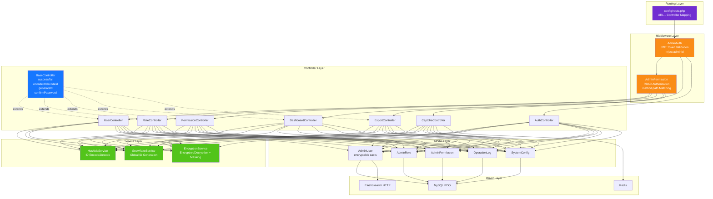

# Backend Layered Architecture

```mermaid
flowchart TD
    subgraph route["Routing Layer"]
        r1["config/route.php<br/>URL→Controller Mapping"]
    end

    subgraph middleware["Middleware Layer"]
        m1["AdminAuth<br/>JWT Token Validation<br/>Inject adminId"]
        m2["AdminPermission<br/>RBAC Authorization<br/>method.path Matching"]
    end

    subgraph controller["Controller Layer"]
        base["BaseController<br/>success/fail<br/>encodeId/decodeId<br/>generateId<br/>confirmPassword"]
        user["UserController"]
        role["RoleController"]
        perm["PermissionController"]
        dash["DashboardController"]
        export["ExportController"]
        captcha["CaptchaController"]
        auth["AuthController"]
    end

    subgraph service["Service Layer"]
        s1["HashidsService<br/>ID Encode/Decode"]
        s2["SnowflakeService<br/>Global ID Generation"]
        s3["EncryptionService<br/>Encryption/Decryption + Masking"]
    end

    subgraph model["Model Layer"]
        md1["AdminUser<br/>encryptable casts"]
        md2["AdminRole"]
        md3["AdminPermission"]
        md4["OperationLog"]
        md5["SystemConfig"]
    end

    subgraph driver["Driver Layer"]
        d1["MySQL PDO"]
        d2["Elasticsearch HTTP"]
        d3["Redis"]
    end

    r1 --> m1 --> m2
    m2 --> user & role & perm & dash & export
    m1 --> captcha & auth
    base -.->|extends| user & role & perm & dash & export
    user & role & perm & dash & export & captcha & auth --> s1 & s2 & s3
    user & role & perm & dash & export & captcha & auth --> md1 & md2 & md3 & md4 & md5
    md1 & md2 & md3 & md4 & md5 --> d1
    md1 --> d2
    captcha --> d3

    style r1 fill:#722ED1,color:#fff
    style m1 fill:#FA8C16,color:#fff
    style m2 fill:#FA8C16,color:#fff
    style base fill:#1677FF,color:#fff
    style s1 fill:#52C41A,color:#fff
    style s2 fill:#52C41A,color:#fff
    style s3 fill:#52C41A,color:#fff
```
