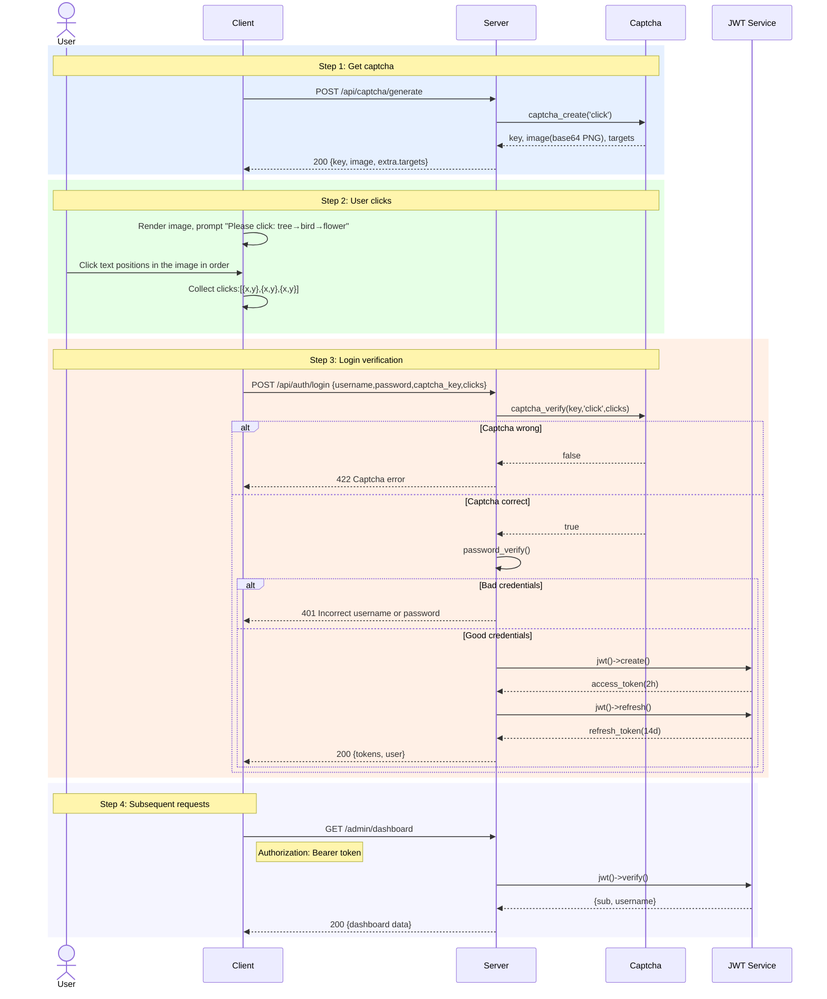

# Authentication & Captcha Flow

```mermaid
sequenceDiagram
    actor U as User
    participant CL as Client
    participant SV as Server
    participant CAP as Captcha
    participant JWT as JWT Service

    rect rgb(230, 240, 255)
    Note over U,CAP: Step 1: Get captcha
    CL->>SV: POST /api/captcha/generate
    SV->>CAP: captcha_create('click')
    CAP-->>SV: key, image(base64 PNG), targets
    SV-->>CL: 200 {key, image, extra.targets}
    end

    rect rgb(230, 255, 230)
    Note over U,CAP: Step 2: User clicks
    CL->>CL: Render image, prompt "Please click: tree→bird→flower"
    U->>CL: Click text positions in the image in order
    CL->>CL: Collect clicks:[{x,y},{x,y},{x,y}]
    end

    rect rgb(255, 240, 230)
    Note over U,CAP: Step 3: Login verification
    CL->>SV: POST /api/auth/login {username,password,captcha_key,clicks}
    SV->>CAP: captcha_verify(key,'click',clicks)

    alt Captcha wrong
        CAP-->>SV: false
        SV-->>CL: 422 Captcha error
    else Captcha correct
        CAP-->>SV: true
        SV->>SV: password_verify()
        alt Bad credentials
            SV-->>CL: 401 Incorrect username or password
        else Good credentials
            SV->>JWT: jwt()->create()
            JWT-->>SV: access_token(2h)
            SV->>JWT: jwt()->refresh()
            JWT-->>SV: refresh_token(14d)
            SV-->>CL: 200 {tokens, user}
        end
    end
    end

    rect rgb(245, 245, 255)
    Note over U,CL: Step 4: Subsequent requests
    CL->>SV: GET /admin/dashboard
    Note right of CL: Authorization: Bearer token
    SV->>JWT: jwt()->verify()
    JWT-->>SV: {sub, username}
    SV-->>CL: 200 {dashboard data}
    end
```
