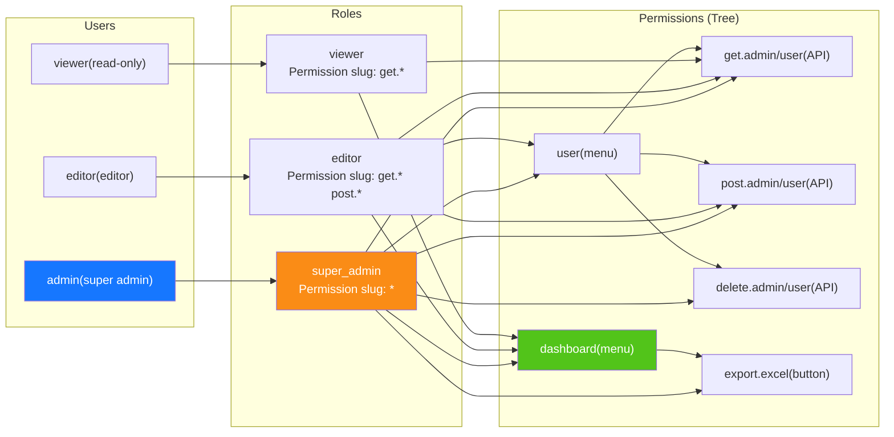
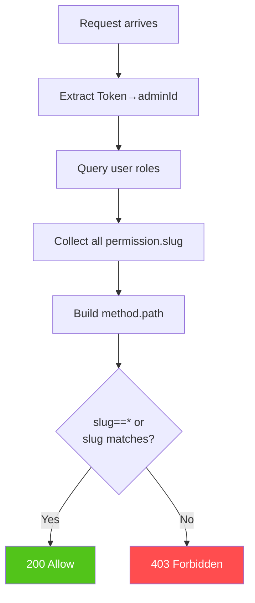
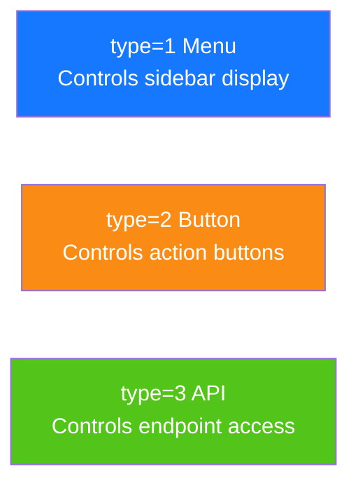

# RBAC Permission Model

## User-Role-Permission Relationship

```mermaid
flowchart LR
    subgraph users["Users"]
        u1["admin(super admin)"]
        u2["editor(editor)"]
        u3["viewer(read-only)"]
    end

    subgraph roles["Roles"]
        r1["super_admin<br/>Permission slug: *"]
        r2["editor<br/>Permission slug: get.* post.*"]
        r3["viewer<br/>Permission slug: get.*"]
    end

    subgraph permissions["Permissions (Tree)"]
        p1["dashboard(menu)"]
        p2["user(menu)"]
        p3["get.admin/user(API)"]
        p4["post.admin/user(API)"]
        p5["delete.admin/user(API)"]
        p6["export.excel(button)"]
    end

    u1 --> r1
    u2 --> r2
    u3 --> r3
    r1 --> p1 & p2 & p3 & p4 & p5 & p6
    r2 --> p1 & p2 & p3 & p4
    r3 --> p1 & p3
    p2 --> p3 & p4 & p5
    p1 --> p6

    style u1 fill:#1677FF,color:#fff
    style r1 fill:#FA8C16,color:#fff
    style p1 fill:#52C41A,color:#fff
```

## Permission Decision Flow

```mermaid
flowchart TD
    start["Request arrives"] --> extract["Extract Token→adminId"]
    extract --> findRoles["Query user roles"]
    findRoles --> collectSlug["Collect all permission.slug"]
    collectSlug --> buildKey["Build method.path"]
    buildKey --> check{"slug==* or<br/>slug matches?"}
    check -->|"Yes"| allow["200 Allow"]
    check -->|"No"| deny["403 Forbidden"]

    style allow fill:#52C41A,color:#fff
    style deny fill:#FF4D4F,color:#fff
```

## Permission Types

```mermaid
flowchart LR
    t1["type=1 Menu<br/>Controls sidebar display"]
    t2["type=2 Button<br/>Controls action buttons"]
    t3["type=3 API<br/>Controls endpoint access"]

    style t1 fill:#1677FF,color:#fff
    style t2 fill:#FA8C16,color:#fff
    style t3 fill:#52C41A,color:#fff
```
