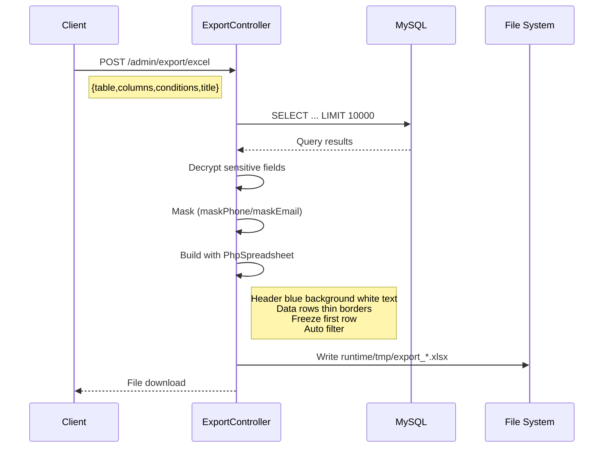
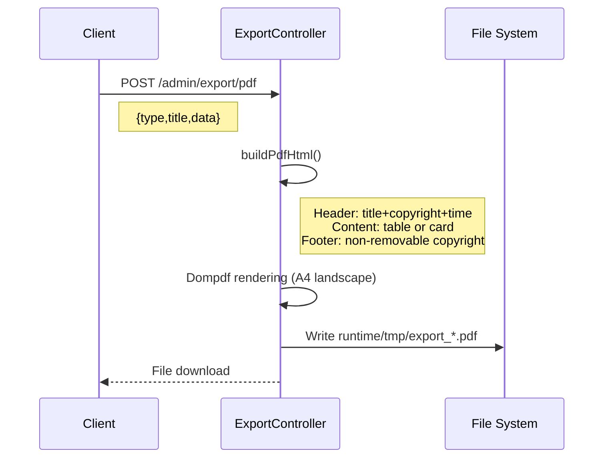

# Export Business Flow

## Excel Export

```mermaid
sequenceDiagram
    participant C as Client
    participant CTL as ExportController
    participant DB as MySQL
    participant FS as File System

    C->>CTL: POST /admin/export/excel
    Note right of C: {table,columns,conditions,title}
    CTL->>DB: SELECT ... LIMIT 10000
    DB-->>CTL: Query results
    CTL->>CTL: Decrypt sensitive fields
    CTL->>CTL: Mask (maskPhone/maskEmail)
    CTL->>CTL: Build with PhpSpreadsheet
    Note right of CTL: Header blue background white text<br/>Data rows thin borders<br/>Freeze first row<br/>Auto filter
    CTL->>FS: Write runtime/tmp/export_*.xlsx
    CTL-->>C: File download
```

## PDF Export

```mermaid
sequenceDiagram
    participant C as Client
    participant CTL as ExportController
    participant FS as File System

    C->>CTL: POST /admin/export/pdf
    Note right of C: {type,title,data}
    CTL->>CTL: buildPdfHtml()
    Note right of CTL: Header: title+copyright+time<br/>Content: table or card<br/>Footer: non-removable copyright
    CTL->>CTL: Dompdf rendering (A4 landscape)
    CTL->>FS: Write runtime/tmp/export_*.pdf
    CTL-->>C: File download
```
