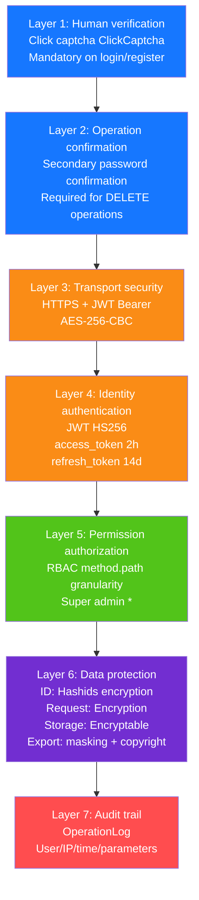

# Defense in Depth

```mermaid
flowchart TB
    l1["Layer 1: Human verification<br/>Click captcha ClickCaptcha<br/>Mandatory on login/register"]
    l2["Layer 2: Operation confirmation<br/>Secondary password confirmation<br/>Required for DELETE operations"]
    l3["Layer 3: Transport security<br/>HTTPS + JWT Bearer<br/>AES-256-CBC"]
    l4["Layer 4: Identity authentication<br/>JWT HS256<br/>access_token 2h<br/>refresh_token 14d"]
    l5["Layer 5: Permission authorization<br/>RBAC method.path granularity<br/>Super admin *"]
    l6["Layer 6: Data protection<br/>ID: Hashids encryption<br/>Request: Encryption<br/>Storage: Encryptable<br/>Export: masking + copyright"]
    l7["Layer 7: Audit trail<br/>OperationLog<br/>User/IP/time/parameters"]

    l1 --> l2 --> l3 --> l4 --> l5 --> l6 --> l7

    style l1 fill:#1677FF,color:#fff
    style l2 fill:#1677FF,color:#fff
    style l3 fill:#FA8C16,color:#fff
    style l4 fill:#FA8C16,color:#fff
    style l5 fill:#52C41A,color:#fff
    style l6 fill:#722ED1,color:#fff
    style l7 fill:#FF4D4F,color:#fff
```
