# Diagramas de arquitectura y flujos de negocio

> Copyright (c) 2026 erik <erik@erik.xyz> — https://erik.xyz

> Los siguientes diagramas Mermaid se renderizan automáticamente en GitHub / GitLab / VS Code. En otros entornos, use el [Mermaid Live Editor](https://mermaid.live/).

---

## 1. Arquitectura topológica del sistema

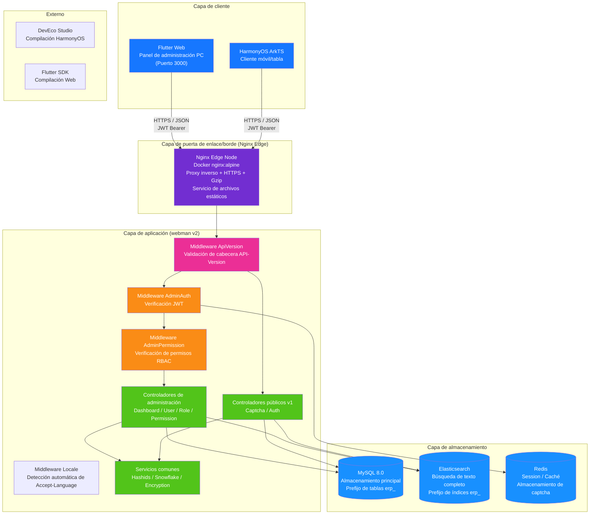

---

## 2. Arquitectura por capas del backend

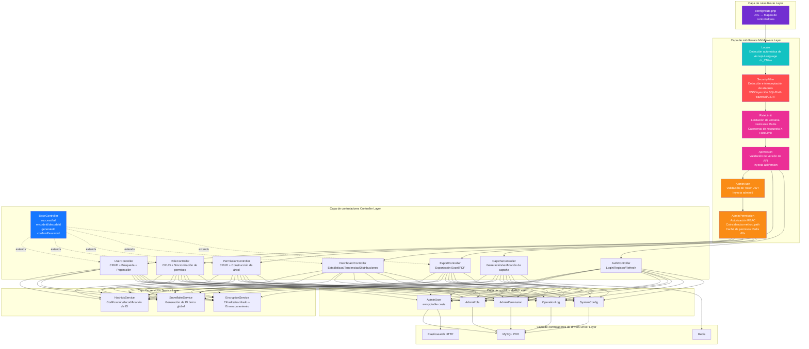

### Extensión de la capa de negocio ERP

A medida que el sistema evoluciona de un panel de administración puro a un sistema ERP completo, la capa de controladores y la capa de servicios incorporan los siguientes módulos de negocio:

| Capa | Directorio | Descripción |
|------|------|------|
| Controladores de negocio | `app/controller/{product,purchase,sales,inventory,finance,crm,workflow,notification,project,hr,manufacturing,report}/` | 70, divididos por módulo, manejan solicitudes de negocio |
| Servicios de negocio | `app/service/{inventory,finance,notification}/` | Entradas/salidas de inventario + cálculo de costos, cuentas por cobrar/pagar + liquidación, envío de notificaciones |

---

## 3. Ciclo de vida de una solicitud

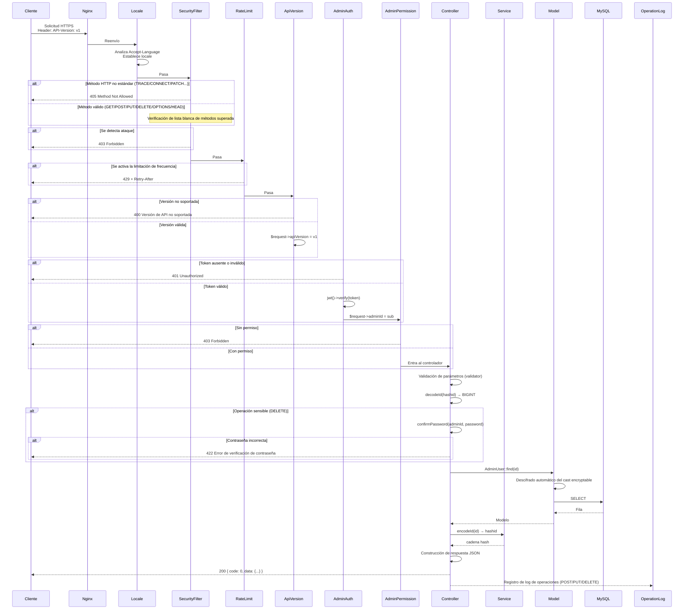

---

## 4. Flujo de autenticación y captcha

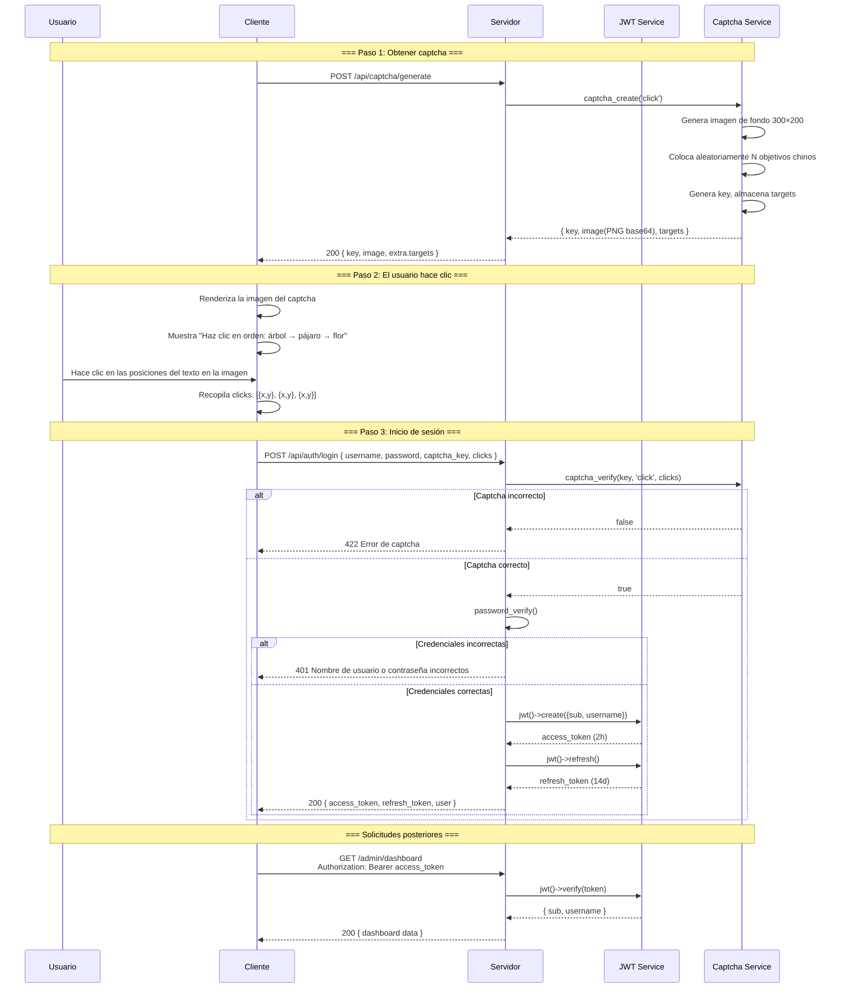

---

## 5. Modelo de permisos RBAC

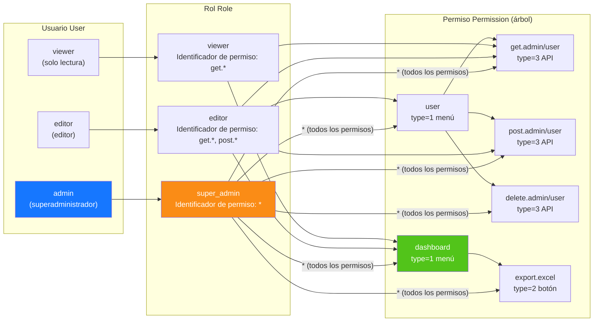

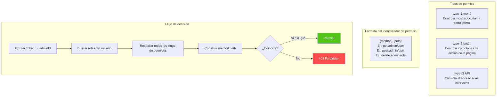

---

## 6. Ciclo de vida completo del ID

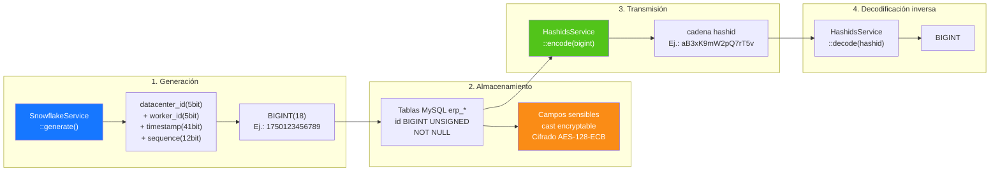

---

## 7. Capas de cifrado de datos

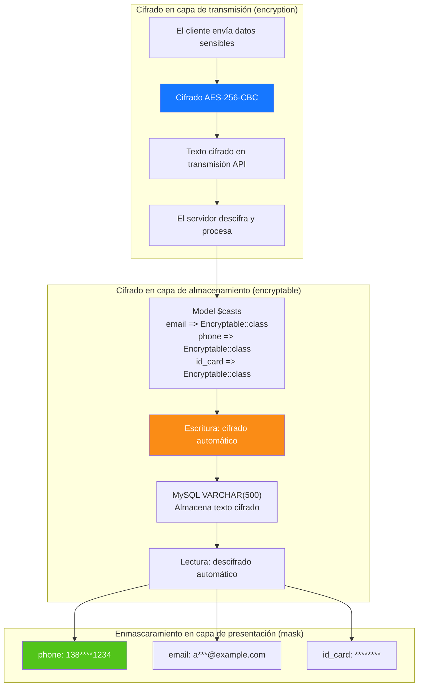

---

## 8. Relaciones ER de la base de datos

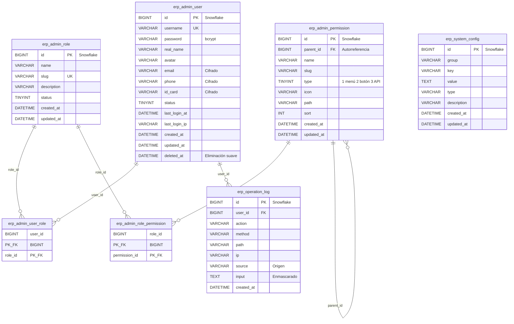

---

## 9. Flujo de negocio de exportación

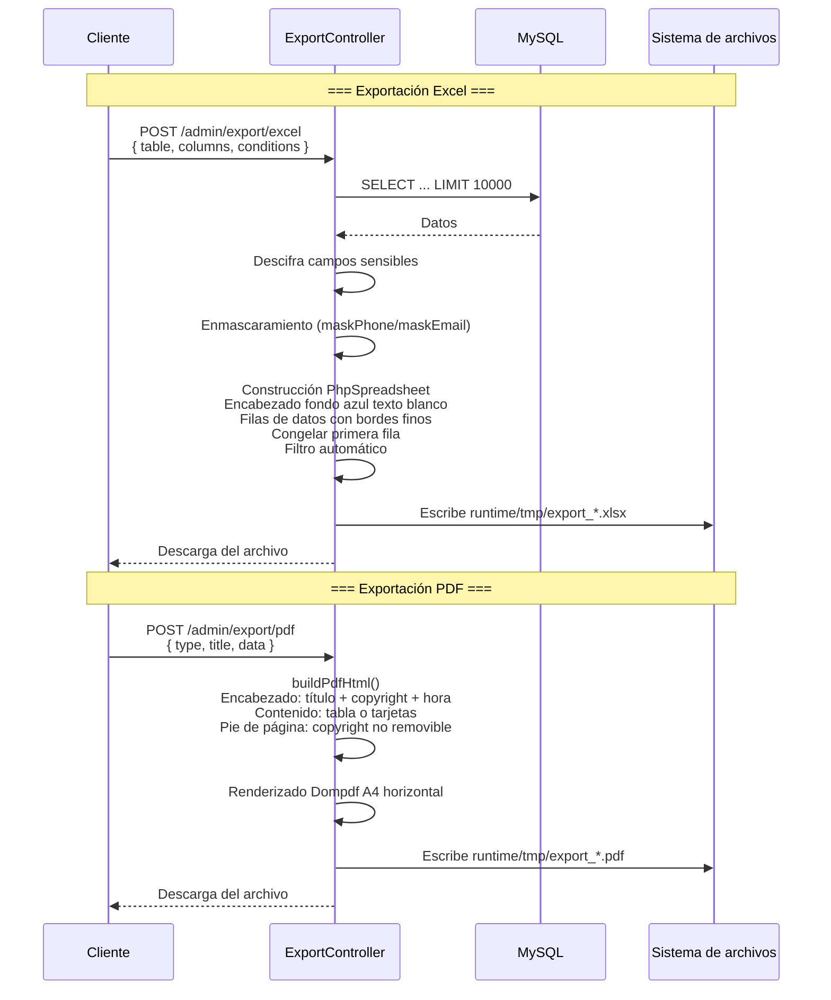

---

## 10. Árbol de componentes Flutter Web

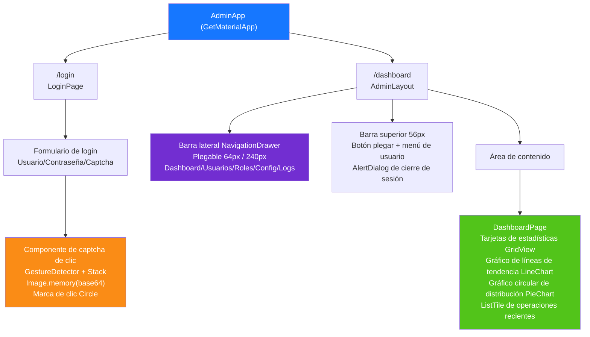

---

## 11. Enrutado de páginas HarmonyOS

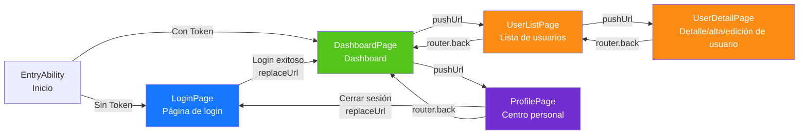

---

## 12. Panorama de defensa en profundidad

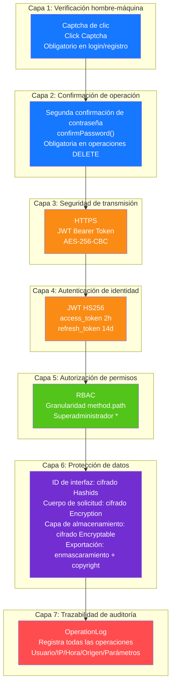

---

## 13. Topología de despliegue

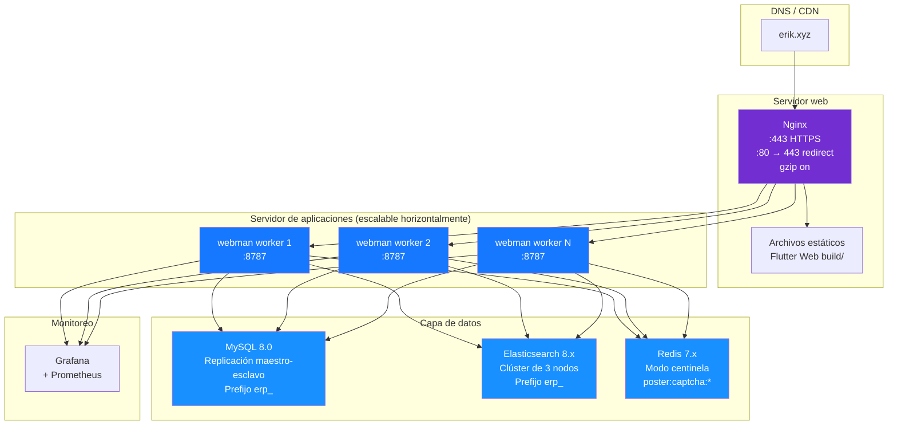

---

## 14. Arquitectura general del sistema ERP

```mermaid
graph TB
    subgraph Client["Capa de cliente"]
        FW["Flutter Web<br/>Panel de administración PC"]
        FA["Flutter App<br/>iOS/Android/macOS/Windows/Linux"]
        HW["HarmonyOS<br/>App nativa Hongmeng"]
    end

    subgraph Gateway["Capa de puerta de enlace API"]
        MW["Cadena de middleware<br/>Locale→Cors→SecurityFilter→RateLimit→Auth→Permission→OpLog"]
    end

    subgraph Business["Capa de módulos de negocio"]
        direction LR
        Admin["Administración del sistema<br/>Usuarios/Roles/Permisos/Config/Logs"]
        Product["Gestión de productos<br/>Productos/Categorías/Marcas/Almacenes/Proveedores/Clientes"]
        Purchase["Gestión de compras<br/>Solicitud→Pedido→Recepción→Devolución→Liquidación"]
        Sales["Gestión de ventas<br/>Cotización→Pedido→Envío→Devolución→Liquidación"]
        Inventory["Gestión de inventario<br/>Entrada/salida/Lotes/Conteo/Transferencia/Alertas"]
        Finance["Gestión financiera<br/>Cuentas/Vouchers/CxC y CxP/Libro mayor/Libro detallado/Reportes/Reembolsos"]
        CRM["CRM<br/>Clientes/Contactos/Seguimiento/Embudo/Pool público/Cotizaciones/Contratos"]
        Workflow["Flujo de aprobación<br/>Definición de flujo/Envío/Aprobación/Rechazo/Retiro"]
        Notification["Notificaciones<br/>Lista de notificaciones/Leídas/Conteo de no leídas"]
        Project["Gestión de proyectos<br/>Proyectos/Tareas/Registro de horas"]
        HR["Recursos humanos<br/>Departamentos/Empleados/Puestos/Asistencia/Vacaciones/Nómina"]
        Manufacturing["Producción y fabricación<br/>BOM/Órdenes de producción/Rutas de proceso/Estaciones de trabajo/MRP"]
        Report["Reportes personalizados<br/>Plantillas de reporte/Conjuntos de datos/Campos/Filtros/Programación"]
    end

    subgraph Service["Capa de servicios de negocio"]
        IS["InventoryService<br/>Entrada/salida + costo promedio ponderado móvil"]
        FS["FinanceService<br/>Generación automática de CxC/CxP + liquidación"]
        NS["NotificationService<br/>Envío unificado de notificaciones"]
    end

    subgraph Data["Capa de datos"]
        MySQL["MySQL 8.0<br/>163 tablas de negocio"]
        Redis["Redis 7<br/>Caché/Limitación/Session"]
        ES["Elasticsearch 8<br/>Búsqueda de texto completo"]
    end

    Client --> Gateway
    Gateway --> Business
    Business --> Service
    Service --> Data
    Business --> Data
```

---

## 15. Flujo de datos entre módulos

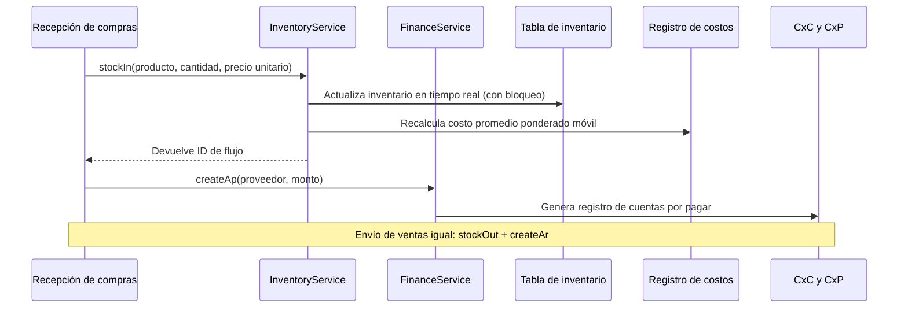

---

## 16. Flujo de datos del cálculo de costos de inventario

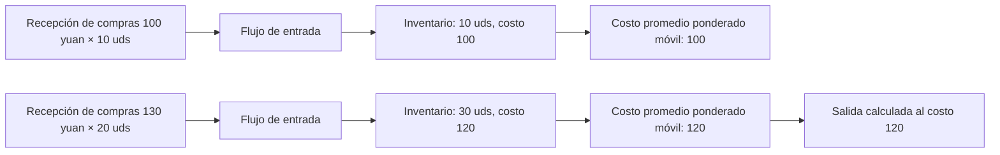

---

## 17. Flujo de datos del flujo de aprobación

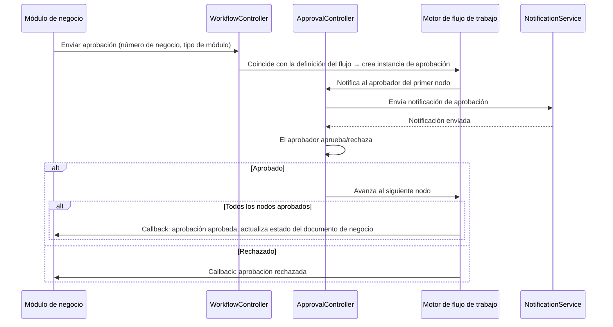

---

## 18. Flujo de datos de notificaciones

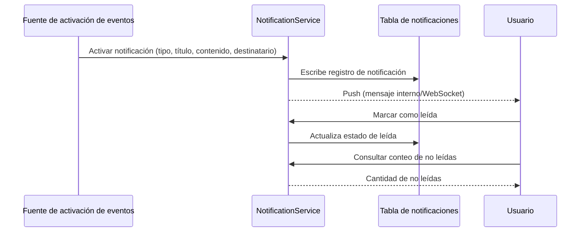

---

## 19. Flujo de datos del MRP (plan de requisitos de materiales)

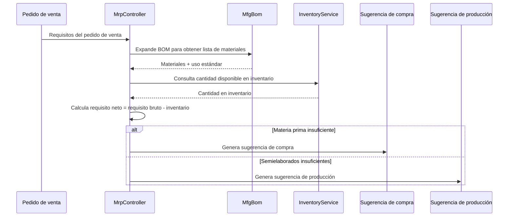

---

## 20. Tabla de mapeo controlador-servicio-modelo de los módulos ERP

> Nota sobre la capa de servicios: la columna `Servicio core` indica los servicios de negocio ya implementados en el módulo; los módulos marcados con **⚠ el controlador consulta el modelo directamente, deuda técnica conocida**
> aún llaman directamente a los métodos de consulta/escritura del modelo desde el controlador (`XxxModel::find/where/save`, etc.), sin capa de servicios extraída; es deuda técnica conocida,
> que se irá consolidando según el patrón de extracción ligera de la capa de servicios P2-F2 (`app/service/AbstractCrudService` como clase base CRUD genérica + Service del módulo).

| Módulo | Controllers (directorio) | Servicio core | Modelos principales | N.º de tablas |
|------|-------------------|-------------|-----------|------|
| Administración del sistema | admin/controller/ (14) | - ⚠Controlador consulta modelo directamente, deuda técnica conocida | AdminUser, AdminRole, AdminPermission | 7 |
| Gestión de productos | controller/product/ (7) | ProductService | Product, Category, Brand, Warehouse, Supplier, Customer | 11 |
| Gestión de compras | controller/purchase/ (5) | InventoryService, FinanceService ⚠CRUD aún directo, deuda técnica conocida | PurchaseOrder, PurchaseReceive | 9 |
| Gestión de ventas | controller/sales/ (5) | InventoryService, FinanceService ⚠CRUD aún directo, deuda técnica conocida | SalesOrder, SalesDelivery | 9 |
| Gestión de inventario | controller/inventory/ (5) | InventoryService ⚠CRUD aún directo, deuda técnica conocida | Inventory, InventoryFlow, CostRecord | 11 |
| Gestión financiera | controller/finance/ (20) | FinanceService ⚠CRUD aún directo, deuda técnica conocida | FinanceArAp, FinanceVoucher, FinanceReceipt, FinancePayment, FinanceGeneralLedger, FinanceBalanceSheet, FinanceAsset, FinanceBudget, FinanceCostCenter | 26 |
| CRM | controller/crm/ (10) | CrmService | CrmOpportunity, CrmFollowRecord, CrmContract, CrmPoolRule, CrmQuotation, CrmCampaign, CrmTicket, CrmAnalyticsReport | 16 |
| Flujo de aprobación | controller/workflow/ (2) | - ⚠Controlador consulta modelo directamente, deuda técnica conocida | ApprovalWorkflow, ApprovalInstance, ApprovalNode, ApprovalRecord | 4 |
| Notificaciones | controller/notification/ (1) | NotificationService ⚠CRUD aún directo, deuda técnica conocida | Notification, NotificationSetting, NotificationTemplate | 3 |
| Gestión de proyectos | controller/project/ (3) | - ⚠Controlador consulta modelo directamente, deuda técnica conocida | Project, ProjectTask, ProjectTimesheet, ProjectMember, ProjectGantt | 5 |
| Recursos humanos | controller/hr/ (5) | HrService | HrDepartment, HrEmployee, HrPosition, HrAttendance, HrLeave, HrSalary | 8 |
| Producción y fabricación | controller/manufacturing/ (5) | ManufacturingService | MfgBom, MfgProductionOrder, MfgRouting, MfgWorkstation, MfgMrpPlan | 8 |
| Reportes personalizados | controller/report/ (2) | - ⚠Controlador consulta modelo directamente, deuda técnica conocida | ReportTemplate, ReportDataset, ReportField, ReportFilter, ReportSchedule | 5 |
| Gestión de equipos EAM | controller/eam/ (4) | - ⚠Controlador consulta modelo directamente, deuda técnica conocida | EamEquipment, EamMaintenancePlan, EamRepairOrder, EamSparePart | 4 |
| Gestión de documentos DMS | controller/dms/ (2) | - ⚠Controlador consulta modelo directamente, deuda técnica conocida | DmsCategory, DmsDocument, DmsDocumentVersion | 3 |
| Paneles BI | controller/bi/ (3) | - ⚠Controlador consulta modelo directamente, deuda técnica conocida | BiDashboard, BiWidget | 2 |

### 20.1 Registro de extracción ligera de la capa de servicios P2-F2 (crm/hr/manufacturing/product ya extraídos)

| Módulo | Llamadas directas al modelo antes de la extracción | Después de la extracción | Nuevo Service | Contenido extraído |
|------|----------------------|--------|--------------|----------|
| CRM | 57 | 0 | `app/service/crm/CrmService.php` | CRUD genérico + transición de estado de contratos, cotización a contrato, asignación/liberación de pool público, asignación/resolución/respuesta de tickets, limpieza en cascada de detalles, construcción de datos de reportes analíticos |
| Recursos humanos | 38 | 0 | `app/service/hr/HrService.php` | CRUD genérico + detección de llegadas tarde/ausencias en fichaje, aprobación de vacaciones (generación automática de asistencia por vacaciones), unicidad de nómina/cálculo neto/pago/generación por lotes |
| Producción y fabricación | 33 | 0 | `app/service/manufacturing/ManufacturingService.php` | CRUD genérico + transición de inicio/fin de órdenes de trabajo, copia de versiones BOM/exclusividad mutua de activación, generación de detalles MRP |
| Gestión de productos | 29 | 0 | `app/service/product/ProductService.php` | CRUD genérico + creación transaccional de productos (SKU/precio), actualización conservando valores originales por campo, carga de detalles relacionales |

Patrón de extracción: `app/service/AbstractCrudService.php` proporciona CRUD genérico `list/all/find/create/update/delete/deleteWhere`
y ayudantes de lógica pura `normalizePageParams/canTransition`; el Service del módulo lo hereda y consolida la lógica de negocio específica del módulo.
Los controladores inyectan el servicio mediante `Container::get(XxxService::class)` (con fallback `class_exists`), manteniendo rutas, parámetros y estructura de respuesta completamente sin cambios;
la codificación/decodificación hashid, la segunda confirmación de contraseña y el empaquetado de respuestas HTTP permanecen en el controlador.
Los nuevos Services están registrados en `config/dependence.php` (archivo dead config, no cargado por addDefinitions; el contenedor de ejecución
instancia con fallback `class_exists`, por lo que todos los Services mantienen constructor sin parámetros).

Los módulos no extraídos (gestión de proyectos 18, reportes personalizados 18, compras 24, ventas 24, administración del sistema 42, etc.) están marcados en la tabla
como "el controlador consulta el modelo directamente, deuda técnica conocida"; las iteraciones posteriores los extraerán con el mismo patrón.

---

## Módulos de extensión OMS/WMS/TMS (2026-08)

### OMS (Order Management System) — 8 tablas
- **Extensión de pedidos** (`erp_oms_order`): agregación multicanal/estado de cumplimiento/estado de pago/prioridad
- **Direcciones de pedido** (`erp_oms_order_address`): dirección de envío/facturación (formato multinacional)
- **Registros de cumplimiento** (`erp_oms_fulfillment`+`_item`): seguimiento de cantidades asignadas/pickeadas/empaquetadas/enviadas
- **RMA** (`erp_oms_rma`+`_item`): ciclo de vida completo de devoluciones e intercambios
- **Reserva de inventario** (`erp_oms_inventory_reservation`): ATP = physical - reserved
- **Canales** (`erp_channel`): direct/marketplace/edi/pos

### WMS (Warehouse Management System) — 12 tablas
- **Zonas y ubicaciones** (`erp_wms_zone`, `erp_wms_location`): zone→aisle→rack→level→bin
- **Entrada** (`erp_wms_asn`+`_item`, `erp_wms_receiving`, `erp_wms_putaway_task`+`_item`)
- **Salida** (`erp_wms_wave`+`wave_order`, `erp_wms_pick_task`+`_item`, `erp_wms_pack_task`)

### TMS (Transport Management System) — 7 tablas
- **Transportistas** (`erp_tms_carrier`+`carrier_service`, `erp_tms_freight_rate`)
- **Envíos** (`erp_tms_shipment`+`_package`, `erp_tms_tracking_event`)
- **Facturas** (`erp_tms_freight_invoice`)

### Flujo de datos
```
OMS: Channel Order → Inventory Reservation (ATP) → Create Fulfillment → WMS
WMS: Wave → Pick → Pack → TMS Shipment
TMS: Rate Shop → Ship → Confirm (stockOut + AR) → Tracking → Delivery
WMS Inbound: ASN → Receive → Putaway (stockIn + AP)
RMA: Request → Approve → Return → Receive (stockIn) → Refund
```

---

## 21. Hoja de ruta del ecosistema (2026-08)

> Especificación de diseño detallada: `superpowers/specs/2026-08-04-erp-ecosystem-roadmap-design.md`

### 21.1 Evaluación de referencia (al inicio de la hoja de ruta)

> P0~P3 ya entregados por completo, puntuación integral actual 89/100 (ver CLAUDE.md); la tabla siguiente es la instantánea de referencia previa al inicio de la hoja de ruta.

| Dimensión | Puntuación | Brechas clave |
|------|------|----------|
| API backend | 85/100 | Varios módulos son esqueletos CRUD, faltan motores de cálculo de negocio |
| Seguridad | 95/100 | Defensa en profundidad de 18 capas, lista para producción |
| UI frontend | 20/100 | **Mayor deficiencia**: Flutter cubre ~20 % de los módulos con 12 páginas, falta el panel de administración web |
| Ecosistema de operaciones | 70/100 | Faltan rollback de migraciones, copias de seguridad automáticas, observabilidad |
| Profundidad de negocio | 55/100 | Algoritmos core de finanzas/HR/fabricación no implementados |
| **Integral** | **65/100** | |

### 21.2 Hoja de ruta serial en cuatro fases

```
P0(3-4 semanas) → P1(4-6 semanas) → P2(1-2 semanas) → P3(2-3 semanas) = total aprox. 13 semanas
```

| Fase | Nombre | Entregables core |
|------|------|----------|
| **P0** | Ecosistema frontend | Panel de administración Flutter Web con todos los módulos (14 módulos, 40+ páginas), biblioteca de componentes genéricos, alineación HarmonyOS |
| **P1** | Profundidad de negocio | Motor de contabilidad por partida doble, motor de cálculo de nómina, motor MRP, módulo de gestión de calidad, notificaciones en tiempo real (WebSocket) |
| **P2** | Confiabilidad operativa | Rollback de migraciones de base de datos, copias de seguridad automáticas mejoradas, trazabilidad OpenTelemetry, colas RabbitMQ |
| **P3** | Mejora de experiencia | Paneles BI arrastrables, gestión de equipos (EAM), aislamiento multitenant, gestión de documentos (DMS) |

### 21.3 Evolución de la cadena de middleware

```
Actual:  Locale → Cors → SecurityFilter → RateLimit → TracingId → {grupo de rutas}
Tras P1: Locale → Cors → SecurityFilter → RateLimit → WebSocketUpgrade → {grupo de rutas}
Tras P2: Locale → Cors → SecurityFilter → RateLimit → TracingId → WebSocketUpgrade → {grupo de rutas}
Tras P3: Locale → Cors → SecurityFilter → RateLimit → TracingId → TenantScope → WebSocketUpgrade → {grupo de rutas}
```

### 21.4 Arquitectura objetivo de P0 — Panel de administración Flutter Web

| Capa | Contenido nuevo |
|------|----------|
| Capa de layout | `AdminLayout` layout de tres columnas para PC (barra lateral plegable + barra superior + área de contenido) |
| Capa de componentes | `DataTableWrapper`, `FormDialog`, `ConfirmDialog`, `StatCard`, `BreadcrumbNav`, `FileUploader` |
| Capa de páginas | Expansión de las 12 páginas actuales a cobertura completa de 14 módulos y 40+ páginas |
| Capa de servicios | Reutiliza los existentes `ApiService`, `AuthService`, `CaptchaService`, `ExportService` |

### 21.5 Arquitectura objetivo de P1 — Motores de cálculo de negocio

| Motor | Clase de servicio | Reglas clave |
|------|--------|----------|
| Contabilidad por partida doble | `DoubleEntryService`, `PeriodCloseService`, `AccountBalanceService` | Validación forzada de equilibrio débito/crédito, cierre de resultados del período, conversión de tipos de cambio multimoneda |
| Cálculo de nómina | `SalaryEngineService`, `SocialInsuranceService`, `HousingFundService`, `TaxCalculatorService` | Límites superior/inferior de la base de seguridad social, proporción del fondo de vivienda, tarifas progresivas del impuesto a la renta, pago bancario masivo |
| MRP | `MrpEngineService`, `BomExplosionService`, `NetRequirementService` | Expansión capa por capa del BOM + mermas, código de nivel bajo (LLC), stock de seguridad, reglas de lote |
| Calidad | `QmsInspectionService` | Flujo de tres documentos: inspección de entrada IQC / inspección de proceso IPQC / inspección de salida OQC |
| Notificaciones | `WebSocketService`, `ChannelRouter` | Multicanal: interno/email/WeCom/DingTalk |

### 21.6 Resumen de cambios del modelo de datos

| Fase | Nuevas tablas | Módulos implicados |
|------|----------|----------|
| P0 | 0 | Solo frontend, sin cambios de tablas |
| P1 | 14 | Finanzas(2) + HR(3) + Fabricación(2) + Calidad(5) + Notificaciones(2) |
| P3 | 7 | BI(2) + EAM(3) + DMS(2) |

---

## 22. Multitenencia (capacidad reservada, no habilitada)

> Aviso de copyright igual que el encabezado del archivo: Copyright (c) 2026 erik <erik@erik.xyz> — https://erik.xyz

### 22.1 Posicionamiento y decisión

La multitenencia se posiciona en este proyecto como **capacidad reservada**; en esta iteración **no se conecta ni se habilita** (degradación documentada). Coherente con la planificación:
la facturación SaaS, el alta de tenant por autoservicio y demás "soluciones comerciales completas de multitenencia" no están dentro del alcance de este proyecto; en esta iteración solo se conserva el
esqueleto mínimo de código (middleware + Trait de modelo) con los pasos de habilitación, para su activación posterior bajo demanda.
Nota: el "aislamiento multitenant" del P3 de la hoja de ruta §21.2 se ajusta por tanto a "capacidad reservada (degradación documentada)", conservando el esqueleto sin conectarlo.

Base de la decisión (revisión 2026-08):
- Los despliegues existentes son casi todos de un solo tenant; conectarlo introduciría complejidad de aislamiento y riesgo de regresión innecesarios;
- El esqueleto actual tiene defectos técnicos (ver 22.4), "conectarlo es aislarlo" no se sostiene; primero hay que corregir el diseño;
- El aislamiento requiere añadir columna por columna y habilitar modelo por modelo en las tablas de negocio entre las 163 tablas; el costo supera con creces la "conexión mínima".

### 22.2 Hechos actuales (verificación de código y configuración)

| Ítem | Estado actual |
|----|------|
| `app/middleware/TenantScope.php` | Existe, no registrado; lee el tenant de la cabecera `X-Tenant-Id`, y si la cabecera falta deja pasar directamente |
| `app/model/concerns/TenantScope.php` | Existe, ningún modelo lo usa; el scope global `bootTenantScope()` solo filtra tras establecer el tenant |
| `config/middleware.php` | Cadena global: Locale → Cors → SecurityFilter → RateLimit → TracingId, sin TenantScope |
| `config/route.php` grupo /admin | AdminAuth → AdminPermission → OperationLog, sin TenantScope |
| Carga JWT | Solo `sub` / `username` / `token_type`, **sin declaración tenant_id** (`app/api/v1/controller/AuthController.php`) |
| Base de datos | **Ninguna columna tenant_id en toda la base de datos** (tampoco en install.sql) |
| Modelos | **Ningún modelo usa el Trait TenantScope** |

### 22.3 Pasos de habilitación (referencia reservada, no ejecutar en esta iteración)

1. Registrar el middleware: añadir `app\middleware\TenantScope::class` en el `middleware()` del grupo /admin de `config/route.php` (después de AdminAuth, garantizando autenticación).
2. El solicitante envía `X-Tenant-Id` (int ID de tenant) en la cabecera de la solicitud.
3. Añadir la columna `tenant_id` (BIGINT + índice) a las tablas de negocio que requieran aislamiento y rellenar los datos existentes;
   las tablas de diccionario/sistema (como `erp_admin_user`, `erp_role`, `erp_permission`) no se aíslan.
4. En las clases de modelo que requieran aislamiento, `use app\model\concerns\TenantScope;` para filtrar automáticamente por el tenant actual.
5. (Opcional) Si se desea obtener el tenant del JWT en lugar de la cabecera: ampliar la carga del login para incluir la declaración `tenant_id`
   y leerlo desde `$payload['tenant_id']` en el middleware.

### 22.4 Limitaciones técnicas conocidas (deben resolverse antes de habilitar)

- **Cadena de transmisión estática rota (comprobado en PHP 8.3)**: el middleware llama a `setCurrentTenantId()` por nombre de trait
  y escribe en la copia estática propia del trait; las clases de modelo que usan ese trait no pueden leerlo y las consultas no se filtran.
  Al habilitar, debe cambiarse a inyección basada en el contexto de la solicitud (p. ej. `request()->tenantId`).
- **Contaminación cruzada del estado global estático**: Workerman es un proceso residente; las propiedades estáticas se comparten entre solicitudes; si se habilita el modo coroutine
  (Swoole/Swow) habrá contaminación cruzada de datos entre tenants; debe cambiarse a enlace a nivel de solicitud (`context()` / objeto de solicitud).
- **Brecha en el plano de datos**: no hay columna tenant_id en toda la base de datos; requiere migración tabla por tabla; las tablas de diccionario compartidas entre tenants requieren un mecanismo de exención.

### 22.5 Criterios de aceptación

Aceptación de esta iteración = coherencia entre documentación y código: `config/middleware.php` y `config/route.php` no contienen
registro de TenantScope; el middleware y el Trait llevan comentarios que indican explícitamente "capacidad reservada, no habilitada" y proporcionan los pasos de habilitación;
esta sección se corresponde punto por punto con el estado actual del código.
