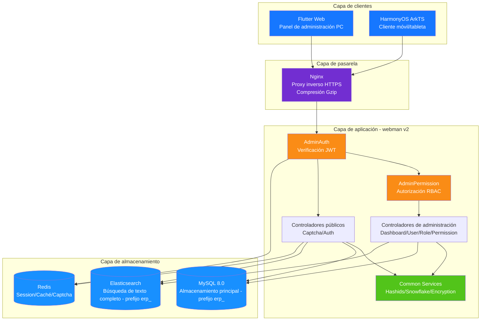

# Arquitectura de topología del sistema

```mermaid
flowchart TB
    subgraph clients["Capa de clientes"]
        flutter["Flutter Web<br/>Panel de administración PC"]
        harmony["HarmonyOS ArkTS<br/>Cliente móvil/tableta"]
    end

    subgraph gateway["Capa de pasarela"]
        nginx["Nginx<br/>Proxy inverso HTTPS<br/>Compresión Gzip"]
    end

    subgraph app["Capa de aplicación - webman v2"]
        auth["AdminAuth<br/>Verificación JWT"]
        perm["AdminPermission<br/>Autorización RBAC"]
        admin["Controladores de administración<br/>Dashboard/User/Role/Permission"]
        public["Controladores públicos<br/>Captcha/Auth"]
        common["Common Services<br/>Hashids/Snowflake/Encryption"]
    end

    subgraph storage["Capa de almacenamiento"]
        mysql[("MySQL 8.0<br/>Almacenamiento principal - prefijo erp_")]
        es[("Elasticsearch<br/>Búsqueda de texto completo - prefijo erp_")]
        redis[("Redis<br/>Session/Caché/Captcha")]
    end

    flutter --> nginx
    harmony --> nginx
    nginx --> auth
    auth --> perm
    perm --> admin
    auth --> public
    admin --> common
    public --> common
    admin --> mysql
    public --> mysql
    admin --> es
    public --> es
    auth --> redis
    public --> redis

    style flutter fill:#1677FF,color:#fff
    style harmony fill:#1677FF,color:#fff
    style nginx fill:#722ED1,color:#fff
    style auth fill:#FA8C16,color:#fff
    style perm fill:#FA8C16,color:#fff
    style common fill:#52C41A,color:#fff
    style mysql fill:#1890FF,color:#fff
    style es fill:#1890FF,color:#fff
    style redis fill:#1890FF,color:#fff
```
