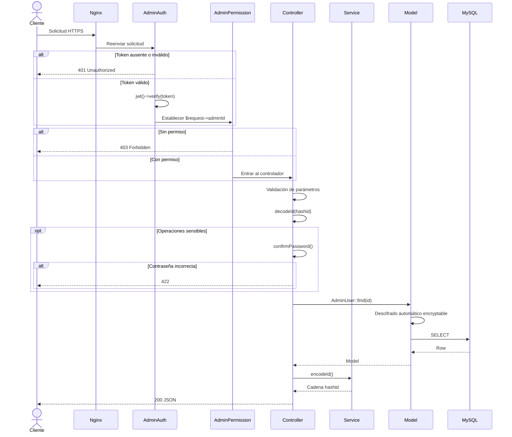

# Ciclo de vida de la solicitud

```mermaid
sequenceDiagram
    actor C as Cliente
    participant N as Nginx
    participant MW1 as AdminAuth
    participant MW2 as AdminPermission
    participant CTL as Controller
    participant SVC as Service
    participant MDL as Model
    participant DB as MySQL

    C->>N: Solicitud HTTPS
    N->>MW1: Reenviar solicitud

    alt Token ausente o inválido
        MW1-->>C: 401 Unauthorized
    else Token válido
        MW1->>MW1: jwt()->verify(token)
        MW1->>MW2: Establecer $request->adminId
    end

    alt Sin permiso
        MW2-->>C: 403 Forbidden
    else Con permiso
        MW2->>CTL: Entrar al controlador
    end

    CTL->>CTL: Validación de parámetros
    CTL->>CTL: decodeId(hashid)

    opt Operaciones sensibles
        CTL->>CTL: confirmPassword()
        alt Contraseña incorrecta
            CTL-->>C: 422
        end
    end

    CTL->>MDL: AdminUser::find(id)
    MDL->>MDL: Descifrado automático encryptable
    MDL->>DB: SELECT
    DB-->>MDL: Row
    MDL-->>CTL: Model

    CTL->>SVC: encodeId()
    SVC-->>CTL: Cadena hashid

    CTL-->>C: 200 JSON
```
