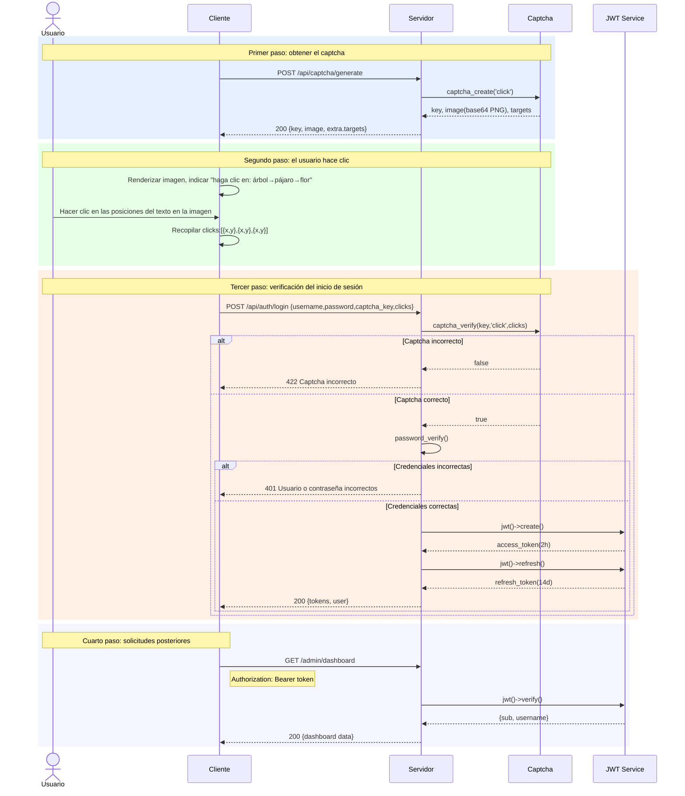

# Flujo de autenticación y captcha

```mermaid
sequenceDiagram
    actor U as Usuario
    participant CL as Cliente
    participant SV as Servidor
    participant CAP as Captcha
    participant JWT as JWT Service

    rect rgb(230, 240, 255)
    Note over U,CAP: Primer paso: obtener el captcha
    CL->>SV: POST /api/captcha/generate
    SV->>CAP: captcha_create('click')
    CAP-->>SV: key, image(base64 PNG), targets
    SV-->>CL: 200 {key, image, extra.targets}
    end

    rect rgb(230, 255, 230)
    Note over U,CAP: Segundo paso: el usuario hace clic
    CL->>CL: Renderizar imagen, indicar "haga clic en: árbol→pájaro→flor"
    U->>CL: Hacer clic en las posiciones del texto en la imagen
    CL->>CL: Recopilar clicks:[{x,y},{x,y},{x,y}]
    end

    rect rgb(255, 240, 230)
    Note over U,CAP: Tercer paso: verificación del inicio de sesión
    CL->>SV: POST /api/auth/login {username,password,captcha_key,clicks}
    SV->>CAP: captcha_verify(key,'click',clicks)

    alt Captcha incorrecto
        CAP-->>SV: false
        SV-->>CL: 422 Captcha incorrecto
    else Captcha correcto
        CAP-->>SV: true
        SV->>SV: password_verify()
        alt Credenciales incorrectas
            SV-->>CL: 401 Usuario o contraseña incorrectos
        else Credenciales correctas
            SV->>JWT: jwt()->create()
            JWT-->>SV: access_token(2h)
            SV->>JWT: jwt()->refresh()
            JWT-->>SV: refresh_token(14d)
            SV-->>CL: 200 {tokens, user}
        end
    end
    end

    rect rgb(245, 245, 255)
    Note over U,CL: Cuarto paso: solicitudes posteriores
    CL->>SV: GET /admin/dashboard
    Note right of CL: Authorization: Bearer token
    SV->>JWT: jwt()->verify()
    JWT-->>SV: {sub, username}
    SV-->>CL: 200 {dashboard data}
    end
```
