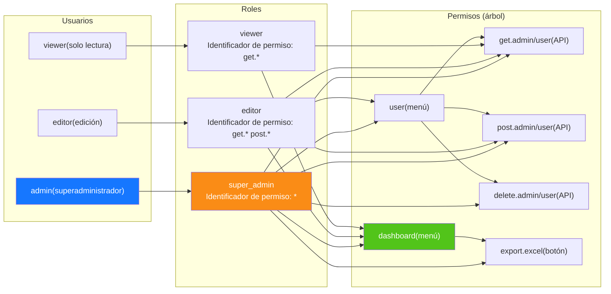
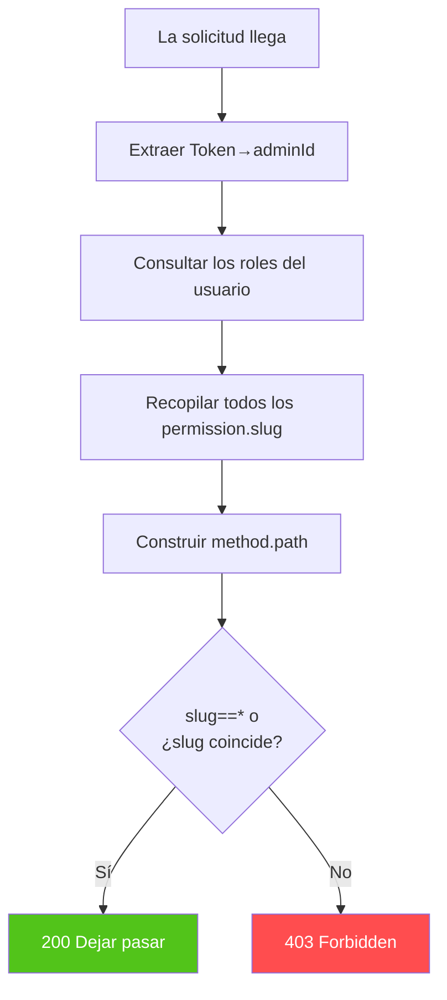
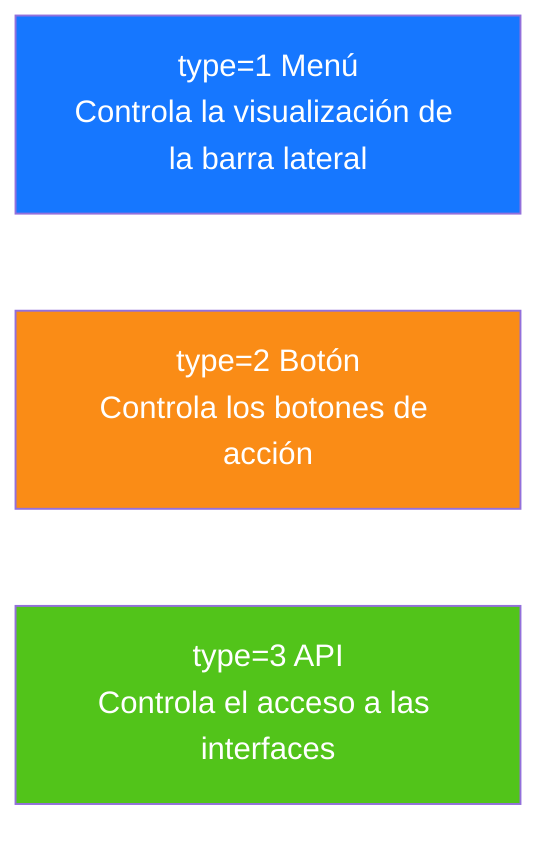

# Modelo de permisos RBAC

## Relación usuario-rol-permiso

```mermaid
flowchart LR
    subgraph users["Usuarios"]
        u1["admin(superadministrador)"]
        u2["editor(edición)"]
        u3["viewer(solo lectura)"]
    end

    subgraph roles["Roles"]
        r1["super_admin<br/>Identificador de permiso: *"]
        r2["editor<br/>Identificador de permiso: get.* post.*"]
        r3["viewer<br/>Identificador de permiso: get.*"]
    end

    subgraph permissions["Permisos (árbol)"]
        p1["dashboard(menú)"]
        p2["user(menú)"]
        p3["get.admin/user(API)"]
        p4["post.admin/user(API)"]
        p5["delete.admin/user(API)"]
        p6["export.excel(botón)"]
    end

    u1 --> r1
    u2 --> r2
    u3 --> r3
    r1 --> p1 & p2 & p3 & p4 & p5 & p6
    r2 --> p1 & p2 & p3 & p4
    r3 --> p1 & p3
    p2 --> p3 & p4 & p5
    p1 --> p6

    style u1 fill:#1677FF,color:#fff
    style r1 fill:#FA8C16,color:#fff
    style p1 fill:#52C41A,color:#fff
```

## Flujo de determinación de permisos

```mermaid
flowchart TD
    start["La solicitud llega"] --> extract["Extraer Token→adminId"]
    extract --> findRoles["Consultar los roles del usuario"]
    findRoles --> collectSlug["Recopilar todos los permission.slug"]
    collectSlug --> buildKey["Construir method.path"]
    buildKey --> check{"slug==* o<br/>¿slug coincide?"}
    check -->|"Sí"| allow["200 Dejar pasar"]
    check -->|"No"| deny["403 Forbidden"]

    style allow fill:#52C41A,color:#fff
    style deny fill:#FF4D4F,color:#fff
```

## Tipos de permisos

```mermaid
flowchart LR
    t1["type=1 Menú<br/>Controla la visualización de la barra lateral"]
    t2["type=2 Botón<br/>Controla los botones de acción"]
    t3["type=3 API<br/>Controla el acceso a las interfaces"]

    style t1 fill:#1677FF,color:#fff
    style t2 fill:#FA8C16,color:#fff
    style t3 fill:#52C41A,color:#fff
```
