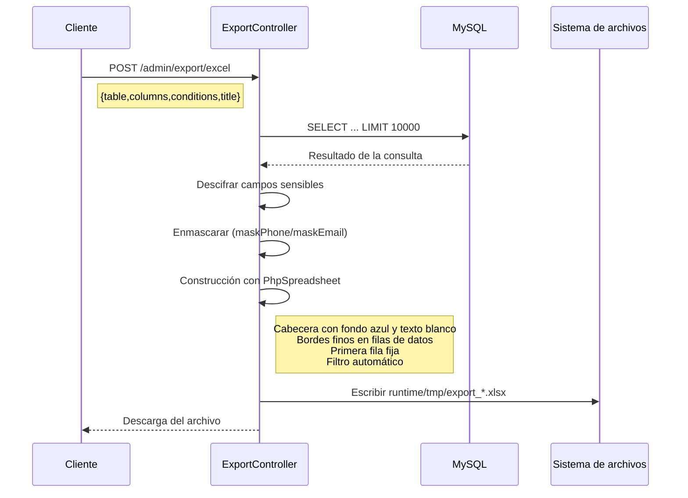
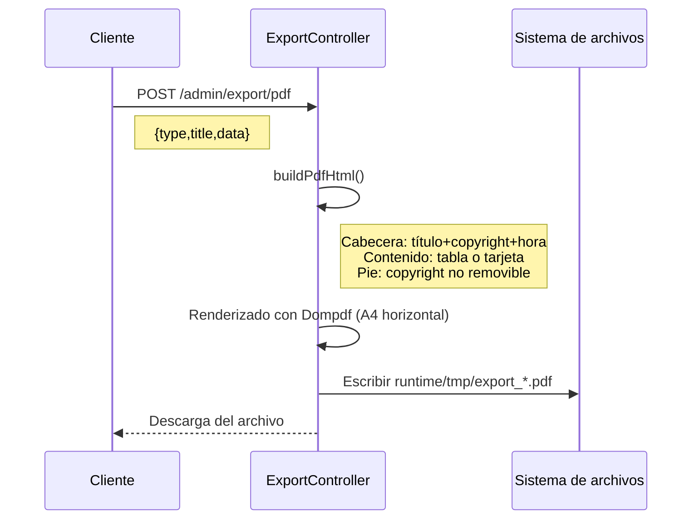

# Proceso de negocio de exportación

## Exportación Excel

```mermaid
sequenceDiagram
    participant C as Cliente
    participant CTL as ExportController
    participant DB as MySQL
    participant FS as Sistema de archivos

    C->>CTL: POST /admin/export/excel
    Note right of C: {table,columns,conditions,title}
    CTL->>DB: SELECT ... LIMIT 10000
    DB-->>CTL: Resultado de la consulta
    CTL->>CTL: Descifrar campos sensibles
    CTL->>CTL: Enmascarar (maskPhone/maskEmail)
    CTL->>CTL: Construcción con PhpSpreadsheet
    Note right of CTL: Cabecera con fondo azul y texto blanco<br/>Bordes finos en filas de datos<br/>Primera fila fija<br/>Filtro automático
    CTL->>FS: Escribir runtime/tmp/export_*.xlsx
    CTL-->>C: Descarga del archivo
```

## Exportación PDF

```mermaid
sequenceDiagram
    participant C as Cliente
    participant CTL as ExportController
    participant FS as Sistema de archivos

    C->>CTL: POST /admin/export/pdf
    Note right of C: {type,title,data}
    CTL->>CTL: buildPdfHtml()
    Note right of CTL: Cabecera: título+copyright+hora<br/>Contenido: tabla o tarjeta<br/>Pie: copyright no removible
    CTL->>CTL: Renderizado con Dompdf (A4 horizontal)
    CTL->>FS: Escribir runtime/tmp/export_*.pdf
    CTL-->>C: Descarga del archivo
```
