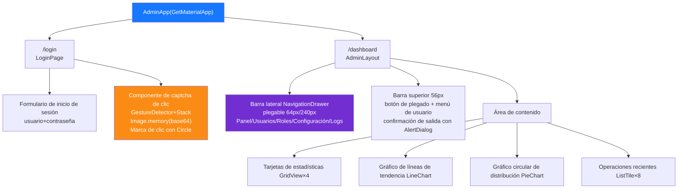
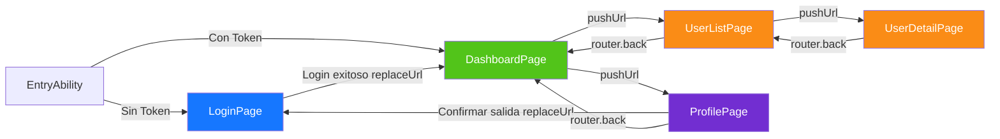

# Arquitectura de componentes del frontend

## Árbol de componentes de Flutter Web

```mermaid
flowchart TD
    app["AdminApp(GetMaterialApp)"]

    app --> login["/login<br/>LoginPage"]
    app --> dashboard["/dashboard<br/>AdminLayout"]

    login --> form["Formulario de inicio de sesión<br/>usuario+contraseña"]
    login --> captcha["Componente de captcha de clic<br/>GestureDetector+Stack<br/>Image.memory(base64)<br/>Marca de clic con Circle"]

    dashboard --> sidebar["Barra lateral NavigationDrawer<br/>plegable 64px/240px<br/>Panel/Usuarios/Roles/Configuración/Logs"]
    dashboard --> header["Barra superior 56px<br/>botón de plegado + menú de usuario<br/>confirmación de salida con AlertDialog"]
    dashboard --> content["Área de contenido"]

    content --> stats["Tarjetas de estadísticas GridView×4"]
    content --> chart["Gráfico de líneas de tendencia LineChart"]
    content --> pie["Gráfico circular de distribución PieChart"]
    content --> logs["Operaciones recientes ListTile×8"]

    style app fill:#1677FF,color:#fff
    style captcha fill:#FA8C16,color:#fff
    style sidebar fill:#722ED1,color:#fff
```

## Rutas de páginas de HarmonyOS

```mermaid
flowchart LR
    entry["EntryAbility"]
    entry -->|"Sin Token"| loginH["LoginPage"]
    entry -->|"Con Token"| dashH["DashboardPage"]

    loginH -->|"Login exitoso replaceUrl"| dashH

    dashH -->|"pushUrl"| userList["UserListPage"]
    dashH -->|"pushUrl"| profile["ProfilePage"]

    userList -->|"pushUrl"| userDetail["UserDetailPage"]
    userList -->|"router.back"| dashH
    userDetail -->|"router.back"| userList

    profile -->|"Confirmar salida replaceUrl"| loginH
    profile -->|"router.back"| dashH

    style loginH fill:#1677FF,color:#fff
    style dashH fill:#52C41A,color:#fff
    style userList fill:#FA8C16,color:#fff
    style userDetail fill:#FA8C16,color:#fff
    style profile fill:#722ED1,color:#fff
```
