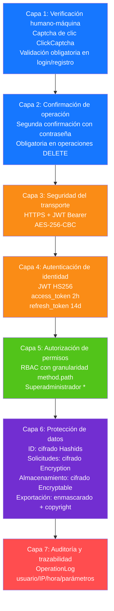

# Defensa en profundidad de seguridad

```mermaid
flowchart TB
    l1["Capa 1: Verificación humano-máquina<br/>Captcha de clic ClickCaptcha<br/>Validación obligatoria en login/registro"]
    l2["Capa 2: Confirmación de operación<br/>Segunda confirmación con contraseña<br/>Obligatoria en operaciones DELETE"]
    l3["Capa 3: Seguridad del transporte<br/>HTTPS + JWT Bearer<br/>AES-256-CBC"]
    l4["Capa 4: Autenticación de identidad<br/>JWT HS256<br/>access_token 2h<br/>refresh_token 14d"]
    l5["Capa 5: Autorización de permisos<br/>RBAC con granularidad method.path<br/>Superadministrador *"]
    l6["Capa 6: Protección de datos<br/>ID: cifrado Hashids<br/>Solicitudes: cifrado Encryption<br/>Almacenamiento: cifrado Encryptable<br/>Exportación: enmascarado + copyright"]
    l7["Capa 7: Auditoría y trazabilidad<br/>OperationLog<br/>usuario/IP/hora/parámetros"]

    l1 --> l2 --> l3 --> l4 --> l5 --> l6 --> l7

    style l1 fill:#1677FF,color:#fff
    style l2 fill:#1677FF,color:#fff
    style l3 fill:#FA8C16,color:#fff
    style l4 fill:#FA8C16,color:#fff
    style l5 fill:#52C41A,color:#fff
    style l6 fill:#722ED1,color:#fff
    style l7 fill:#FF4D4F,color:#fff
```
