# Diagrammes d'architecture et de logique métier

> Copyright (c) 2026 erik <erik@erik.xyz> — https://erik.xyz

> Les diagrammes Mermaid suivants se rendent automatiquement dans GitHub / GitLab / VS Code. Pour les autres environnements, utilisez le [Mermaid Live Editor](https://mermaid.live/).

---

## 1. Topologie du système

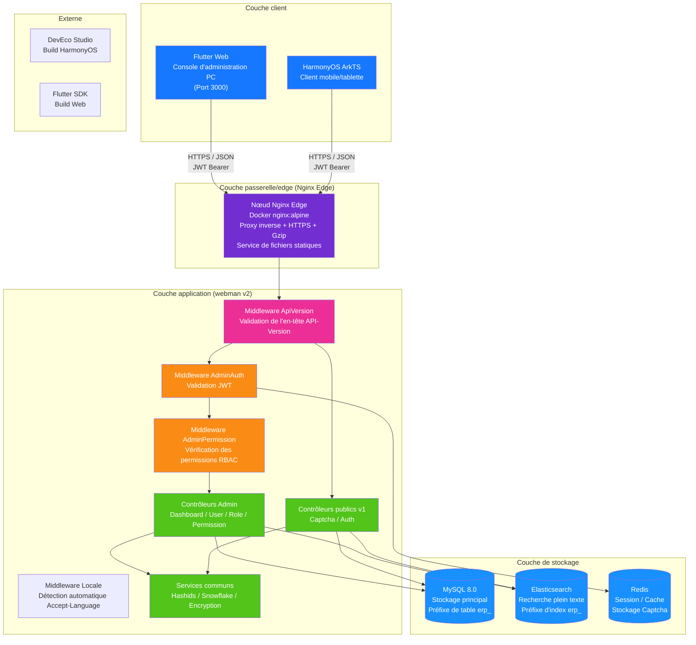

---

## 2. Architecture en couches du backend

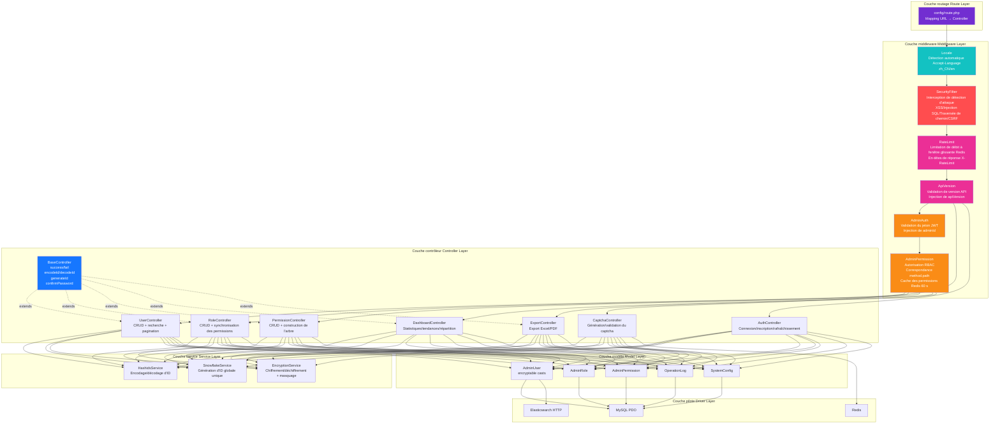

### Extension de la couche métier ERP

Au fur et à mesure que le système évolue d'une simple console d'administration vers un système ERP complet, les couches contrôleur et service intègrent les modules métier suivants :

| Couche | Répertoire | Description |
|------|------|------|
| Contrôleurs métier | `app/controller/{product,purchase,sales,inventory,finance,crm,workflow,notification,project,hr,manufacturing,report}/` | 70, répartis par module, traitent les requêtes métier |
| Services métier | `app/service/{inventory,finance,notification}/` | entrées-sorties de stock + calcul des coûts, comptes à recevoir et à payer + rapprochement, envoi de notifications |

---

## 3. Cycle de vie d'une requête

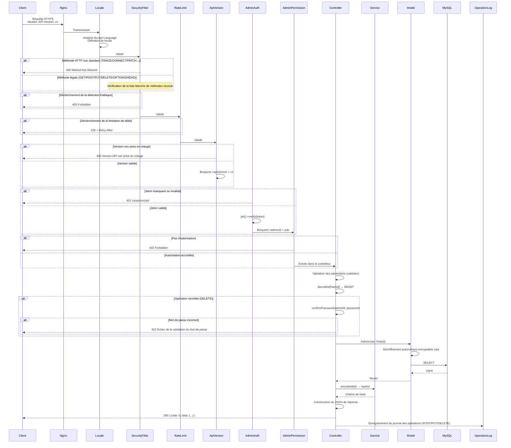

---

## 4. Flux d'authentification et de captcha

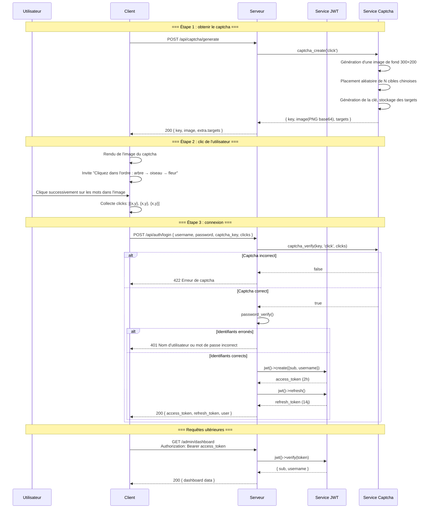

---

## 5. Modèle d'autorisation RBAC

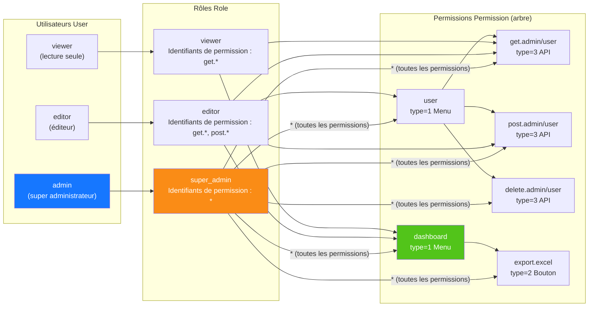

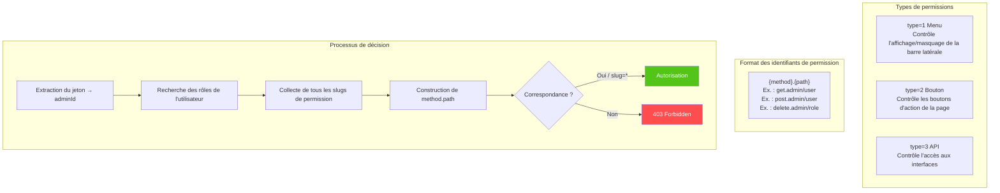

---

## 6. Cycle de vie complet des ID

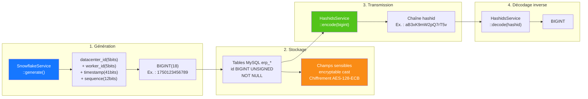

---

## 7. Couches de chiffrement des données

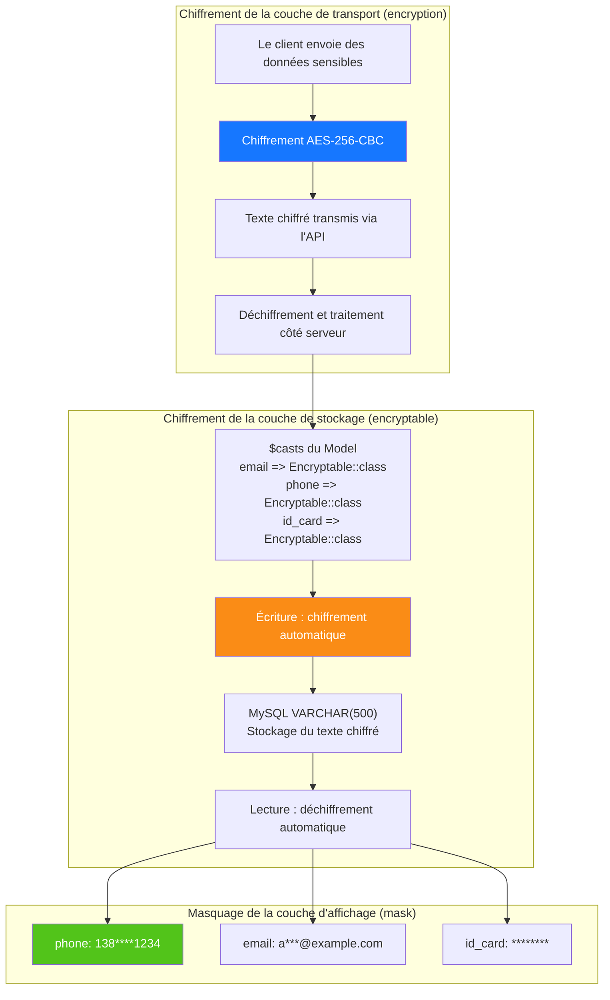

---

## 8. Relations ER de la base de données

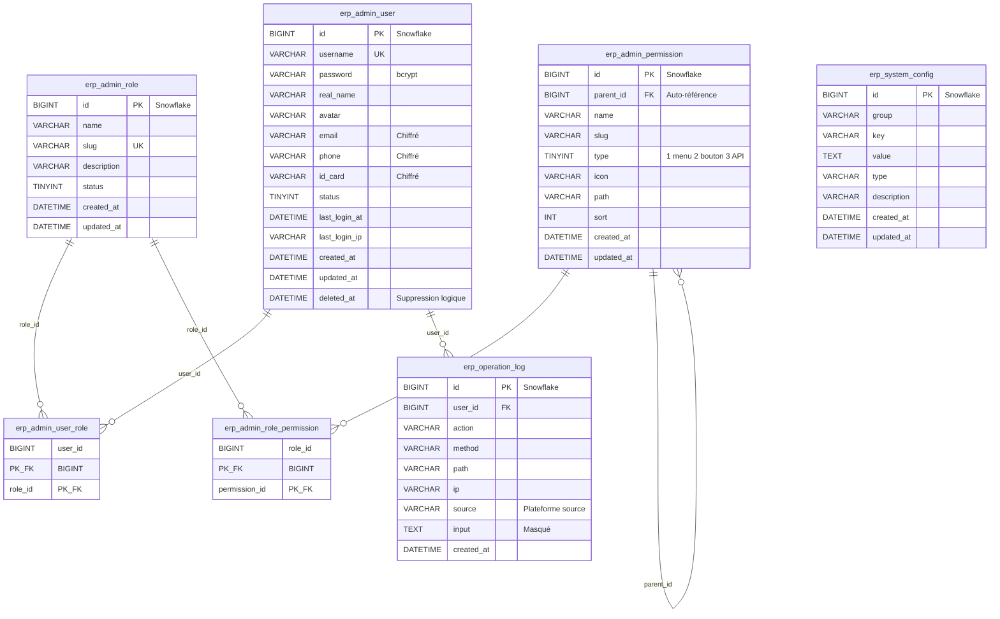

---

## 9. Processus métier d'export

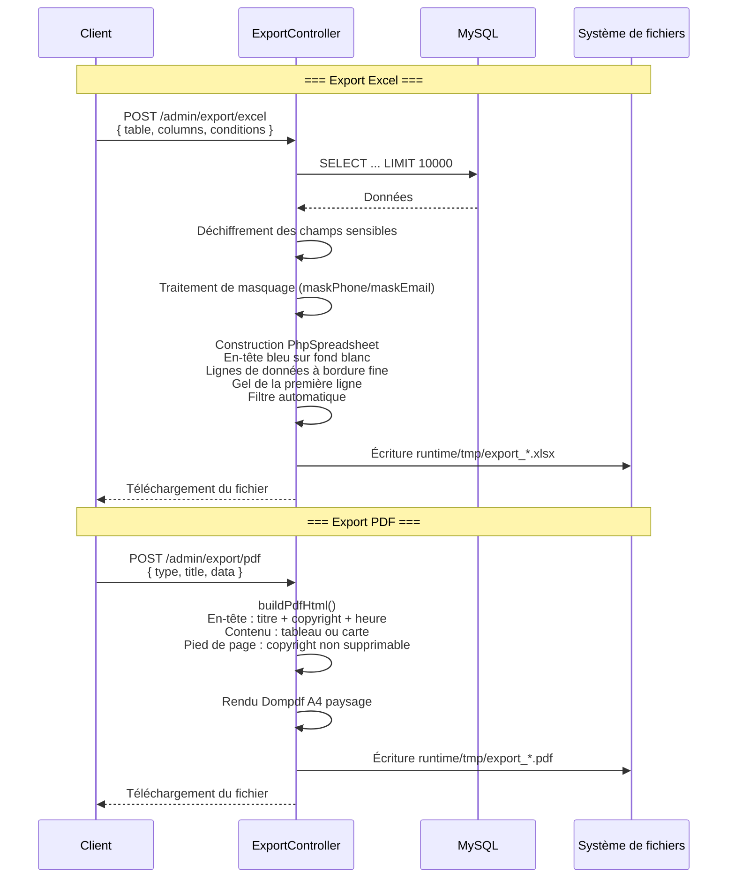

---

## 10. Arborescence des composants Flutter Web

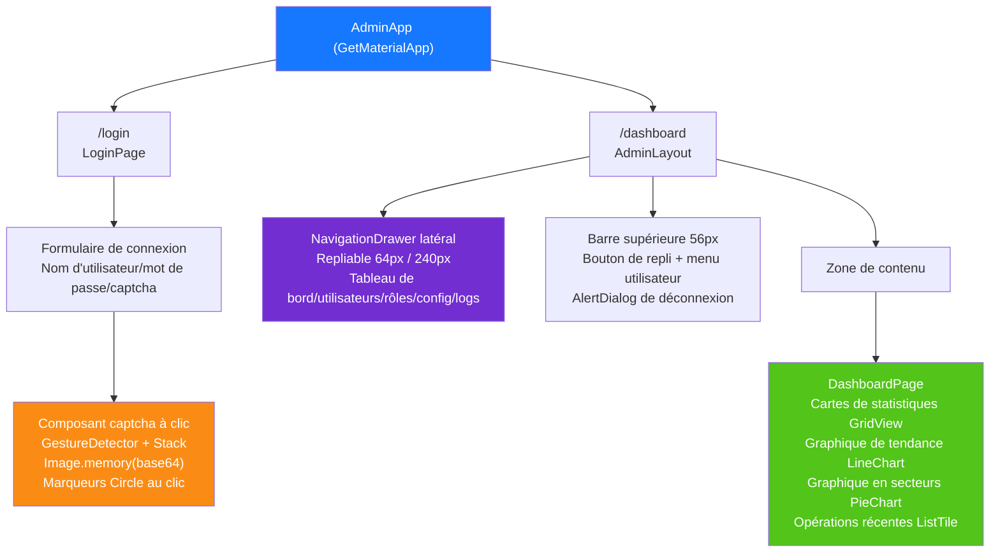

---

## 11. Routage des pages HarmonyOS

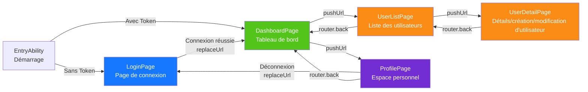

---

## 12. Vue d'ensemble de la défense en profondeur de la sécurité

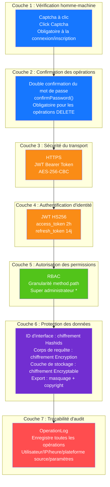

---

## 13. Topologie de déploiement

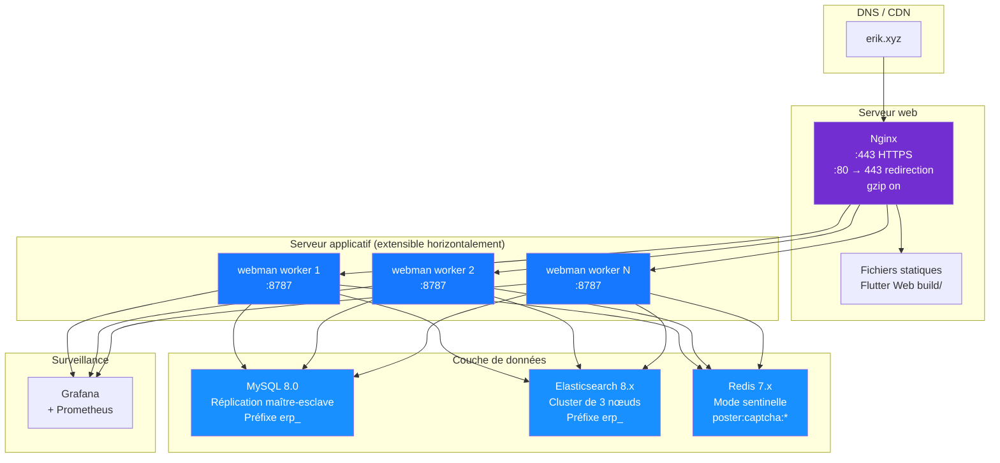

---

## 14. Architecture globale du système ERP

```mermaid
graph TB
    subgraph Client["Couche client"]
        FW["Flutter Web<br/>Console d'administration PC"]
        FA["Flutter App<br/>iOS/Android/macOS/Windows/Linux"]
        HW["HarmonyOS<br/>Application native HarmonyOS"]
    end

    subgraph Gateway["Couche passerelle API"]
        MW["Chaîne de middleware<br/>Locale→Cors→SecurityFilter→RateLimit→Auth→Permission→OpLog"]
    end

    subgraph Business["Couche des modules métier"]
        direction LR
        Admin["Gestion système<br/>Utilisateurs/rôles/permissions/config/logs"]
        Product["Gestion des produits<br/>Produits/catégories/marques/entrepôts/fournisseurs/clients"]
        Purchase["Gestion des achats<br/>Demande→commande→réception→retour→règlement"]
        Sales["Gestion des ventes<br/>Devis→commande→expédition→retour→règlement"]
        Inventory["Gestion des stocks<br/>Entrées-sorties/lots/inventaires/transferts/alertes"]
        Finance["Gestion financière<br/>Comptes/pièces/comptes à recevoir et à payer/grand livre/auxiliaire/rapports/notes de frais"]
        CRM["CRM<br/>Clients/contacts/suivi/entonnoir/bassin commun/devis/contrats"]
        Workflow["Flux d'approbation<br/>Définition du flux/soumission/approbation/refus/retrait"]
        Notification["Notifications<br/>Liste de notifications/lues/compteur de non-lues"]
        Project["Gestion de projet<br/>Projets/tâches/enregistrement des heures"]
        HR["Ressources humaines<br/>Départements/employés/postes/présences/congés/salaires"]
        Manufacturing["Production<br/>BOM/ordres de production/gammes/postes de travail/MRP"]
        Report["Rapports personnalisés<br/>Modèles de rapport/datasets/champs/filtres/planifications"]
    end

    subgraph Service["Couche des services métier"]
        IS["InventoryService<br/>Entrées-sorties + coût moyen pondéré mobile"]
        FS["FinanceService<br/>Génération automatique des comptes à recevoir et à payer + rapprochement"]
        NS["NotificationService<br/>Envoi unifié des notifications"]
    end

    subgraph Data["Couche de données"]
        MySQL["MySQL 8.0<br/>163 tables métier"]
        Redis["Redis 7<br/>Cache/limitation de débit/Session"]
        ES["Elasticsearch 8<br/>Recherche plein texte"]
    end

    Client --> Gateway
    Gateway --> Business
    Business --> Service
    Service --> Data
    Business --> Data
```

---

## 15. Flux de données inter-modules

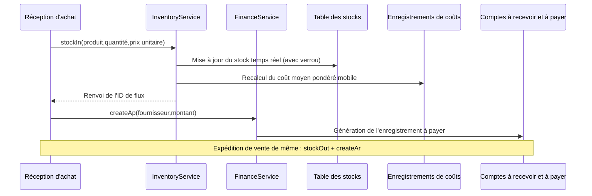

---

## 16. Flux de données du calcul des coûts de stock

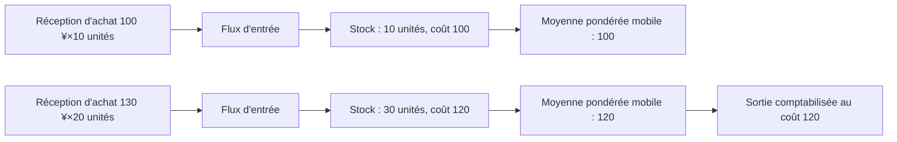

---

## 17. Flux de données du flux d'approbation

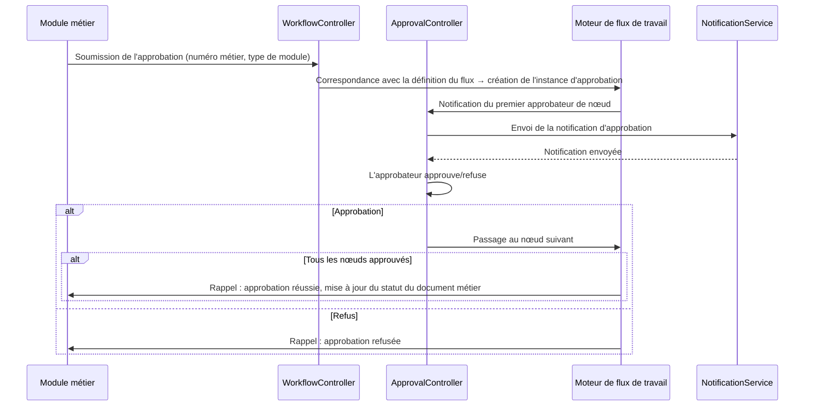

---

## 18. Flux de données des notifications

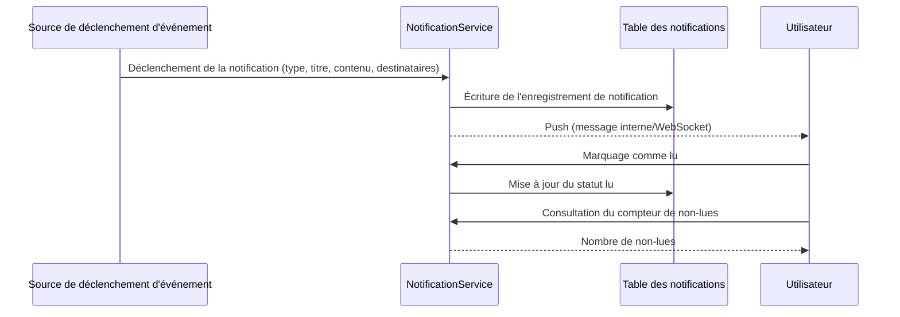

---

## 19. Flux de données MRP (planification des besoins en matériaux)

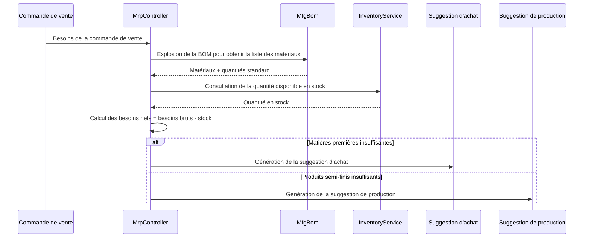

---

## 20. Table de correspondance modules ERP contrôleur-service-modèle

> Note sur la couche service : la colonne `Service central` indique les services métier déjà extraits pour ce module ; les modules marqués **⚠ Le contrôleur interroge directement les modèles, dette technique connue** voient leurs contrôleurs appeler directement les méthodes d'interrogation/écriture des modèles (`XxxModel::find/where/save` etc.) sans couche service extraite — dette technique connue, à résorber progressivement selon le modèle d'extraction légère P2-F2 de la couche service (`app/service/AbstractCrudService` base CRUD générique + Service par module).

| Module | Controllers (répertoire) | Service central | Modèles principaux | Nombre de tables |
|------|-------------------|-------------|-----------|------|
| Gestion système | admin/controller/ (14) | - ⚠Le contrôleur interroge directement les modèles, dette technique connue | AdminUser, AdminRole, AdminPermission | 7 |
| Gestion des produits | controller/product/ (7) | ProductService | Product, Category, Brand, Warehouse, Supplier, Customer | 11 |
| Gestion des achats | controller/purchase/ (5) | InventoryService, FinanceService ⚠CRUD encore en requête directe, dette technique connue | PurchaseOrder, PurchaseReceive | 9 |
| Gestion des ventes | controller/sales/ (5) | InventoryService, FinanceService ⚠CRUD encore en requête directe, dette technique connue | SalesOrder, SalesDelivery | 9 |
| Gestion des stocks | controller/inventory/ (5) | InventoryService ⚠CRUD encore en requête directe, dette technique connue | Inventory, InventoryFlow, CostRecord | 11 |
| Gestion financière | controller/finance/ (20) | FinanceService ⚠CRUD encore en requête directe, dette technique connue | FinanceArAp, FinanceVoucher, FinanceReceipt, FinancePayment, FinanceGeneralLedger, FinanceBalanceSheet, FinanceAsset, FinanceBudget, FinanceCostCenter | 26 |
| CRM | controller/crm/ (10) | CrmService | CrmOpportunity, CrmFollowRecord, CrmContract, CrmPoolRule, CrmQuotation, CrmCampaign, CrmTicket, CrmAnalyticsReport | 16 |
| Flux d'approbation | controller/workflow/ (2) | - ⚠Le contrôleur interroge directement les modèles, dette technique connue | ApprovalWorkflow, ApprovalInstance, ApprovalNode, ApprovalRecord | 4 |
| Notifications | controller/notification/ (1) | NotificationService ⚠CRUD encore en requête directe, dette technique connue | Notification, NotificationSetting, NotificationTemplate | 3 |
| Gestion de projet | controller/project/ (3) | - ⚠Le contrôleur interroge directement les modèles, dette technique connue | Project, ProjectTask, ProjectTimesheet, ProjectMember, ProjectGantt | 5 |
| Ressources humaines | controller/hr/ (5) | HrService | HrDepartment, HrEmployee, HrPosition, HrAttendance, HrLeave, HrSalary | 8 |
| Production | controller/manufacturing/ (5) | ManufacturingService | MfgBom, MfgProductionOrder, MfgRouting, MfgWorkstation, MfgMrpPlan | 8 |
| Rapports personnalisés | controller/report/ (2) | - ⚠Le contrôleur interroge directement les modèles, dette technique connue | ReportTemplate, ReportDataset, ReportField, ReportFilter, ReportSchedule | 5 |
| Gestion d'équipements EAM | controller/eam/ (4) | - ⚠Le contrôleur interroge directement les modèles, dette technique connue | EamEquipment, EamMaintenancePlan, EamRepairOrder, EamSparePart | 4 |
| Gestion documentaire DMS | controller/dms/ (2) | - ⚠Le contrôleur interroge directement les modèles, dette technique connue | DmsCategory, DmsDocument, DmsDocumentVersion | 3 |
| Tableaux de bord BI | controller/bi/ (3) | - ⚠Le contrôleur interroge directement les modèles, dette technique connue | BiDashboard, BiWidget | 2 |

### 20.1 Journal d'extraction légère de la couche service P2-F2 (crm/hr/manufacturing/product extraits)

| Module | Appels directs du contrôleur avant extraction | Après extraction | Nouveaux Services | Contenu extrait |
|------|----------------------|--------|--------------|----------|
| CRM | 57 | 0 | `app/service/crm/CrmService.php` | CRUD générique + transitions de statut de contrat, devis→contrat, réclamation/libération du bassin commun, assignation/résolution/réponse des tickets, nettoyage en cascade des lignes de détail, construction des données des rapports d'analyse |
| Ressources humaines | 38 | 0 | `app/service/hr/HrService.php` | CRUD générique + détection retard/départ anticipé des pointages, approbation des congés (génération automatique des pointages de congé), unicité du salaire/calcul du net/versement/génération en masse |
| Production | 33 | 0 | `app/service/manufacturing/ManufacturingService.php` | CRUD générique + transitions de début/fin d'ordre de travail, copie des versions BOM/mutualité exclusive d'activation, génération des lignes de détail MRP |
| Gestion des produits | 29 | 0 | `app/service/product/ProductService.php` | CRUD générique + création transactionnelle du produit (SKU/prix), mise à jour par champs en conservant les valeurs d'origine, chargement associé des détails |

Modèle d'extraction : `app/service/AbstractCrudService.php` fournit le CRUD générique `list/all/find/create/update/delete/deleteWhere`
et les assistants de logique pure `normalizePageParams/canTransition` ; les Services de module en héritent et y déposent la logique métier spécifique.
Les contrôleurs injectent le service via `Container::get(XxxService::class)` (repli class_exists), en conservant strictement la structure des routes/paramètres/réponses ;
l'encodage/décodage hashid, la double confirmation du mot de passe, l'emballage des réponses et autres préoccupations HTTP restent dans le contrôleur.
Les nouveaux Services sont enregistrés dans `config/dependence.php` (ce fichier est une config morte, non chargée par addDefinitions ; l'instanciation se fait via le
repli class_exists du conteneur à l'exécution, d'où des Services tous sans constructeur).

Les modules non extraits (gestion de projet 18 fois, rapports personnalisés 18 fois, achats 24 fois, ventes 24 fois, gestion système 42 fois etc.) sont marqués
« le contrôleur interroge directement les modèles, dette technique connue » dans le tableau, et seront extraits selon le même modèle lors des itérations suivantes.

---

## Modules d'extension OMS/WMS/TMS (2026-08)

### OMS (Order Management System) — 8 tables
- **Extension de commande** (`erp_oms_order`) : agrégation multicanal/statut de traitement/statut de paiement/priorité
- **Adresses de commande** (`erp_oms_order_address`) : adresses de livraison/facturation (format multilingue)
- **Enregistrements de traitement** (`erp_oms_fulfillment`+`_item`) : suivi des quantités allouées/prélevées/emballées/expédiées
- **RMA** (`erp_oms_rma`+`_item`) : cycle de vie complet des retours et échanges
- **Réservation de stock** (`erp_oms_inventory_reservation`) : ATP = physical - reserved
- **Canaux** (`erp_channel`) : direct/marketplace/edi/pos

### WMS (Warehouse Management System) — 12 tables
- **Zones et emplacements** (`erp_wms_zone`, `erp_wms_location`) : zone→aisle→rack→level→bin
- **Entrées** (`erp_wms_asn`+`_item`, `erp_wms_receiving`, `erp_wms_putaway_task`+`_item`)
- **Sorties** (`erp_wms_wave`+`wave_order`, `erp_wms_pick_task`+`_item`, `erp_wms_pack_task`)

### TMS (Transport Management System) — 7 tables
- **Transporteurs** (`erp_tms_carrier`+`carrier_service`, `erp_tms_freight_rate`)
- **Connaissements** (`erp_tms_shipment`+`_package`, `erp_tms_tracking_event`)
- **Factures** (`erp_tms_freight_invoice`)

### Flux de données
```
OMS : Commande du canal → Réservation de stock (ATP) → Création du traitement → WMS
WMS : Vague → Prélèvement → Emballage → Envoi TMS
TMS : Comparaison des tarifs → Expédition → Confirmation (stockOut + AR) → Suivi → Livraison
Entrée WMS : ASN → Réception → Rangement (stockIn + AP)
RMA : Demande → Approbation → Retour → Réception (stockIn) → Remboursement
```

---

## 21. Feuille de route de l'écosystème (2026-08)

> Spécifications de conception détaillées : `superpowers/specs/2026-08-04-erp-ecosystem-roadmap-design.md`

### 21.1 Évaluation de base (au lancement de la feuille de route)

> P0~P3 entièrement livrés, score global actuel 89/100 (voir CLAUDE.md) ; le tableau ci-dessous est la photographie de base avant le lancement de la feuille de route.

| Dimension | Score | Écart clé |
|------|------|----------|
| API backend | 85/100 | plusieurs modules sont des squelettes CRUD, il manque les moteurs de calcul métier |
| Protection de sécurité | 95/100 | défense en profondeur sur 18 couches, prête pour la production |
| UI frontend | 20/100 | **plus grande lacune** : les 12 pages Flutter couvrent ~20 % des modules, pas de panneau d'administration Web |
| Écosystème d'exploitation | 70/100 | manquent rollback de migration, sauvegarde automatique, observabilité |
| Profondeur métier | 55/100 | algorithmes centraux finance/RH/fabrication non implémentés |
| **Global** | **65/100** | |

### 21.2 Feuille de route séquentielle en quatre phases

```
P0(3-4 semaines) → P1(4-6 semaines) → P2(1-2 semaines) → P3(2-3 semaines) = environ 13 semaines au total
```

| Phase | Nom | Livraison centrale |
|------|------|----------|
| **P0** | Écosystème frontend | panneau d'administration Flutter Web tous modules (14 modules 40+ pages), bibliothèque de composants génériques, alignement HarmonyOS |
| **P1** | Profondeur métier | moteur de comptabilité en partie double, moteur de calcul des salaires, moteur MRP, module qualité, notifications temps réel (WebSocket) |
| **P2** | Fiabilité opérationnelle | rollback des migrations de base de données, sauvegarde automatique renforcée, traçage OpenTelemetry, moteur de file de messages RabbitMQ |
| **P3** | Expérience renforcée | tableaux de bord BI par glisser-déposer, gestion d'équipements (EAM), isolation multi-tenant, gestion documentaire (DMS) |

### 21.3 Évolution de la chaîne de middleware

```
Actuel :   Locale → Cors → SecurityFilter → RateLimit → TracingId → {groupe de routes}
Après P1 :  Locale → Cors → SecurityFilter → RateLimit → WebSocketUpgrade → {groupe de routes}
Après P2 :  Locale → Cors → SecurityFilter → RateLimit → TracingId → WebSocketUpgrade → {groupe de routes}
Après P3 :  Locale → Cors → SecurityFilter → RateLimit → TracingId → TenantScope → WebSocketUpgrade → {groupe de routes}
```

### 21.4 Architecture cible P0 — Panneau d'administration Flutter Web

| Couche | Contenu ajouté |
|------|----------|
| Couche de disposition | `AdminLayout` disposition PC à trois colonnes (barre latérale repliable + barre supérieure + zone de contenu) |
| Couche de composants | `DataTableWrapper`, `FormDialog`, `ConfirmDialog`, `StatCard`, `BreadcrumbNav`, `FileUploader` |
| Couche de pages | extension des 12 pages actuelles vers une couverture complète de 14 modules 40+ pages |
| Couche de services | réutilisation des `ApiService`, `AuthService`, `CaptchaService`, `ExportService` existants |

### 21.5 Architecture cible P1 — Moteurs de calcul métier

| Moteur | Classe de service | Règles clés |
|------|--------|----------|
| Comptabilité en partie double | `DoubleEntryService`, `PeriodCloseService`, `AccountBalanceService` | validation forcée de l'équilibre débit-crédit, clôture et report des résultats de fin de période, conversion des taux multi-devises |
| Calcul des salaires | `SalaryEngineService`, `SocialInsuranceService`, `HousingFundService`, `TaxCalculatorService` | bornes de base de la sécurité sociale, taux du fonds de logement, barème progressif de l'impôt sur le revenu, virement bancaire |
| MRP | `MrpEngineService`, `BomExplosionService`, `NetRequirementService` | explosion BOM couche par couche + pertes, code de niveau bas (LLC), stock de sécurité, règles par lots |
| Qualité | `QmsInspectionService` | circulation des trois documents IQC entrée/IPQC process/OQC sortie |
| Notifications | `WebSocketService`, `ChannelRouter` | multicanal interne/e-mail/WeCom/DingTalk |

### 21.6 Récapitulatif des modifications du modèle de données

| Phase | Nouvelles tables | Modules concernés |
|------|----------|----------|
| P0 | 0 | frontend pur, aucun changement de table |
| P1 | 14 | Finance (2) + RH (3) + Fabrication (2) + Qualité (5) + Notifications (2) |
| P3 | 7 | BI (2) + EAM (3) + DMS (2) |

---

## 22. Multi-tenant (capacité réservée, non activée)

> Mention de copyright comme en tête de fichier : Copyright (c) 2026 erik <erik@erik.xyz> — https://erik.xyz

### 22.1 Positionnement et décision

Dans ce projet, le multi-tenant est positionné comme **capacité réservée** : il n'est **pas branché, pas activé** dans cette itération (dégradation documentée). Conformément à la planification :
la facturation SaaS, l'auto-ouverture des locataires et autres « offres commerciales complètes du multi-tenant » ne font pas partie du périmètre de construction de ce projet ; cette itération ne conserve que le squelette
de code minimal (middleware + Trait de modèle) avec les étapes d'activation, pour une mise en service ultérieure à la demande.
Note : le « isolation multi-tenant » du P3 de la feuille de route §21.2 est en conséquence ajusté en « capacité réservée (dégradation documentée) », en conservant le squelette sans branchement.

Base de décision (revue 2026-08) :
- les déploiements existants sont presque tous mono-tenant ; le branchement introduirait une complexité d'isolation inutile et un risque de régression ;
- le squelette actuel présente des défauts techniques (voir 22.4) ; « branché = isolé » n'est pas vérifié, une correction de conception est d'abord nécessaire ;
- l'isolation exige d'ajouter des colonnes à chacune des tables métier parmi les 163 tables et d'activer le trait sur chaque modèle, un coût bien supérieur à un « branchement minimal ».

### 22.2 Faits actuels (vérification du code et de la configuration)

| Élément | État actuel |
|----|------|
| `app/middleware/TenantScope.php` | existe, non enregistré ; lit le locataire depuis l'en-tête `X-Tenant-Id`, autorise directement si l'en-tête est absent |
| `app/model/concerns/TenantScope.php` | existe, aucun modèle ne l'utilise ; le scope global `bootTenantScope()` ne filtre qu'une fois le locataire défini |
| `config/middleware.php` | chaîne globale : Locale → Cors → SecurityFilter → RateLimit → TracingId, sans TenantScope |
| `config/route.php` groupe /admin | AdminAuth → AdminPermission → OperationLog, sans TenantScope |
| Payload JWT | uniquement `sub` / `username` / `token_type`, **aucune déclaration tenant_id** (`app/api/v1/controller/AuthController.php`) |
| Base de données | **aucune colonne tenant_id dans toute la base** (install.sql non plus) |
| Modèles | **aucun modèle n'utilise le trait TenantScope** |

### 22.3 Étapes d'activation (référence réservée, non exécutées dans cette itération)

1. Enregistrer le middleware : dans `config/route.php`, ajouter au groupe /admin `middleware()`
   `app\middleware\TenantScope::class` (placé après AdminAuth, pour garantir l'authentification).
2. Le demandeur porte `X-Tenant-Id` (ID de locataire int) dans l'en-tête de requête.
3. Ajouter la colonne `tenant_id` (BIGINT + index) aux tables métier à isoler et réinjecter les données existantes ;
   les tables de dictionnaire/système (comme `erp_admin_user`, `erp_role`, `erp_permission`) ne sont pas isolées.
4. Utiliser `app\model\concerns\TenantScope;` dans les classes de modèles à isoler, pour filtrer automatiquement selon le locataire courant.
5. (Optionnel) si le locataire doit être lu depuis le JWT plutôt que l'en-tête : étendre le payload de connexion avec une déclaration `tenant_id`,
   et lire `$payload['tenant_id']` dans le middleware.

### 22.4 Limitations techniques connues (à résoudre avant l'activation)

- **Chaîne de transmission statique rompue (testé sur PHP 8.3)** : le middleware appelle `setCurrentTenantId()` via le nom du trait,
  qui écrit dans la copie statique du trait lui-même ; les classes de modèles utilisant ce trait ne peuvent pas la lire, les requêtes ne sont donc pas filtrées.
  À l'activation, passer à une injection basée sur le contexte de requête (comme `request()->tenantId`).
- **Interférence de l'état global statique** : Workerman est un processus résident, les propriétés statiques sont partagées entre requêtes ; en mode coroutine
  (Swoole/Swow), une interférence de données inter-locataires se produirait ; passer à une liaison au niveau requête (`context()` / objet requête).
- **Lacune du plan de données** : aucune colonne tenant_id dans toute la base, nécessite une migration table par table ; les tables de dictionnaire partagées inter-locataires nécessitent un mécanisme d'exemption à concevoir.

### 22.5 Critères d'acceptation

Acceptation de cette itération = cohérence entre documentation et code : `config/middleware.php` et `config/route.php` ne contiennent pas
d'enregistrement TenantScope ; les commentaires du middleware et du Trait indiquent clairement « capacité réservée, non activée » avec les étapes d'activation ;
chaque point de cette section correspond à l'état du code.
