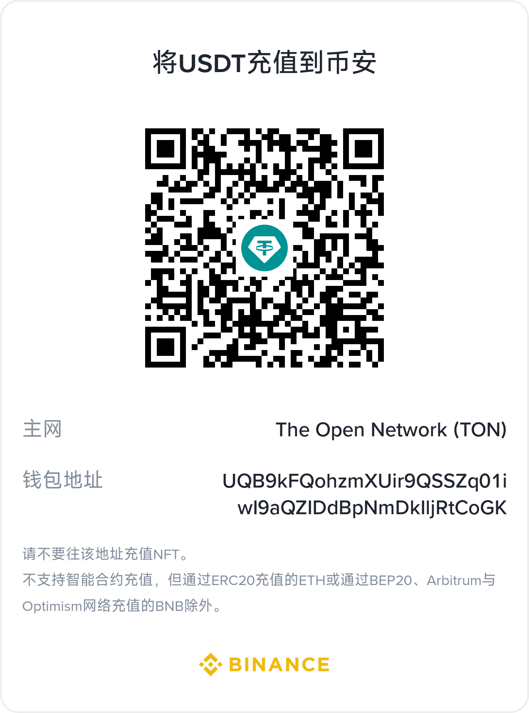

# Système ERP Open (open-erp)

ERP full-stack basé sur webman v2 + Flutter.

<div align="center"></div>

<div align="center">🌐 [中文](../../../README.md) | [English](../en/README.md) | [한국어](../ko/README.md) | [Русский](../ru/README.md) | [Deutsch](../de/README.md) | Français | [Español](../es/README.md) | [Português](../pt/README.md) | [हिन्दी](../hi/README.md) | [العربية](../ar/README.md) | [বাংলা](../bn/README.md) | [Bahasa Indonesia](../id/README.md) | [日本語](../ja/README.md)</div>

> [Version anglaise](../en/README.md) | [Comparaison des éditions](EDITIONS.md) | [Diagramme d'architecture](ARCHITECTURE.md) | [Diagramme d'architecture système](#diagramme-darchitecture-système) | [Document de conception](DESIGN.md) | [Architecture de sécurité](SECURITY.md) | [Référence API](API.md) | [Manuel des fonctionnalités](FUNCTIONS.md)

## Liste des fonctionnalités

| Domaine métier | Fonctionnalité | Description |
|--------|------|------|
| 🔐 Authentification | Connexion / inscription / rafraîchissement de jeton / déconnexion | Captcha à clic + JWT + liste noire |
| | Verrouillage de compte | 5 échecs → verrouillage 15 minutes |
| | Limite de sessions simultanées | 3 jetons valides maximum par utilisateur |
| 📊 Tableau de bord | Vue d'ensemble / ventes / stock / finances | Cache Redis 5 minutes |
| 👥 Gestion des utilisateurs | CRUD + suppression en masse / activation-désactivation | Suppression logique + double confirmation du mot de passe |
| | Import Excel en masse | Validation ligne par ligne + rapport d'erreurs |
| 🔒 Rôles et permissions | CRUD des rôles + arbre de permissions | RBAC granularité method.path |
| ⚙ Configuration système | CRUD clé-valeur | Gestion par groupes |
| 📋 Audit des opérations | Consultation des journaux + détection de la source | Reconnaissance automatique de 8 plateformes |
| 📁 Gestion des fichiers | Téléversement / export Excel / export PDF | Masquage automatique des données sensibles |
| 🛡 Protection de sécurité | Défense en profondeur sur 18 couches | XSS / injection SQL / traversée de chemin / injection de commande / CSRF / limitation de débit / CSP… |
| 🏥 Exploitation | Vérification de santé / metrics / documentation API / security.txt | Prometheus + OpenAPI 3.0 |
| 📦 Gestion des produits | Fiche produit / SKU / multi-spécifications / multi-unités / catégories / marques / stratégie de prix | Arbre de catégories multi-niveaux + conversion multi-unités |
| | Entrepôts et emplacements | Gestion multi-entrepôts et multi-emplacements |
| | Fiches fournisseurs / clients | Contacts / comptes bancaires / limites de crédit |
| 📥 Gestion des achats | Demande → commande → réception → retour → règlement | Processus d'achat complet + approbation |
| 📤 Gestion des ventes | Devis → commande → expédition → retour → règlement | Conversion devis en commande + marge brute des ventes |
| 🏗 Gestion des stocks | Stock en temps réel / lots / numéros de série / transferts / inventaire / alertes | Évaluation du coût moyen pondéré mobile |
| 💰 Gestion financière | Comptes clients / fournisseurs / encaissements / décaissements / journaux / notes de frais / compte de résultat / immobilisations / fiscalité / multi-devises / budgets / centres de coût et de profit | Génération automatique des comptes à recevoir et à payer + rapprochement + gestion financière complète |
| 🤝 CRM | Clients / contacts / suivi / campagnes marketing / tickets de service / rapports d'analyse / entonnoir de vente / pool commun / devis / contrats | Gestion du cycle de vie complet du client |
| ✅ Workflow d'approbation | Définition des workflows / soumission / approbation / refus / retrait / mes approbations | Moteur de workflow multi-étapes |
| 🔔 Notifications | Liste / marquer comme lu / compteur non lu / tout marquer comme lu | Envoi en temps réel et suivi des états |
| 📐 Gestion de projets | Projets / tâches / relevés de temps | Suivi de l'avancement et gestion des ressources |
| 👤 Ressources humaines | Départements / employés / postes / pointage / congés / salaires | Gestion complète du personnel |
| 🏭 Production | Nomenclature / ordres de fabrication / gammes / postes de travail / MRP | Planification des besoins en matières et exécution de la production |
| 📈 Rapports personnalisés | Modèles / jeux de données / champs / filtres / exécution / planification | Constructeur de rapports visuel |
| 📋 Gestion des commandes (OMS) | Commandes multi-canaux / orchestration de l'exécution / pré-réservation de stock / allocation / annulation / retours RMA | Gestion du cycle de vie complet des commandes |
| 🏗 Gestion d'entrepôt (WMS) | Zones / emplacements / ASN / réception / mise en rayon / vagues / préparation / emballage / expédition | Processus d'exploitation d'entrepôt complet |
| 🚚 Gestion du transport (TMS) | Transporteurs / services / tarifs / connaissements / suivi logistique / factures de fret | Comparaison des tarifs multi-transporteurs + suivi des colis |

## Modules ERP

Flux de données entre les modules métier :

- Réception d'achat → entrée en stock automatique (coût moyen pondéré mobile) → génération automatique des comptes fournisseurs
- Expédition de vente → sortie de stock automatique → génération automatique des comptes clients
- Encaissements / décaissements → rapprochement des comptes à recevoir et à payer → mise à jour des journaux
- Validation des écritures → mise à jour automatique du grand livre (résumé par compte) + livre auxiliaire (enregistrement détaillé)
- Bilan → génération automatique à partir des soldes de fin de période du grand livre
- Tableau des flux de trésorerie → génération automatique à partir des journaux de caisse et de banque (trois catégories : exploitation / investissement / financement)
- Workflow d'approbation → soumission des documents métier → circulation multi-étapes → retour du résultat à l'approbation du module métier
- Notifications → déclenchement par approbation / alerte / événement système → envoi en temps réel → l'utilisateur marque comme lu
- MRP → basé sur les commandes de vente + nomenclature → calcul des besoins en matières → génération de suggestions d'achat / de production
- OMS → import des commandes multi-canaux → pré-réservation de stock (ATP) → création de l'exécution → envoi de la préparation / de l'emballage au WMS
- WMS → agrégation en vagues → tâches de préparation → confirmation de préparation → emballage terminé → déclenchement de la création du connaissement TMS
- TMS → comparaison des tarifs de fret → création du connaissement → confirmation d'expédition (stockOut + comptes clients) → suivi logistique → signature de réception
- Entrée WMS → ASN (pré-arrivée) → réception → contrôle qualité → confirmation de mise en rayon (stockIn + comptes fournisseurs) → mise à jour du stock
- RMA → demande de retour → approbation → retour en stock → remboursement

## Pile technique

| Couche | Technologie | Description |
|---|------|------|
| Framework backend | webman v2 (workerman) | Framework PHP haute performance à processus résidents |
| Version PHP | 8.3+ | |
| Base de données | MySQL 8.0+ | Préfixe de table `erp_`, clés primaires BIGINT non auto-incrémentées |
| Moteur de recherche | Elasticsearch | Synchronisation et recherche via `webman-scout` |
| Frontend d'administration | Flutter 3.x | Style console d'administration PC sur le Web (`apps/flutter/`) |
| Application mobile | HarmonyOS ArkTS | Client natif HarmonyOS (`apps/harmonyos/`), prend en charge téléphone / tablette / 2-en-1 |

## Dépendances principales

| Paquet | Usage |
|---|------|
| `erikwang2013/snowflake-php` | Algorithme Snowflake pour générer des clés primaires BIGINT uniques globales |
| `erikwang2013/hashids` | Chiffrement / déchiffrement des ID au niveau API, masque les vrais ID de base de données |
| `erikwang2013/jwt-webman` | Émission et validation des jetons d'authentification JWT |
| `erikwang2013/encryption` | Chiffrement / déchiffrement des données sensibles au niveau de la couche de transport |
| `erikwang2013/encryptable` | Chiffrement / déchiffrement automatique des champs sensibles au niveau de la couche de stockage |
| `erikwang2013/webman-scout` | Synchronisation Elasticsearch et recherche plein texte |
| `erikwang2013/season` | Données des drapeaux nationaux |
| `erikwang2013/poster-php` | Génération et validation du captcha à clic + génération d'affiches |
| `erikwang2013/security-php` | Contrôles des outils de sécurité |
| `phpoffice/phpspreadsheet` | Export Excel |
| `barryvdh/laravel-dompdf` | Export PDF (basé sur Dompdf) |
| `hg/apidoc` | Génération automatique de la documentation API | Documentation d'interface annotée, groupée par admin / client |

## Internationalisation

Internationalisation | Détection automatique via l'en-tête Accept-Language | Prise en charge bilingue Chinois / Anglais

## Structure du projet

```
open-erp/
├── app/
│   ├── admin/controller/       # 系统管理控制器 (14 个)
│   ├── api/v1/controller/      # 客户端 API（版本由 API-Version 请求头控制）
│   ├── controller/             # 业务模块控制器 (88 个)
│   │   ├── product/            # 商品/分类/品牌/仓库/库位/供应商/客户 (7 个)
│   │   ├── purchase/           # 采购申请/订单/收货/退货/结算 (5 个)
│   │   ├── sales/              # 销售报价/订单/发货/退货/结算 (5 个)
│   │   ├── inventory/          # 库存/流水/调拨/盘点/预警 (5 个)
│   │   ├── finance/            # 应收应付/凭证/收付款/日记账/总账/明细账/报表/资产/税务/多币种/预算/成本利润中心 (20 个)
│   │   ├── crm/                # 商机/跟进/漏斗/联系人/公海池/合同/报价/营销/工单/分析 (10 个)
│   │   ├── workflow/           # 工作流定义/审批提交/批准/拒绝/撤回 (2 个)
│   │   ├── notification/       # 通知列表/已读/未读计数 (1 个)
│   │   ├── project/            # 项目/任务/工时记录 (3 个)
│   │   ├── hr/                 # 部门/员工/职位/考勤/请假/薪资 (5 个)
│   │   ├── manufacturing/      # BOM/生产订单/工艺路线/工作站/MRP (5 个)
│   │   ├── report/             # 报表模板/数据集/执行/定时调度 (2 个)
│   │   ├── oms/                # OMS订单/履约/RMA/渠道 (4 个)
│   │   ├── wms/                # 库区/库位/ASN/收货/上架/波次/拣货/打包 (8 个)
│   │   └── tms/                # 承运商/服务/费率/运单/轨迹/运费发票 (6 个)
│   ├── service/                # 业务逻辑层
│   │   ├── inventory/          # 出入库 + 移动加权平均成本核算 + 库存预占/ATP
│   │   ├── finance/            # 应收应付自动生成 + 核销
│   │   ├── notification/       # 通知发送服务
│   │   ├── oms/                # 订单编排/库存分配/RMA生命周期
│   │   ├── wms/                # 入库流程(ASN→收货→上架) / 出库流程(波次→拣货→打包)
│   │   └── tms/                # 运单管理/运费比价/物流轨迹
│   ├── model/                  # 161 个 Eloquent 模型（多模块共用）
│   ├── middleware/             # 12 个中间件
│   ├── common/                 # Hashids/Snowflake/Encryption 服务
│   └── queue/                  # 队列任务
├── apps/
│   ├── flutter/                # Flutter 跨平台（Web PC + iOS/Android/macOS/Windows/Linux）
│   └── harmonyos/              # HarmonyOS 原生客户端
├── config/                     # 配置文件（含中文注释）
│   ├── plugin/hg/apidoc/        # API 文档配置
├── database/
│   ├── install.sql              # 完整安装SQL（163张表 + 种子数据）
│   ├── e2e-seed.sql             # E2E/CI 最小种子
│   └── backup/                 # 备份/恢复脚本
├── docs/                       # 架构、设计、安全、API 文档
├── tests/                      # PHPUnit 测试（20 个测试文件，137 个测试方法，805 条断言）
├── resource/
│   └── translations/           # 翻译文件 (zh_CN, en)
│       ├── zh_CN/              # 中文翻译 (127 键)
│       └── en/                 # English translations (127 keys)
├── public/                     # 公共入口
├── runtime/                    # 运行时文件
└── vendor/                     # Composer 依赖
```

## Diagramme d'architecture système

> Cliquez sur l'image pour voir le SVG original. Les diagrammes utilisent des noms en anglais et présentent clairement l'architecture du système à tous les niveaux.

### Topologie du système


**Architecture en cinq couches** : couche client → couche de périphérie de passerelle (reverse proxy Nginx) → couche applicative (webman v2 + chaîne de middleware + authentification et autorisation + logique métier + services communs) → couche de stockage de données (MySQL + Redis + Elasticsearch) → couche d'exploitation (CI/CD + Docker + Prometheus)

### Diagramme de flux de données métier


**Interconnexion des sept domaines métier** : les achats → stocks → ventes → finances forment la boucle centrale de la chaîne d'approvisionnement ; la gestion de la relation client pilote les ventes ; le MRP de production planifie les achats et la production à partir des commandes de vente et des nomenclatures ; le workflow d'approbation, les notifications, la gestion de projets et les ressources humaines sont des modules de support qui traversent tout le processus.

### Vue d'ensemble des modules fonctionnels


**19 domaines métier, 163 tables de données, 121 contrôleurs** : couvrent l'authentification et la sécurité, le tableau de bord, l'administration système, la protection de sécurité, la supervision d'exploitation, la gestion des produits, les achats, les ventes, les stocks, la finance (14 sous-modules), le CRM (10 sous-modules), le workflow d'approbation, les notifications, la gestion de projets, les ressources humaines, la production (MRP), les rapports personnalisés, la gestion des commandes (OMS), la gestion d'entrepôt (WMS), la gestion du transport (TMS), la gestion de la qualité (QMS), la gestion des équipements (EAM), la gestion documentaire (DMS), les tableaux de bord BI.

### Cycle de vie d'une requête


**Chemin complet d'une requête du client à la base de données** : client (Flutter / HarmonyOS) → terminaison SSL Nginx → détection de la langue → gestion CORS → filtre de sécurité → limitation de débit → validation de la version API → [Admin : authentification JWT → permissions RBAC → journal des opérations] → contrôleur → couche de services → couche de modèles → cache / base de données / moteur de recherche → réponse JSON. Le diagramme inclut les deux chemins : cache hit et cache miss.

### Architecture de défense en profondeur


**Défense en profondeur sur 18 couches** : L0 réseau physique → L1 sécurité du transport → L2 en-têtes de sécurité HTTP → L3 validation des requêtes → L4 assainissement des entrées → L5 protection CSRF → L6 limitation de débit → L7 authentification (JWT + captcha + liste noire + contrôle de session) → L8 autorisation RBAC → L9 protection des données (chiffrement du transport + chiffrement du stockage + obscurcissement des ID + masquage des données) → L10 audit et supervision → L11 divulgation de conformité.

---

## Prérequis

- PHP >= 8.3
- Composer 2.x
- MySQL >= 8.0
- Flutter >= 3.41 (requis uniquement pour le développement frontend)
- Elasticsearch >= 7.x (optionnel, requis pour la fonctionnalité de recherche)

## Démarrage rapide

### 1. Installer les dépendances

```bash
composer install
```

### 2. Configurer les variables d'environnement

Copiez et modifiez les variables d'environnement (optionnel — sans configuration, les valeurs par défaut de `config/*.php` sont utilisées) :

```bash
cp .env.example .env
```

Paramètres clés :

| Variable d'environnement | Description | Valeur par défaut |
|---------|------|--------|
| `JWT_SECRET` | Clé de signature JWT | `open-admin-jwt-secret-change-in-production` |
| `HASHIDS_SALT` | Sel Hashids | `open-admin-hashids-salt-2026` |
| `ENCRYPTION_KEY` | Clé de chiffrement API | Valeur par défaut de 32 octets |
| `SNOWFLAKE_DATACENTER_ID` | ID du centre de données (0-31) | `1` |
| `SNOWFLAKE_WORKER_ID` | ID du nœud de travail (0-31) | `1` |
| `SCOUT_HOSTS` | Adresse ES | `http://localhost:9200` |

**En production, remplacez impérativement toutes les clés par des chaînes aléatoires.**

### 3. Initialiser la base de données

**Méthode 1 : Assistant d'installation Web (recommandé)**

Après le démarrage du service, accédez à `http://localhost:8788/install` et suivez les 4 étapes : vérification de l'environnement → configuration de la base de données → compte administrateur → installation en un clic.

**Méthode 2 : Import en ligne de commande**

```bash
mysql -u root -p 数据库名 < database/install.sql
```

`install.sql` est fusionné à partir de 29 fichiers de migration et contient la structure des 163 tables et les données initiales.

**Méthode 3 : Environnement Docker**

```bash
docker-compose exec app mysql -h mysql -u root -p < database/install.sql
```

### 4. Démarrer le service

```bash
php start.php start
```

Écoute par défaut sur `http://0.0.0.0:8788`.

### 5. Démarrer le frontend (optionnel)

**Console d'administration Flutter (Web) :**

```bash
cd apps/flutter
flutter pub get
flutter run -d chrome    # Web (style console d'administration PC)
```

**Client HarmonyOS (mobile) :**

Ouvrez le répertoire `apps/harmonyos/` avec DevEco Studio et exécutez sur un appareil réel ou un émulateur.

### 6. Déploiement en un clic avec Docker Compose (recommandé pour la production)

Le projet fournit une orchestration Docker complète avec 5 services : Nginx, PHP (application webman), MySQL, Redis, Elasticsearch.

```bash
# 1. Configurer les variables d'environnement Docker
cp .env.docker .env

# 2. Démarrer tous les services
docker-compose up -d

# 3. Initialiser la base de données (exécuter dans le conteneur app)
docker-compose exec app mysql -h mysql -u root -p < database/install.sql

# 4. Accéder
# http://localhost:8788  (webman)
# http://localhost:8080  (reverse proxy Nginx)
```

- `Dockerfile` : PHP 8.3 + OPcache + Composer, basé sur `php:8.3-cli`
- `docker-compose.yml` : orchestration des 5 services, isolation réseau, volumes de données persistants
- `.env.docker` : variables d'environnement dédiées à Docker
## Règles de base de données

- **Préfixe de table** : `erp_`
- **Clé primaire** : la clé primaire de toutes les tables est `id BIGINT UNSIGNED NOT NULL`, **AUTO_INCREMENT interdit**
- **Génération des ID** : les clés primaires sont générées par `SnowflakeService::generate()` au niveau applicatif, uniques en environnement distribué
- **Champs obligatoires** : chaque table doit contenir `id`, `created_at`, `updated_at`
- **Suppression logique** : les tables nécessitant une suppression logique ajoutent `deleted_at DATETIME DEFAULT NULL`
- **Champs sensibles** : numéro de téléphone, e-mail, numéro de carte d'identité, etc. chiffrés / déchiffrés automatiquement via le plugin `encryptable` ; le champ de base de données utilise `VARCHAR(500)` pour stocker le texte chiffré

## Règles API

### Documentation API

Le projet utilise hg/apidoc pour générer automatiquement la documentation des interfaces, accessible sur `/apidoc`.

- Interfaces d'administration (Admin) : 25 groupes de modules, avec paramètres de requête et structures de réponse complets
- Interfaces client (Service API) : 3 groupes — authentification / captcha / produits
- Toutes les interfaces indiquent les en-têtes globaux : authentification JWT, version API, internationalisation, etc.

### Format de réponse unifié

```json
{
    "code": 0,
    "message": "success",
    "data": {}
}
```

### Codes d'erreur métier

| Code d'erreur | Signification | Description |
|-------|------|------|
| `0` | Succès | |
| `400` | Erreur de paramètre de requête | |
| `401` | Non authentifié (jeton invalide ou expiré) | |
| `403` | Pas d'autorisation / interception de sécurité | Échec RBAC / détection d'attaque SecurityFilter |
| `404` | Ressource inexistante | |
| `422` | Échec de validation des paramètres | |
| `413` | Corps de requête trop volumineux | Déclenché par SecurityFilter, au-delà de 10 Mo |
| `405` | Méthode de requête non autorisée | Déclenché par SecurityFilter, seuls GET/POST/PUT/DELETE/OPTIONS/HEAD sont autorisés |
| `415` | Type de média non pris en charge | Déclenché par SecurityFilter, Content-Type non JSON |
| `429` | Trop de requêtes | Déclenché par RateLimit / verrouillage de compte (5 échecs de connexion → verrouillage 15 minutes) |
| `500` | Erreur interne du serveur | |

### Internationalisation

L'en-tête de requête `Accept-Language` change automatiquement la langue (zh-CN → Chinois, en → Anglais), le chinois étant la langue par défaut.

### Traitement des ID

- **ID dans les requêtes / réponses** : chiffrés en chaîne via hashids, les vrais ID de base de données ne sont jamais exposés
- **Chemins d'interface** : `GET /admin/user/{hashid}` — le `{id}` du chemin est une chaîne hashid
- **Stockage en base de données** : valeur BIGINT d'origine, générée par snowflake

### Version API

La version API est contrôlée par l'en-tête de requête, **non reflétée dans l'URL** :

```http
API-Version: v1
```

- Si aucune version n'est fournie, `v1` est utilisée par défaut
- Une version non prise en charge renvoie `400 Bad Request`
- Pour ajouter une version, il suffit de créer le répertoire `app/api/{version}/controller/` et d'enregistrer la nouvelle version dans le middleware

### Limitation de débit

Algorithme de fenêtre glissante basé sur Redis, par défaut 60 requêtes/minute/IP/route. Interfaces sensibles plus strictes :
- Connexion : 10 requêtes/minute
- Inscription : 5 requêtes/minute (désactivée par défaut, nécessite `REGISTRATION_ENABLED=1`)

Les en-têtes de réponse contiennent `X-RateLimit-Limit`, `X-RateLimit-Remaining`, `X-RateLimit-Reset`. En cas de dépassement, renvoie 429 avec `Retry-After`.

### Architecture des middlewares

Les middlewares globaux s'appliquent à toutes les requêtes, exécutés dans l'ordre :

```
Locale（Accept-Language 自动检测，设置语言环境）
  → Cors（跨域预处理 + 响应头）
  → SecurityFilter（HTTP方法限制/请求体大小/Content-Type校验/XSS/SQL注入/路径遍历/命令注入/CSRF 攻击拦截）
  → RateLimit（Redis 滑动窗口限流 + 账号锁定：5次登录失败锁定15分钟）
  → ApiVersion（API 版本校验，/api 路由组）
  → AdminAuth（JWT 认证 + 黑名单，/admin 路由组）
  → AdminPermission（RBAC 鉴权，/admin 路由组）
  → OperationLog（POST/PUT/DELETE 自动记录，含来源端检测，/admin 路由组）
```

`/health`, `/api/docs` et `/install` sont des points de terminaison publics, soumis uniquement à `Locale → Cors → SecurityFilter → RateLimit`.

Renforcements de sécurité :
- **Verrouillage de compte** : après 5 échecs de connexion consécutifs, le compte est automatiquement verrouillé pendant 15 minutes ; les connexions pendant le verrouillage renvoient 429
- **Limite de sessions simultanées** : 3 jetons valides maximum par utilisateur ; au-delà, le jeton le plus ancien est automatiquement ajouté à la liste noire
- **security.txt** : `GET /.well-known/security.txt` fournit les informations de contact de sécurité standard RFC 9116
- **Configuration de sécurité Nginx** : voir `docs/nginx-security.conf` pour un exemple complet de durcissement du reverse proxy

### Authentification

La connexion et l'inscription nécessitent d'abord la validation du **captcha à clic** :

1. Le client appelle `POST /api/captcha/generate` pour obtenir l'image du captcha (PNG base64) et la liste des cibles textuelles
2. L'utilisateur clique dans l'ordre sur les positions du texte correspondant dans l'image et collecte les coordonnées de clic `[{x, y}, ...]`
3. À la connexion, `captcha_key` et `clicks` sont soumis ensemble ; le serveur valide d'abord le captcha, puis les identifiants

```http
POST /api/auth/login
Content-Type: application/json

{
  "username": "admin",
  "password": "******",
  "captcha_key": "abc123...",
  "clicks": [{"x": 120, "y": 85}, {"x": 210, "y": 140}, {"x": 95, "y": 170}]
}
```

Les interfaces d'administration ultérieures nécessitent l'authentification JWT :

```http
Authorization: Bearer <token>
```

Après une connexion réussie, `access_token` est renvoyé avec une validité de 2 heures ; `refresh_token` est également renvoyé avec une validité de 14 jours.

À la déconnexion, le jeton est ajouté à la liste noire Redis et ne peut plus être réutilisé pendant sa période de validité. POST /admin/profile/logout

### Double confirmation des opérations sensibles

Les opérations sensibles telles que la suppression d'un utilisateur, d'un rôle ou d'une permission exigent de transmettre le `password` de l'utilisateur connecté dans le corps de la requête pour une double confirmation d'identité :

```http
DELETE /admin/user/{id}
Content-Type: application/json
Authorization: Bearer <token>

{ "password": "******" }
```

## Liste des API

La liste complète des interfaces (interfaces publiques / interfaces d'administration / interfaces métier / interfaces client) a été déplacée vers un document séparé :

→ [Document de référence API](API.md)

## Notes frontend

### Console d'administration Flutter (style PC)

- **Disposition** : barre latérale (repliable 64px/240px) + barre supérieure + zone de contenu, trois points de rupture réactifs (mobile / tablette / bureau)
- **Pages** : connexion, tableau de bord, gestion des utilisateurs, rôles et permissions, configuration système, journaux d'opérations, espace personnel
- **Gestion d'état** : GetX (`ApiService` singleton + persistance du jeton `AuthService`)
- **Tableau de bord** : cartes statistiques, graphique en courbes de tendance (fl_chart), graphique circulaire, journaux d'opérations récents
- **Export** : export Excel/PDF, le PDF contient des informations de copyright non supprimables
- **Opérations en masse** : suppression en masse multi-sélection, activation/désactivation en masse
- **Thème** : double thème Material 3 clair / sombre

### Application mobile HarmonyOS

- **Pages** : connexion, tableau de bord, liste/détail des utilisateurs, espace personnel
- **Authentification** : JWT Bearer + rafraîchissement transparent automatique du jeton sur 401, redirection automatique vers la page de connexion en cas d'échec du rafraîchissement
- **Stockage** : jeton géré via AppStorage

## Règles de développement

- Les fonctions/classes globales ne sont pas précédées d'un `\`, import unifié via `use`
- Tous les fichiers PHP doivent contenir l'en-tête de copyright
- Tous les fichiers de configuration doivent contenir des commentaires en chinois
- Les clés primaires de base de données doivent être générées par snowflake au niveau applicatif, l'auto-incrémentation est interdite
- Tous les ID dans les paramètres et réponses de la couche API doivent passer par le chiffrement / déchiffrement hashids
- Le middleware AdminPermission met en cache les permissions des utilisateurs dans Redis (TTL=60s), éliminant le goulot d'étranglement des requêtes N+1

## Déploiement

### Docker Compose (recommandé)

`docker-compose.yml` à la racine du projet orchestre 5 services :

| Service | Image | Port |
|------|------|------|
| `nginx` | nginx:alpine | 80, 443 |
| `app` | construit à partir du `Dockerfile` local | 8788 |
| `mysql` | mysql:8.0 | 3306 |
| `redis` | redis:7-alpine | 6379 |
| `elasticsearch` | elasticsearch:8.x | 9200 |

L'image PHP est construite via le `Dockerfile`, image de base `php:8.3-cli`, OPcache activé.

```bash
cp .env.docker .env
docker-compose up -d
```

### CI/CD

Pipeline d'intégration continue GitHub Actions : `.github/workflows/ci.yml`

- Vérification de la syntaxe PHP (`php -l`)
- Tests unitaires PHPUnit
- Analyse statique Flutter (`flutter analyze`, incluse dans le CI et activée — voir le job flutter dans `.github/workflows/ci.yml`)

### Sauvegarde de la base de données

Répertoire `database/backup/` :

- `backup.sh` — sauvegarde mysqldump + gzip, nettoyage automatique des sauvegardes de plus de 30 jours
- `restore.sh` — restauration interactive, liste les sauvegardes disponibles pour sélection

### Configuration de sécurité Nginx

Pour un déploiement en production, reportez-vous à `docs/nginx-security.conf` pour le durcissement du reverse proxy.

## L'open source n'est pas facile, soutenez-nous

| WeChat | Alipay |
|:---:|:---:|
|  |  |

### Virement international (Bank Transfer)

**Informations du bénéficiaire**

- Nom du bénéficiaire : WANG KEXUN
- Numéro de compte du bénéficiaire : 881015918251

**Banque du bénéficiaire**

- Code SWIFT de ZA Bank : AABLHKHHXXX
- Nom de la banque : ZA Bank Limited
- Numéro de banque : 387
- Adresse de la banque : Core F, Cyberport 3, 100 Cyberport Road, Hong Kong

**Banque correspondante pour les transferts transfrontaliers (si nécessaire)**

> Il s'agit des informations de la banque correspondante (intermédiaire), et non de la banque du bénéficiaire. Renseignez-vous auprès de votre banque pour savoir si elles sont requises.

- Dépôts en dollars de Hong Kong, en yuans et en dollars américains : Citibank N.A. Hong Kong — SWIFT `CITIHKHXXXX`, numéro de banque 006, succursale Hong Kong Branch, numéro de succursale 391, Citibank Tower, Citibank Plaza, 3 Garden Road, Central, Hong Kong
- Dépôts dans d'autres devises : THE BANK OF NEW YORK MELLON — SWIFT `IRVTUS3NXXX`, 240 GREENWICH STREET, NEW YORK, United States

### Don en cryptomonnaie (Crypto Donation)

Si ce projet vous est utile, scannez le code QR pour faire un don, merci !

| <br>**BNB Smart Chain (BEP20)**<br>`0x355d429f97511897ccb4e271ec888205f9ab6629` | <br>**Tron (TRC20)**<br>`TEdDHWLajt1XvqtPDWmQctdrJaC3pzZZzz` |
| <br>**Ethereum (ERC20)**<br>`0x355d429f97511897ccb4e271ec888205f9ab6629` | <br>**Aptos**<br>`0x836e3780edfc3f7b2372b39e2a1a3a5d7adfaccd96c726f21cfde1b50dd68030` |
| <br>**Plasma**<br>`0x355d429f97511897ccb4e271ec888205f9ab6629` | <br>**Polygon POS**<br>`0x355d429f97511897ccb4e271ec888205f9ab6629` |
| <br>**Solana**<br>`2hfhboHdmdrYsY25XfQSsEWxq5ip4EQsR7f4AzSRMUyr` | <br>**The Open Network (TON)**<br>`UQB9kFQohzmXUir9QSSZq01iwl9aQZIDdBpNmDklljRtCoGK` |
| <br>**Arbitrum One**<br>`0x355d429f97511897ccb4e271ec888205f9ab6629` | <br>**AVAX C-Chain**<br>`0x355d429f97511897ccb4e271ec888205f9ab6629` |

---

## License

MIT

Copyright (c) 2026 erik <erik@erik.xyz> — https://erik.xyz
