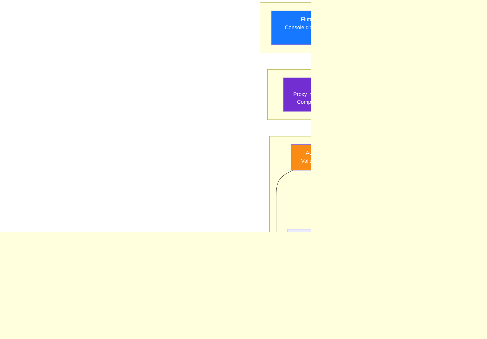

# Topologie du système

```mermaid
flowchart TB
    subgraph clients["Couche client"]
        flutter["Flutter Web<br/>Console d'administration PC"]
        harmony["HarmonyOS ArkTS<br/>Client mobile/tablette"]
    end

    subgraph gateway["Couche passerelle"]
        nginx["Nginx<br/>Proxy inverse HTTPS<br/>Compression Gzip"]
    end

    subgraph app["Couche application - webman v2"]
        auth["AdminAuth<br/>Validation JWT"]
        perm["AdminPermission<br/>Autorisation RBAC"]
        admin["Contrôleurs Admin<br/>Dashboard/User/Role/Permission"]
        public["Contrôleurs publics<br/>Captcha/Auth"]
        common["Services communs<br/>Hashids/Snowflake/Encryption"]
    end

    subgraph storage["Couche stockage"]
        mysql[("MySQL 8.0<br/>Stockage principal - préfixe erp_")]
        es[("Elasticsearch<br/>Recherche plein texte - préfixe erp_")]
        redis[("Redis<br/>Session/Cache/Captcha")]
    end

    flutter --> nginx
    harmony --> nginx
    nginx --> auth
    auth --> perm
    perm --> admin
    auth --> public
    admin --> common
    public --> common
    admin --> mysql
    public --> mysql
    admin --> es
    public --> es
    auth --> redis
    public --> redis

    style flutter fill:#1677FF,color:#fff
    style harmony fill:#1677FF,color:#fff
    style nginx fill:#722ED1,color:#fff
    style auth fill:#FA8C16,color:#fff
    style perm fill:#FA8C16,color:#fff
    style common fill:#52C41A,color:#fff
    style mysql fill:#1890FF,color:#fff
    style es fill:#1890FF,color:#fff
    style redis fill:#1890FF,color:#fff
```
