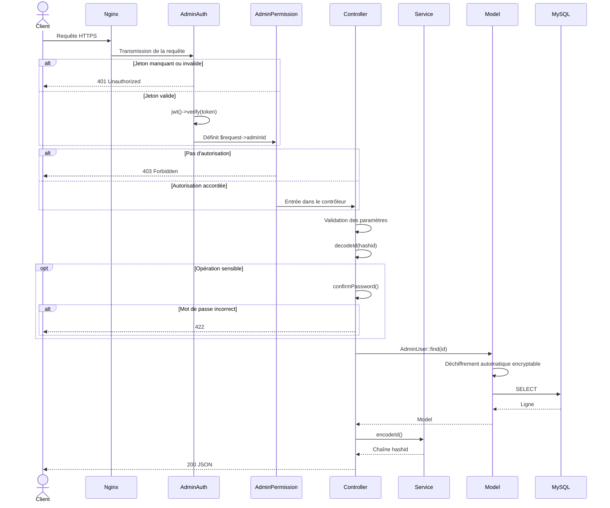

# Cycle de vie d'une requête

```mermaid
sequenceDiagram
    actor C as Client
    participant N as Nginx
    participant MW1 as AdminAuth
    participant MW2 as AdminPermission
    participant CTL as Controller
    participant SVC as Service
    participant MDL as Model
    participant DB as MySQL

    C->>N: Requête HTTPS
    N->>MW1: Transmission de la requête

    alt Jeton manquant ou invalide
        MW1-->>C: 401 Unauthorized
    else Jeton valide
        MW1->>MW1: jwt()->verify(token)
        MW1->>MW2: Définit $request->adminId
    end

    alt Pas d'autorisation
        MW2-->>C: 403 Forbidden
    else Autorisation accordée
        MW2->>CTL: Entrée dans le contrôleur
    end

    CTL->>CTL: Validation des paramètres
    CTL->>CTL: decodeId(hashid)

    opt Opération sensible
        CTL->>CTL: confirmPassword()
        alt Mot de passe incorrect
            CTL-->>C: 422
        end
    end

    CTL->>MDL: AdminUser::find(id)
    MDL->>MDL: Déchiffrement automatique encryptable
    MDL->>DB: SELECT
    DB-->>MDL: Ligne
    MDL-->>CTL: Model

    CTL->>SVC: encodeId()
    SVC-->>CTL: Chaîne hashid

    CTL-->>C: 200 JSON
```
