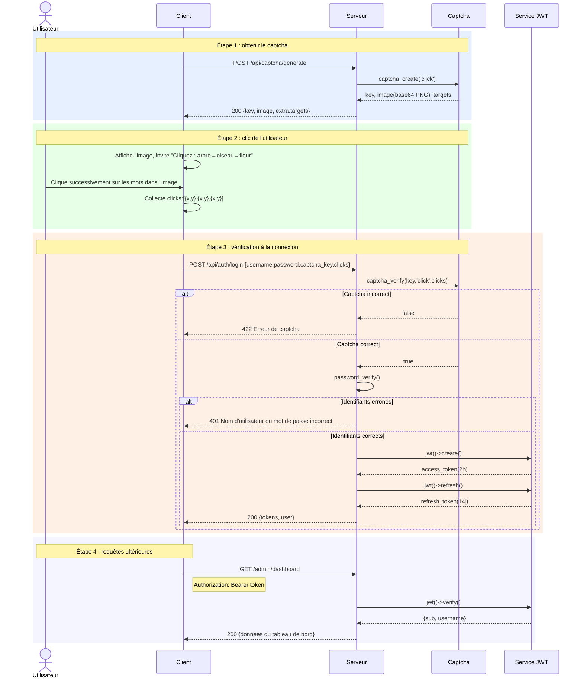

# Flux d'authentification et de captcha

```mermaid
sequenceDiagram
    actor U as Utilisateur
    participant CL as Client
    participant SV as Serveur
    participant CAP as Captcha
    participant JWT as Service JWT

    rect rgb(230, 240, 255)
    Note over U,CAP: Étape 1 : obtenir le captcha
    CL->>SV: POST /api/captcha/generate
    SV->>CAP: captcha_create('click')
    CAP-->>SV: key, image(base64 PNG), targets
    SV-->>CL: 200 {key, image, extra.targets}
    end

    rect rgb(230, 255, 230)
    Note over U,CAP: Étape 2 : clic de l'utilisateur
    CL->>CL: Affiche l'image, invite "Cliquez : arbre→oiseau→fleur"
    U->>CL: Clique successivement sur les mots dans l'image
    CL->>CL: Collecte clicks:[{x,y},{x,y},{x,y}]
    end

    rect rgb(255, 240, 230)
    Note over U,CAP: Étape 3 : vérification à la connexion
    CL->>SV: POST /api/auth/login {username,password,captcha_key,clicks}
    SV->>CAP: captcha_verify(key,'click',clicks)

    alt Captcha incorrect
        CAP-->>SV: false
        SV-->>CL: 422 Erreur de captcha
    else Captcha correct
        CAP-->>SV: true
        SV->>SV: password_verify()
        alt Identifiants erronés
            SV-->>CL: 401 Nom d'utilisateur ou mot de passe incorrect
        else Identifiants corrects
            SV->>JWT: jwt()->create()
            JWT-->>SV: access_token(2h)
            SV->>JWT: jwt()->refresh()
            JWT-->>SV: refresh_token(14j)
            SV-->>CL: 200 {tokens, user}
        end
    end
    end

    rect rgb(245, 245, 255)
    Note over U,CL: Étape 4 : requêtes ultérieures
    CL->>SV: GET /admin/dashboard
    Note right of CL: Authorization: Bearer token
    SV->>JWT: jwt()->verify()
    JWT-->>SV: {sub, username}
    SV-->>CL: 200 {données du tableau de bord}
    end
```
