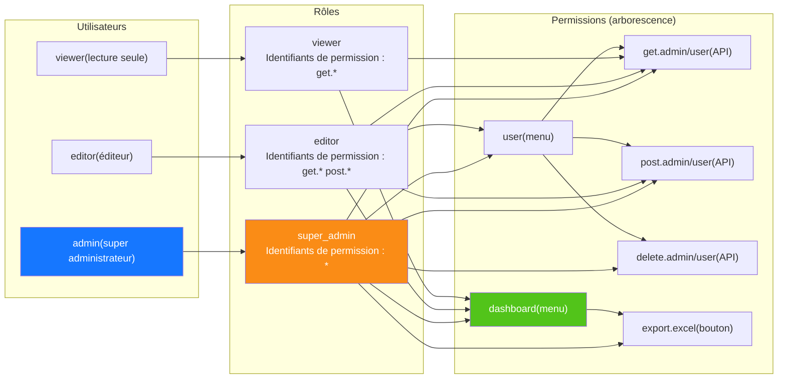
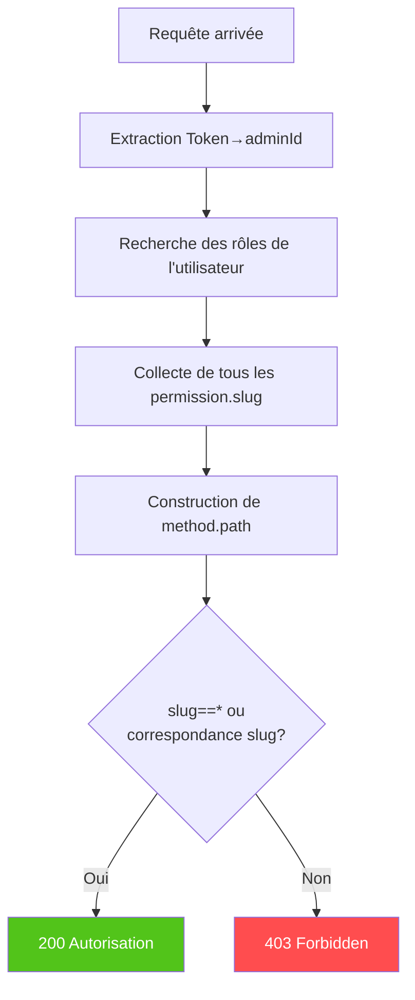
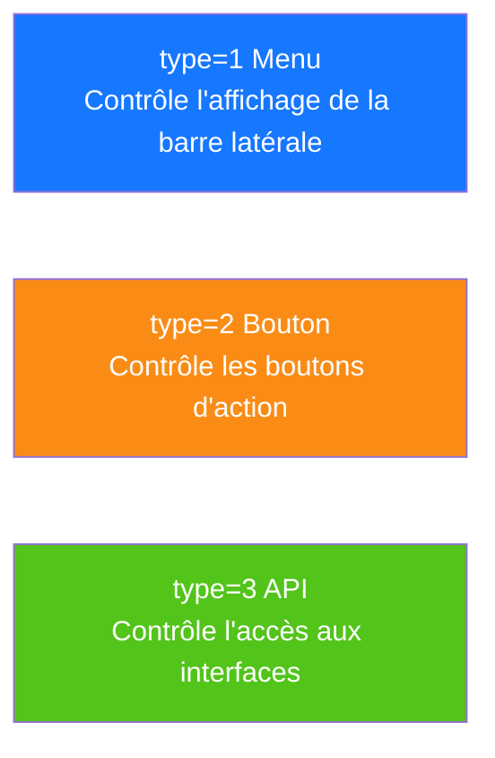

# Modèle d'autorisation RBAC

## Relations utilisateur-rôle-permission

```mermaid
flowchart LR
    subgraph users["Utilisateurs"]
        u1["admin(super administrateur)"]
        u2["editor(éditeur)"]
        u3["viewer(lecture seule)"]
    end

    subgraph roles["Rôles"]
        r1["super_admin<br/>Identifiants de permission : *"]
        r2["editor<br/>Identifiants de permission : get.* post.*"]
        r3["viewer<br/>Identifiants de permission : get.*"]
    end

    subgraph permissions["Permissions (arborescence)"]
        p1["dashboard(menu)"]
        p2["user(menu)"]
        p3["get.admin/user(API)"]
        p4["post.admin/user(API)"]
        p5["delete.admin/user(API)"]
        p6["export.excel(bouton)"]
    end

    u1 --> r1
    u2 --> r2
    u3 --> r3
    r1 --> p1 & p2 & p3 & p4 & p5 & p6
    r2 --> p1 & p2 & p3 & p4
    r3 --> p1 & p3
    p2 --> p3 & p4 & p5
    p1 --> p6

    style u1 fill:#1677FF,color:#fff
    style r1 fill:#FA8C16,color:#fff
    style p1 fill:#52C41A,color:#fff
```

## Flux de décision de permission

```mermaid
flowchart TD
    start["Requête arrivée"] --> extract["Extraction Token→adminId"]
    extract --> findRoles["Recherche des rôles de l'utilisateur"]
    findRoles --> collectSlug["Collecte de tous les permission.slug"]
    collectSlug --> buildKey["Construction de method.path"]
    buildKey --> check{"slug==* ou<br/>correspondance slug?"}
    check -->|"Oui"| allow["200 Autorisation"]
    check -->|"Non"| deny["403 Forbidden"]

    style allow fill:#52C41A,color:#fff
    style deny fill:#FF4D4F,color:#fff
```

## Types de permissions

```mermaid
flowchart LR
    t1["type=1 Menu<br/>Contrôle l'affichage de la barre latérale"]
    t2["type=2 Bouton<br/>Contrôle les boutons d'action"]
    t3["type=3 API<br/>Contrôle l'accès aux interfaces"]

    style t1 fill:#1677FF,color:#fff
    style t2 fill:#FA8C16,color:#fff
    style t3 fill:#52C41A,color:#fff
```
