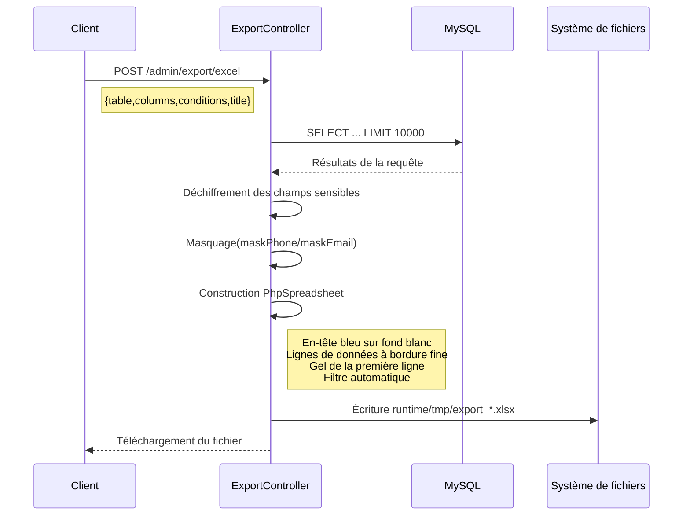
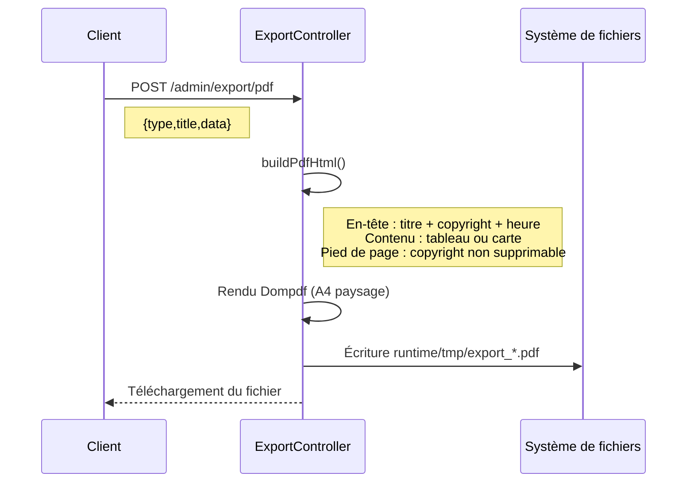

# Processus métier d'export

## Export Excel

```mermaid
sequenceDiagram
    participant C as Client
    participant CTL as ExportController
    participant DB as MySQL
    participant FS as Système de fichiers

    C->>CTL: POST /admin/export/excel
    Note right of C: {table,columns,conditions,title}
    CTL->>DB: SELECT ... LIMIT 10000
    DB-->>CTL: Résultats de la requête
    CTL->>CTL: Déchiffrement des champs sensibles
    CTL->>CTL: Masquage(maskPhone/maskEmail)
    CTL->>CTL: Construction PhpSpreadsheet
    Note right of CTL: En-tête bleu sur fond blanc<br/>Lignes de données à bordure fine<br/>Gel de la première ligne<br/>Filtre automatique
    CTL->>FS: Écriture runtime/tmp/export_*.xlsx
    CTL-->>C: Téléchargement du fichier
```

## Export PDF

```mermaid
sequenceDiagram
    participant C as Client
    participant CTL as ExportController
    participant FS as Système de fichiers

    C->>CTL: POST /admin/export/pdf
    Note right of C: {type,title,data}
    CTL->>CTL: buildPdfHtml()
    Note right of CTL: En-tête : titre + copyright + heure<br/>Contenu : tableau ou carte<br/>Pied de page : copyright non supprimable
    CTL->>CTL: Rendu Dompdf (A4 paysage)
    CTL->>FS: Écriture runtime/tmp/export_*.pdf
    CTL-->>C: Téléchargement du fichier
```
