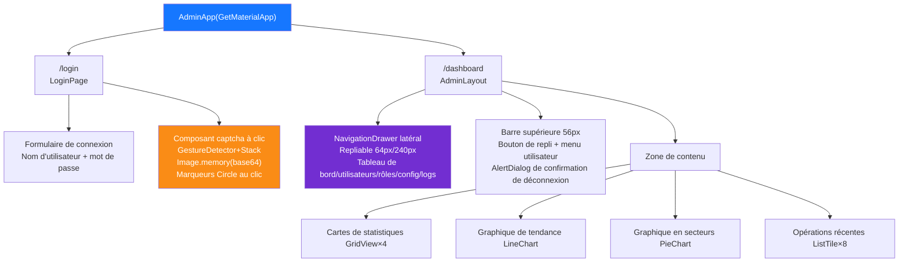
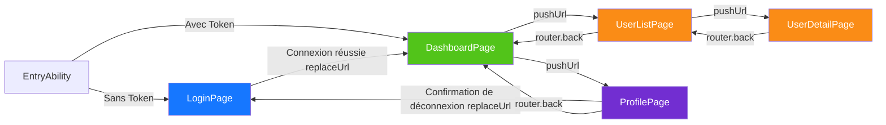

# Architecture des composants frontend

## Arborescence des composants Flutter Web

```mermaid
flowchart TD
    app["AdminApp(GetMaterialApp)"]

    app --> login["/login<br/>LoginPage"]
    app --> dashboard["/dashboard<br/>AdminLayout"]

    login --> form["Formulaire de connexion<br/>Nom d'utilisateur + mot de passe"]
    login --> captcha["Composant captcha à clic<br/>GestureDetector+Stack<br/>Image.memory(base64)<br/>Marqueurs Circle au clic"]

    dashboard --> sidebar["NavigationDrawer latéral<br/>Repliable 64px/240px<br/>Tableau de bord/utilisateurs/rôles/config/logs"]
    dashboard --> header["Barre supérieure 56px<br/>Bouton de repli + menu utilisateur<br/>AlertDialog de confirmation de déconnexion"]
    dashboard --> content["Zone de contenu"]

    content --> stats["Cartes de statistiques GridView×4"]
    content --> chart["Graphique de tendance LineChart"]
    content --> pie["Graphique en secteurs PieChart"]
    content --> logs["Opérations récentes ListTile×8"]

    style app fill:#1677FF,color:#fff
    style captcha fill:#FA8C16,color:#fff
    style sidebar fill:#722ED1,color:#fff
```

## Routage des pages HarmonyOS

```mermaid
flowchart LR
    entry["EntryAbility"]
    entry -->|"Sans Token"| loginH["LoginPage"]
    entry -->|"Avec Token"| dashH["DashboardPage"]

    loginH -->|"Connexion réussie replaceUrl"| dashH

    dashH -->|"pushUrl"| userList["UserListPage"]
    dashH -->|"pushUrl"| profile["ProfilePage"]

    userList -->|"pushUrl"| userDetail["UserDetailPage"]
    userList -->|"router.back"| dashH
    userDetail -->|"router.back"| userList

    profile -->|"Confirmation de déconnexion replaceUrl"| loginH
    profile -->|"router.back"| dashH

    style loginH fill:#1677FF,color:#fff
    style dashH fill:#52C41A,color:#fff
    style userList fill:#FA8C16,color:#fff
    style userDetail fill:#FA8C16,color:#fff
    style profile fill:#722ED1,color:#fff
```
