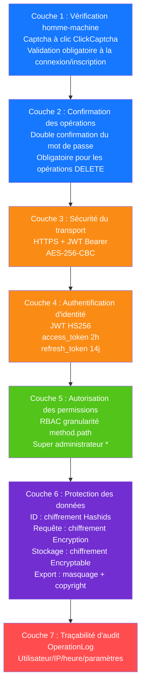

# Défense en profondeur de la sécurité

```mermaid
flowchart TB
    l1["Couche 1 : Vérification homme-machine<br/>Captcha à clic ClickCaptcha<br/>Validation obligatoire à la connexion/inscription"]
    l2["Couche 2 : Confirmation des opérations<br/>Double confirmation du mot de passe<br/>Obligatoire pour les opérations DELETE"]
    l3["Couche 3 : Sécurité du transport<br/>HTTPS + JWT Bearer<br/>AES-256-CBC"]
    l4["Couche 4 : Authentification d'identité<br/>JWT HS256<br/>access_token 2h<br/>refresh_token 14j"]
    l5["Couche 5 : Autorisation des permissions<br/>RBAC granularité method.path<br/>Super administrateur *"]
    l6["Couche 6 : Protection des données<br/>ID : chiffrement Hashids<br/>Requête : chiffrement Encryption<br/>Stockage : chiffrement Encryptable<br/>Export : masquage + copyright"]
    l7["Couche 7 : Traçabilité d'audit<br/>OperationLog<br/>Utilisateur/IP/heure/paramètres"]

    l1 --> l2 --> l3 --> l4 --> l5 --> l6 --> l7

    style l1 fill:#1677FF,color:#fff
    style l2 fill:#1677FF,color:#fff
    style l3 fill:#FA8C16,color:#fff
    style l4 fill:#FA8C16,color:#fff
    style l5 fill:#52C41A,color:#fff
    style l6 fill:#722ED1,color:#fff
    style l7 fill:#FF4D4F,color:#fff
```
