# वास्तुकला आरेख और व्यावसायिक तर्क आरेख

> Copyright (c) 2026 erik <erik@erik.xyz> — https://erik.xyz

> निम्नलिखित Mermaid चार्ट GitHub / GitLab / VS Code में स्वचालित रूप से रेंडर होते हैं। अन्य वातावरणों के लिए [Mermaid Live Editor](https://mermaid.live/) का उपयोग करें।

---

## 1. सिस्टम टोपोलॉजी वास्तुकला

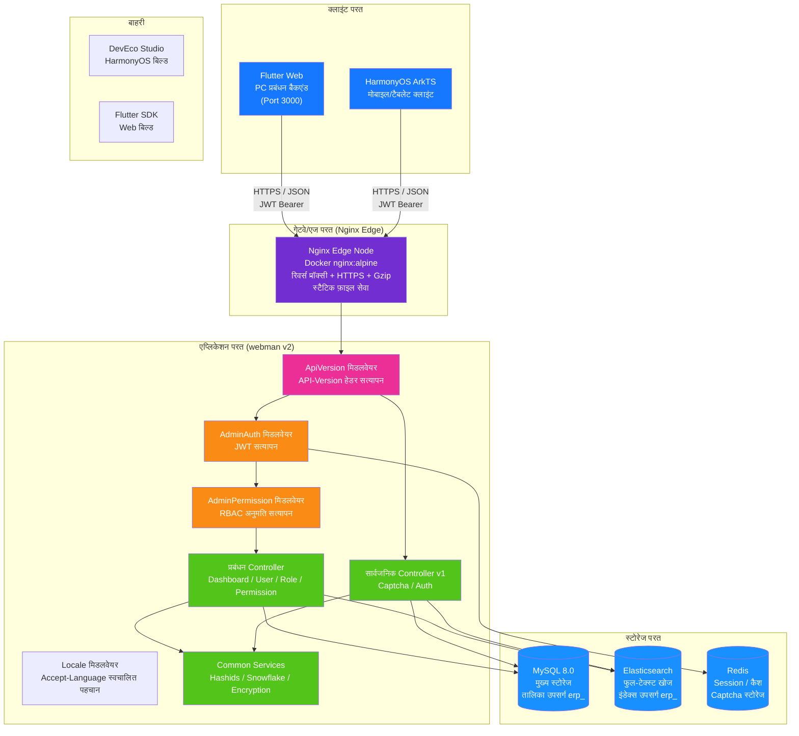

---

## 2. बैकएंड परत वास्तुकला

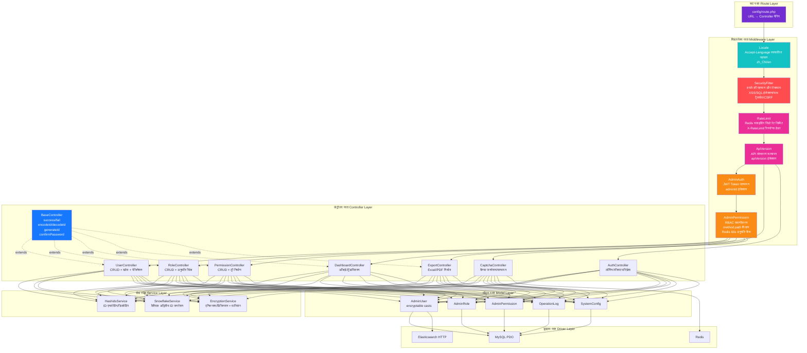

### ERP व्यावसायिक परत विस्तार

जैसे-जैसे सिस्टम शुद्ध प्रबंधन बैकएंड से पूर्ण ERP सिस्टम में विकसित हुआ, कंट्रोलर परत और सेवा परत में निम्नलिखित व्यावसायिक मॉड्यूल जोड़े गए:

| परत | निर्देशिका | विवरण |
|------|------|------|
| व्यावसायिक कंट्रोलर | `app/controller/{product,purchase,sales,inventory,finance,crm,workflow,notification,project,hr,manufacturing,report}/` | 70, मॉड्यूल के अनुसार विभाजित, व्यावसायिक अनुरोधों को संभालते हैं |
| व्यावसायिक सेवा | `app/service/{inventory,finance,notification}/` | इन्वेंटरी प्रवेश/निकास + लागत गणना, वित्तीय प्राप्य/देय + निपटान, नोटिफिकेशन भेजना |

---

## 3. अनुरोध जीवनचक्र

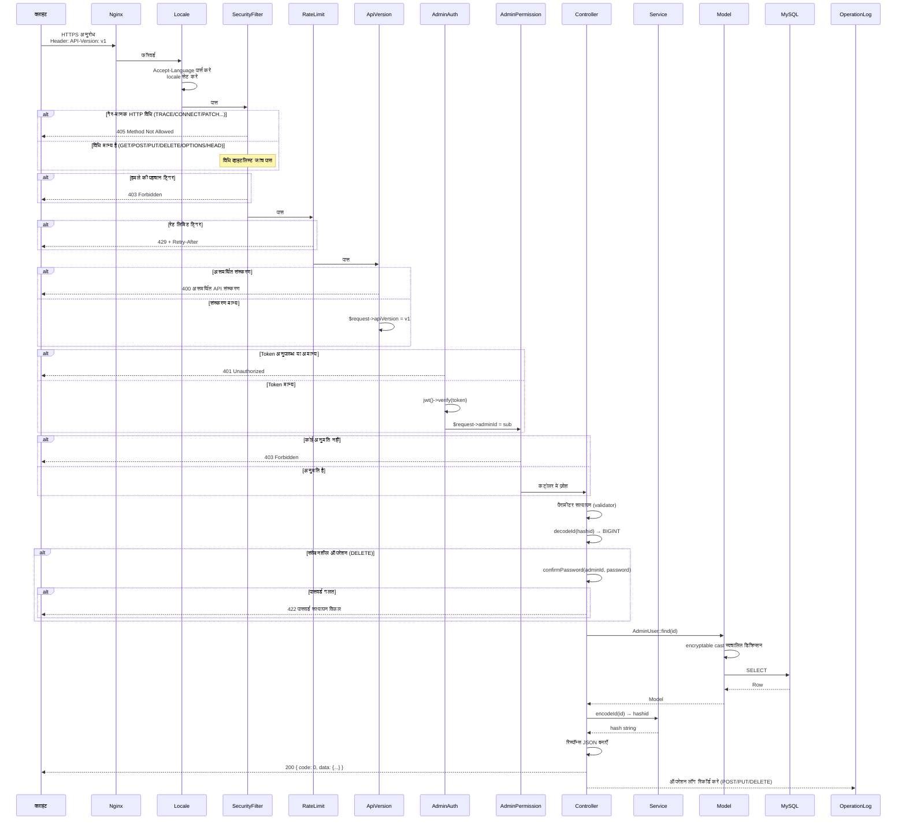

---

## 4. प्रमाणीकरण और कैप्चा प्रवाह

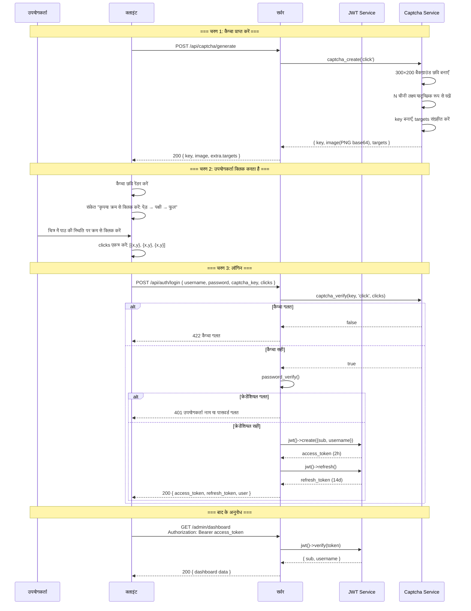

---

## 5. RBAC अनुमति मॉडल

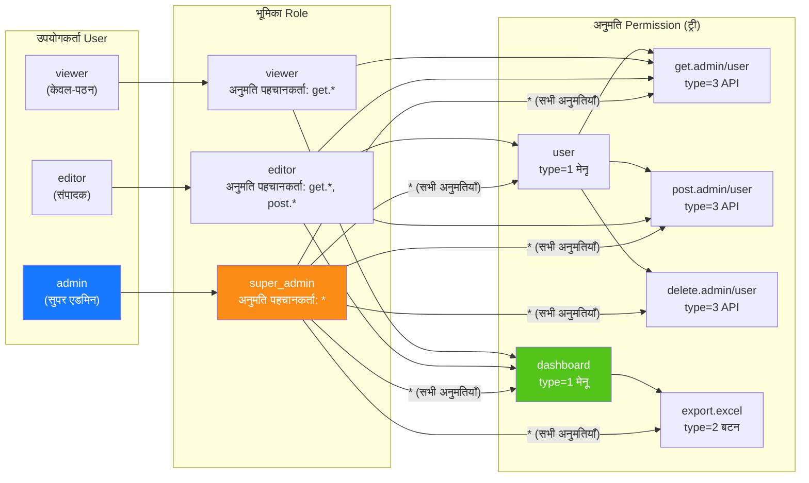

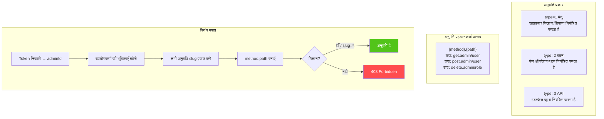

---

## 6. ID का पूर्ण जीवनचक्र

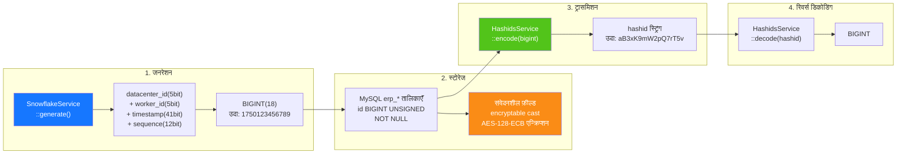

---

## 7. डेटा एन्क्रिप्शन परतें

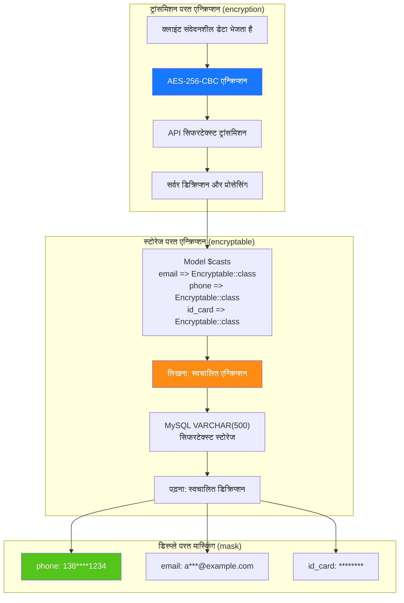

---

## 8. डेटाबेस ER संबंध

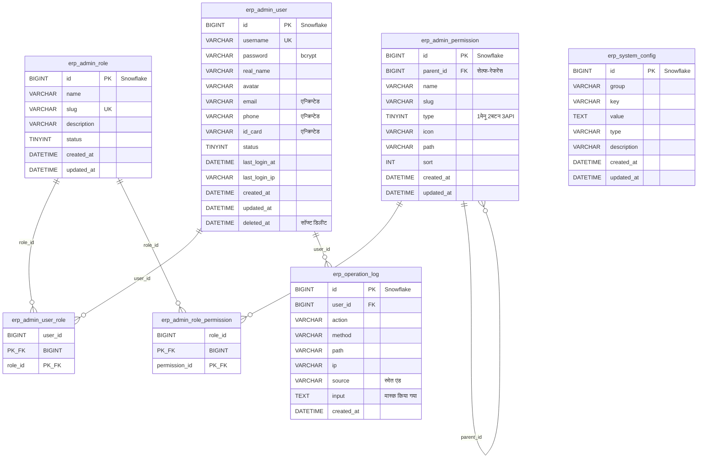

---

## 9. निर्यात व्यावसायिक प्रक्रिया

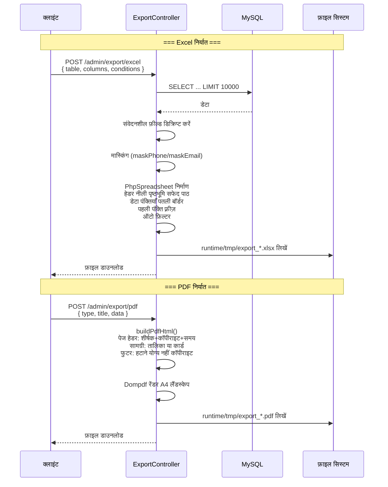

---

## 10. Flutter Web कंपोनेंट ट्री

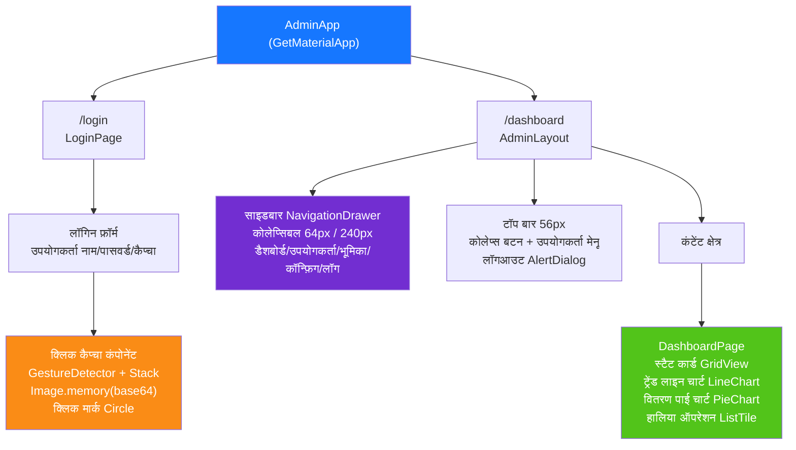

---

## 11. HarmonyOS पेज रूटिंग

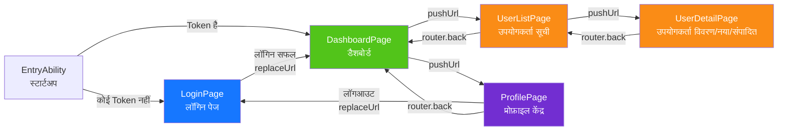

---

## 12. सुरक्षा गहन रक्षा परिदृश्य

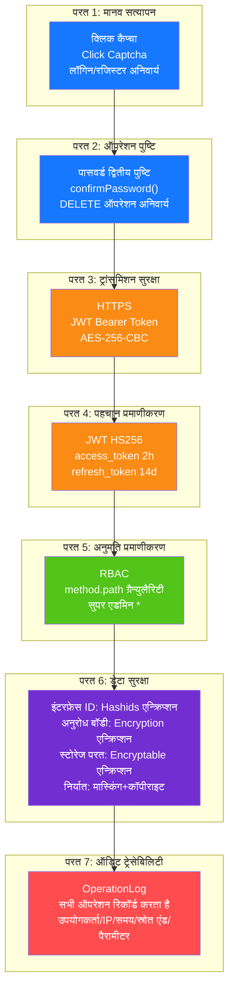

---

## 13. डिप्लॉयमेंट टोपोलॉजी

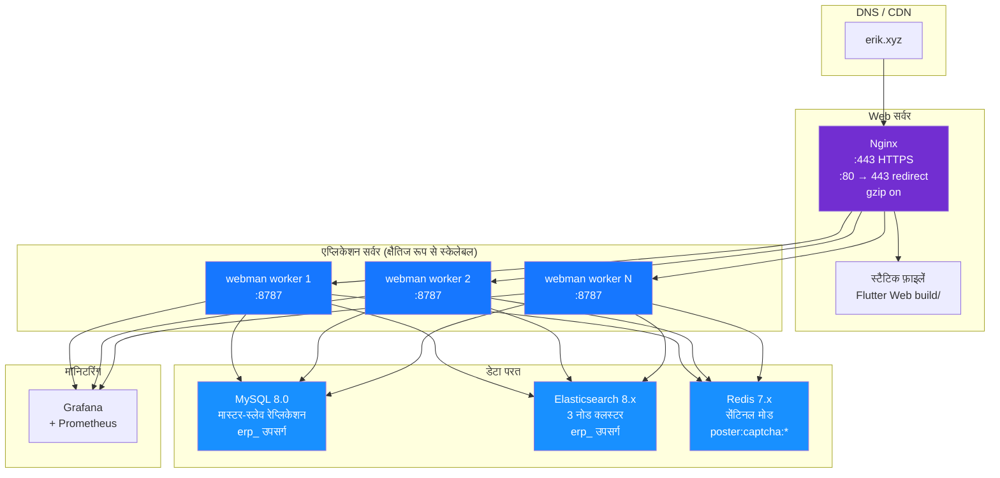

---

## 14. ERP सिस्टम समग्र वास्तुकला

```mermaid
graph TB
    subgraph Client["क्लाइंट परत"]
        FW["Flutter Web<br/>PC प्रबंधन बैकएंड"]
        FA["Flutter App<br/>iOS/Android/macOS/Windows/Linux"]
        HW["HarmonyOS<br/>हार्मनी नेटिव App"]
    end

    subgraph Gateway["API गेटवे परत"]
        MW["मिडलवेयर चेन<br/>Locale→Cors→SecurityFilter→RateLimit→Auth→Permission→OpLog"]
    end

    subgraph Business["व्यावसायिक मॉड्यूल परत"]
        direction LR
        Admin["सिस्टम प्रबंधन<br/>उपयोगकर्ता/भूमिका/अनुमति/कॉन्फ़िग/लॉग"]
        Product["उत्पाद प्रबंधन<br/>उत्पाद/श्रेणी/ब्रांड/वेयरहाउस/सप्लायर/ग्राहक"]
        Purchase["क्रय प्रबंधन<br/>अनुरोध→ऑर्डर→प्राप्ति→वापसी→निपटान"]
        Sales["बिक्री प्रबंधन<br/>कोटेशन→ऑर्डर→शिपमेंट→वापसी→निपटान"]
        Inventory["इन्वेंटरी प्रबंधन<br/>प्रवेश/निकास/बैच/स्टॉक ले/ट्रांसफर/अलर्ट"]
        Finance["वित्त प्रबंधन<br/>खाता/वाउचर/प्राप्य देय/लेजर/विवरण/रिपोर्ट/रिइम्बर्समेंट"]
        CRM["CRM<br/>ग्राहक/संपर्क/फॉलोअप/फ़नल/पब्लिक पूल/कोटेशन/कॉन्ट्रैक्ट"]
        Workflow["अनुमोदन वर्कफ़्लो<br/>वर्कफ़्लो परिभाषा/सबमिट/स्वीकृत/अस्वीकृत/वापस लें"]
        Notification["संदेश नोटिफिकेशन<br/>नोटिफिकेशन सूची/पढ़ा/अपठित गणना"]
        Project["प्रोजेक्ट प्रबंधन<br/>प्रोजेक्ट/कार्य/कार्य-घंटे रिकॉर्ड"]
        HR["मानव संसाधन<br/>विभाग/कर्मचारी/पद/उपस्थिति/अवकाश/वेतन"]
        Manufacturing["उत्पादन निर्माण<br/>BOM/उत्पादन ऑर्डर/प्रक्रिया मार्ग/वर्कस्टेशन/MRP"]
        Report["कस्टम रिपोर्ट<br/>रिपोर्ट टेम्पलेट/डेटासेट/फ़ील्ड/फ़िल्टर/शेड्यूल"]
    end

    subgraph Service["व्यावसायिक सेवा परत"]
        IS["InventoryService<br/>प्रवेश/निकास + मूविंग वेटेड एवरेज लागत"]
        FS["FinanceService<br/>प्राप्य/देय स्वचालित जनरेशन + निपटान"]
        NS["NotificationService<br/>नोटिफिकेशन एकीकृत भेजना"]
    end

    subgraph Data["डेटा परत"]
        MySQL["MySQL 8.0<br/>163 व्यावसायिक तालिकाएँ"]
        Redis["Redis 7<br/>कैश/रेट लिमिट/Session"]
        ES["Elasticsearch 8<br/>फुल-टेक्स्ट खोज"]
    end

    Client --> Gateway
    Gateway --> Business
    Business --> Service
    Service --> Data
    Business --> Data
```

---

## 15. क्रॉस-मॉड्यूल डेटा प्रवाह

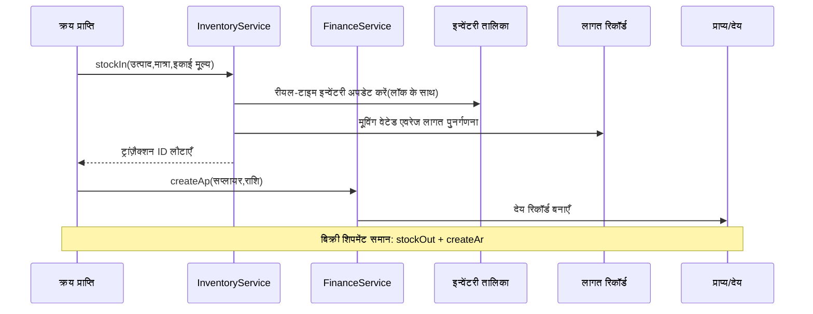

---

## 16. इन्वेंटरी लागत गणना डेटा प्रवाह

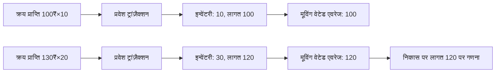

---

## 17. अनुमोदन वर्कफ़्लो डेटा प्रवाह

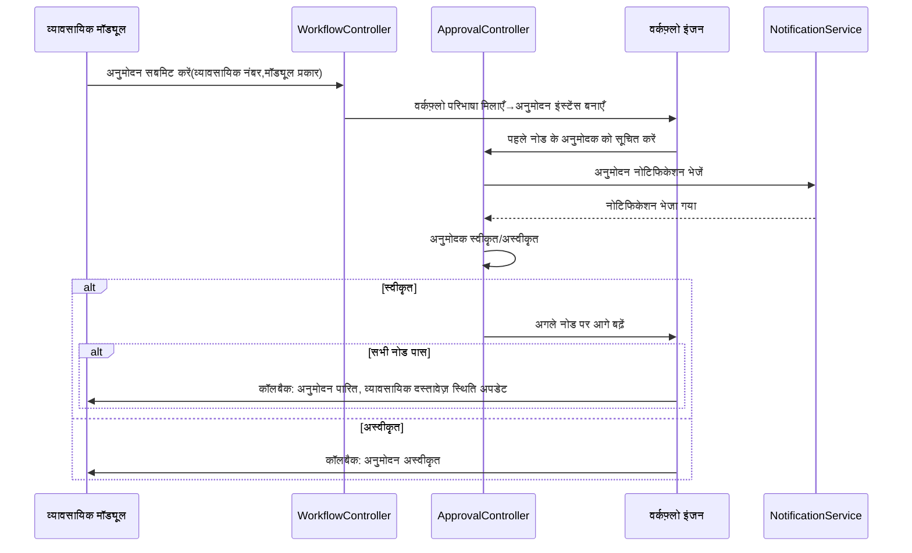

---

## 18. संदेश नोटिफिकेशन डेटा प्रवाह

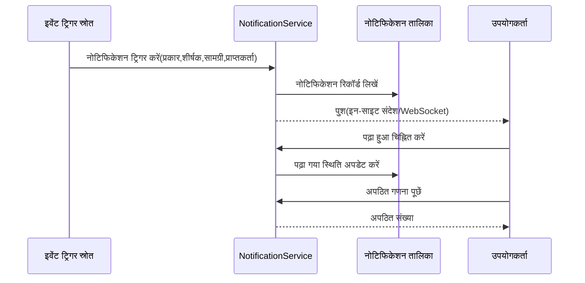

---

## 19. MRP सामग्री आवश्यकता योजना डेटा प्रवाह

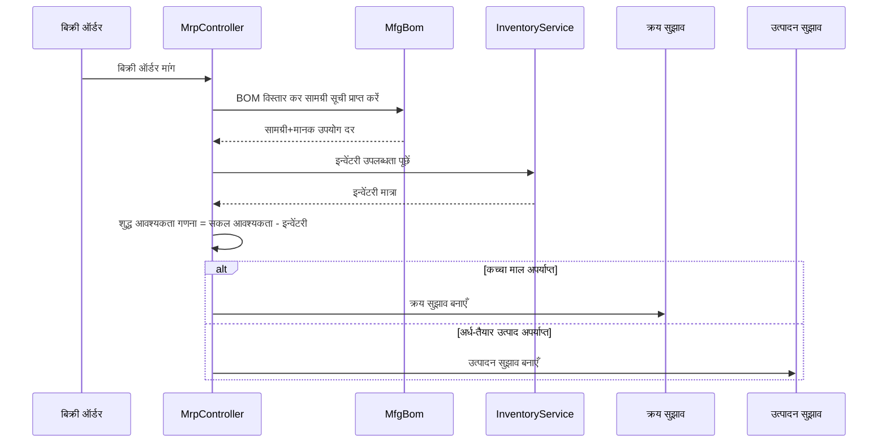

---

## 20. ERP मॉड्यूल कंट्रोलर-सेवा-मॉडल मैपिंग तालिका

> सेवा परत विवरण: `कोर सेवा` कॉलम उस मॉड्यूल को चिह्नित करता है जिसके व्यावसायिक सेवाएँ पहले से स्थानांतरित हो चुकी हैं; **⚠ कंट्रोलर सीधे मॉडल से क्वेरी करता है, ज्ञात तकनीकी ऋण** चिह्नित मॉड्यूल में,
> कंट्रोलर अभी भी सीधे मॉडल क्वेरी/राइट विधियों (`XxxModel::find/where/save` आदि) को कॉल करते हैं, सेवा परत अभी तक नहीं निकाली गई है, यह ज्ञात तकनीकी ऋण है,
> भविष्य में P2-F2 सेवा परत हल्के निष्कर्षण पैटर्न (`app/service/AbstractCrudService` सामान्य CRUD आधार वर्ग + मॉड्यूल सेवा) के अनुसार धीरे-धीरे समेकित किया जाएगा।

| मॉड्यूल | Controllers (निर्देशिका) | कोर सेवा | मुख्य Model | तालिका संख्या |
|------|-------------------|-------------|-----------|------|
| सिस्टम प्रबंधन | admin/controller/ (14) | - ⚠कंट्रोलर सीधे मॉडल क्वेरी, ज्ञात तकनीकी ऋण | AdminUser, AdminRole, AdminPermission | 7 |
| उत्पाद प्रबंधन | controller/product/ (7) | ProductService | Product, Category, Brand, Warehouse, Supplier, Customer | 11 |
| क्रय प्रबंधन | controller/purchase/ (5) | InventoryService, FinanceService ⚠CRUD अभी भी सीधे क्वेरी, ज्ञात तकनीकी ऋण | PurchaseOrder, PurchaseReceive | 9 |
| बिक्री प्रबंधन | controller/sales/ (5) | InventoryService, FinanceService ⚠CRUD अभी भी सीधे क्वेरी, ज्ञात तकनीकी ऋण | SalesOrder, SalesDelivery | 9 |
| इन्वेंटरी प्रबंधन | controller/inventory/ (5) | InventoryService ⚠CRUD अभी भी सीधे क्वेरी, ज्ञात तकनीकी ऋण | Inventory, InventoryFlow, CostRecord | 11 |
| वित्त प्रबंधन | controller/finance/ (20) | FinanceService ⚠CRUD अभी भी सीधे क्वेरी, ज्ञात तकनीकी ऋण | FinanceArAp, FinanceVoucher, FinanceReceipt, FinancePayment, FinanceGeneralLedger, FinanceBalanceSheet, FinanceAsset, FinanceBudget, FinanceCostCenter | 26 |
| CRM | controller/crm/ (10) | CrmService | CrmOpportunity, CrmFollowRecord, CrmContract, CrmPoolRule, CrmQuotation, CrmCampaign, CrmTicket, CrmAnalyticsReport | 16 |
| अनुमोदन वर्कफ़्लो | controller/workflow/ (2) | - ⚠कंट्रोलर सीधे मॉडल क्वेरी, ज्ञात तकनीकी ऋण | ApprovalWorkflow, ApprovalInstance, ApprovalNode, ApprovalRecord | 4 |
| संदेश नोटिफिकेशन | controller/notification/ (1) | NotificationService ⚠CRUD अभी भी सीधे क्वेरी, ज्ञात तकनीकी ऋण | Notification, NotificationSetting, NotificationTemplate | 3 |
| प्रोजेक्ट प्रबंधन | controller/project/ (3) | - ⚠कंट्रोलर सीधे मॉडल क्वेरी, ज्ञात तकनीकी ऋण | Project, ProjectTask, ProjectTimesheet, ProjectMember, ProjectGantt | 5 |
| मानव संसाधन | controller/hr/ (5) | HrService | HrDepartment, HrEmployee, HrPosition, HrAttendance, HrLeave, HrSalary | 8 |
| उत्पादन निर्माण | controller/manufacturing/ (5) | ManufacturingService | MfgBom, MfgProductionOrder, MfgRouting, MfgWorkstation, MfgMrpPlan | 8 |
| कस्टम रिपोर्ट | controller/report/ (2) | - ⚠कंट्रोलर सीधे मॉडल क्वेरी, ज्ञात तकनीकी ऋण | ReportTemplate, ReportDataset, ReportField, ReportFilter, ReportSchedule | 5 |
| EAM उपकरण प्रबंधन | controller/eam/ (4) | - ⚠कंट्रोलर सीधे मॉडल क्वेरी, ज्ञात तकनीकी ऋण | EamEquipment, EamMaintenancePlan, EamRepairOrder, EamSparePart | 4 |
| DMS दस्तावेज़ प्रबंधन | controller/dms/ (2) | - ⚠कंट्रोलर सीधे मॉडल क्वेरी, ज्ञात तकनीकी ऋण | DmsCategory, DmsDocument, DmsDocumentVersion | 3 |
| BI डैशबोर्ड | controller/bi/ (3) | - ⚠कंट्रोलर सीधे मॉडल क्वेरी, ज्ञात तकनीकी ऋण | BiDashboard, BiWidget | 2 |

### 20.1 P2-F2 सेवा परत हल्के निष्कर्षण रिकॉर्ड (crm/hr/manufacturing/product निष्कर्षण पूर्ण)

| मॉड्यूल | निष्कर्षण से पहले कंट्रोलर सीधे क्वेरी कॉल | निष्कर्षण के बाद | नई सेवा | निष्कर्षण सामग्री |
|------|----------------------|--------|--------------|----------|
| CRM | 57 | 0 | `app/service/crm/CrmService.php` | सामान्य CRUD + कॉन्ट्रैक्ट स्थिति संक्रमण, कोटेशन से कॉन्ट्रैक्ट, पब्लिक पूल क्लेम/रिलीज़, टिकट असाइन/समाधान/उत्तर, विवरण कैस्केड क्लीनअप, विश्लेषण रिपोर्ट डेटा निर्माण |
| मानव संसाधन | 38 | 0 | `app/service/hr/HrService.php` | सामान्य CRUD + अटेंडेंस लेट/जल्दी निकलना निर्धारण, अवकाश अनुमोदन (स्वचालित अवकाश उपस्थिति जनरेशन), वेतन अद्वितीयता/शुद्ध वेतन गणना/भुगतान/बैच जनरेशन |
| उत्पादन निर्माण | 33 | 0 | `app/service/manufacturing/ManufacturingService.php` | सामान्य CRUD + कार्य ऑर्डर प्रारंभ/समाप्त संक्रमण, BOM संस्करण प्रतिलिपि/प्रभावी पारस्परिक बहिष्करण, MRP विवरण जनरेशन |
| उत्पाद प्रबंधन | 29 | 0 | `app/service/product/ProductService.php` | सामान्य CRUD + उत्पाद ट्रांज़ैक्शन निर्माण (SKU/मूल्य), फ़ील्ड द्वारा मूल मान संरक्षित अपडेट, विवरण संबंधित लोडिंग |

निष्कर्षण पैटर्न: `app/service/AbstractCrudService.php` `list/all/find/create/update/delete/deleteWhere` सामान्य CRUD
और `normalizePageParams/canTransition` शुद्ध तर्क सहायक प्रदान करता है; मॉड्यूल सेवा इसे विरासत में लेती है और मॉड्यूल-विशिष्ट व्यवसाय जमा करती है।
कंट्रोलर `Container::get(XxxService::class)` (class_exists फॉलबैक) के माध्यम से सेवा इंजेक्ट करते हैं, रूट/पैरामीटर/रिटर्न संरचना पूरी तरह अपरिवर्तित रहती है;
hashid एन्कोडिंग/डिकोडिंग, पासवर्ड द्वितीय पुष्टि, रिस्पॉन्स रैपिंग जैसे HTTP संबंधी पहलू कंट्रोलर में ही रहते हैं।
नई सेवाएँ `config/dependence.php` में पंजीकृत हैं (यह फ़ाइल dead config है, addDefinitions द्वारा लोड नहीं होती, रनटाइम कंटेनर
class_exists फॉलबैक इंस्टैंशिएशन पर निर्भर करता है, इसलिए सभी सेवाएँ बिना-पैरामीटर कंस्ट्रक्टर रखती हैं)।

निष्कर्षण न होने वाले मॉड्यूल (प्रोजेक्ट प्रबंधन 18 बार, कस्टम रिपोर्ट 18 बार, क्रय 24 बार, बिक्री 24 बार, सिस्टम प्रबंधन 42 बार आदि) तालिका में
"कंट्रोलर सीधे मॉडल क्वेरी, ज्ञात तकनीकी ऋण" के रूप में चिह्नित हैं, अगले इटरेशन में उसी पैटर्न के अनुसार निष्कर्षण किया जाएगा।

---

## OMS/WMS/TMS विस्तार मॉड्यूल (2026-08)

### OMS (Order Management System) — 8 तालिकाएँ
- **ऑर्डर विस्तार** (`erp_oms_order`): मल्टी-चैनल एग्रीगेशन/फ़ुलफ़िलमेंट स्थिति/भुगतान स्थिति/प्राथमिकता
- **ऑर्डर पता** (`erp_oms_order_address`): डिलीवरी/बिलिंग पता (बहु-देश प्रारूप)
- **फ़ुलफ़िलमेंट रिकॉर्ड** (`erp_oms_fulfillment`+`_item`): आवंटित/पिक किया/पैक किया/भेजा गया मात्रा ट्रैकिंग
- **RMA** (`erp_oms_rma`+`_item`): वापसी/अदला-बदली पूर्ण जीवनचक्र
- **इन्वेंटरी प्री-रिज़र्वेशन** (`erp_oms_inventory_reservation`): ATP = physical - reserved
- **चैनल** (`erp_channel`): direct/marketplace/edi/pos

### WMS (Warehouse Management System) — 12 तालिकाएँ
- **वेयरहाउस ज़ोन/लोकेशन** (`erp_wms_zone`, `erp_wms_location`): zone→aisle→rack→level→bin
- **इनबाउंड** (`erp_wms_asn`+`_item`, `erp_wms_receiving`, `erp_wms_putaway_task`+`_item`)
- **आउटबाउंड** (`erp_wms_wave`+`wave_order`, `erp_wms_pick_task`+`_item`, `erp_wms_pack_task`)

### TMS (Transport Management System) — 7 तालिकाएँ
- **कैरियर** (`erp_tms_carrier`+`carrier_service`, `erp_tms_freight_rate`)
- **शिपमेंट** (`erp_tms_shipment`+`_package`, `erp_tms_tracking_event`)
- **इनवॉइस** (`erp_tms_freight_invoice`)

### डेटा प्रवाह
```
OMS: Channel Order → Inventory Reservation (ATP) → Create Fulfillment → WMS
WMS: Wave → Pick → Pack → TMS Shipment
TMS: Rate Shop → Ship → Confirm (stockOut + AR) → Tracking → Delivery
WMS Inbound: ASN → Receive → Putaway (stockIn + AP)
RMA: Request → Approve → Return → Receive (stockIn) → Refund
```

---

## 21. इकोसिस्टम रोडमैप (2026-08)

> विस्तृत डिज़ाइन स्पेक: `superpowers/specs/2026-08-04-erp-ecosystem-roadmap-design.md`

### 21.1 बेसलाइन मूल्यांकन (रोडमैप प्रारंभ के समय)

> P0~P3 सभी डिलीवर हो चुके हैं, वर्तमान समग्र स्कोर 89/100 (CLAUDE.md देखें); निम्न तालिका रोडमैप प्रारंभ से पहले की बेसलाइन स्नैपशॉट है।

| आयाम | स्कोर | प्रमुख अंतर |
|------|------|----------|
| बैकएंड API | 85/100 | कई मॉड्यूल CRUD कंकाल हैं, व्यावसायिक गणना इंजन की कमी |
| सुरक्षा सुरक्षा | 95/100 | 18 परत गहन रक्षा, उत्पादन-तैयार |
| फ्रंटएंड UI | 20/100 | **सबसे बड़ी कमी**: Flutter 12 पेज ~20% मॉड्यूल कवर करते हैं, Web प्रबंधन पैनल अनुपलब्ध |
| ऑप्स इकोसिस्टम | 70/100 | माइग्रेशन रोलबैक, स्वचालित बैकअप, ऑब्ज़र्वेबिलिटी की कमी |
| व्यावसायिक गहराई | 55/100 | वित्त/HR/निर्माण मुख्य एल्गोरिदम लागू नहीं |
| **समग्र** | **65/100** | |

### 21.2 चार-चरण अनुक्रमिक रोडमैप

```
P0(3-4 सप्ताह) → P1(4-6 सप्ताह) → P2(1-2 सप्ताह) → P3(2-3 सप्ताह) = कुल लगभग 13 सप्ताह
```

| चरण | नाम | मुख्य डिलीवरी |
|------|------|----------|
| **P0** | फ्रंटएंड इकोसिस्टम | Flutter Web पूर्ण-मॉड्यूल प्रबंधन पैनल (14 मॉड्यूल 40+ पेज), सामान्य कंपोनेंट लाइब्रेरी, HarmonyOS संरेखण |
| **P1** | व्यावसायिक गहराई | वित्तीय डबल-एंट्री इंजन, वेतन गणना इंजन, MRP इंजन, गुणवत्ता प्रबंधन मॉड्यूल, रीयल-टाइम नोटिफिकेशन (WebSocket) |
| **P2** | ऑप्स विश्वसनीयता | डेटाबेस माइग्रेशन रोलबैक, स्वचालित बैकअप वृद्धि, OpenTelemetry ट्रेसिंग, RabbitMQ क्यू ड्राइवर |
| **P3** | अनुभव वृद्धि | BI ड्रैगेबल डैशबोर्ड, उपकरण प्रबंधन (EAM), मल्टी-टेनेंट आइसोलेशन, दस्तावेज़ प्रबंधन (DMS) |

### 21.3 मिडलवेयर चेन विकास

```
वर्तमान:   Locale → Cors → SecurityFilter → RateLimit → TracingId → {रूट समूह}
P1 के बाद:  Locale → Cors → SecurityFilter → RateLimit → WebSocketUpgrade → {रूट समूह}
P2 के बाद:  Locale → Cors → SecurityFilter → RateLimit → TracingId → WebSocketUpgrade → {रूट समूह}
P3 के बाद:  Locale → Cors → SecurityFilter → RateLimit → TracingId → TenantScope → WebSocketUpgrade → {रूट समूह}
```

### 21.4 P0 लक्ष्य वास्तुकला — Flutter Web प्रबंधन पैनल

| परत | नई सामग्री |
|------|----------|
| लेआउट परत | `AdminLayout` PC तीन-कॉलम लेआउट (कोलेप्सिबल साइडबार + टॉप बार + कंटेंट क्षेत्र) |
| कंपोनेंट परत | `DataTableWrapper`, `FormDialog`, `ConfirmDialog`, `StatCard`, `BreadcrumbNav`, `FileUploader` |
| पेज परत | मौजूदा 12 पेजों से 14 मॉड्यूल 40+ पेज पूर्ण कवरेज तक विस्तार |
| सेवा परत | मौजूदा `ApiService`, `AuthService`, `CaptchaService`, `ExportService` का पुन: उपयोग |

### 21.5 P1 लक्ष्य वास्तुकला — व्यावसायिक गणना इंजन

| इंजन | सेवा वर्ग | प्रमुख नियम |
|------|--------|----------|
| डबल-एंट्री बुककीपिंग | `DoubleEntryService`, `PeriodCloseService`, `AccountBalanceService` | डेबिट/क्रेडिट संतुलन अनिवार्य सत्यापन, अवधि अंत लाभ/हानि कैरी-फॉरवर्ड, मल्टी-करेंसी विनिमय दर रूपांतरण |
| वेतन गणना | `SalaryEngineService`, `SocialInsuranceService`, `HousingFundService`, `TaxCalculatorService` | सामाजिक बीमा आधार ऊपरी/निचली सीमा, आवास निधि अनुपात, व्यक्तिगत कर प्रगतिशील दर, बैंक बल्क भुगतान |
| MRP | `MrpEngineService`, `BomExplosionService`, `NetRequirementService` | BOM परत-दर-परत विस्तार + अपशिष्ट, लो-लेवल कोड (LLC), सुरक्षा स्टॉक, बैच नियम |
| गुणवत्ता | `QmsInspectionService` | IQC आगमन/IPQC प्रक्रिया/OQC शिपमेंट तीन-दस्तावेज़ संक्रमण |
| नोटिफिकेशन | `WebSocketService`, `ChannelRouter` | इन-साइट/ईमेल/वीचैट-वर्क/डिंगटॉक मल्टी-चैनल |

### 21.6 डेटा मॉडल परिवर्तन सारांश

| चरण | नई तालिका संख्या | संबंधित मॉड्यूल |
|------|----------|----------|
| P0 | 0 | शुद्ध फ्रंटएंड, कोई तालिका परिवर्तन नहीं |
| P1 | 14 | वित्त(2) + HR(3) + निर्माण(2) + गुणवत्ता(5) + नोटिफिकेशन(2) |
| P3 | 7 | BI(2) + EAM(3) + DMS(2) |

---

## 22. मल्टी-टेनेंट (आरक्षित क्षमता, सक्षम नहीं)

> कॉपीराइट घोषणा फ़ाइल शीर्षक के समान: Copyright (c) 2026 erik <erik@erik.xyz> — https://erik.xyz

### 22.1 स्थिति और निर्णय

मल्टी-टेनेंट इस प्रोजेक्ट में **आरक्षित क्षमता** के रूप में स्थित है, इस चरण में **वायर-अप नहीं, सक्षम नहीं** (दस्तावेज़ित डाउनग्रेड)। योजना के अनुरूप:
SaaS बिलिंग, टेनेंट सेल्फ-सर्विस ऑनबोर्डिंग जैसे "मल्टी-टेनेंट पूर्ण व्यावसायीकरण समाधान" इस प्रोजेक्ट के निर्माण दायरे में नहीं हैं; इस चरण में केवल न्यूनतम
कोड कंकाल (मिडलवेयर + मॉडल Trait) रखा गया है और सक्षम करने के चरण दिए गए हैं, ताकि भविष्य में आवश्यकता अनुसार सक्षम किया जा सके।
नोट: §21.2 रोडमैप P3 में "मल्टी-टेनेंट आइसोलेशन" को तदनुसार "आरक्षित क्षमता (दस्तावेज़ित डाउनग्रेड)" में समायोजित किया गया है, कंकाल रखा गया है, वायर-अप नहीं।

निर्णय आधार (2026-08 समीक्षा):
- मौजूदा डिप्लॉयमेंट लगभग सभी सिंगल-टेनेंट हैं, वायर-अप अनावश्यक आइसोलेशन जटिलता और रिग्रेशन जोखिम लाएगा;
- वर्तमान कंकाल में तकनीकी खामियाँ हैं (22.4 देखें), "वायर-अप = आइसोलेशन" सही नहीं है, पहले डिज़ाइन सुधार पूरा करना आवश्यक है;
- आइसोलेशन के लिए 163 तालिकाओं में से व्यावसायिक तालिकाओं में एक-एक करके कॉलम जोड़ने और एक-एक मॉडल सक्षम करने की आवश्यकता है, लागत "न्यूनतम वायर-अप" से कहीं अधिक है।

### 22.2 वर्तमान तथ्य (कोड और कॉन्फ़िग सत्यापन)

| आइटम | वर्तमान स्थिति |
|----|------|
| `app/middleware/TenantScope.php` | मौजूद है, पंजीकृत नहीं; `X-Tenant-Id` हेडर से टेनेंट पढ़ता है, हेडर अनुपलब्ध होने पर सीधे पास करता है |
| `app/model/concerns/TenantScope.php` | मौजूद है, कोई मॉडल उपयोग नहीं करता; `bootTenantScope()` वैश्विक स्कोप केवल टेनेंट सेट होने पर फ़िल्टर करता है |
| `config/middleware.php` | वैश्विक चेन: Locale → Cors → SecurityFilter → RateLimit → TracingId, कोई TenantScope नहीं |
| `config/route.php` /admin समूह | AdminAuth → AdminPermission → OperationLog, कोई TenantScope नहीं |
| JWT पेलोड | केवल `sub` / `username` / `token_type`, **कोई tenant_id दावा नहीं** (`app/api/v1/controller/AuthController.php`) |
| डेटाबेस | **पूरे डेटाबेस में कोई tenant_id कॉलम नहीं** (install.sql में भी नहीं) |
| मॉडल | **कोई भी मॉडल TenantScope trait का उपयोग नहीं करता** |

### 22.3 सक्षम करने के चरण (आरक्षित संदर्भ, इस चरण में निष्पादित नहीं)

1. मिडलवेयर पंजीकृत करें: `config/route.php` के /admin समूह में `middleware()` में जोड़ें
   `app\middleware\TenantScope::class` (AdminAuth के बाद रखें, सुनिश्चित करें कि प्रमाणीकृत है)।
2. अनुरोधकर्ता अनुरोध हेडर में `X-Tenant-Id` (int टेनेंट ID) भेजे।
3. आइसोलेशन आवश्यक व्यावसायिक तालिकाओं में `tenant_id` कॉलम (BIGINT + इंडेक्स) जोड़ें और मौजूदा डेटा बैकफ़िल करें;
   डिक्शनरी/सिस्टम तालिकाएँ (जैसे `erp_admin_user`, `erp_role`, `erp_permission`) आइसोलेट नहीं होतीं।
4. आइसोलेशन आवश्यक मॉडल वर्गों में `use app\model\concerns\TenantScope;` जोड़ें, स्वचालित रूप से वर्तमान टेनेंट द्वारा फ़िल्टर होगा।
5. (वैकल्पिक) यदि JWT से टेनेंट लेना हो (अनुरोध हेडर के बजाय): लॉगिन टोकन पेलोड में `tenant_id` दावा जोड़ें,
   और मिडलवेयर में `$payload['tenant_id']` से पढ़ें।

### 22.4 ज्ञात तकनीकी सीमाएँ (सक्षम करने से पहले हल करना अनिवार्य)

- **स्टैटिक ट्रांसमिशन चेन टूटना (PHP 8.3 पर परीक्षित)**: मिडलवेयर trait नाम के माध्यम से `setCurrentTenantId()` कॉल करता है,
  जो trait की स्वयं की स्टैटिक प्रतिलिपि में लिखता है, trait का उपयोग करने वाला मॉडल वर्ग इसे पढ़ नहीं पाता, क्वेरी फ़िल्टर नहीं होती।
  सक्षम करते समय अनुरोध संदर्भ-आधारित इंजेक्शन (जैसे `request()->tenantId`) में बदलना होगा।
- **स्टैटिक वैश्विक स्थिति क्रॉस-टॉक**: Workerman रेसिडेंट प्रोसेस है, स्टैटिक प्रॉपर्टी अनुरोधों के बीच साझा होती हैं; यदि कोरुटीन मोड
  (Swoole/Swow) सक्षम हो तो क्रॉस-टेनेंट डेटा क्रॉस-टॉक होगा, अनुरोध-स्तर बाइंडिंग (`context()` / अनुरोध ऑब्जेक्ट) में बदलना होगा।
- **डेटा प्लेन गैप**: पूरे डेटाबेस में tenant_id कॉलम नहीं है, तालिका-दर-तालिका माइग्रेशन आवश्यक है; क्रॉस-टेनेंट साझा डिक्शनरी तालिकाओं के लिए छूट तंत्र डिज़ाइन करना होगा।

### 22.5 स्वीकृति मानदंड

इस चरण की स्वीकृति = दस्तावेज़ और कोड का समान होना: `config/middleware.php` और `config/route.php` में
TenantScope पंजीकरण नहीं होना चाहिए; मिडलवेयर और Trait टिप्पणियों में स्पष्ट रूप से "आरक्षित क्षमता, सक्षम नहीं" चिह्नित और सक्षम करने के चरण दिए होने चाहिए;
यह अनुभाग कोड की वर्तमान स्थिति के अनुरूप बिंदु-दर-बिंदु मेल खाना चाहिए।
