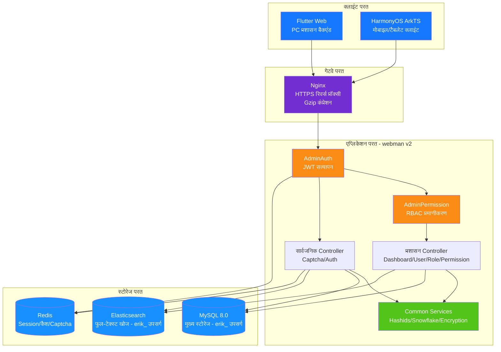

# सिस्टम टोपोलॉजी आर्किटेक्चर

```mermaid
flowchart TB
    subgraph clients["क्लाइंट परत"]
        flutter["Flutter Web<br/>PC प्रशासन बैकएंड"]
        harmony["HarmonyOS ArkTS<br/>मोबाइल/टैबलेट क्लाइंट"]
    end

    subgraph gateway["गेटवे परत"]
        nginx["Nginx<br/>HTTPS रिवर्स प्रॉक्सी<br/>Gzip कंप्रेशन"]
    end

    subgraph app["एप्लिकेशन परत - webman v2"]
        auth["AdminAuth<br/>JWT सत्यापन"]
        perm["AdminPermission<br/>RBAC प्रमाणीकरण"]
        admin["प्रशासन Controller<br/>Dashboard/User/Role/Permission"]
        public["सार्वजनिक Controller<br/>Captcha/Auth"]
        common["Common Services<br/>Hashids/Snowflake/Encryption"]
    end

    subgraph storage["स्टोरेज परत"]
        mysql[("MySQL 8.0<br/>मुख्य स्टोरेज - erik_ उपसर्ग")]
        es[("Elasticsearch<br/>फुल-टेक्स्ट खोज - erik_ उपसर्ग")]
        redis[("Redis<br/>Session/कैश/Captcha")]
    end

    flutter --> nginx
    harmony --> nginx
    nginx --> auth
    auth --> perm
    perm --> admin
    auth --> public
    admin --> common
    public --> common
    admin --> mysql
    public --> mysql
    admin --> es
    public --> es
    auth --> redis
    public --> redis

    style flutter fill:#1677FF,color:#fff
    style harmony fill:#1677FF,color:#fff
    style nginx fill:#722ED1,color:#fff
    style auth fill:#FA8C16,color:#fff
    style perm fill:#FA8C16,color:#fff
    style common fill:#52C41A,color:#fff
    style mysql fill:#1890FF,color:#fff
    style es fill:#1890FF,color:#fff
    style redis fill:#1890FF,color:#fff
```
