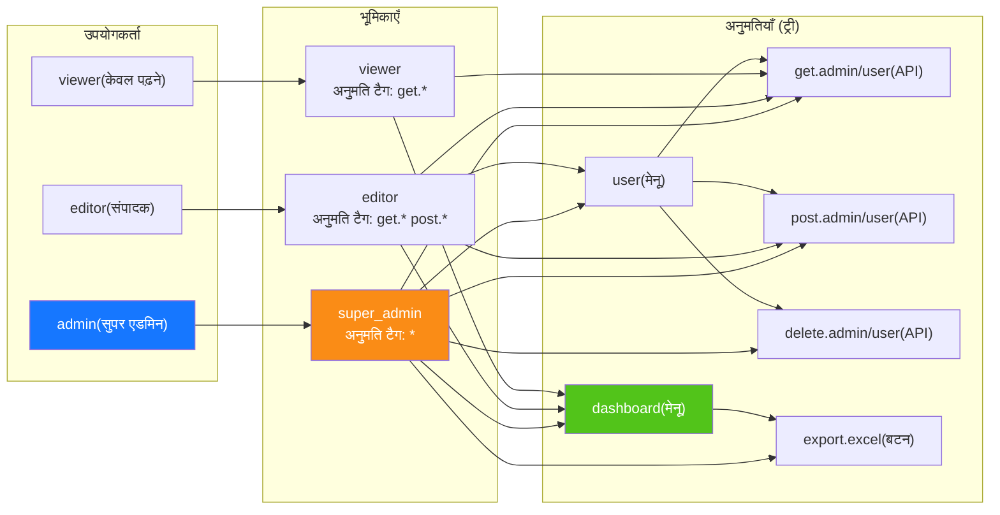
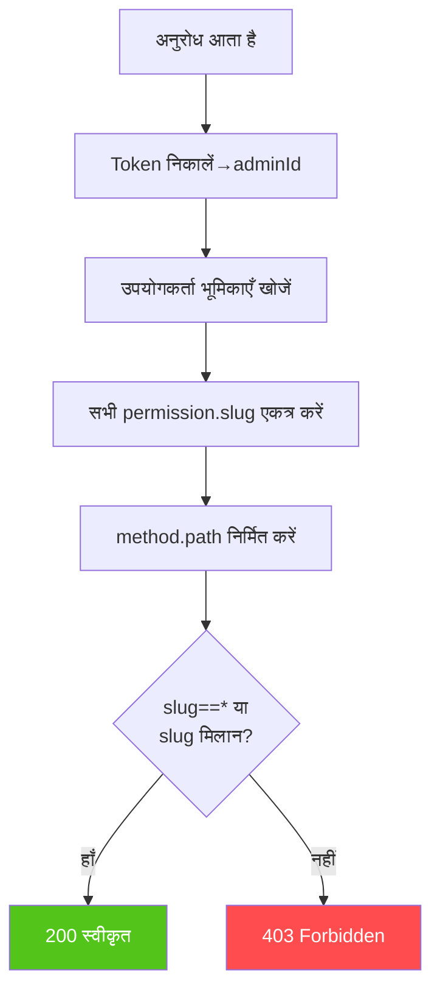
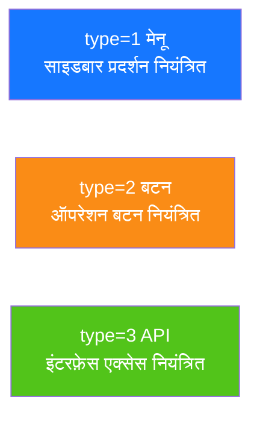

# RBAC अनुमति मॉडल

## उपयोगकर्ता-भूमिका-अनुमति संबंध

```mermaid
flowchart LR
    subgraph users["उपयोगकर्ता"]
        u1["admin(सुपर एडमिन)"]
        u2["editor(संपादक)"]
        u3["viewer(केवल पढ़ने)"]
    end

    subgraph roles["भूमिकाएँ"]
        r1["super_admin<br/>अनुमति टैग: *"]
        r2["editor<br/>अनुमति टैग: get.* post.*"]
        r3["viewer<br/>अनुमति टैग: get.*"]
    end

    subgraph permissions["अनुमतियाँ (ट्री)"]
        p1["dashboard(मेनू)"]
        p2["user(मेनू)"]
        p3["get.admin/user(API)"]
        p4["post.admin/user(API)"]
        p5["delete.admin/user(API)"]
        p6["export.excel(बटन)"]
    end

    u1 --> r1
    u2 --> r2
    u3 --> r3
    r1 --> p1 & p2 & p3 & p4 & p5 & p6
    r2 --> p1 & p2 & p3 & p4
    r3 --> p1 & p3
    p2 --> p3 & p4 & p5
    p1 --> p6

    style u1 fill:#1677FF,color:#fff
    style r1 fill:#FA8C16,color:#fff
    style p1 fill:#52C41A,color:#fff
```

## अनुमति निर्णय प्रवाह

```mermaid
flowchart TD
    start["अनुरोध आता है"] --> extract["Token निकालें→adminId"]
    extract --> findRoles["उपयोगकर्ता भूमिकाएँ खोजें"]
    findRoles --> collectSlug["सभी permission.slug एकत्र करें"]
    collectSlug --> buildKey["method.path निर्मित करें"]
    buildKey --> check{"slug==* या<br/>slug मिलान?"}
    check -->|"हाँ"| allow["200 स्वीकृत"]
    check -->|"नहीं"| deny["403 Forbidden"]

    style allow fill:#52C41A,color:#fff
    style deny fill:#FF4D4F,color:#fff
```

## अनुमति प्रकार

```mermaid
flowchart LR
    t1["type=1 मेनू<br/>साइडबार प्रदर्शन नियंत्रित"]
    t2["type=2 बटन<br/>ऑपरेशन बटन नियंत्रित"]
    t3["type=3 API<br/>इंटरफ़ेस एक्सेस नियंत्रित"]

    style t1 fill:#1677FF,color:#fff
    style t2 fill:#FA8C16,color:#fff
    style t3 fill:#52C41A,color:#fff
```
